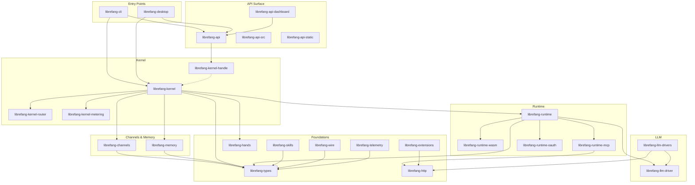

# Other

# Other — Supporting Crates & Infrastructure

This module group contains the crates that compose the **LibreFang Agent OS** — a self-hosted autonomous agent platform with multi-channel messaging, LLM orchestration, sandboxed skill execution, and both web and native desktop interfaces.

## Architecture Overview

## How the Sub-Modules Fit Together

### Type Foundation

[librefang-types](librefang-types.md) is the leaf dependency that every other crate references for shared data structures, error types, and trait definitions. Its companion crates handle localization ([librefang-types-locales](librefang-types-locales.md)), model catalog structures ([librefang-types-src](librefang-types-src.md)), and cross-language serialization contract tests ([librefang-types-tests](librefang-types-tests.md)).

### Kernel & Orchestration

[librefang-kernel](librefang-kernel.md) is the composition root — it wires together all subsystems without implementing domain logic itself. It depends on:

- [librefang-kernel-handle](librefang-kernel-handle.md) — the `KernelHandle` trait that in-process callers (API, channels) use to issue requests
- [librefang-kernel-router](librefang-kernel-router.md) — pattern-matching dispatch to hands and templates
- [librefang-kernel-metering](librefang-kernel-metering.md) — cost tracking and quota enforcement

[librefang-kernel-tests](librefang-kernel-tests.md) exercises the full kernel lifecycle end-to-end.

### Agent Runtime

[librefang-runtime](librefang-runtime.md) manages agent lifecycles, LLM dispatch, and sandboxing. It draws on:

- [librefang-llm-driver](librefang-llm-driver.md) / [librefang-llm-drivers](librefang-llm-drivers.md) — the trait abstraction and concrete provider implementations (Anthropic, OpenAI, Gemini, etc.), with shared rate-limit guard tests in [librefang-llm-drivers-tests](librefang-llm-drivers-tests.md)
- [librefang-runtime-wasm](librefang-runtime-wasm.md) — WASM sandbox for skill execution via wasmtime
- [librefang-runtime-mcp](librefang-runtime-mcp.md) — MCP client for dynamic tool discovery
- [librefang-runtime-oauth](librefang-runtime-oauth.md) — OAuth 2.0 PKCE flows for ChatGPT and GitHub Copilot backends

[librefang-runtime-tests](librefang-runtime-tests.md) validates the MCP/OAuth integration path.

### Channel Bridge

[librefang-channels](librefang-channels.md) provides a uniform messaging interface across 40+ platforms, isolating each behind feature-gated adapters. Performance is tracked by [librefang-channels-benches](librefang-channels-benches.md) and correctness by [librefang-channels-tests](librefang-channels-tests.md).

### API & Dashboard

[librefang-api](librefang-api.md) exposes the full agent lifecycle over HTTP and WebSocket, wiring together the kernel, runtime, memory, channels, skills, and extensions behind axum handlers. The browser-based management interface is [librefang-api-dashboard](librefang-api-dashboard.md) (React 19 + TanStack), with a self-contained [login page](librefang-api-src.md) and [static locale assets](librefang-api-static.md). End-to-end HTTP tests live in [librefang-api-tests](librefang-api-tests.md).

### Entry Points

Operators interact with LibreFang through two binaries:

- [librefang-cli](librefang-cli.md) — the `librefang` command-line tool, with i18n via [librefang-cli-locales](librefang-cli-locales.md) and init templates from [librefang-cli-templates](librefang-cli-templates.md)
- [librefang-desktop](librefang-desktop.md) — a Tauri 2.0 native app (full daemon on desktop, thin client on mobile), with capability declarations in [librefang-desktop-capabilities](librefang-desktop-capabilities.md) and generated build scaffolding in [librefang-desktop-gen](librefang-desktop-gen.md)

### Supporting Infrastructure

| Crate | Role |
|---|---|
| [librefang-memory](librefang-memory.md) | Persistence layer for agent state and conversation history (session-scoped) |
| [librefang-hands](librefang-hands.md) | Curated autonomous capability packages — the bridge between intent and execution |
| [librefang-skills](librefang-skills.md) | Skill registry, filesystem loader, marketplace client, and OpenClaw compatibility |
| [librefang-extensions](librefang-extensions.md) | MCP server setup, encrypted credential vault, and OAuth2 PKCE |
| [librefang-http](librefang-http.md) | Shared `reqwest::Client` builder with centralized proxy and TLS configuration |
| [librefang-telemetry](librefang-telemetry.md) | OpenTelemetry + Prometheus metrics instrumentation |
| [librefang-wire](librefang-wire.md) | LibreFang Protocol — agent-to-agent networking with cryptographic authentication |
| [librefang-migrate](librefang-migrate.md) | One-shot import tool for converting foreign C2/agent configs into LibreFang types |
| [librefang-testing](librefang-testing.md) | Shared mock kernel, fake LLM driver, and axum route test utilities |

## Key Workflows That Span Sub-Modules

**Incoming message flow:** A user sends a message on a platform → [librefang-channels](librefang-channels.md) adapter ingests and normalizes it → [librefang-kernel](librefang-kernel.md) receives it via the bridge → [librefang-kernel-router](librefang-kernel-router.md) resolves the target hand/agent → [librefang-runtime](librefang-runtime.md) dispatches to the LLM via [librefang-llm-drivers](librefang-llm-drivers.md) → the response flows back through channels → conversation is persisted in [librefang-memory](librefang-memory.md).

**Skill execution:** [librefang-skills](librefang-skills.md) discovers and loads a skill manifest → the runtime invokes it through [librefang-runtime-wasm](librefang-runtime-wasm.md) → the WASM sandbox executes in isolation, communicating with the kernel via [librefang-kernel-handle](librefang-kernel-handle.md).

**Dashboard interaction:** The browser loads [librefang-api-dashboard](librefang-api-dashboard.md) → TanStack Query hooks call [librefang-api](librefang-api.md) REST/WebSocket endpoints → the API delegates to the kernel through the `KernelHandle` trait → [librefang-telemetry](librefang-telemetry.md) records metrics throughout.

**MCP tool invocation:** The runtime connects to external tool servers via [librefang-runtime-mcp](librefang-runtime-mcp.md) → authentication is handled by [librefang-runtime-oauth](librefang-runtime-oauth.md) and [librefang-extensions](librefang-extensions.md) credential vault → all HTTP traffic uses [librefang-http](librefang-http.md) for consistent TLS/proxy behavior.

**Cross-agent communication:** [librefang-wire](librefang-wire.md) provides the framing, serialization, and cryptographic primitives for agent-to-agent messaging over the network, sitting below application-level RPC logic.