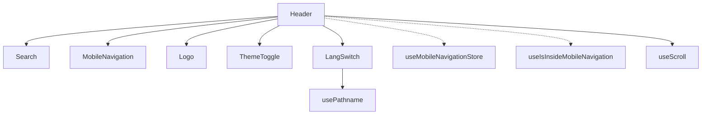

# Other

# Other Module

This module contains miscellaneous infrastructure components that support the documentation site and web presence but don't belong to other specific feature modules. It includes URL redirects for backward compatibility, the main site header component, and Cloudflare Workers for analytics tracking.

## Module Structure

```
docs/public/_redirects              # URL redirect rules for backward compatibility
docs/src/components/Header.tsx      # Site-wide header component
web/workers/github-stats-worker/    # Cloudflare Worker for GitHub statistics
web/workers/visit-counter-worker/   # Cloudflare Worker for visit tracking
```

---

## URL Redirects (`docs/public/_redirects`)

### Purpose

When the documentation site restructured its URLs from flat, top-level paths to a hierarchical group-based organization (April 2026), existing bookmarks and external links would break. This redirect configuration ensures all old URLs continue working by mapping them to their new hierarchical locations.

### Redirect Format

The file uses [Netlify's redirect format](https://docs.netlify.com/routing/redirects/), where each line specifies a source path, destination path, and HTTP status code:

```
/old-path    /new-path    301
```

### Redirect Groups

The redirects are organized into logical groups matching the new documentation hierarchy:

| Group | Old Prefix | New Prefix | Purpose |
|-------|-----------|------------|---------|
| Getting Started | `/librefang`, `/roadmap`, `/examples`, `/glossary`, `/comparison` | `/getting-started/*` | Core docs entry points |
| Configuration | `/providers`, `/providers/*` | `/configuration/providers*` | Provider configuration |
| Architecture | `/security` | `/architecture/security` | Security documentation |
| Agent | `/agents`, `/hands`, `/memory`, `/skills`, `/plugins`, `/prompt-intelligence`, `/workflows` | `/agent/*` | Agent-related docs |
| Integrations | `/channels`, `/api`, `/sdk`, `/cli`, `/android-termux`, `/mcp-a2a`, `/migration`, `/desktop`, `/development` | `/integrations/*` | External integrations |
| Operations | `/troubleshooting`, `/production`, `/faq` | `/operations/*` | Deployment and operations |
| Chinese locale | `/zh/*` | `/zh/getting-started/*`, etc. | zh-Hans translations |

### Key Rules

```nginx
# Exact matches must come before wildcards
/providers              /configuration/providers         301
/providers/*            /configuration/providers/:splat  301
```

The wildcard rule with `:splat` captures any path segments beyond `/providers/` and appends them to the destination.

---

## Header Component (`docs/src/components/Header.tsx`)

### Purpose

The `Header` component provides the persistent top navigation bar across all documentation pages. It integrates search, navigation, language switching, and theme controls.

### Component Architecture



### Key Features

#### Scroll-Based Blur Effect

The header applies a dynamic backdrop blur that increases as the user scrolls:

```typescript
const { scrollY } = useScroll();
const bgOpacityLight = useTransform(scrollY, [0, 72], ["50%", "90%"]);
const bgOpacityDark = useTransform(scrollY, [0, 72], ["20%", "80%"]);
```

At scroll position 0, the background is 50% opaque (light) / 20% (dark). By 72px scroll depth, it reaches 90% / 80% opacity. This creates a smooth transition from transparent to solid as content scrolls beneath.

#### Language Switching

The `LangSwitch` component detects the current locale from the pathname and toggles between English and Chinese:

```typescript
// English path: /getting-started/overview
// Chinese path:  /zh/getting-started/overview

if (isZh) {
  targetPath = pathname.replace(/^\/zh/, "") || "/";
} else {
  targetPath = `/zh${pathname === "/" ? "" : pathname}`;
}
```

#### Responsive Behavior

| Breakpoint | Behavior |
|------------|----------|
| Mobile | Logo, mobile nav, search, language/theme toggles visible |
| Desktop (md+) | Full navigation links, condensed toolbar |

The header shifts from a centered layout on mobile to a left-aligned sidebar-connected layout on larger screens (`lg:left-72 xl:left-80`).

### Props

The component forwards refs and additional props to the underlying `motion.div` for animation support, making it compatible with scroll-based entrance animations.

---

## Cloudflare Workers

### GitHub Stats Worker

**Location:** `web/workers/github-stats-worker/`

A scheduled Cloudflare Worker that fetches repository statistics from GitHub's API daily and caches them in a KV namespace.

**Configuration:**
- **Cron trigger:** Runs daily at 00:00 UTC
- **KV binding:** `KV` namespace for cached statistics
- **Purpose:** Provides stars, forks, and other metrics for the documentation site without rate-limiting GitHub's API

### Visit Counter Worker

**Location:** `web/workers/visit-counter-worker/`

A Cloudflare Worker that tracks page visits by incrementing counters stored in a KV namespace.

**Configuration:**
- **KV binding:** `VISIT_COUNTER` namespace for persistence
- **Purpose:** Anonymously tracks documentation page views for analytics

### Worker Architecture Pattern

Both workers follow a common pattern:

```mermaid
sequenceDiagram
    participant Cron as Cron Trigger
    participant Worker as CF Worker
    participant KV as KV Namespace
    
    Cron->>Worker: Scheduled event
    Worker->>GitHub or Visit Data
    Worker->>KV: Store/update
```

Workers use Cloudflare's edge runtime, enabling:
- **Global distribution** — Workers run at edge locations near users
- **Durable storage** — KV namespaces persist data across invocations
- **Cost efficiency** — Scheduled workers have minimal compute costs

---

## Integration Points

| Component | Connects To | Purpose |
|-----------|-------------|---------|
| `Header.tsx` | `MobileNavigation` | Mobile menu state management |
| `Header.tsx` | `Search` | Documentation search |
| `Header.tsx` | `ThemeToggle` | Dark/light mode |
| `Header.tsx` | `withPrefix` | Locale-aware URL generation |
| `Header.tsx` | `usePathname` | Route detection for locale |
| `_redirects` | Netlify CDN | Production redirect handling |
| Workers | Cloudflare KV | Data persistence |
| Workers | External APIs | GitHub stats retrieval |

---

## Contribution Notes

When adding new documentation pages:
1. **Add redirects** if the URL pattern changes — follow the existing format with exact matches before wildcards
2. **Update Header nav** if adding a major top-level section — the header lists primary navigation destinations
3. **Consider locale parity** — both English and Chinese redirect patterns should be maintained