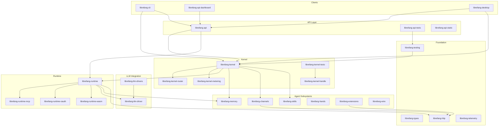

# Other

# Other — Supporting Crates & Infrastructure

This module group contains the bulk of the LibreFang Agent OS crate ecosystem — everything from foundational type definitions through the kernel, runtime, API surface, and user-facing clients. The crates are organized into layered clusters that build upward from pure data definitions to full user-facing applications.

## Architecture

## Layer Overview

### Foundation

| Crate | Role |
|---|---|
| [librefang-types](librefang-types.md) | Shared data structures, traits, enums, and error types — the vocabulary every other crate speaks |
| [librefang-types-locales](librefang-types-locales.md) | Localized API error messages (6 languages via Project Fluent) |
| [librefang-http](librefang-http.md) | Centralized `reqwest` client builder with TLS and proxy configuration |
| [librefang-telemetry](librefang-telemetry.md) | OpenTelemetry metric definitions and instrumentation macros |
| [librefang-testing](librefang-testing.md) | Mock kernel, mock LLM driver, and API route test helpers used across the workspace |

### Kernel

[librefang-kernel](librefang-kernel.md) is the central orchestrator. It owns the agent lifecycle — loading config, initializing subsystems, coordinating message flow, and managing SQLite state. Its focused sub-crates handle specific concerns:

- [librefang-kernel-router](librefang-kernel-router.md) — resolves input to the correct hand/template
- [librefang-kernel-metering](librefang-kernel-metering.md) — cost tracking and quota enforcement
- [librefang-kernel-handle](librefang-kernel-handle.md) — the `KernelHandle` trait, a lightweight interface crate that breaks circular dependencies

### Runtime

[librefang-runtime](librefang-runtime.md) is the execution environment. It wires together LLM drivers, skill execution, memory access, and channel I/O into a coherent agent lifecycle. Sub-crates provide specific capabilities:

- [librefang-runtime-wasm](librefang-runtime-wasm.md) — WASM sandbox for isolated skill execution
- [librefang-runtime-mcp](librefang-runtime-mcp.md) — Model Context Protocol client for external tool servers
- [librefang-runtime-oauth](librefang-runtime-oauth.md) — OAuth 2.0 PKCE flows for ChatGPT and GitHub Copilot providers

### LLM Integration

[librefang-llm-driver](librefang-llm-driver.md) defines the `LlmDriver` trait that decouples the rest of the system from any specific provider. [librefang-llm-drivers](librefang-llm-drivers.md) contains the concrete implementations for Anthropic, OpenAI, Gemini, and others — translating generic requests into provider-specific HTTP payloads.

### Agent Subsystems

| Crate | Role |
|---|---|
| [librefang-memory](librefang-memory.md) | Persistence substrate — conversation history, task state, session-scoped context with cross-session isolation |
| [librefang-channels](librefang-channels.md) | Bridge layer to 40+ messaging platforms, each feature-gated for compile-time selection |
| [librefang-skills](librefang-skills.md) | Skill registry, loader, marketplace client, and OpenClaw compatibility |
| [librefang-hands](librefang-hands.md) | Curated autonomous capability packages — what an agent can do and what it requires |
| [librefang-extensions](librefang-extensions.md) | MCP server setup, encrypted credential vault (AES-256-GCM), and OAuth2 PKCE for integrations |
| [librefang-wire](librefang-wire.md) | Agent-to-agent networking via the LibreFang Protocol (OFP) — serialization, framing, cryptographic auth |

### API & Dashboard

[librefang-api](librefang-api.md) exposes the full system through RESTful JSON and WebSocket endpoints. It integrates nearly every other crate into a unified network service built on axum.

[librefang-api-dashboard](librefang-api-dashboard.md) is the React 19 SPA that provides the management UI — agent lifecycle, workflows, scheduling, analytics, and configuration. [librefang-api-static](librefang-api-static.md) holds its i18n translation files (English and Japanese).

### Clients

- [librefang-cli](librefang-cli.md) — the `librefang` binary; a feature-rich CLI for configuring, running, and debugging agents
- [librefang-cli-locales](librefang-cli-locales.md) — CLI localization in Fluent format (English, Simplified Chinese)
- [librefang-cli-templates](librefang-cli-templates.md) — TOML config templates written during `librefang init`
- [librefang-desktop](librefang-desktop.md) — Tauri 2.0 native desktop app wrapping the kernel and web UI, with system tray, auto-updates, and notifications. Supported by [librefang-desktop-capabilities](librefang-desktop-capabilities.md) (security config) and [librefang-desktop-gen](librefang-desktop-gen.md) (auto-generated permission schemas)

### Migration & Testing

[librefang-migrate](librefang-migrate.md) imports agent configurations from other frameworks into LibreFang's native format. Test suites at each layer ensure correctness: [librefang-api-tests](librefang-api-tests.md) (HTTP integration, load, OpenAPI spec), [librefang-kernel-tests](librefang-kernel-tests.md) and [librefang-kernel-src](librefang-kernel-src.md) (kernel lifecycle, WASM, workflows), [librefang-channels-tests](librefang-channels-tests.md) (bridge dispatch), [librefang-memory-tests](librefang-memory-tests.md) (session isolation regression), and [librefang-runtime-tests](librefang-runtime-tests.md) (OAuth/MCP integration).

## Key Cross-Module Workflows

**Agent message processing:** A message arrives through [librefang-channels](librefang-channels.md) → [librefang-kernel](librefang-kernel.md) routes it via [librefang-kernel-router](librefang-kernel-router.md) → [librefang-runtime](librefang-runtime.md) executes through an [librefang-llm-driver](librefang-llm-driver.md) implementation → [librefang-memory](librefang-memory.md) persists context → response flows back through channels.

**Dashboard to kernel:** [librefang-api-dashboard](librefang-api-dashboard.md) calls API endpoints on [librefang-api](librefang-api.md) → which exercises the full path through [librefang-testing](librefang-testing.md)'s mock infrastructure in tests → validated end-to-end by [librefang-api-tests](librefang-api-tests.md) against a real kernel on a random port.

**Type-driven consistency:** Every crate depends on [librefang-types](librefang-types.md) for shared vocabulary. [librefang-types-tests](librefang-types-tests.md) guards against drift between the dashboard's TypeScript serializer and the Rust deserializer, ensuring the TOML contract holds across the boundary.