# Other

# Other — Supporting Crates & Infrastructure

This module group contains the crates that form the LibreFang Agent OS — a platform for running, managing, and communicating with autonomous AI agents. Everything from core type definitions to the desktop application lives here.

## Architecture

The crates form a layered system with clear dependency flow:

```mermaid
graph TD
    subgraph "User-Facing"
        CLI[librefang-cli]
        DESK[librefang-desktop]
        DASH[librefang-api-dashboard]
    end

    subgraph "API Layer"
        API[librefang-api]
        APILOGIN[librefang-api-src]
        APILOCALE[librefang-api-static]
        APITEST[librefang-api-tests]
    end

    subgraph "Core"
        KERNEL[librefang-kernel]
        KHANDLE[librefang-kernel-handle]
        KROUTE[librefang-kernel-router]
        KMETER[librefang-kernel-metering]
    end

    subgraph "Runtime"
        RT[librefang-runtime]
        RTWASM[librefang-runtime-wasm]
        RTMCP[librefang-runtime-mcp]
        RTOAUTH[librefang-runtime-oauth]
    end

    subgraph "LLM"
        LLMD[librefang-llm-driver]
        LLMDR[librefang-llm-drivers]
    end

    subgraph "Channels & Networking"
        CH[librefang-channels]
        WIRE[librefang-wire]
    end

    subgraph "Storage & Extensions"
        MEM[librefang-memory]
        EXT[librefang-extensions]
        HANDS[librefang-hands]
        MIG[librefang-migrate]
    end

    subgraph "Foundation"
        TYPES[librefang-types]
        HTTP[librefang-http]
        TELE[librefang-telemetry]
        TEST[librefang-testing]
    end

    CLI --> KERNEL
    CLI --> API
    DESK --> KERNEL
    DESK --> API
    DASH --> API

    API --> KERNEL
    API --> RT
    API --> MEM
    API --> CH

    KERNEL --> KHANDLE
    KERNEL --> KROUTE
    KERNEL --> KMETER
    KERNEL --> MEM
    KERNEL --> RT

    RT --> RTWASM
    RT --> RTMCP
    RT --> RTOAUTH
    RT --> LLMD

    LLMDR --> LLMD
    LLMDR --> HTTP
    CH --> HTTP
    WIRE --> HTTP

    EXT --> TYPES
    HANDS --> TYPES
    TEST --> TYPES

    style TYPES fill:#e8f5e9,stroke:#388e3c
    style KERNEL fill:#e3f2fd,stroke:#1976d2
    style API fill:#fce4ec,stroke:#c62828
```

## Key Layers

### Foundation — [librefang-types](librefang-types.md), [librefang-http](librefang-http.md), [librefang-telemetry](librefang-telemetry.md), [librefang-testing](librefang-testing.md)

[librefang-types](librefang-types.md) is the bedrock: pure data definitions with no I/O or logic, consumed by every other crate. [librefang-http](librefang-http.md) centralizes TLS and proxy configuration so all outbound HTTP calls behave consistently. [librefang-telemetry](librefang-telemetry.md) provides shared metric names and labels. [librefang-testing](librefang-testing.md) supplies mock kernels and LLM drivers used across integration test suites.

### Core — [librefang-kernel](librefang-kernel.md)

The central orchestrator. It wires together subsystems without implementing domain logic itself. The kernel depends on three specialized sub-crates: [librefang-kernel-handle](librefang-kernel-handle.md) defines the `KernelHandle` trait for in-process callers, [librefang-kernel-router](librefang-kernel-router.md) resolves which Hand and template apply to incoming input, and [librefang-kernel-metering](librefang-kernel-metering.md) enforces resource quotas during execution.

### Runtime — [librefang-runtime](librefang-runtime.md)

Coordinates the agent lifecycle: LLM invocation, skill execution, memory persistence, and channel communication. It re-exports three sibling crates — [librefang-runtime-wasm](librefang-runtime-wasm.md) for sandboxed WASM skill execution via wasmtime, [librefang-runtime-mcp](librefang-runtime-mcp.md) for MCP tool discovery and invocation, and [librefang-runtime-oauth](librefang-runtime-oauth.md) for OAuth 2.0 token flows with providers like OpenAI and GitHub Copilot.

### LLM — [librefang-llm-driver](librefang-llm-driver.md) → [librefang-llm-drivers](librefang-llm-drivers.md)

A trait/provider split. [librefang-llm-driver](librefang-llm-driver.md) defines the `LlmDriver` contract; [librefang-llm-drivers](librefang-llm-drivers.md) implements it for Anthropic, OpenAI, Gemini, and others, handling wire protocols and SSE streaming.

### Channels & Networking — [librefang-channels](librefang-channels.md), [librefang-wire](librefang-wire.md)

[librefang-channels](librefang-channels.md) provides a unified async interface over 40+ messaging platforms, each selectable as a compile-time feature. [librefang-wire](librefang-wire.md) handles agent-to-agent networking over the LibreFang Protocol (OFP) with HMAC authentication and session management.

### API & Dashboard — [librefang-api](librefang-api.md), [librefang-api-dashboard](librefang-api-dashboard.md)

[librefang-api](librefang-api.md) is an Axum-based HTTP/WebSocket server exposing the daemon's capabilities. It embeds [librefang-api-dashboard](librefang-api-dashboard.md), a React 19 SPA using TanStack Router and Query for agent management. Supporting pieces include the self-contained [login page](librefang-api-src.md) with TOTP support, and [static locale data](librefang-api-static.md) for i18n.

### User Interfaces — [librefang-cli](librefang-cli.md), [librefang-desktop](librefang-desktop.md)

Two entry points for human users. [librefang-cli](librefang-cli.md) produces the `librefang` binary — the primary command-line tool, backed by [Fluent-based locale files](librefang-cli-locales.md) and [TOML config templates](librefang-cli-templates.md). [librefang-desktop](librefang-desktop.md) is a Tauri 2.0 native app bundling the API server with a system tray, auto-updater, and platform installers.

### Storage & Capabilities — [librefang-memory](librefang-memory.md), [librefang-hands](librefang-hands.md), [librefang-extensions](librefang-extensions.md)

[librefang-memory](librefang-memory.md) provides the persistence substrate for conversation history and state. [librefang-hands](librefang-hands.md) defines composable capability packages that can be assigned to agents. [librefang-extensions](librefang-extensions.md) adds MCP server setup, an encrypted credential vault, and OAuth2 PKCE flows.

### Migration — [librefang-migrate](librefang-migrate.md)

Converts agent definitions and configurations from other frameworks (JSON, YAML, TOML) into LibreFang-native types.

## Key Cross-Module Workflows

**Agent message cycle:** A message arrives via [librefang-channels](librefang-channels.md) → [librefang-kernel](librefang-kernel.md) routes it through [librefang-kernel-router](librefang-kernel-router.md) → [librefang-runtime](librefang-runtime.md) invokes an LLM via [librefang-llm-drivers](librefang-llm-drivers.md), possibly executing WASM skills through [librefang-runtime-wasm](librefang-runtime-wasm.md) or MCP tools through [librefang-runtime-mcp](librefang-runtime-mcp.md) → results are persisted to [librefang-memory](librefang-memory.md) and sent back through channels.

**Dashboard control flow:** The React SPA in [librefang-api-dashboard](librefang-api-dashboard.md) calls [librefang-api](librefang-api.md) endpoints → the API delegates to [librefang-kernel](librefang-kernel.md) → the kernel orchestrates the appropriate subsystems → telemetry flows to [librefang-telemetry](librefang-telemetry.md).

**Cross-session isolation:** [librefang-memory](librefang-memory.md) tags every `CanonicalEntry` with its originating `SessionId`, preventing data leaks between concurrent chats — a behavior guarded by dedicated [memory integration tests](librefang-memory-tests.md).

**Type safety across language boundaries:** [librefang-types](librefang-types.md) defines the canonical schema; [round-trip tests](librefang-types-tests.md) verify that TOML emitted by the TypeScript dashboard deserializes correctly in Rust, catching schema drift before production.