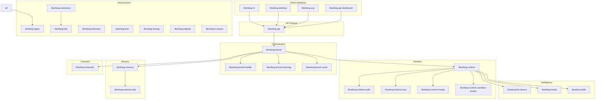

# Other

# Other Modules

Supplementary crates that complete the LibreFang Agent OS — client interfaces, kernel internals, runtime subsystems, memory, LLM drivers, channel adapters, testing infrastructure, and cross-cutting utilities.

## Architecture

## Layer Summary

### Foundation — [librefang-types](librefang-types.md)

Every crate depends on this. Pure shared data structures — no business logic, no workspace dependencies. Localized error messages live in [librefang-types-locales](librefang-types-locales.md); model catalog types in [librefang-types-src](librefang-types-src.md). The [test suite](librefang-types-tests.md) guards TOML serialization contracts with the dashboard.

### Kernel — [librefang-kernel](librefang-kernel.md)

Core orchestration: agent lifecycles, scheduling, permissions, inter-agent communication. The [kernel handle trait](librefang-kernel-handle.md) defines the in-process interface so callers can mock or decorate it. [Metering](librefang-kernel-metering.md) enforces spending quotas on LLM calls. The [router](librefang-kernel-router.md) resolves incoming messages to the correct Hand or Template handler. Verified by [kernel tests](librefang-kernel-tests.md) and [kernel-src tests](librefang-kernel-src.md).

### Runtime — [librefang-runtime](librefang-runtime.md)

Agent execution engine: the turn-by-turn loop, tool dispatch, context management, and the Agent-to-Agent protocol. Subsystem crates extracted during the god-crate split:

- [audit](librefang-runtime-audit.md) — tamper-evident Merkle hash chain for all agent actions
- [MCP client](librefang-runtime-mcp.md) — Model Context Protocol tool discovery and invocation
- [media](librefang-runtime-media.md) — text-to-speech, image, video, and music generation
- [sandbox-docker](librefang-runtime-sandbox-docker.md) — OS-level isolation for tool execution

Covered by [runtime tests](librefang-runtime-tests.md) and [runtime-src tests](librefang-runtime-src.md).

### LLM Drivers — [librefang-llm-drivers](librefang-llm-drivers.md)

Concrete provider implementations (Anthropic, OpenAI, Gemini, Groq, Ollama) of the [LlmDriver trait](librefang-llm-driver.md). Includes credential rotation, rate limiting, failover chains, and stream backpressure. [Driver tests](librefang-llm-drivers-tests.md) validate wire contracts against mock HTTP servers.

### Memory — [librefang-memory](librefang-memory.md)

Unified memory API over structured storage, semantic search, and a knowledge graph — all backed by SQLite. The [wiki vault](librefang-memory-wiki.md) persists agent knowledge as Obsidian-compatible Markdown with cryptographic provenance. [RosterStore](librefang-memory-src.md) tracks group chat membership. Guarded by [memory tests](librefang-memory-tests.md) and [wiki tests](librefang-memory-wiki-tests.md).

### Channels — [librefang-channels](librefang-channels.md)

Bridges 40+ messaging platforms into unified `ChannelMessage` events and routes agent replies back out. Includes a router, message journal, rate limiter, sanitizer, and sidecar infrastructure. Benchmarked in [channels-benches](librefang-channels-benches.md); tested end-to-end in [channels-tests](librefang-channels-tests.md).

### Hands & Skills — [librefang-hands](librefang-hands.md) · [librefang-skills](librefang-skills.md)

Hands are self-contained capability packages defining what an agent can *do*. Skills provide the registry, filesystem loader, marketplace client, and OpenClaw compatibility layer. [Hands tests](librefang-hands-tests.md) validate the full install → activate → deactivate → uninstall lifecycle.

### API — [librefang-api](librefang-api.md)

HTTP and WebSocket server — the primary network entry point for all external clients. Hosts the kernel in-process. The [React dashboard](librefang-api-dashboard.md) provides a real-time management UI. Authentication flows through a [self-contained login page](librefang-api-src.md). Static assets include [i18n locale files](librefang-api-static.md). Verified by [API integration tests](librefang-api-tests.md).

### Client Interfaces

| Crate | Purpose |
|---|---|
| [librefang-cli](librefang-cli.md) | Terminal interface; operates in daemon mode or single-shot mode |
| [librefang-desktop](librefang-desktop.md) | Tauri 2.0 app for desktop and mobile; desktop runs the full stack locally, mobile is a thin client |
| [librefang-acp](librefang-acp.md) | Agent Client Protocol adapter bridging agents into editor environments (Zed, VS Code, JetBrains) over stdio JSON-RPC |

Supporting resources: [CLI locales](librefang-cli-locales.md), [CLI templates](librefang-cli-templates.md) and [template discovery](librefang-cli-src.md), [desktop capabilities](librefang-desktop-capabilities.md), [desktop generated scaffolding](librefang-desktop-gen.md), [desktop entry point](librefang-desktop-src.md), [ACP tests](librefang-acp-tests.md), [CLI tests](librefang-cli-tests.md).

### Infrastructure

| Crate | Purpose |
|---|---|
| [librefang-extensions](librefang-extensions.md) | Agent-side infrastructure: vault, MCP catalog, OAuth2 PKCE, health probes, plugin installer |
| [librefang-http](librefang-http.md) | Shared HTTP client builder with consistent TLS and proxy configuration |
| [librefang-telemetry](librefang-telemetry.md) | OpenTelemetry and Prometheus metrics facade |
| [librefang-wire](librefang-wire.md) | Authenticated, encrypted agent-to-agent networking (X25519 + Ed25519 + HKDF) |
| [librefang-testing](librefang-testing.md) | Mock kernel, mock LLM drivers, and API test harness utilities |
| [librefang-migrate](librefang-migrate.md) | Imports agent configs from other frameworks into LibreFang format |
| [librefang-rl-export](librefang-rl-export.md) | RL rollout trajectory exporter for W&B, Tinker, and Atropos |

Supporting test modules: [extensions tests](librefang-extensions-tests.md), [testing examples](librefang-testing-src.md), [migrate tests](librefang-migrate-tests.md), [audit-src tests](librefang-runtime-audit-src.md), [MCP tests](librefang-runtime-mcp-tests.md), [kernel-handle tests](librefang-kernel-handle-tests.md).

## Key Cross-Module Workflows

**Inbound message**: A platform message arrives via [channels](librefang-channels.md) → is normalized to a `ChannelMessage` → kernel [router](librefang-kernel-router.md) dispatches it to the correct agent → [runtime](librefang-runtime.md) executes the agent loop → calls [LLM drivers](librefang-llm-drivers.md) for inference → persists context to [memory](librefang-memory.md) → reply routes back through channels.

**Metered LLM call**: Runtime prepares an inference request → [kernel-metering](librefang-kernel-metering.md) checks quota → driver executes → metering records actual token cost → [audit log](librefang-runtime-audit.md) appends a tamper-evident entry.

**Editor integration**: An editor extension launches a LibreFang process → [ACP adapter](librefang-acp.md) translates JSON-RPC over stdio into kernel API calls → kernel routes to runtime → streaming responses flow back as ACP notifications.

**Dashboard management**: User authenticates via the [login page](librefang-api-src.md) → [React dashboard](librefang-api-dashboard.md) issues REST calls to [librefang-api](librefang-api.md) → API delegates to kernel for agent CRUD, skill management, analytics → real-time updates pushed over WebSocket.