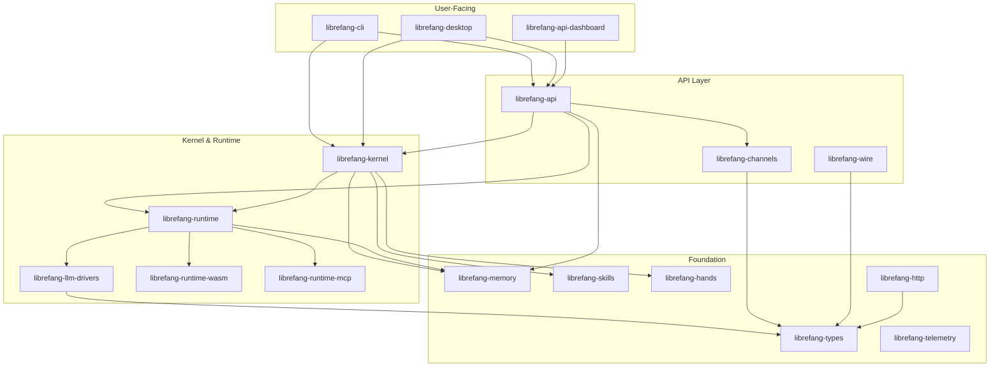

# Other

# Other — LibreFang Agent OS

This module group constitutes the **LibreFang Agent OS** — a full-stack platform for building, running, and managing autonomous AI agents. The sub-modules span from foundational type definitions through to desktop, CLI, and web interfaces.

## Architecture

## Module Groups

### Foundation

| Module | Role |
|--------|------|
| [librefang-types](Other%20-%20librefang-types.md) | Canonical data models, error types, traits — the single source of truth every other crate depends on |
| [librefang-http](Other%20-%20librefang-http.md) | Shared `reqwest::Client` builder with uniform TLS/proxy configuration |
| [librefang-telemetry](Other%20-%20librefang-telemetry.md) | Centralized `metrics` facade for OpenTelemetry/Prometheus instrumentation |

### Kernel & Orchestration

The **kernel** is the central hub. It does not implement subsystem logic — it wires everything together:

- [librefang-kernel](Other%20-%20librefang-kernel.md) — top-level orchestration: agent lifecycles, tool dispatch, skill evolution, approval workflows, auto-reply
- [librefang-kernel-handle](Other%20-%20librefang-kernel-handle.md) — the `KernelHandle` trait abstracting in-process kernel access
- [librefang-kernel-metering](Other%20-%20librefang-kernel-metering.md) — cost accounting and quota enforcement
- [librefang-kernel-router](Other%20-%20librefang-kernel-router.md) — resolves incoming requests to the correct hand and template

### Agent Runtime

The **runtime** manages a single agent's execution loop — LLM calls, memory, tool invocation, and skill execution:

- [librefang-runtime](Other%20-%20librefang-runtime.md) — coordinates the agent loop by integrating sibling crates
- [librefang-llm-driver](Other%20-%20librefang-llm-driver.md) / [librefang-llm-drivers](Other%20-%20librefang-llm-drivers.md) — abstract LLM trait and concrete provider implementations (Anthropic, OpenAI, Gemini, etc.)
- [librefang-runtime-wasm](Other%20-%20librefang-runtime-wasm.md) — Wasmtime-based sandbox for user-authored skills
- [librefang-runtime-mcp](Other%20-%20librefang-runtime-mcp.md) — Model Context Protocol client for tool discovery
- [librefang-runtime-oauth](Other%20-%20librefang-runtime-oauth.md) — OAuth 2.0 PKCE flows for third-party service auth

### Capabilities

| Module | Role |
|--------|------|
| [librefang-hands](Other%20-%20librefang-hands.md) | Curated capability packages — self-contained handler units loaded from TOML/JSON config |
| [librefang-skills](Other%20-%20librefang-skills.md) | Skill lifecycle: filesystem loader, remote marketplace, version resolution, in-memory registry |
| [librefang-memory](Other%20-%20librefang-memory.md) | SQLite-backed persistent storage for agent state, conversation history, and session context |
| [librefang-extensions](Other%20-%20librefang-extensions.md) | MCP server bootstrap, AES-256-GCM credential vault, OAuth2 integrations |

### Networking & Messaging

- [librefang-wire](Other%20-%20librefang-wire.md) — agent-to-agent authenticated transport over async TCP (LibreFang Protocol framing)
- [librefang-channels](Other%20-%20librefang-channels.md) — pluggable bridge to 40+ messaging/notification platforms through a unified `Channel` trait

### User Interfaces

**Web:** [librefang-api](Other%20-%20librefang-api.md) is the HTTP/WebSocket server that composes all subsystems into a network-facing service. It ships an embedded [dashboard](Other%20-%20librefang-api-dashboard.md) (React 19 + TanStack), a self-contained [login page](Other%20-%20librefang-api-src.md), and [i18n locale files](Other%20-%20librefang-api-static.md).

**CLI:** [librefang-cli](Other%20-%20librefang-cli.md) produces the `librefang` binary — a `clap`-based CLI with a TUI layer ([screens](Other%20-%20librefang-cli-src.md)) and [Fluent locale catalogs](Other%20-%20librefang-cli-locales.md).

**Desktop:** [librefang-desktop](Other%20-%20librefang-desktop.md) wraps everything in a Tauri 2.0 shell with system tray, auto-updates, and capability-based security ([capabilities](Other%20-%20librefang-desktop-capabilities.md), [generated ACLs](Other%20-%20librefang-desktop-gen.md)).

### Testing & Migration

- [librefang-testing](Other%20-%20librefang-testing.md) — shared mock kernel, mock LLM driver, and route-level test helpers
- [librefang-migrate](Other%20-%20librefang-migrate.md) — imports agent configurations from third-party frameworks

Each major crate has a companion test module (e.g. [kernel tests](Other%20-%20librefang-kernel-tests.md), [API tests](Other%20-%20librefang-api-tests.md), [memory tests](Other%20-%20librefang-memory-tests.md), [channels tests](Other%20-%20librefang-channels-tests.md), [runtime tests](Other%20-%20librefang-runtime-tests.md), [types tests](Other%20-%20librefang-types-tests.md)) exercising real infrastructure without mocks where possible.

### AI Agent Directives

[AGENTS.md](Other%20-%20AGENTS.md) and [CLAUDE.md](Other%20-%20CLAUDE.md) are policy files consumed by AI coding assistants. They enforce mandatory pre-edit impact analysis against GitNexus's static analysis index to prevent blind edits from cascading through the call graph.

## Key Cross-Cutting Workflow

A typical request flows through the system like this:

1. A user action hits **librefang-api** (HTTP) or **librefang-cli** (TUI)
2. The request is routed to **librefang-kernel**, which resolves the target agent and hand via **librefang-kernel-router**
3. **librefang-kernel** delegates execution to **librefang-runtime**, which runs the agent loop
4. The runtime calls a concrete **librefang-llm-driver** for inference, loads context from **librefang-memory**, and optionally executes sandboxed skills via **librefang-runtime-wasm** or external tools via **librefang-runtime-mcp**
5. Results are persisted to **librefang-memory**, dispatched outbound through **librefang-channels** or **librefang-wire**, and metered by **librefang-kernel-metering**
6. **librefang-telemetry** records metrics at every layer