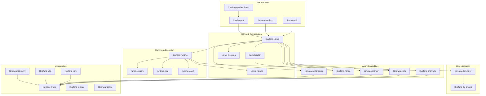

# Other

# Other — LibreFang Agent OS Supporting Crates

This module group contains the bulk of the LibreFang Agent OS workspace — every crate that isn't a core agent or system-level primitive. Together they form the complete stack from shared types through to user-facing interfaces.

## Architecture Overview

## Layer Breakdown

### Foundation — Types & Infrastructure

[librefang-types](librefang-types.md) is the leaf dependency that every other crate imports. It defines canonical domain types, error enums, configuration shapes, and crypto primitives. No I/O or business logic lives here.

Supporting infrastructure crates build on top:

- [librefang-http](librefang-http.md) — shared `reqwest::Client` builder with proxy and TLS certificate fallback, ensuring consistent outbound HTTP across the workspace.
- [librefang-telemetry](librefang-telemetry.md) — `metrics`-facade instrumentation layer; actual exporters (Prometheus, OpenTelemetry) are wired at the binary level.
- [librefang-testing](librefang-testing.md) — mock kernel, mock LLM driver, and axum route test utilities shared across integration suites.

### Kernel — Central Orchestration

[librefang-kernel](librefang-kernel.md) is the process supervisor and message bus. It wires together every subsystem into a coherent agent runtime. The kernel delegates to several focused sub-crates:

- [librefang-kernel-handle](librefang-kernel-handle.md) — the `KernelHandle` trait, decoupling in-process callers from the kernel's concrete implementation.
- [librefang-kernel-router](librefang-kernel-router.md) — resolves which hand definition and template should handle a given request.
- [librefang-kernel-metering](librefang-kernel-metering.md) — cost tracking and quota enforcement.

### Runtime — Execution Environment

[librefang-runtime](librefang-runtime.md) composes the kernel's orchestration with concrete execution capabilities:

- [librefang-runtime-wasm](librefang-runtime-wasm.md) — WASM sandbox for isolated skill execution.
- [librefang-runtime-mcp](librefang-runtime-mcp.md) — Model Context Protocol client for discovering and invoking external tool servers.
- [librefang-runtime-oauth](librefang-runtime-oauth.md) — OAuth 2.0 PKCE flows for ChatGPT and GitHub Copilot backends.

### LLM Integration

The LLM layer is split into abstraction and implementation:

- [librefang-llm-driver](librefang-llm-driver.md) — the trait and shared request/response types.
- [librefang-llm-drivers](librefang-llm-drivers.md) — concrete integrations with Anthropic, OpenAI, Gemini, and other providers.

### Agent Capabilities

These crates define what agents can do:

- [librefang-skills](librefang-skills.md) — skill registry, filesystem loader, marketplace client, and OpenClaw compatibility.
- [librefang-hands](librefang-hands.md) — curated capability packages that scope agent actions under the principle of least privilege.
- [librefang-channels](librefang-channels.md) — feature-flagged bridge layer to 45+ messaging platforms (Telegram, Discord, Slack, IRC, etc.).
- [librefang-memory](librefang-memory.md) — persistence substrate for agent state, chat history, and session context.
- [librefang-extensions](librefang-extensions.md) — MCP server setup, credential vault (OS keyring-backed), and OAuth2 PKCE flows.
- [librefang-wire](librefang-wire.md) — agent-to-agent networking with HMAC-authenticated message framing and async transport.

### User Interfaces

Three entry points into the system:

- [librefang-cli](librefang-cli.md) — the `librefang` binary for running agents, managing configs, migrations, and skills from the terminal. Includes [locale files](librefang-cli-locales.md) (English, Chinese) and [config templates](librefang-cli-templates.md).
- [librefang-api](librefang-api.md) — Axum-based HTTP/WebSocket API server that exposes the full system over REST and WebSocket. Includes the [embedded login page](librefang-api-src.md), [dashboard locale files](librefang-api-static.md) (English, Japanese), and an [integration test suite](librefang-api-tests.md).
- [librefang-desktop](librefang-desktop.md) — Tauri 2.0 native desktop app wrapping the kernel, API, and extension system with system tray integration and auto-updates. Includes [capability permissions](librefang-desktop-capabilities.md) and [auto-generated security schemas](librefang-desktop-gen.md).

The [dashboard](librefang-api-dashboard.md) is a React 19 SPA consuming the API through TanStack Router and Query, covering agent management, session inspection, approvals, channel configuration, skill installation, memory, analytics, and runtime control.

### Migration & Compatibility

[librefang-migrate](librefang-migrate.md) converts projects from AutoGen, CrewAI, LangGraph, and other frameworks into native LibreFang format.

## Key Cross-Module Workflows

**Inbound message flow:** A message arrives via a [channel](librefang-channels.md) adapter → [kernel](librefang-kernel.md) resolves the target agent through [kernel-router](librefang-kernel-router.md) → loads context from [memory](librefang-memory.md) → calls an [LLM driver](librefang-llm-drivers.md) → executes skills through [runtime-wasm](librefang-runtime-wasm.md) or tools via [runtime-mcp](librefang-runtime-mcp.md) → routes the response back through the channel.

**Dashboard operation:** The [React dashboard](librefang-api-dashboard.md) authenticates via the [login page](librefang-api-src.md) → calls [API](librefang-api.md) endpoints using localized strings from [api-static](librefang-api-static.md) → API delegates to [kernel](librefang-kernel.md) → kernel orchestrates the appropriate subsystems.

**Agent-to-agent communication:** [librefang-wire](librefang-wire.md) handles HMAC-signed message framing and transport between distributed agents, with connection state tracked via concurrent data structures.

## Test Coverage

The workspace emphasizes real-integration testing. Each major crate ships dedicated test modules — [kernel tests](librefang-kernel-tests.md), [kernel source-level tests](librefang-kernel-src.md), [API tests](librefang-api-tests.md), [channel bridge tests](librefang-channels-tests.md), [channel benchmarks](librefang-channels-benches.md), [memory tests](librefang-memory-tests.md), [runtime tests](librefang-runtime-tests.md), and [types contract tests](librefang-types-tests.md) — all backed by the shared [testing infrastructure](librefang-testing.md). Tests boot real kernels and servers on random ports rather than using mocks, ensuring the full stack is validated.