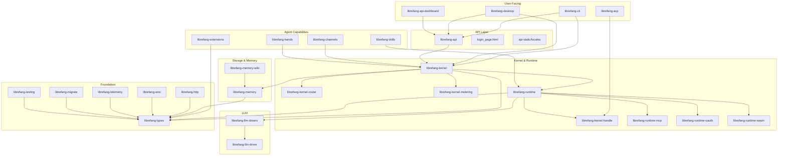

# Other

# Other Modules

Supplementary and infrastructure crates that support the LibreFang Agent OS. These modules span the full stack — from shared types and networking protocols through to user-facing surfaces like the CLI, desktop app, and web dashboard.

## Architecture

## Module Groups

### Foundation

| Module | Role |
|--------|------|
| [librefang-types](librefang-types.md) | Shared data structures at the bottom of the dependency graph. Every crate depends on it; it depends on nothing. |
| [librefang-http](librefang-http.md) | Centralized HTTP client builder with consistent proxy/TLS configuration for all network callers. |
| [librefang-wire](librefang-wire.md) | Agent-to-agent networking protocol (OFP) — cryptographic handshake, session keys, encrypted framing. |
| [librefang-telemetry](librefang-telemetry.md) | OpenTelemetry and Prometheus metric definitions used consistently across the workspace. |
| [librefang-testing](librefang-testing.md) | Mock kernel, mock LLM driver, and HTTP test utilities shared by integration tests everywhere. |
| [librefang-migrate](librefang-migrate.md) | Imports agents and configs from other frameworks into LibreFang-native formats. |

### Kernel & Runtime

[librefang-kernel](librefang-kernel.md) orchestrates agent lifecycles, permissions, scheduling, and message dispatch. It re-exports [librefang-kernel-router](librefang-kernel-router.md) (hand/template routing) and [librefang-kernel-metering](librefang-kernel-metering.md) (token cost accounting). In-process callers interact through the [librefang-kernel-handle](librefang-kernel-handle.md) trait.

[librefang-runtime](librefang-runtime.md) executes the turn-by-turn agent loop. It pulls in [librefang-runtime-mcp](librefang-runtime-mcp.md) for MCP tool servers, [librefang-runtime-oauth](librefang-runtime-oauth.md) for third-party AI service auth flows, and [librefang-runtime-wasm](librefang-runtime-wasm.md) for sandboxed skill execution via Wasmtime.

### LLM Drivers

[librefang-llm-driver](librefang-llm-driver.md) defines the abstract trait. [librefang-llm-drivers](librefang-llm-drivers.md) implements it for Anthropic, OpenAI, Gemini, Groq, Ollama, and others, with failover chains and rate limiting.

### Memory

[librefang-memory](librefang-memory.md) provides a unified `Memory` trait over SQLite key-value, semantic search, and knowledge graph backends. [librefang-memory-wiki](librefang-memory-wiki.md) adds a durable markdown knowledge vault with YAML frontmatter provenance.

### Agent Capabilities

- [librefang-skills](librefang-skills.md) — skill registration, loading, marketplace interaction, and OpenClaw compatibility.
- [librefang-hands](librefang-hands.md) — declarative capability packages defining discrete autonomous behaviors.
- [librefang-channels](librefang-channels.md) — pluggable messaging bridge for 40+ platforms (Telegram, Discord, Slack, email, webhooks) via the `ChannelAdapter` trait.
- [librefang-extensions](librefang-extensions.md) — MCP server catalog, credential vault, OAuth2 PKCE, provider health probes, and plugin installer.

### User-Facing Surfaces

| Module | Role |
|--------|------|
| [librefang-cli](librefang-cli.md) | `librefang` binary — talks to a running daemon over HTTP or boots an in-process kernel for single-shot commands. |
| [librefang-api](librefang-api.md) | HTTP/WebSocket server exposing the kernel to CLI, browsers, mobile apps, and peers. |
| [librefang-api-dashboard](librefang-api-dashboard.md) | React 19 SPA for managing agents, sessions, approvals, workflows, and configuration. |
| [librefang-desktop](librefang-desktop.md) | Tauri 2.0 native shell wrapping the API server and React frontend for macOS, Windows, Linux, iOS, and Android. |
| [librefang-acp](librefang-acp.md) | Agent Client Protocol adapter — bridges LibreFang agents into editors like Zed, VS Code, and JetBrains over stdio JSON-RPC. |

### Localization

- [librefang-cli-locales](librefang-cli-locales.md) — Fluent `.ftl` files for CLI output (English, Simplified Chinese).
- [librefang-types-locales](librefang-types-locales.md) — Localized API error messages in six languages.
- [librefang-api-static](librefang-api-static.md) — Dashboard i18n catalogs served as static assets.

## Key Cross-Module Workflows

**Inbound message flow:** A platform message arrives through a [librefang-channels](librefang-channels.md) adapter → normalized to `ChannelMessage` → dispatched to [librefang-kernel](librefang-kernel.md) → routed via [librefang-kernel-router](librefang-kernel-router.md) → executed by [librefang-runtime](librefang-runtime.md) using an LLM from [librefang-llm-drivers](librefang-llm-drivers.md) → response routed back through the originating channel.

**Tool execution path:** The runtime loop encounters a tool call → MCP tools go through [librefang-runtime-mcp](librefang-runtime-mcp.md) → WASM skills execute in [librefang-runtime-wasm](librefang-runtime-wasm.md) → Hands dispatch via [librefang-hands](librefang-hands.md) → costs tracked by [librefang-kernel-metering](librefang-kernel-metering.md).

**API request lifecycle:** External client hits [librefang-api](librefang-api.md) → request translated to a kernel operation via the [librefang-kernel-handle](librefang-kernel-handle.md) trait → kernel dispatches to runtime/memory/channels → result streamed back over HTTP or WebSocket.

**Editor integration:** Zed/VS Code sends a JSON-RPC request over stdio → [librefang-acp](librefang-acp.md) translates ACP protocol to kernel calls via the `AcpKernel` trait → agent processes the request → response translated back to ACP.

## Test Suites

Nearly every module has a companion `-tests` crate that validates end-to-end behavior against mock implementations from [librefang-testing](librefang-testing.md):

- [librefang-kernel-tests](librefang-kernel-tests.md) / [librefang-kernel-src](librefang-kernel-src.md) — kernel lifecycle, RBAC, persistence, WASM execution
- [librefang-runtime-tests](librefang-runtime-tests.md) — tool dispatch, MCP OAuth integration, backend selection
- [librefang-channels-tests](librefang-channels-tests.md) — `BridgeManager` dispatch against mock adapters
- [librefang-acp-tests](librefang-acp-tests.md) — on-the-wire JSON-RPC correctness over duplex pipes
- [librefang-api-tests](librefang-api-tests.md) — full router/handler integration via `tower::oneshot`
- [librefang-memory-tests](librefang-memory-tests.md) — chat-scoped isolation and canonical context privacy
- [librefang-llm-drivers-tests](librefang-llm-drivers-tests.md) — request shape, retry behavior, and streaming against wiremock servers
- [librefang-types-tests](librefang-types-tests.md) — TOML serialization round-trips and schema generation