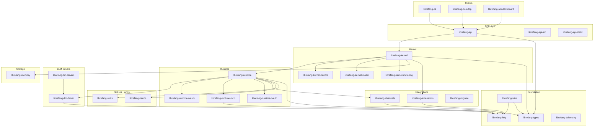

# Other

# Other

Supporting crates, frontends, and infrastructure that round out the LibreFang Agent OS. This module group contains everything outside the main agent and communications crates — the kernel, runtime, API surface, client applications, and the test suites that hold them together.

## Architecture

## Sub-module Groups

### Foundation

| Crate | Purpose |
|-------|---------|
| [librefang-types](librefang-types.md) | Shared type definitions, traits, error types, and configuration schemas — the vocabulary every other crate depends on. |
| [librefang-http](librefang-http.md) | Centralized `reqwest` client builder with rustls TLS and proxy support, used by any crate making outbound HTTP calls. |
| [librefang-wire](librefang-wire.md) | LibreFang Protocol (OFP) — cryptographic handshake, message framing, and authenticated channels for agent-to-agent networking. |
| [librefang-telemetry](librefang-telemetry.md) | `metrics` facade declarations for counters, gauges, and histograms; the binary selects the exporter (Prometheus, OTLP). |

### Kernel

[librefang-kernel](librefang-kernel.md) is the top-level orchestrator. It wires subsystems together without implementing logic itself. Its supporting crates:

- [librefang-kernel-handle](librefang-kernel-handle.md) — the `KernelHandle` trait, separating interface from implementation so consumers avoid circular dependencies.
- [librefang-kernel-router](librefang-kernel-router.md) — template-based routing engine that resolves incoming requests to the correct hand.
- [librefang-kernel-metering](librefang-kernel-metering.md) — cost tracking and quota enforcement (scaffolded).

### Runtime & Execution

[librefang-runtime](librefang-runtime.md) orchestrates the agent lifecycle — LLM calls, tool dispatch, memory access, and channel I/O. Its specialized sub-crates:

- [librefang-runtime-wasm](librefang-runtime-wasm.md) — WASM sandbox for isolated skill execution.
- [librefang-runtime-mcp](librefang-runtime-mcp.md) — Model Context Protocol client for external tool servers.
- [librefang-runtime-oauth](librefang-runtime-oauth.md) — OAuth 2.0 / device-authorization flows for ChatGPT and GitHub Copilot backends.

### LLM Layer

[librefang-llm-driver](librefang-llm-driver.md) defines the provider-agnostic trait and shared request/response types. [librefang-llm-drivers](librefang-llm-drivers.md) ships concrete implementations for Anthropic, OpenAI, and Gemini.

### Memory

[librefang-memory](librefang-memory.md) provides the SQLite-backed memory substrate — short-term conversation context, long-term knowledge, content-addressed storage, and group roster persistence via [librefang-memory-src](librefang-memory-src.md).

### Channels & Integration

[librefang-channels](librefang-channels.md) is the feature-gated bridge layer supporting 40+ messaging platforms. [librefang-extensions](librefang-extensions.md) adds MCP server bootstrapping, a credential vault, and OAuth2 PKCE flows. [librefang-migrate](librefang-migrate.md) imports configurations from other agent frameworks.

### Skills & Hands

[librefang-skills](librefang-skills.md) manages the skill lifecycle — filesystem discovery, manifest parsing, registry indexing, and marketplace downloads. [librefang-hands](librefang-hands.md) provides declarative capability packages that the kernel router resolves and the runtime dispatches.

### API & Dashboard

[librefang-api](librefang-api.md) exposes the full agent surface over REST and WebSocket via Axum. The [dashboard](librefang-api-dashboard.md) is a React 19 SPA (TanStack Router + Query) for real-time monitoring and management. Supporting assets:

- [librefang-api-src](librefang-api-src.md) — self-contained login page with TOTP 2FA support.
- [librefang-api-static](librefang-api-static.md) — i18n locale JSON files (`en`, `ja`).

### Client Applications

[librefang-cli](librefang-cli.md) is the primary binary — argument parsing, config loading, feature-gated channel selection, and optional TUI rendering. It ships with [FTL locale catalogs](librefang-cli-locales.md) and [TOML configuration templates](librefang-cli-templates.md).

[librefang-desktop](librefang-desktop.md) wraps everything in a Tauri 2.0 native shell with system tray, auto-updater, and mobile client support. Its [capabilities](librefang-desktop-capabilities.md) and [generated scaffolding](librefang-desktop-gen.md) configure platform-specific permissions.

### Testing Infrastructure

[librefang-testing](librefang-testing.md) centralizes mock implementations — `MockKernel`, `MockLlmDriver`, and Axum route test helpers — used across all integration suites. Every major crate has a companion `-tests` module (e.g., [librefang-kernel-tests](librefang-kernel-tests.md), [librefang-api-tests](librefang-api-tests.md)) that validates end-to-end wiring without mocks on the HTTP layer.

Benchmarks live in [librefang-channels-benches](librefang-channels-benches.md), profiling the serialization, routing, and formatting hot paths.

## Key Cross-Module Workflows

**Inbound message processing:** A message arrives through [librefang-channels](librefang-channels.md) → [librefang-kernel](librefang-kernel.md) routes it via [librefang-kernel-router](librefang-kernel-router.md) → [librefang-runtime](librefang-runtime.md) dispatches to the LLM through [librefang-llm-drivers](librefang-llm-drivers.md) → tools execute in [librefang-runtime-wasm](librefang-runtime-wasm.md) or via [librefang-runtime-mcp](librefang-runtime-mcp.md) → results persist in [librefang-memory](librefang-memory.md).

**Dashboard → API → Kernel:** The [React dashboard](librefang-api-dashboard.md) calls REST endpoints on [librefang-api](librefang-api.md), which delegates to [librefang-kernel](librefang-kernel.md) through the [KernelHandle](librefang-kernel-handle.md) trait. Auth flows (login, TOTP) are handled by the [login page](librefang-api-src.md) before the SPA loads.

**CLI bootstrapping:** [librefang-cli](librefang-cli.md) parses args, loads config from a [template](librefang-cli-templates.md), initializes telemetry via [librefang-telemetry](librefang-telemetry.md), and starts the kernel. Localization strings come from [Fluent catalogs](librefang-cli-locales.md).

**Desktop bundling:** [librefang-desktop](librefang-desktop.md) embeds the kernel, API server, and extensions into a Tauri binary. Platform capabilities are declared in [librefang-desktop-capabilities](librefang-desktop-capabilities.md) and scaffolded by [librefang-desktop-gen](librefang-desktop-gen.md).

**Agent-to-agent communication:** [librefang-wire](librefang-wire.md) handles cryptographic handshakes (X25519 + Ed25519) and encrypted message transport between peers, using [librefang-http](librefang-http.md) for the underlying connections.