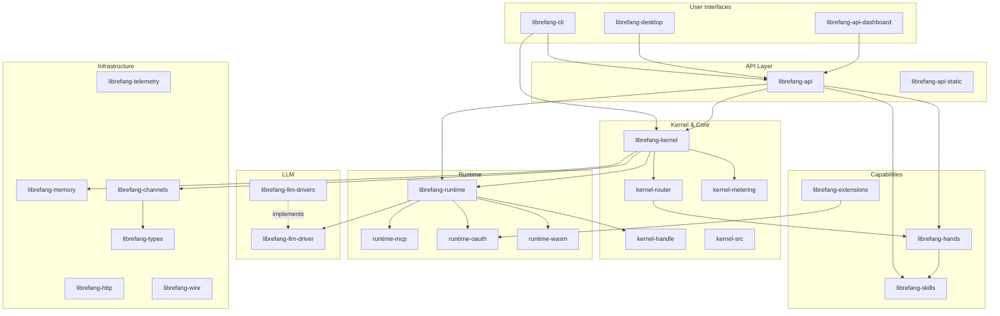

# Other

# Other — LibreFang Agent OS

LibreFang is an autonomous agent operating system comprising ~30 Rust crates, a React dashboard, and supporting infrastructure. This module group contains everything that makes up the platform — from shared type definitions through to desktop distribution.

## Architecture Overview

## Layer Breakdown

### Foundation

- [**librefang-types**](Other%20—%20librefang-types.md) — Canonical shared types, traits, and constants. Every other crate depends on this. Includes localized error messages ([librefang-types-locales](Other%20—%20librefang-types-locales.md)) and the model catalog schema ([librefang-types-src](Other%20—%20librefang-types-src.md)).
- [**librefang-http**](Other%20—%20librefang-http.md) — Centralized `reqwest::Client` builder with proxy awareness and TLS fallback (rustls + Mozilla roots).
- [**librefang-wire**](Other%20—%20librefang-wire.md) — Agent-to-agent networking implementing the LibreFang Protocol (OFP), handling framing, crypto auth, and connection lifecycle.

### Core Services

- [**librefang-kernel**](Other%20—%20librefang-kernel.md) — Central orchestration crate. Wires together all subsystems (LLM, skills, routing, metering, memory, channels) into a coherent runtime. Sub-crates handle specific concerns:
  - [kernel-handle](Other%20—%20librefang-kernel-handle.md) — `KernelHandle` trait, the async interface for in-process callers.
  - [kernel-router](Other%20—%20librefang-kernel-router.md) — Maps incoming events to Hands and Templates via pattern-matching rules.
  - [kernel-metering](Other%20—%20librefang-kernel-metering.md) — Cost tracking and quota enforcement.
  - [kernel-src](Other%20—%20librefang-kernel-src.md) — Approval management (gating dangerous tool executions) and RBAC authentication.
- [**librefang-memory**](Other%20—%20librefang-memory.md) — Persistence substrate for agent state, backed by SQLite. Provides session-scoped context loading to prevent cross-session privacy leaks.
- [**librefang-channels**](Other%20—%20librefang-channels.md) — Pluggable messaging bridge layer. Translates internal `ChannelMessage` types into platform-specific formats (Twitch IRC, etc.). Includes benchmarks ([channels-benches](Other%20—%20librefang-channels-benches.md)), the Twitch adapter ([channels-src](Other%20—%20librefang-channels-src.md)), and integration tests ([channels-tests](Other%20—%20librefang-channels-tests.md)).

### Runtime & LLM

- [**librefang-runtime**](Other%20—%20librefang-runtime.md) — Agent execution environment. Orchestrates the full lifecycle from initialization to shutdown by composing LLM drivers, memory, skills, and external protocol support.
- [**librefang-llm-driver**](Other%20—%20librefang-llm-driver.md) — Abstract trait defining how LibreFang talks to LLM backends.
- [**librefang-llm-drivers**](Other%20—%20librefang-llm-drivers.md) — Concrete implementations for Anthropic, OpenAI, and Google Gemini, handling request serialization, SSE streaming, and error mapping.
- [**librefang-runtime-mcp**](Other%20—%20librefang-runtime-mcp.md) — Model Context Protocol client for discovering and invoking external tools.
- [**librefang-runtime-oauth**](Other%20—%20librefang-runtime-oauth.md) — OAuth 2.0 + PKCE flows for authenticating with third-party AI services.
- [**librefang-runtime-wasm**](Other%20—%20librefang-runtime-wasm.md) — WASM sandbox (via wasmtime) for safely executing user-authored skills with controlled capabilities.

### Capability Layer

- [**librefang-hands**](Other%20—%20librefang-hands.md) — Declarative capability packages. Each "Hand" encapsulates a discrete autonomous behavior — registry, lifecycle management, and validation.
- [**librefang-skills**](Other%20—%20librefang-skills.md) — Skill discovery, loading, marketplace integration, and OpenClaw format compatibility.
- [**librefang-extensions**](Other%20—%20librefang-extensions.md) — MCP server provisioning, encrypted credential vault (Argon2 + AES-256-GCM), and OAuth2 PKCE browser authorization.

### User Interfaces

- [**librefang-cli**](Other%20—%20librefang-cli.md) — Primary CLI binary (`librefang` command). `clap`-driven interface with optional `ratatui` TUI. Pulls in templates ([cli-templates](Other%20—%20librefang-cli-templates.md)) and localized messages ([cli-locales](Other%20—%20librefang-cli-locales.md)).
- [**librefang-desktop**](Other%20—%20librefang-desktop.md) — Tauri 2.0 native desktop app. System-tray resident with local web UI and auto-update. Includes Tauri capability definitions ([desktop-capabilities](Other%20—%20librefang-desktop-capabilities.md)) and auto-generated security schemas ([desktop-gen](Other%20—%20librefang-desktop-gen.md)).
- [**librefang-api**](Other%20—%20librefang-api.md) — HTTP/WebSocket API server exposing the daemon's full capabilities. Includes the React dashboard ([api-dashboard](Other%20—%20librefang-api-dashboard.md) — TanStack Router + Query, PWA with offline caching), static locale assets ([api-static](Other%20—%20librefang-api-static.md)), and integration tests ([api-tests](Other%20—%20librefang-api-tests.md)).

### Cross-Cutting

- [**librefang-telemetry**](Other%20—%20librefang-telemetry.md) — OpenTelemetry + Prometheus metrics. Centralized metric definitions wrapping the `metrics` facade.
- [**librefang-testing**](Other%20—%20librefang-testing.md) — Dev-only test infrastructure: mock kernel, mock LLM drivers, and API route test harness. Includes its own test suite ([testing-src](Other%20—%20librefang-testing-src.md)).
- [**librefang-migrate**](Other%20—%20librefang-migrate.md) — Imports configurations from other C2 agent frameworks into LibreFang's native format.
- [**AGENTS.md**](Other%20—%20AGENTS.md) / [**CLAUDE.md**](Other%20—%20CLAUDE.md) — AI coding agent instruction files defining safety protocols and navigation strategies for repository-aware development.

## Key Workflows

**Message dispatch** — An inbound message arrives via a channel adapter → `BridgeManager` routes it through `AgentRouter` → `kernel-router` resolves the target Hand → `librefang-runtime` executes the agent loop using an LLM driver → the response flows back through the channel adapter. The entire path is guarded by metering quotas and approval gates.

**Skill execution** — Skills are discovered on disk by `librefang-skills`, loaded into `librefang-hands` as Hand packages, and executed either through the LLM tool-call path (runtime invokes the driver, which returns tool invocations) or through the WASM sandbox (`librefang-runtime-wasm` provides isolated execution with explicit capability grants).

**Dashboard → API → Kernel** — The React dashboard ([api-dashboard](Other%20—%20librefang-api-dashboard.md)) issues mutations (e.g., `useUpdateWorkflow`, `useTestChannel`, `useCreatePromptVersion`) that flow through TanStack Query → `api.ts` HTTP client → `librefang-api` axum routes → kernel operations. Auth headers are built via `authHeader` → `getItem` (localStorage), and errors are centralized through `parseError` with automatic `clearApiKey` on auth failure.

**Cross-session memory isolation** — Agent memories are stored via `librefang-memory` with session-scoped context loading. The kernel loads only the relevant canonical context for each channel session, preventing private DMs from leaking into group conversations. This is guarded by regression tests in [memory-tests](Other%20—%20librefang-memory-tests.md).

**Extension auth flow** — `librefang-extensions` triggers OAuth2 PKCE via `librefang-runtime-oauth`, which spins up a local callback server and exchanges codes for tokens. Tokens are persisted in the credential vault (Argon2-derived key, AES-256-GCM encryption). The runtime's MCP client (`librefang-runtime-mcp`) uses these credentials when connecting to MCP servers.