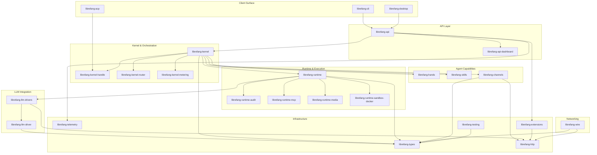

# Other

# Other — LibreFang Agent OS Workspace Crates

This module group contains the complete crate-level architecture of the **LibreFang Agent Operating System** — a platform for running, orchestrating, and extending autonomous AI agents across messaging channels on a 24×7 basis. The crates are organized into layered subsystems with clear dependency boundaries.

## Architecture Overview

```mermaid
graph TD
    subgraph "Client Surface"
        CLI[librefang-cli]
        DESKTOP[librefang-desktop]
        ACP[librefang-acp]
    end

    subgraph "API Layer"
        API[librefang-api]
        DASH[librefang-api-dashboard]
    end

    subgraph "Kernel & Orchestration"
        KERNEL[librefang-kernel]
        HANDLE[librefang-kernel-handle]
        ROUTER[librefang-kernel-router]
        METER[librefang-kernel-metering]
    end

    subgraph "Runtime & Execution"
        RUNTIME[librefang-runtime]
        AUDIT[librefang-runtime-audit]
        MCP[librefang-runtime-mcp]
        MEDIA[librefang-runtime-media]
        SANDBOX[librefang-runtime-sandbox-docker]
    end

    subgraph "LLM Integration"
        DRIVER[librefang-llm-driver]
        DRIVERS[librefang-llm-drivers]
    end

    subgraph "Agent Capabilities"
        HANDS[librefang-hands]
        SKILLS[librefang-skills]
        CHANNELS[librefang-channels]
    end

    subgraph "Infrastructure"
        TYPES[librefang-types]
        HTTP[librefang-http]
        TELEMETRY[librefang-telemetry]
        EXT[librefang-extensions]
        TESTING[librefang-testing]
    end

    subgraph "Networking"
        WIRE[librefang-wire]
    end

    CLI --> API
    DESKTOP --> API
    ACP --> HANDLE
    API --> KERNEL
    KERNEL --> RUNTIME
    KERNEL --> HANDLE
    KERNEL --> ROUTER
    KERNEL --> METER
    RUNTIME --> AUDIT
    RUNTIME --> MCP
    RUNTIME --> MEDIA
    RUNTIME --> SANDBOX
    RUNTIME --> DRIVERS
    DRIVERS --> DRIVER
    KERNEL --> HANDS
    KERNEL --> SKILLS
    KERNEL --> CHANNELS
    CHANNELS --> HTTP
    DRIVERS --> HTTP
    EXT --> HTTP
    WIRE --> HTTP
    API --> EXT
    API --> TELEMETRY
    API --> DASH

    DRIVER --> TYPES
    KERNEL --> TYPES
    RUNTIME --> TYPES
    CHANNELS --> TYPES
    WIRE --> TYPES
    TESTING --> TYPES
```

## Subsystem Breakdown

### Foundation Layer

| Crate | Purpose |
|-------|---------|
| [librefang-types](Other%20—%20librefang-types.md) | Shared data structures at the bottom of the dependency DAG. Every workspace crate depends on this; it depends on nothing in the workspace. |
| [librefang-http](Other%20—%20librefang-http.md) | Centralized `reqwest` client builder with uniform TLS (rustls) and proxy configuration. All HTTP-speaking crates go through here. |
| [librefang-telemetry](Other%20—%20librefang-telemetry.md) | OpenTelemetry/Prometheus metric definitions — single source of truth for counters, gauges, and histograms. |
| [librefang-testing](Other%20—%20librefang-testing.md) | Shared test infrastructure: mock kernel, mock LLM driver, and axum route test helpers. |

### Kernel & Orchestration

The kernel is the central coordination hub. It manages agent lifecycles, scheduling, permissions, inter-agent messaging, and fans requests out to the runtime and LLM layers.

- [librefang-kernel](Other%20—%20librefang-kernel.md) — Core orchestration: agent registry, cron scheduling, event bus, session lifecycle.
- [librefang-kernel-handle](Other%20—%20librefang-kernel-handle.md) — Defines the `KernelHandle` trait, the stable in-process interface for kernel callers. Enables test mocking and decoupling.
- [librefang-kernel-router](Other%20—%20librefang-kernel-router.md) — Resolves incoming requests to the correct Hand implementation via pattern matching and TOML routing rules.
- [librefang-kernel-metering](Other%20—%20librefang-kernel-metering.md) — Token usage tracking and cost quota enforcement.

### Runtime & Execution

The runtime layer handles the agent loop, tool execution, sandboxing, and media generation — everything that happens after the kernel dispatches work.

- [librefang-runtime](Other%20—%20librefang-runtime.md) — Agent loop (LLM completion → tool execution → response assembly → session persistence), gateway compression, compaction.
- [librefang-runtime-audit](Other%20—%20librefang-runtime-audit.md) — Tamper-evident Merkle hash chain for auditable runtime events. Persisted to SQLite with optional external anchor files.
- [librefang-runtime-mcp](Other%20—%20librefang-runtime-mcp.md) — MCP (Model Context Protocol) transport implementations for tool integration.
- [librefang-runtime-media](Other%20—%20librefang-runtime-media.md) — Provider-agnostic media drivers (TTS, image/video generation, speech-to-text) with caching.
- [librefang-runtime-sandbox-docker](Other%20—%20librefang-runtime-sandbox-docker.md) — Docker container sandbox for isolated tool execution with resource limits and network isolation.

### LLM Integration

Split into trait definition and concrete implementations to prevent dependency bloat:

- [librefang-llm-driver](Other%20—%20librefang-driver.md) — The `LlmDriver` trait and `LlmError` enum. No provider code, no TLS dependencies.
- [librefang-llm-drivers](Other%20—%20librefang-drivers.md) — Concrete implementations for Anthropic, OpenAI, Gemini, Groq, Ollama, etc., with credential pooling, fallback chains, rate limiting, retry with backoff, and stream backpressure.

### Agent Capabilities

- [librefang-hands](Other%20—%20librefang-hands.md) — Curated, versioned capability packages (Hands). Provides registry, loading, validation, and disk persistence.
- [librefang-skills](Other%20—%20librefang-skills.md) — Skill discovery, loading, registry, marketplace client, and OpenClaw compatibility layer.
- [librefang-channels](Other%20—%20librefang-channels.md) — Bridge layer connecting the kernel to out-of-process channel adapters (Telegram, Discord, Slack, Matrix, Signal, etc.) running as Python sidecars. Owns the sidecar trampoline, bridge protocol types, and shared messaging infrastructure.

### Client Surfaces

Three interfaces expose LibreFang to users and editors:

- [librefang-cli](Other%20—%20librefang-cli.md) — The `librefang` binary. Operates in daemon mode (forwarding to a running HTTP daemon) or single-shot mode (in-process kernel for one-off commands).
- [librefang-desktop](Other%20—%20librefang-desktop.md) — Native Tauri 2.0 application for macOS, Windows, Linux, iOS, and Android. Desktop embeds the kernel; mobile is a thin client connecting to a remote daemon.
- [librefang-acp](Other%20—%20librefang-acp.md) — Agent Client Protocol adapter for editor integration (Zed, VS Code, JetBrains) over stdio JSON-RPC.

### API & Dashboard

- [librefang-api](Other%20—%20librefang-api.md) — axum HTTP/WebSocket server exposing agent management, sessions, channels, approvals, MCP, peer/A2A networking, and the embedded React dashboard.
- [librefang-api-dashboard](Other%20—%20librefang-api-dashboard.md) — React 19 + TanStack Router + TanStack Query SPA for real-time agent management. PWA-enabled with service worker.
- [librefang-api-static](Other%20—%20librefang-api-static.md) — i18n locale files (English, Japanese) for the dashboard.

### Cross-Cutting Infrastructure

- [librefang-extensions](Other%20—%20librefang-extensions.md) — Credential vault, MCP server lifecycle management, OAuth2 PKCE flows, and workspace environment parsing. Shared by API, CLI, and Desktop.
- [librefang-wire](Other%20—%20librefang-wire.md) — LibreFang Protocol (OFP) for agent-to-agent networking. Handles X25519 key exchange, HKDF-derived session keys, AEAD encryption, and HMAC-SHA256 integrity.
- [librefang-import](Other%20—%20librefang-import.md) — Migration engine for importing agent configs from LangChain, AutoGPT, Semantic Kernel, and other frameworks.
- [librefang-rl-export](Other%20—%20librefang-rl-export.md) — RL rollout trajectory exporter for W&B, Tinker, and Atropos integration.

## Key Workflows That Span Crates

**Agent message processing:** An inbound message arrives via a channel sidecar → [librefang-channels](Other%20—%20librefang-channels.md) deserializes and routes it → [librefang-kernel](Other%20—%20librefang-kernel.md) resolves the target agent via [librefang-kernel-router](Other%20—%20librefang-kernel-router.md) → [librefang-runtime](Other%20—%20librefang-runtime.md) runs the agent loop → [librefang-llm-drivers](Other%20—%20librefang-llm-drivers.md) streams completions → tool results are collected → response is formatted and dispatched back through channels. Token usage is tracked by [librefang-kernel-metering](Other%20—%20librefang-kernel-metering.md) and every auditable event is appended to the [librefang-runtime-audit](Other%20—%20librefang-runtime-audit.md) Merkle chain.

**CLI/Dashboard → Kernel path:** Both [librefang-cli](Other%20—%20librefang-cli.md) and [librefang-api-dashboard](Other%20—%20librefang-api-dashboard.md) talk to the kernel through [librefang-api](Other%20—%20librefang-api.md)'s REST/WebSocket surface, which uses the [librefang-kernel-handle](Other%20—%20librefang-kernel-handle.md) trait for in-process dispatch. Credentials are resolved through [librefang-extensions](Other%20—%20librefang-extensions.md)' vault, and all HTTP traffic uses [librefang-http](Other%20—%20librefang-http.md)'s shared client.

**Editor integration:** [librefang-acp](Other%20—%20librefang-acp.md) translates editor JSON-RPC messages into kernel operations via the `KernelHandle` trait, enabling agent-assisted coding in Zed, VS Code, and JetBrains without running a full API server.

**Agent-to-agent networking:** [librefang-wire](Other%20—%20librefang-wire.md) provides the cryptographic handshake and encrypted transport. Agents on different daemons establish X25519 key exchange sessions and communicate through AEAD-encrypted channels, with integrity verified via HMAC-SHA256 hash chains.

## Test Suites

Nearly every crate has a companion `-tests` crate providing hermetic integration tests against mock kernels and fake LLM providers. Key test suites include:

| Test Crate | Scope |
|-----------|-------|
| [librefang-api-tests](Other%20—%20librefang-api-tests.md) | Production router end-to-end: auth middleware, validation, error envelopes, security boundaries |
| [librefang-kernel-tests](Other%20—%20librefang-kernel-tests.md) | Agent lifecycle, async tasks, memory, RBAC, cron, hand management, workflows |
| [librefang-llm-drivers-tests](Other%20—%20librefang-llm-drivers-tests.md) | Wire contract validation against wiremock servers for each LLM provider |
| [librefang-channels-tests](Other%20—%20librefang-channels-tests.md) | Bridge dispatch pipeline and sidecar protocol conformance |
| [librefang-extensions-tests](Other%20—%20librefang-extensions-tests.md) | Credential vault cryptographic round-trips and key rotation |
| [librefang-memory-tests](Other%20—%20librefang-memory-tests.md) | Chat-scoped canonical memory isolation (privacy regression guard) |