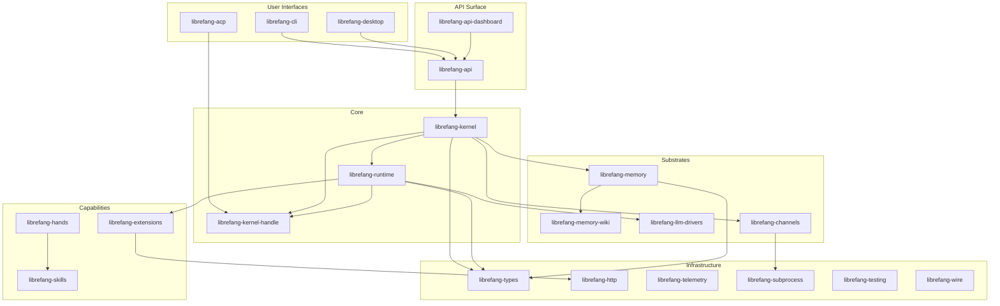

# Other

# Other Module

Supporting crates, interfaces, tests, and utilities that complete the LibreFang Agent OS architecture. This module group encompasses everything below the top-level crates: the core kernel and runtime, memory and LLM subsystems, user-facing interfaces (CLI, desktop, dashboard), channel adapters, skill/hand management, and cross-cutting infrastructure.

## Architecture

```mermaid
graph TD
    subgraph "User Interfaces"
        CLI[librefang-cli]
        DESK[librefang-desktop]
        ACP[librefang-acp]
    end

    subgraph "API Surface"
        API[librefang-api]
        DASH[librefang-api-dashboard]
    end

    subgraph "Core"
        KERN[librefang-kernel]
        RT[librefang-runtime]
        KH[librefang-kernel-handle]
    end

    subgraph "Substrates"
        MEM[librefang-memory]
        WIKI[librefang-memory-wiki]
        LLD[librefang-llm-drivers]
        CH[librefang-channels]
    end

    subgraph "Capabilities"
        SK[librefang-skills]
        HANDS[librefang-hands]
        EXT[librefang-extensions]
    end

    subgraph "Infrastructure"
        TYPES[librefang-types]
        HTTP[librefang-http]
        TELE[librefang-telemetry]
        SUB[librefang-subprocess]
        TEST[librefang-testing]
        WIRE[librefang-wire]
    end

    CLI --> API
    DESK --> API
    ACP --> KH

    API --> KERN
    DASH --> API

    KERN --> RT
    KERN --> KH
    KERN --> MEM
    KERN --> CH

    RT --> KH
    RT --> LLD
    RT --> EXT

    MEM --> WIKI
    CH --> SUB

    HANDS --> SK
    EXT --> HTTP

    KERN --> TYPES
    RT --> TYPES
    MEM --> TYPES
```

## Layer Breakdown

### Foundation — Types & Infrastructure

[librefang-types](librefang-types.md) sits at the bottom of the dependency graph. Every workspace crate depends on it for shared data structures, serde derives, and wire-protocol types. It contains no business logic.

Supporting infrastructure crates provide cross-cutting concerns:

| Crate | Concern |
|---|---|
| [librefang-http](librefang-http.md) | Shared HTTP client builder with TLS/proxy configuration |
| [librefang-telemetry](librefang-telemetry.md) | OpenTelemetry + Prometheus metrics via the `metrics` facade |
| [librefang-subprocess](librefang-subprocess.md) | Persistent JSON-over-stdio transport used by all sidecar bridges |
| [librefang-wire](librefang-wire.md) | Agent-to-agent networking with cryptographic authentication |
| [librefang-testing](librefang-testing.md) | Mock kernel, mock LLM driver, and API route test helpers |

Localization resources live in dedicated resource modules — [librefang-types-locales](librefang-types-locales.md) for API error messages and [librefang-cli-locales](librefang-cli-locales.md) for CLI strings — both using Project Fluent `.ftl` files.

### Core — Kernel & Runtime

[librefang-kernel](librefang-kernel.md) is the orchestration crate: agent lifecycles, scheduling, permissions, inter-agent communication, and the message dispatch loop. It re-exports [librefang-kernel-metering](librefang-kernel-metering.md) (cost tracking and quota enforcement) and [librefang-kernel-router](librefang-kernel-router.md) (regex-based hand routing).

[librefang-kernel-handle](librefang-kernel-handle.md) defines the `KernelHandle` trait — the zero-copy in-process interface that all callers use to interact with the kernel. The kernel implements this trait; consumers depend only on the interface.

[librefang-runtime](librefang-runtime.md) owns the turn-by-turn agent loop, tool dispatch, context window management, and the A2A peer protocol. It consumes `KernelHandle` rather than the concrete kernel. Feature-gated sub-crates handle isolated concerns:

| Sub-crate | Purpose |
|---|---|
| [librefang-runtime-audit](librefang-runtime-audit.md) | Tamper-evident Merkle-hash-chained audit log |
| [librefang-runtime-mcp](librefang-runtime-mcp.md) | MCP client for tool discovery and invocation |
| [librefang-runtime-media](librefang-runtime-media.md) | Provider-agnostic TTS, image, video, and music generation |
| [librefang-runtime-sandbox-docker](librefang-runtime-sandbox-docker.md) | Hardened Docker container execution for untrusted code |

### Substrates — Memory, LLM, Channels

[librefang-memory](librefang-memory.md) provides the unified `Memory` trait backed by structured storage (SQLite), semantic search (LIKE/Qdrant), and a knowledge graph. [librefang-memory-wiki](librefang-memory-wiki.md) adds a durable markdown knowledge vault with YAML frontmatter and Obsidian-compatible export.

[librefang-llm-driver](librefang-llm-driver.md) defines the `LlmDriver` trait and shared types. [librefang-llm-drivers](librefang-llm-drivers.md) implements it for Anthropic, OpenAI, Gemini, Groq, Ollama, and others — with credential pooling, fallback chains, rate-limit tracking, and stream backpressure.

[librefang-channels](librefang-channels.md) is the bridge layer connecting the kernel to out-of-process channel adapters (Python sidecars). It provides the trampoline that launches sidecars, the bridge types defining the communication contract, and shared utilities. [librefang-channels-src](librefang-channels-src.md) enforces the sidecar-first policy via an allowlist.

### Capabilities — Skills, Hands, Extensions

[librefang-skills](librefang-skills.md) manages the full skill lifecycle: discovery, deserialization from TOML/YAML/JSON, version resolution, integrity verification, and marketplace interaction.

[librefang-hands](librefang-hands.md) layers on top, providing curated bundles of skills assembled into coherent capability packages that can be loaded and deployed as a unit.

[librefang-extensions](librefang-extensions.md) provides the "everything-side-of-an-agent" functionality: MCP server setup, an AES-256-GCM credential vault, OAuth2 PKCE with Dynamic Client Registration, and agent workspace configuration.

### User Interfaces

| Interface | Crate | Mode |
|---|---|---|
| Command line | [librefang-cli](librefang-cli.md) | Daemon mode (HTTP client) or single-shot (in-process kernel) |
| Desktop/Mobile | [librefang-desktop](librefang-desktop.md) | Tauri 2.0 app — desktop embeds the daemon; mobile is a thin client |
| Editor integration | [librefang-acp](librefang-acp.md) | Bridges into Zed, VS Code, JetBrains over stdio JSON-RPC via ACP |
| Web dashboard | [librefang-api-dashboard](librefang-api-dashboard.md) | React 19 SPA with TanStack Router/Query, served by the API |

[librefang-api](librefang-api.md) is the HTTP/WebSocket server that exposes agent management, sessions, approvals, MCP, peer networking, and the dashboard SPA. [librefang-api-src](librefang-api-src.md) provides the self-contained login page, and [librefang-api-static](librefang-api-static.md) ships i18n locale files.

[librefang-cli-templates](librefang-cli-templates.md) contains the TOML templates used by `librefang init`. [librefang-desktop-capabilities](librefang-desktop-capabilities.md) and [librefang-desktop-gen](librefang-desktop-gen.md) define the Tauri security model.

### Migration & Export

[librefang-import](librefang-import.md) converts configurations and agent definitions from other frameworks into LibreFang-native types. [librefang-rl-export](librefang-rl-export.md) serializes RL rollout trajectories to Weights & Biases, Tinker, and Atropos.

## Key Workflows

**Agent message handling:** A user message arrives via a channel adapter (channels), the API, or the CLI. The kernel router scores it against regex rules to select the best hand. The runtime executes the turn-by-turn agent loop, calling through `KernelHandle` to dispatch to the LLM driver, invoke tools, and persist to memory. Metering tracks token costs; audit logs record every action.

**Skill/hand activation:** Skills are loaded from disk by the skill registry. Hands bundle curated skill sets. When a hand is activated, the kernel resolves its skill references and gates tool availability accordingly.

**Cross-agent communication:** The A2A protocol (runtime) enables interoperability with external agent frameworks. For LibreFang-to-LibreFang peers, [librefang-wire](librefang-wire.md) handles authenticated channel establishment and encrypted message framing.

**Test strategy:** [librefang-testing](librefang-testing.md) provides mock kernel and LLM driver implementations used across all integration test suites. Each major crate has a companion test module that validates wire contracts, cross-crate invariants, and end-to-end behavior without requiring live services.