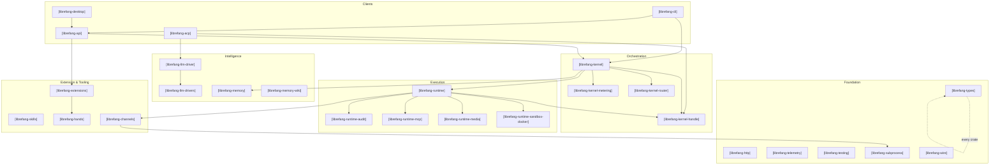

# Other

# Other — LibreFang Agent OS Supporting Crates

This module group contains the full stack of supporting crates for the LibreFang Agent OS — everything below the top-level workspace that isn't a self-contained service. The crates span from the shared type spine through the kernel, runtime, API surface, client interfaces, and their test suites.

## Architecture

```mermaid
graph TD
    subgraph "Clients"
        CLI["[librefang-cli]"]
        DESK["[librefang-desktop]"]
        ACP["[librefang-acp]"]
        API["[librefang-api]"]
    end

    subgraph "Orchestration"
        K["[librefang-kernel]"]
        KH["[librefang-kernel-handle]"]
        KM["[librefang-kernel-metering]"]
        KR["[librefang-kernel-router]"]
    end

    subgraph "Execution"
        RT["[librefang-runtime]"]
        AUDIT["[librefang-runtime-audit]"]
        MCP["[librefang-runtime-mcp]"]
        MEDIA["[librefang-runtime-media]"]
        DOCK["[librefang-runtime-sandbox-docker]"]
    end

    subgraph "Intelligence"
        LLD["[librefang-llm-driver]"]
        LLDS["[librefang-llm-drivers]"]
        MEM["[librefang-memory]"]
        WIKI["[librefang-memory-wiki]"]
    end

    subgraph "Extension & Tooling"
        EXT["[librefang-extensions]"]
        SKILLS["[librefang-skills]"]
        HANDS["[librefang-hands]"]
        CH["[librefang-channels]"]
    end

    subgraph "Foundation"
        T["[librefang-types]"]
        HTTP["[librefang-http]"]
        TELE["[librefang-telemetry]"]
        TEST["[librefang-testing]"]
        SUB["[librefang-subprocess]"]
        WIRE["[librefang-wire]"]
    end

    CLI --> API
    CLI --> K
    DESK --> API
    ACP --> KH
    ACP --> LLD
    API --> K
    API --> EXT

    K --> KH
    K --> RT
    K --> KM
    K --> KR
    K --> MEM

    RT --> KH
    RT --> AUDIT
    RT --> MCP
    RT --> MEDIA
    RT --> DOCK
    RT --> CH

    LLD --> LLDS
    CH --> SUB
    EXT --> HANDS

    T -.->|every crate| T
```

## Layer Breakdown

### Foundation — Shared Types & Infrastructure

[**librefang-types**](librefang-types.md) is the schema spine. Every workspace crate depends on it; it depends on nothing else. It holds pure data structures, error enums, and derive-only helpers. [**librefang-types-locales**](librefang-types-locales.md) provides the Fluent `.ftl` files for localized API error strings, while [**librefang-types-tests**](librefang-types-tests.md) guards against serialization drift between the TypeScript dashboard, TOML configs, and Rust's type system.

[**librefang-http**](librefang-http.md) provides a shared `reqwest::Client` builder with consistent TLS (rustls), system proxy awareness, and certificate loading — used by every crate that makes outbound requests. [**librefang-telemetry**](librefang-telemetry.md) centralizes OpenTelemetry/Prometheus metric definitions on the `metrics` facade. [**librefang-testing**](librefang-testing.md) supplies mock kernel and LLM driver implementations, API test helpers, and the `MockKernelBuilder` used across integration suites ([**librefang-testing-src**](librefang-testing-src.md) demonstrates usage patterns).

[**librefang-subprocess**](librefang-subprocess.md) is the shared JSON-over-stdio transport used by all sidecar bridges — it handles child process spawning, request/reply correlation by `id`, stderr draining, and cleanup. [**librefang-wire**](librefang-wire.md) implements the LibreFang Protocol (OFP) for authenticated, encrypted agent-to-agent networking.

### Kernel — Orchestration & Lifecycle

[**librefang-kernel**](librefang-kernel.md) is the central orchestrator: agent lifecycles, scheduling, permissions, inter-agent communication, and the message-dispatch loop. It re-exports [**librefang-kernel-metering**](librefang-kernel-metering.md) (cost tracking and quota enforcement per session/tenant) and [**librefang-kernel-router**](librefang-kernel-router.md) (resolving requests to hand implementations and template renderers).

[**librefang-kernel-handle**](librefang-kernel-handle.md) defines the `KernelHandle` trait — the in-process boundary layer that decouples the kernel's concrete implementation from its consumers (runtime, API, ACP adapter). Default method implementations allow opt-in capability specialization ([**librefang-kernel-handle-tests**](librefang-kernel-handle-tests.md) validates those defaults).

The kernel's own tests live in two crates: [**librefang-kernel-src**](librefang-kernel-src.md) for unit tests booted against real kernels with `RecordingChannelAdapter`, and [**librefang-kernel-tests**](librefang-kernel-tests.md) for broader integration coverage (RBAC, cron scheduling, session compaction, multi-agent isolation).

### Runtime — Execution & Agent Loop

[**librefang-runtime**](librefang-runtime.md) owns the turn-by-turn agent loop, tool dispatch, context management, sandboxing, OAuth flows, audit trail, and channel registry. It re-exports several focused sub-crates extracted during the #3710 god-crate split:

- [**librefang-runtime-audit**](librefang-runtime-audit.md) — tamper-evident SHA-256 Merkle hash chain for every auditable event, optionally persisted to SQLite ([**librefang-runtime-audit-src**](librefang-runtime-audit-src.md) details the constructors and data structures).
- [**librefang-runtime-mcp**](librefang-runtime-mcp.md) — Model Context Protocol client for discovering and calling external tool servers ([**librefang-runtime-mcp-tests**](librefang-runtime-mcp-tests.md) exercises `HttpCompat` transport).
- [**librefang-runtime-media**](librefang-runtime-media.md) — provider-agnostic drivers for text-to-speech, image, video, and music generation.
- [**librefang-runtime-sandbox-docker**](librefang-runtime-sandbox-docker.md) — Docker container isolation for untrusted tool execution.

[**librefang-runtime-src**](librefang-runtime-src.md) covers the agent loop unit tests (empty-response fallback, tool-call recovery, cascade-leak suppression, reply directives), while [**librefang-runtime-tests**](librefang-runtime-tests.md) exercises cross-module contracts (Docker sandbox parity, OAuth integration, tool ACL enforcement).

### LLM — Provider Abstraction

[**librefang-llm-driver**](librefang-llm-driver.md) defines the `LlmDriver` trait, `LlmError` enum, and shared types. It contains no concrete implementations — those live in [**librefang-llm-drivers**](librefang-llm-drivers.md), which provides isolated modules for Anthropic, OpenAI, Gemini, Groq, Ollama, Bedrock, and others, along with production infrastructure: `FallbackChain` delegation, `ArcCredentialPool`, rate-limit buckets, backoff/retry logic, and stream backpressure. [**librefang-llm-drivers-tests**](librefang-llm-drivers-tests.md) runs every provider against `wiremock` HTTP servers, verifying request shapes, retry behavior, trace header propagation, and stream alignment.

### Memory — Storage & Retrieval

[**librefang-memory**](librefang-memory.md) provides the unified `Memory` trait backed by three stores: structured (SQLite key/value/sessions/audit), semantic (LIKE/Qdrant text search), and knowledge graph (SQLite entities & relations). Session-scoped filtering prevents cross-conversation leakage ([**librefang-memory-tests**](librefang-memory-tests.md) guards this privacy fix).

[**librefang-memory-wiki**](librefang-memory-wiki.md) is a durable Markdown knowledge vault with YAML frontmatter provenance tracking, exportable to Obsidian-compatible vaults ([**librefang-memory-wiki-tests**](librefang-memory-wiki-tests.md) validates the filesystem contract and JSON shape).

### API & Dashboard — HTTP Surface & Web UI

[**librefang-api**](librefang-api.md) is the primary network interface — an axum HTTP/WebSocket server exposing agent management, sessions, channels, approvals, MCP tool execution, peer networking, and the bundled React dashboard SPA. It sits between clients and the in-process kernel.

[**librefang-api-dashboard**](librefang-api-dashboard.md) is the React 19 SPA built on TanStack Router v1 and TanStack Query v5, bundled with Vite. Pages and components interact exclusively through query/mutation hooks — never calling `fetch()` directly. [**librefang-api-src**](librefang-api-src.md) contains the self-contained login page (inline HTML/CSS/JS, no build step) served to unauthenticated users. [**librefang-api-static**](librefang-api-static.md) holds i18n locale files (`en.json`, `ja.json`) consumed by the frontend's `getFixedT`/`t()` bindings. [**librefang-api-tests**](librefang-api-tests.md) exercises route handlers through the real middleware stack via `tower::oneshot` or loopback TCP.

### ACP — IDE Integration

[**librefang-acp**](librefang-acp.md) adapts LibreFang agents to the Agent Client Protocol, allowing them to run inside Zed, VS Code, and JetBrains extensions via stdio JSON-RPC. It translates ACP messages into kernel operations using the `AcpKernel` trait and streams results back. [**librefang-acp-tests**](librefang-acp-tests.md) exercises both directions of the JSON-RPC connection over `tokio::io::duplex` pipes with a `MockKernel`.

### Channels — External Messaging Bridge

[**librefang-channels**](librefang-channels.md) is the trampoline connecting the kernel to out-of-process channel sidecars (Slack, Telegram, Discord). It spawns, manages, and communicates with Python sidecar adapters using the shared subprocess transport. [**librefang-channels-benches**](librefang-channels-benches.md) benchmarks serialization, routing, and formatting hot paths. [**librefang-channels-src**](librefang-channels-src.md) enforces the sidecar-only policy via an allowlist preventing new in-process adapters. [**librefang-channels-tests**](librefang-channels-tests.md) validates bridge dispatch end-to-end and sidecar protocol conformance against a shared JSON corpus.

### CLI — Command-Line Interface

[**librefang-cli**](librefang-cli.md) ships the `librefang` binary, operating in daemon mode (long-running background process) or standalone mode (in-process kernel for single-shot commands). [**librefang-cli-locales**](librefang-cli-locales.md) provides Fluent `.ftl` files (English, Simplified Chinese) for localized CLI output. [**librefang-cli-templates**](librefang-cli-templates.md) holds the TOML configuration templates used by `librefang init`. [**librefang-cli-tests**](librefang-cli-tests.md) includes a regression guard preventing build-script git mutation and vault key rotation correctness tests.

### Desktop — Native Application Shell

[**librefang-desktop**](librefang-desktop.md) is a Tauri 2.0 wrapper that runs the web UI as a native app. On desktop it embeds the kernel, API server, and system integration (tray icon, autostart, global shortcuts, auto-updates); on mobile it acts as a thin dashboard connecting to a remote daemon. [**librefang-desktop-capabilities**](librefang-desktop-capabilities.md) defines Tauri capability/permission configurations split by platform. [**librefang-desktop-gen**](librefang-desktop-gen.md) holds auto-generated Tauri security artifacts (ACL manifests, capability schemas).

### Extensions, Skills & Hands — Capability System

[**librefang-extensions**](librefang-extensions.md) is the "everything-side-of-an-agent" toolkit: MCP server catalog management, encrypted credential storage (`CredentialVault`), OAuth2 PKCE flows, provider health probing, plugin installation, shared HTTP client construction, and `.env` parsing. [**librefang-extensions-tests**](librefang-extensions-tests.md) validates the vault encrypt→persist→reload→decrypt lifecycle.

[**librefang-skills**](librefang-skills.md) implements the complete skill lifecycle — disk discovery, loading, versioning, integrity verification, marketplace interaction, and OpenClaw format compatibility. [**librefang-hands**](librefang-hands.md) defines self-contained capability packages with TOML deserialization and a thread-safe registry ([**librefang-hands-tests**](librefang-hands-tests.md) exercises cross-method lifecycle composition).

### Import — Migration

[**librefang-import**](librefang-import.md) locates, parses, and converts configurations from other agent frameworks into LibreFang-native types. [**librefang-import-tests**](librefang-import-tests.md) verifies byte-level idempotency and crash recovery across repeated migrations.

### RL Export — Training Integration

[**librefang-rl-export**](librefang-rl-export.md) serializes and transmits long-horizon RL rollout trajectories to Weights & Biases, Tinker, and Atropos for experiment tracking and analysis.

---

## Key Workflows Spanning Modules

**Inbound user message (daemon path):** CLI → `librefang-api` (HTTP/WebSocket) → `librefang-kernel` (dispatch) → `librefang-runtime` (agent loop) → `librefang-llm-drivers` (LLM inference) → `librefang-memory` (context retrieval/storage). The runtime consults `librefang-kernel-metering` for quota checks, records events via `librefang-runtime-audit`, and may invoke tools through `librefang-runtime-mcp` or `librefang-runtime-sandbox-docker`.

**Inbound user message (IDE path):** IDE extension → `librefang-acp` (stdio JSON-RPC) → `librefang-kernel-handle` trait → same kernel/runtime path above.

**Channel message (Slack/Telegram/Discord):** External service → Python sidecar → `librefang-subprocess` (JSON-over-stdio) → `librefang-channels` bridge → `librefang-kernel` → same runtime path.

**Dashboard interaction:** Browser → `librefang-api` (serves SPA from `librefang-api-static` assets, `librefang-api-dashboard` React bundle, `librefang-api-src` login page) → API routes → kernel.

**Agent-to-agent networking:** `librefang-wire` handles authenticated key exchange and encrypted message framing between LibreFang instances.

**Configuration migration:** `librefang-cli` invokes `librefang-import` to parse external framework configs → converts to `librefang-types` → writes LibreFang-native configuration.