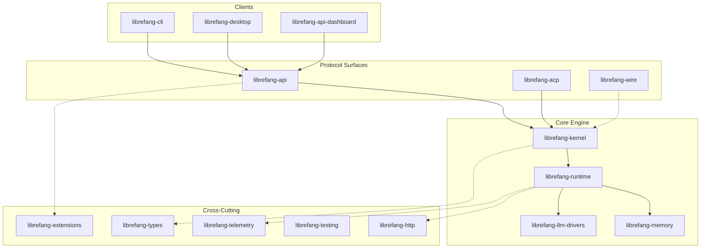

# Other

# Other — Supporting Crates & Infrastructure

This module group contains every LibreFang crate that isn't the core agent OS daemon itself. It spans foundational types, the kernel orchestration layer, agent execution runtime, LLM integrations, memory systems, network surfaces, client applications, and cross-cutting infrastructure.

## Layered Architecture


```mermaid
graph TB
    subgraph "Clients"
        CLI["librefang-cli"]
        DESK["librefang-desktop"]
        DASH["librefang-api-dashboard"]
    end

    subgraph "Protocol Surfaces"
        API["librefang-api"]
        ACP["librefang-acp"]
        WIRE["librefang-wire"]
    end

    subgraph "Core Engine"
        KERNEL["librefang-kernel"]
        RT["librefang-runtime"]
        MEM["librefang-memory"]
        LLM["librefang-llm-drivers"]
    end

    subgraph "Cross-Cutting"
        TYPES["librefang-types"]
        HTTP["librefang-http"]
        TELE["librefang-telemetry"]
        TEST["librefang-testing"]
        EXT["librefang-extensions"]
    end

    CLI --> API
    DESK --> API
    DASH --> API
    ACP --> KERNEL
    API --> KERNEL
    KERNEL --> RT
    RT --> MEM
    RT --> LLM
    WIRE -.-> KERNEL
    KERNEL -.-> TYPES
    RT -.-> HTTP
    RT -.-> TELE
    API -.-> EXT
```

## Sub-module Groups

### Foundation

| Crate | Role |
|-------|------|
| [librefang-types](librefang-types.md) | Shared data structures — bottom of the dependency DAG. Every crate depends on this; it depends on none. |
| [librefang-types-locales](librefang-types-locales.md) | Fluent `.ftl` error message catalogs for the API layer. |
| [librefang-http](librefang-http.md) | Centralized `reqwest` client builder with TLS fallback and proxy support. |
| [librefang-telemetry](librefang-telemetry.md) | OpenTelemetry / Prometheus metric definitions used across the workspace. |
| [librefang-testing](librefang-testing.md) | Mock kernel, mock LLM drivers, and test harnesses — consumed via `[dev-dependencies]`. |

### Kernel & Orchestration

| Crate | Role |
|-------|------|
| [librefang-kernel](librefang-kernel.md) | Agent lifecycle, scheduling, permissions, inter-agent communication. The orchestration heart. |
| [librefang-kernel-handle](librefang-kernel-handle.md) | `KernelHandle` trait — the in-process interface consumers use to talk to the kernel without circular deps. |
| [librefang-kernel-router](librefang-kernel-router.md) | Template-based pattern matching to resolve which Hand handles a given input. |
| [librefang-kernel-metering](librefang-kernel-metering.md) | Token/cost tracking and quota enforcement for LLM operations. |

### Runtime & Execution

| Crate | Role |
|-------|------|
| [librefang-runtime](librefang-runtime.md) | Turn-by-turn agent loop, tool dispatch, context window management. Re-exports audit, MCP, media, and sandbox sub-crates. |
| [librefang-runtime-audit](librefang-runtime-audit.md) | Tamper-evident Merkle-hash-chain audit log for runtime events. |
| [librefang-runtime-mcp](librefang-runtime-mcp.md) | Model Context Protocol client — connects to external tool/context servers. |
| [librefang-runtime-media](librefang-runtime-media.md) | Provider-agnostic TTS, image, video, and music generation drivers. |
| [librefang-runtime-sandbox-docker](librefang-runtime-sandbox-docker.md) | Docker container isolation for untrusted tool execution. |

### LLM Drivers

| Crate | Role |
|-------|------|
| [librefang-llm-driver](librefang-llm-driver.md) | `LlmDriver` trait and shared error types — no concrete implementations. |
| [librefang-llm-drivers](librefang-llm-drivers.md) | Concrete providers: Anthropic, OpenAI, Gemini, Groq, Ollama, plus fallback chains and credential pooling. |

The split is deliberate: test crates depend only on the trait crate, avoiding heavy HTTP/TLS dependencies.

### Memory

| Crate | Role |
|-------|------|
| [librefang-memory](librefang-memory.md) | `Memory` trait backed by three SQLite stores (structured, semantic FTS5, knowledge graph) with optional proactive memorization. |
| [librefang-memory-wiki](librefang-memory-wiki.md) | Durable markdown knowledge vault with YAML provenance frontmatter, Obsidian-compatible output. |

### Hands & Skills

| Crate | Role |
|-------|------|
| [librefang-hands](librefang-hands.md) | Declarative capability packages — loading, validation, and registry. Execution is delegated to the runtime. |
| [librefang-skills](librefang-skills.md) | Skill registry, filesystem loader, marketplace client, and OpenClaw compatibility layer. |

### Network Surfaces

| Crate | Role |
|-------|------|
| [librefang-api](librefang-api.md) | Axum HTTP/WebSocket server — the primary network surface for CLI, desktop, and mobile clients. Embeds the kernel in-process. |
| [librefang-acp](librefang-acp.md) | Agent Client Protocol adapter — stdio JSON-RPC bridge for editor integrations (Zed, VS Code, JetBrains). |
| [librefang-wire](librefang-wire.md) | OFP agent-to-agent networking — authenticated, encrypted inter-agent communication over untrusted networks. |
| [librefang-channels](librefang-channels.md) | Channel bridge layer — sidecar trampoline and shared IPC protocol for out-of-process adapters (Telegram, Discord, Slack, etc.). |

### Client Applications

| Crate | Role |
|-------|------|
| [librefang-cli](librefang-cli.md) | `librefang` binary — dual-mode: daemon client (HTTP) or standalone in-process kernel. |
| [librefang-desktop](librefang-desktop.md) | Tauri 2.0 native app — desktop (embedded kernel + API) and mobile (remote daemon client). |
| [librefang-api-dashboard](librefang-api-dashboard.md) | React 19 SPA — the web dashboard served by the API. |

### Extensions & Integrations

| Crate | Role |
|-------|------|
| [librefang-extensions](librefang-extensions.md) | Credential vault, OAuth2 PKCE, MCP server setup, workspace environment config. |
| [librefang-import](librefang-import.md) | Migration engine for importing configurations from other agent frameworks. |
| [librefang-rl-export](librefang-rl-export.md) | RL rollout trajectory exporter for W&B, Tinker, and Atropos. |

## Key Workflows Spanning Crates

### Inbound User Request

```
Client (CLI / Desktop / Browser)
  → librefang-api (Axum router + middleware)
    → librefang-kernel (KernelHandle trait)
      → librefang-kernel-router (resolve target Hand)
      → librefang-runtime (agent loop + tool dispatch)
        → librefang-llm-drivers (LLM call)
        → librefang-memory (context retrieval)
        → librefang-runtime-mcp (external tool invocation)
```

### Channel Message (e.g., Telegram)

```
External platform
  → Python sidecar adapter
    → librefang-channels (sidecar trampoline, IPC deserialization)
      → librefang-kernel (dispatch)
        → librefang-runtime (agent loop)
          → response flows back through channels → sidecar → platform
```

### Editor Integration

```
Editor (Zed / VS Code / JetBrains)
  → stdio JSON-RPC
    → librefang-acp (ACP ↔ kernel translation)
      → librefang-kernel (KernelHandle trait)
```

### Agent-to-Agent Communication

```
Agent A (runtime)
  → librefang-wire (OFP encode + encrypt)
    → network
      → librefang-wire (decrypt + decode)
        → Agent B (runtime)
```

## Test Suites

Nearly every crate has a companion `*-tests` package providing hermetic integration tests against mock kernels and LLM drivers — no real LLM calls, no external services. The shared test infrastructure lives in [librefang-testing](librefang-testing.md), which supplies `MockKernelBuilder`, mock LLM drivers, and HTTP test helpers.