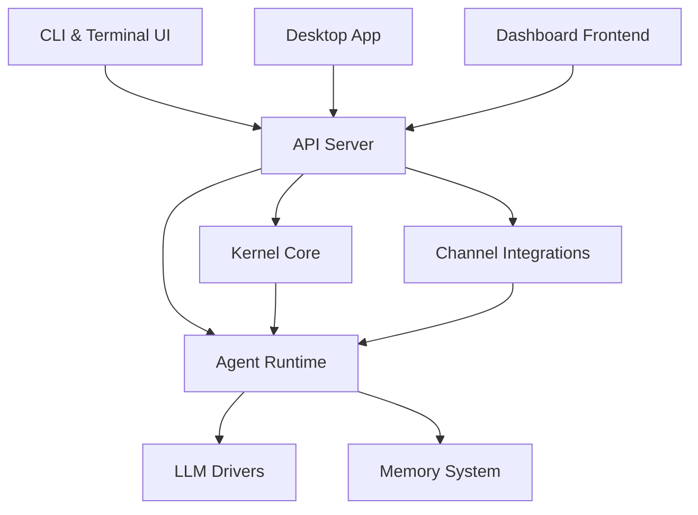

# crates — Wiki

# LibreFang Agent OS — `crates`

Welcome to the **LibreFang Agent OS** monorepo. LibreFang is a self-hosted platform for running, managing, and evolving autonomous AI agents. It provides a complete operating system for agents — from LLM completion and tool execution to durable memory, multi-channel messaging, skills marketplace integration, and a polished operator dashboard.

This workspace contains every Rust crate, backend service, and frontend application that makes up the platform.

---

## Architecture at a Glance



---

## How the System Fits Together

Users interact with LibreFang through one of three entry points:

- **[CLI & Terminal UI](cli-terminal-ui.md)** — the `librefang` command-line binary, which also hosts an interactive TUI dashboard and launcher menu.
- **[Desktop Application](desktop-application.md)** — a native Tauri 2.0 shell that boots an embedded kernel or connects to a remote instance.
- **[Dashboard Frontend](dashboard-frontend.md)** — a React SPA served by the API, providing the full operator control plane for agent management, chat, workflows, and diagnostics.

All three talk to the **[API Server](api-server.md)**, the central HTTP/WebSocket/ACP gateway. The API routes requests into the engine room:

- **[Kernel Core](kernel-core.md)** is the authority on agent identity, lifecycle, and approval gating. It ensures that respawned agents keep their IDs, that sessions and memories aren't orphaned, and that dangerous operations require explicit approval.
- **[Agent Runtime](agent-runtime.md)** is the execution engine — the agent loop, tool runner, and orchestration layer that drives each conversation turn from prompt through LLM completion to tool invocation and response.
- **[LLM Drivers](llm-drivers.md)** provide a vendor-neutral trait abstraction over LLM providers, with concrete implementations, retry/backoff logic, and rate limiting.
- **[Memory System](memory-system.md)** gives agents durable, queryable state through SQLite-backed key/value and vector storage, plus a human-editable Markdown knowledge wiki with auditable provenance.
- **[Channel Integrations](channel-integrations.md)** normalize messages from Telegram, Discord, Slack, WhatsApp, and other platforms into a unified `ChannelMessage` type, route them through the agent runtime, and deliver responses back.

Surrounding these core modules are several specialized layers:

- **[Shared Types & Configuration](shared-types-configuration.md)** — the canonical type definitions (`AgentId`, `AgentManifest`, `SessionId`, resource quotas, etc.) used across every crate in the workspace.
- **[Runtime Subsystems](runtime-subsystems.md)** — MCP client for external tool connectivity, media engine for generation, Docker sandbox for secure code execution, and tamper-evident audit trail.
- **[Skills System](skills-system.md)** — marketplace discovery, installation, and agent-driven self-evolution (create, patch, rollback) of capabilities through a multi-layer security pipeline.
- **[Hands Framework](hands-framework.md)** — curated, domain-complete autonomous agent packages that run in the background; users discover and activate them from a marketplace.
- **[Extensions & Vault](extensions-vault.md)** — MCP server templates, credential resolution from multiple secure sources, OAuth2 flows, and secrets management.
- **[Agent Control Protocol (ACP)](agent-control-protocol-acp.md)** — JSON-RPC 2.0 adapter over duplex byte streams, letting editors like Zed, VS Code, and JetBrains embed a LibreFang agent natively.
- **[Wire Protocol & Networking](wire-protocol-networking.md)** — OFP, the TCP-based protocol for cross-kernel agent discovery, authentication, and communication.
- **[Infrastructure Libraries](infrastructure-libraries.md)** — cross-cutting foundations including HTTP transport, kernel trait boundaries, cost tracking, routing, telemetry, testing utilities, RL data export, and migration tooling.

---

## Key End-to-End Flows

### Streaming Agent Loop

A chat request enters through the API, hits the agent runtime's streaming loop, applies gateway compression (context window management via token estimation), calls out to an LLM driver for completion, writes to memory, and streams tokens back to the client.

`[API Server](api-server.md)` → `[Agent Runtime](agent-runtime.md)` → `[LLM Drivers](llm-drivers.md)` → `[Memory System](memory-system.md)`

### Channel Message Round-Trip

An inbound message from Telegram or Discord is normalized by the channel integrations layer, routed to the correct agent through the kernel, processed by the runtime, and the response is delivered back through the originating channel adapter.

`[Channel Integrations](channel-integrations.md)` → `[Kernel Core](kernel-core.md)` → `[Agent Runtime](agent-runtime.md)` → `[Channel Integrations](channel-integrations.md)`

### Provider Health Check → TLS Handshake

When listing LLM providers, the API calls through the runtime's provider health probe, which builds an HTTP client via the infrastructure HTTP library, ultimately configuring TLS for the connection.

`[API Server](api-server.md)` → `[Agent Runtime](agent-runtime.md)` → `[Infrastructure Libraries](infrastructure-libraries.md)`

### Skill Evolution

Agents can create, patch, or remove their own skills at runtime. The request flows from the runtime through the skills system's evolution module and security pipeline, with validation and rollback support.

`[Agent Runtime](agent-runtime.md)` → `[Skills System](skills-system.md)`

---

## Getting Started

1. **Build the workspace:**
   ```bash
   cargo build --workspace
   ```

2. **Run the CLI:**
   ```bash
   cargo run -p librefang-cli
   ```
   This opens the interactive launcher where you can start a local kernel, open the TUI dashboard, or connect to a remote instance.

3. **Initial configuration:** LibreFang uses `.env` files and a secrets vault. The CLI's init wizard (`librefang init`) walks you through setting up provider API keys, channel bot tokens, and sandbox configuration.

---

## Where to Go Next

If you want to understand the internals, start with **[Kernel Core](kernel-core.md)** and **[Agent Runtime](agent-runtime.md)** — they're the heart of the system. If you're working on the client side, **[API Server](api-server.md)** covers everything exposed externally. For extending agent capabilities, see **[Skills System](skills-system.md)** and **[Runtime Subsystems](runtime-subsystems.md)**.