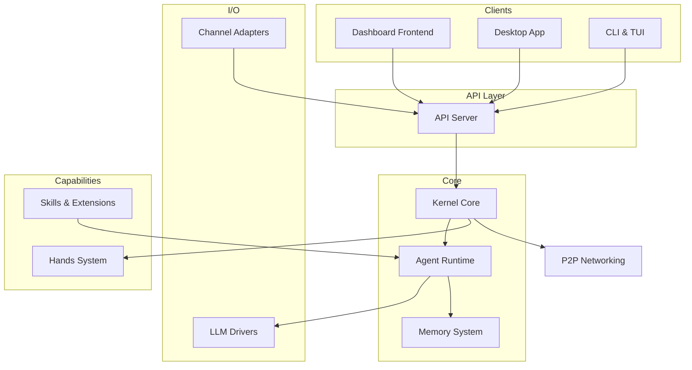

# crates — Wiki

# LibreFang Agent OS

LibreFang is a full-stack agent operating system that lets you build, deploy, and manage autonomous AI agents across dozens of messaging platforms. Agents chat with users over Telegram, Discord, Slack, WhatsApp, and 30+ other channels — or run autonomously in the background as "Hands" — while the kernel enforces policy, manages memory, and orchestrates tool execution.

## Architecture

The system is organized as a layered architecture with clear separation of concerns. At the center sits the [Kernel Core](librefang-kernel-src.md), which acts as the authoritative orchestrator for all agent operations — approval gates, RBAC, workflow execution, config hot-reload, and background agent spawning all flow through it.

User-facing interfaces wrap the kernel on all sides:

- **Web**: The [Dashboard Frontend](librefang-api-dashboard.md) (React SPA) talks to the [API Server](librefang-api-src.md) over HTTP. The API server translates dashboard actions and channel webhooks into kernel calls.
- **Desktop/Mobile**: The [Desktop Application](librefang-desktop.md) (Tauri 2.0) embeds either a local kernel or connects to a remote daemon, providing native OS integration.
- **Terminal**: The [CLI & TUI](librefang-cli.md) operates over HTTP when a daemon is running, or boots an in-process kernel for single-shot commands.

Inbound messages from external platforms arrive through [Channel Adapters](librefang-channels.md), which normalize messages behind a uniform `ChannelAdapter` trait. The adapters route into the kernel, which dispatches to the [Agent Runtime](librefang-runtime.md) — the execution engine that manages the full LLM call cycle, tool execution, memory recall, and streaming responses. The runtime leans on [LLM Drivers](librefang-llm-driver-src.md) for provider-agnostic completions (Anthropic, OpenAI, Gemini, Bedrock, and more) and on the [Memory System](librefang-memory.md) for persistent structured storage, semantic vector search, and a knowledge graph.

Capabilities beyond the core live in [Skills & Extensions](librefang-extensions-src.md), which handles skill installation, security scanning, runtime tool execution, and infrastructure services like credential management. The [Hands System](librefang-hands.md) builds on top to offer autonomous background agents that you deploy from a marketplace and monitor rather than drive interactively.

For multi-node deployments, the [P2P Networking](librefang-wire.md) module (LibreFang Wire Protocol) provides authenticated peer-to-peer communication between kernels.

Everything shares [Shared Types](librefang-types.md) (`librefang-types`), the foundational crate of data structures that crosses every process boundary.

## Key End-to-End Flow: User Sends a Message

Here's what happens when a user sends a message to an agent through a channel like Telegram:

1. The **Channel Adapter** receives the inbound message and normalizes it into LibreFang's internal format.
2. The adapter hands the message to the **API Server** (via the channel bridge), which authenticates the request and forwards it to the **Kernel Core**.
3. The kernel checks RBAC policies, approval gates, and agent routing rules, then dispatches to the **Agent Runtime**.
4. The runtime assembles context — pulling relevant memories from the **Memory System**, loading the agent's tool profile from **Skills & Extensions**, and constructing a completion request.
5. The runtime calls the **LLM Drivers** to get a streaming response from the configured provider, executing any tool calls the model requests along the way.
6. The response streams back through the kernel → API server → channel adapter → external platform.

A similar flow serves the dashboard: when an operator triggers a workflow from the WorkflowsPage, the React app calls the API server, which delegates to the kernel's workflow DAG engine.

## Getting Around the Codebase

New to the project? A good reading path:

1. **[Shared Types](librefang-types.md)** — the vocabulary everything else uses. Understanding the core types (`AgentId`, `SessionId`, `AgentManifest`, `CompletionRequest`) will make every other module clearer.
2. **[Kernel Core](librefang-kernel-src.md)** — the central orchestrator. This is where policy, routing, and lifecycle decisions are made.
3. **[Agent Runtime](librefang-runtime.md)** — the execution engine. Follow this to understand how messages are actually processed end to end.
4. From there, dive into whichever surface you're working on — the dashboard, a specific channel adapter, the memory subsystem, or elsewhere. Each module has its own dedicated wiki page with deeper detail.

## Other Modules

- **[Migration](librefang-migrate.md)** — imports agents, memory, sessions, and configs from OpenClaw, OpenFang, and other frameworks.
- **[Infrastructure Utilities](librefang-http.md)** — shared HTTP client, telemetry/metrics, and test harness crates used across the codebase.