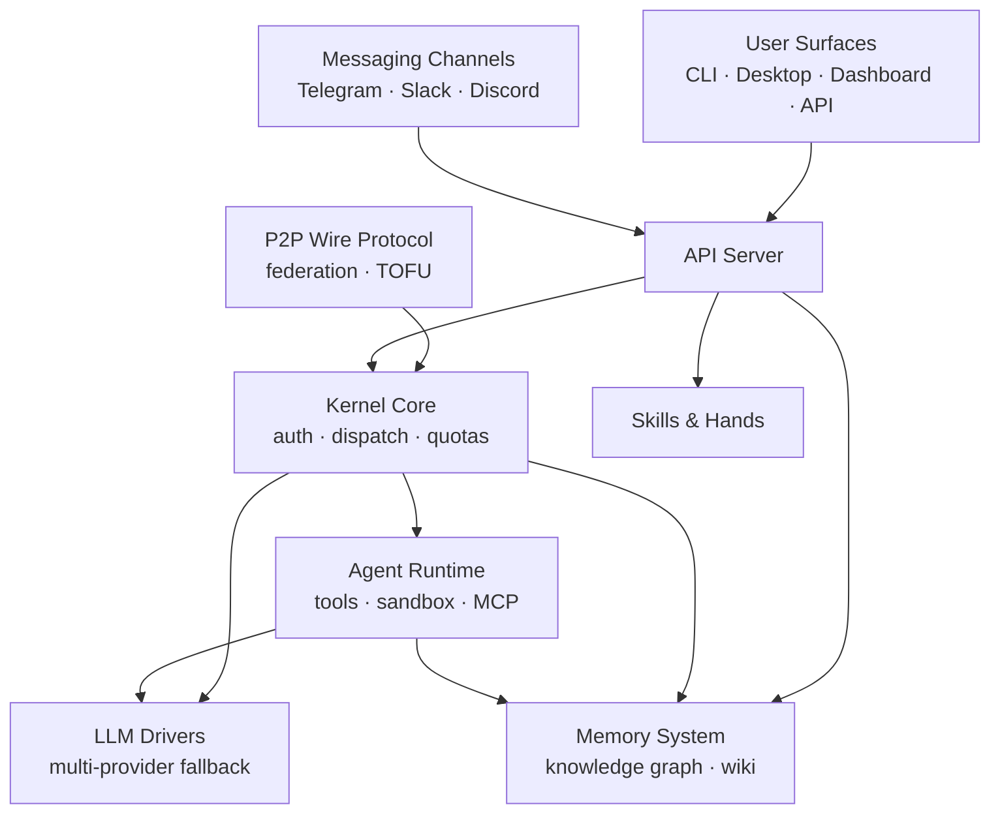

# crates — Wiki

# LibreFang

LibreFang is an open-source agent operating system for building, running, and managing autonomous AI agents. It provides the full stack—from kernel-level orchestration and LLM provider integration to user-facing interfaces across CLI, desktop, web, and messaging platforms.

## Architecture Overview



## How It Works

At the center sits the **Kernel Core** (`librefang-kernel`), which handles agent identity registration, approval gates (with TOTP and recovery codes), RBAC-based authorization, spending quotas, and message routing to specialist agents. It exposes a clean API surface through 19 focused role traits via the [Kernel Handle](librefang-kernel-handle-src.md), keeping the rest of the system decoupled from internal kernel state.

The **Agent Runtime** (`librefang-runtime`) is the execution engine. When an agent needs to act—invoke a tool, run sandboxed code, communicate with an LLM provider—the runtime manages that entire lifecycle. It includes dedicated sub-modules for [MCP connections](librefang-runtime-mcp-src.md), [OAuth flows](librefang-runtime-oauth-src.md), and [WASM sandboxing](librefang-runtime-wasm-src.md).

All LLM communication flows through the **LLM Drivers** layer, which defines a provider-agnostic trait in [librefang-llm-driver](librefang-llm-driver-src.md) and ships concrete implementations with health-aware fallback routing in [librefang-llm-drivers](librefang-llm-drivers-src.md). A typical provider health probe traverses from an API route through the runtime's provider health system, down into the HTTP client layer for TLS configuration and proxy resolution.

Agents persist what they learn in the **Memory System**, which combines a structured knowledge graph with embeddings, decay logic, and ACLs in [librefang-memory](librefang-memory-src.md), alongside a Markdown-based wiki document vault with frontmatter and provenance tracking in [librefang-memory-wiki](librefang-memory-wiki-src.md).

External users reach LibreFang through several surfaces: the **API Server** (`librefang-api`) handles HTTP routes, ACP protocol listeners, and streaming events; **Messaging Channels** connect to Telegram, Slack, Discord, and other platforms; the **CLI & Terminal UI** (`librefang-cli`) offers an interactive TUI, diagnostics, and protocol servers for editor integration; and the **Desktop Application** (`librefang-desktop`) wraps everything in a Tauri 2.0 shell supporting both local embedded and remote modes.

For multi-instance deployments, the **P2P Wire Protocol** (OFP) provides agent-to-agent networking over TCP with multi-layer authentication—HMAC verification, Ed25519 identity with TOFU pinning, and X25519 key exchange—for secure federation between kernel instances.

## Key End-to-End Flows

**Provider health probing**: An API route receives a `list_providers` request → the runtime checks its health cache → if stale, probes the provider endpoint → builds an HTTP client with TLS config and proxy settings → returns reachability status to the caller.

**Skill evolution**: A skill route receives a file removal request → the skills system walks the file tree → supporting files are cleaned up → the dashboard React frontend reconciles the change.

**Plugin loading and benchmarking**: A plugin route triggers a benchmark → the runtime loads the plugin manifest → validates semver compatibility → the plugin hook executes and returns results.

## Supporting Infrastructure

- **Skills System** (`librefang-skills`) manages skill definition, evolution, and file-level operations
- **Hands Orchestration** coordinates multi-agent workflows and complex task delegation
- **Extensions & Vault** (`librefang-extensions`) provides dotenv management, vault storage, and extension loading
- **Migration Tools** (`librefang-migrate`) imports agents, configuration, and memory from OpenClaw, OpenFang, and other frameworks with atomic, idempotent, non-destructive operations
- **Telemetry & Observability** (`librefang-telemetry`) provides OpenTelemetry-compatible metrics with path normalization to prevent cardinality explosions
- **Testing Framework** (`librefang-testing`) offers mock kernel/app infrastructure with deterministic fakes for networking, LLM providers, and storage
- **Types & Configuration** and **Dashboard UI** provide shared type definitions, static assets, and the web dashboard respectively

## Getting Started

Clone the repository and build with Cargo:

```bash
git clone https://github.com/librefang/crates.git
cd crates
cargo build
```

To launch the interactive setup wizard:

```bash
cargo run --bin librefang-cli
```

The wizard walks you through provider configuration, storing credentials in a `.env` file via the extensions dotenv module. From there you can start the API server, connect a desktop client, or attach messaging channels.

For testing, the [Testing Framework](librefang-testing-src.md) provides `MockKernelBuilder` and `TestAppState` to spin up real kernel and app instances with faked externals—no network access or LLM keys required.