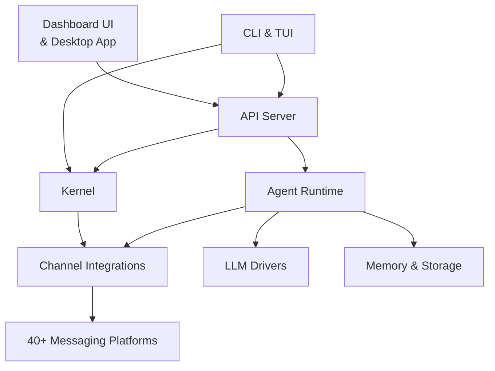

# crates — Wiki

# LibreFang Agent Operating System

LibreFang is an open-source agent operating system for building, running, and managing autonomous AI agents. It connects agents to 40+ messaging platforms (Telegram, Discord, Slack, WhatsApp, and more), gives them persistent memory, allows them to call LLMs from any provider, and provides human-in-the-loop safety gates for dangerous operations. Operators manage everything through a web dashboard, a desktop app, or a full-featured CLI.

## Architecture at a Glance

## How Data Flows

A typical interaction looks like this:

1. A user sends a message on Telegram (or any supported platform).
2. **Channel Integrations** normalizes it into an internal message format and routes it to the **Kernel**.
3. The **Kernel** resolves the agent's identity, checks for pending approvals, and hands the message to the **Agent Runtime**.
4. The **Agent Runtime** loads conversation context, calls an **LLM Driver** to generate a streaming response, executes any tool calls the model requests (gated by the approval system when needed), and persists session state to **Memory & Storage**.
5. The response travels back through the channel adapter and lands in the user's chat.

Operators trigger the same flows (or manage agents, budgets, skills, and hands) through the **Dashboard UI** or **CLI & TUI**, both of which communicate with the **API Server** — the central HTTP gateway that fronts the kernel and runtime.

## The Module Map

**Foundational layer.** Every struct, enum, and identifier that crosses a crate boundary lives in [Core Types & Configuration](core-types-and-configuration.md) (`librefang-types`). Downstream crates depend on it but never redefine shared types. Beneath that, [Shared Libraries](shared-libraries.md) provides the infrastructure — HTTP client factories, auth helpers, cost enforcement, sandboxing, observability, testing utilities, and database migrations — that every higher-level crate leans on.

**Runtime core.** The [Kernel](kernel.md) is the heart of the system: it maintains the agent identity registry (surviving restarts via TOML), enforces human-in-the-loop approval gates on dangerous tool calls, and wires channels to agents. The [Agent Runtime](agent-runtime.md) is the execution engine — the agent loop, the A2A (agent-to-agent) protocol layer, and the context loader that together turn an agent manifest into a running, conversing entity.

**Intelligence & persistence.** [LLM Drivers](llm-drivers.md) provides a provider-agnostic `LlmDriver` trait with concrete implementations for Anthropic, OpenAI, and every other supported provider. [Memory & Storage](memory-and-storage.md) is the persistence substrate — SQLite-backed structured key-value storage, semantic vector search, a knowledge graph, session history, usage metering, and proactive memory.

**Channels & networking.** [Channel Integrations](channel-integrations.md) (`librefang-channels`) is the messaging backbone: a uniform adapter abstraction, dispatch pipeline, input sanitization, debouncing, and attachment enrichment for 40+ platforms. [Networking & P2P](networking-and-p2p.md) (`librefang-wire`) handles agent-to-agent TCP communication with peer discovery, mutual authentication (Ed25519 + X25519 KEX), and a JSON-RPC framed protocol.

**User-facing surfaces.** The [API Server](api-server.md) is the channel bridge and HTTP gateway. [Dashboard UI](dashboard-ui.md) is a React SPA (Vite + TanStack Query) targeting both browser and Tauri desktop environments. [CLI & TUI](cli-and-tui.md) offers ~30 subcommands, an interactive launcher, and a full-screen terminal dashboard. The [Desktop Application](desktop-application.md) wraps everything in a Tauri 2.0 native shell with system tray, global shortcuts, and auto-update.

**Extensibility.** [Skills & Marketplace](skills-and-marketplace.md) manages the full skill lifecycle — discovery on ClawHub, local installation with security scanning, agent-driven creation, and version-controlled evolution. The [Hands System](hands-system.md) provides pre-built, domain-complete autonomous agent configurations (a video-clip hand that watches a folder, a security hand that monitors logs) that users activate from a marketplace. [Extensions & Vault](extensions-and-vault.md) bridges the MCP server registry to the running kernel, manages encrypted credential storage, and tracks runtime health of integrations.

## Getting Started

The fastest path into the codebase depends on what you're working on:

- **Frontend work:** Start with [Dashboard UI](dashboard-ui.md). It's a standard Vite + React project — `pnpm install` and `pnpm dev` will get you running against a local or remote API.
- **Backend / agent logic:** Read [Core Types & Configuration](core-types-and-configuration.md) first to learn the shared vocabulary, then dive into [Agent Runtime](agent-runtime.md) for the execution loop or [Kernel](kernel.md) for identity and approval flows.
- **Adding a channel:** See [Channel Integrations](channel-integrations.md) for the adapter abstraction and dispatch pipeline.
- **Adding an LLM provider:** See [LLM Drivers](llm-drivers.md) for the `LlmDriver` trait and existing implementations.
- **CLI / desktop:** Start with [CLI & TUI](cli-and-tui.md) for command structure, then [Desktop Application](desktop-application.md) for the Tauri wrapper.

The entire project is a Cargo workspace. Build everything with `cargo build`, run tests with `cargo test`, and use the CLI (`librefang-cli`) as your primary interface to a running daemon.