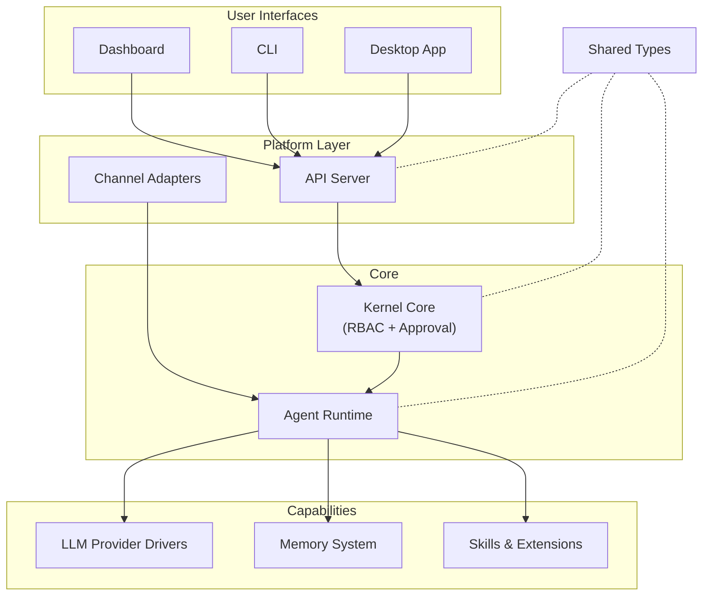

# crates — Wiki

# LibreFang Agent OS

Welcome to **LibreFang** — an open-source agent operating system that runs autonomous AI agents across messaging platforms, with built-in safety controls, persistent memory, and a full management UI.

LibreFang agents chat with users on Telegram, Discord, Slack, Bluesky, WhatsApp, and more. They can use tools (via [Skills & Extensions](skills-and-extensions.md)), remember past interactions (via the [Memory System](memory-system.md)), and enforce per-user permissions (via [Kernel Core](kernel-core.md) RBAC and approval gating). Multiple LibreFang instances can discover and coordinate with each other over the [P2P Networking](p2p-networking.md) layer.

## Architecture

## How the System Fits Together

### Incoming messages

A user sends a message on a platform like Telegram. The appropriate [Channel Adapter](channel-adapters.md) picks it up, routes it through the [Kernel Core](kernel-core.md) for RBAC checks, and hands it to the [Agent Runtime](agent-runtime.md). The runtime loads context from the [Memory System](memory-system.md), invokes an [LLM Provider Driver](llm-provider-drivers.md) to generate a response, executes any tools the model requests (gated by the kernel's approval system), and streams the reply back through the channel adapter.

### Management and configuration

Operators use the [Dashboard Application](dashboard-application.md) (or the [CLI](command-line-interface.md), or the [Desktop Application](desktop-application.md)) to configure agents, install skills, manage channels, inspect memory, and monitor budgets. These frontends talk to the [API Server](api-server.md), which exposes the kernel's full capabilities over REST. The API server is the primary integration point — it translates HTTP requests into kernel operations and streams results back.

### Autonomous agents (Hands)

[Hands](hands-framework.md) are pre-built, domain-specific autonomous agents that users activate from a marketplace. Unlike interactive agents, Hands run in the background and users check in on their progress. The Hands framework manages definitions, tracks active instances, and persists state across daemon restarts.

### Cross-instance coordination

The [P2P Networking](p2p-networking.md) module (LibreFang Wire Protocol) enables separate LibreFang kernels to discover each other's agents, exchange messages, and distribute work across machines over TCP.

### External integrations

[Runtime Protocol Integrations](runtime-protocol-integrations.md) connect agents to the outside world: MCP tool servers, OAuth 2.0 identity providers, and sandboxed WASM plugins. The MCP client handles the full lifecycle from handshake through tool invocation with integrated taint scanning.

### Foundation layer

[Shared Types](shared-types.md) defines the canonical data structures used across every crate — agent manifests, approval types, message formats — so serialized data passes between processes and over the network without translation. [Infrastructure & Utilities](infrastructure-and-utilities.md) provides the horizontal concerns: HTTP transport, kernel abstractions, cost metering, routing, observability, database migration, and test infrastructure.

## Key End-to-End Flows

**A user starts a chat from the Dashboard:**
The ChatPage component calls a React mutation hook, which posts to the API server. The API server authenticates the request, delegates to the kernel, which spawns an agent session through the runtime. The runtime loads context from memory, calls the configured LLM provider, and streams the response back through the API to the Dashboard in real time.

**A message arrives on Discord:**
The Discord channel adapter receives the platform event, the BridgeManager looks up the configured agent for that channel, the kernel checks RBAC policies for the Discord user, and the agent runtime begins a turn — potentially invoking skills, hitting the memory store, and streaming a reply back through Discord's API.

**An operator installs a skill from the CLI:**
The CLI parses the subcommand, calls the API server's skill endpoint, which delegates to the Skills & Extensions loader. The skill is verified, registered in the kernel, and becomes available for agents to invoke on their next turn.

## Where to Go Next

- Start with **[Kernel Core](kernel-core.md)** to understand the safety and permission model
- Read **[Agent Runtime](agent-runtime.md)** for the execution loop and how agents actually run
- Explore **[API Server](api-server.md)** if you're working on the backend or adding endpoints
- Check **[Dashboard Application](dashboard-application.md)** if you're working on the frontend
- Browse **[Shared Types](shared-types.md)** when you need to understand the data model