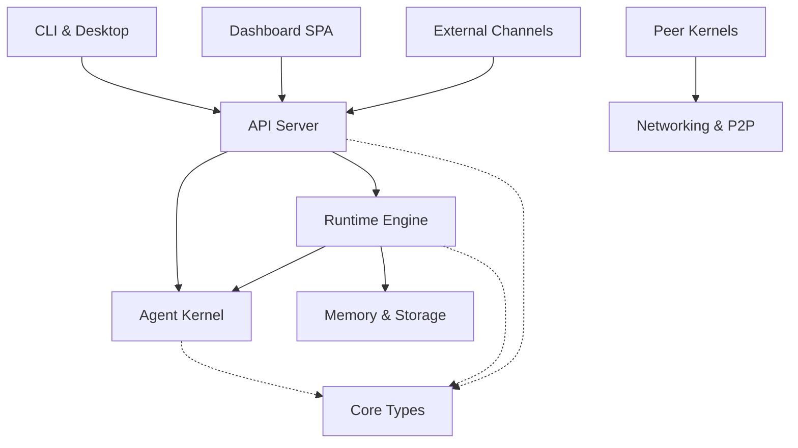

# crates — Wiki

# LibreFang Agent OS — `crates` Workspace

LibreFang Agent OS is a full-stack platform for deploying, managing, and orchestrating AI agents. It provides a kernel-based runtime where agents can be configured, scheduled, and supervised — with persistent memory, pluggable skills, 40+ messaging channel integrations, and support for 43+ LLM providers. Users interact through a CLI, a React dashboard, or a native desktop application.

## Architecture Overview

## How It Works

At the center of the system sits the [Agent Kernel](agent-kernel.md), which manages agent lifecycles, configuration, scheduling, inter-agent communication, and process supervision. The kernel runs in-process alongside the [API Server](api-server.md), which exposes JSON REST and WebSocket endpoints to all client surfaces: the [CLI & Terminal UI](cli-terminal-ui.md), the [Dashboard Frontend](dashboard-frontend.md), the [Desktop Application](desktop-application.md), and external integrations.

When a user message arrives — whether from a chat channel, the dashboard, or the CLI — the [Runtime Engine](runtime-engine.md) takes over. It handles the full agent turn: recalling relevant memories, assembling prompts, calling the LLM, executing tool calls in a sandboxed environment, and persisting the updated session. The runtime is the highest-traffic module in the workspace and depends on nearly every other layer.

### Memory & Skills

The [Memory & Storage](memory-storage.md) module provides a unified persistence substrate over SQLite: structured key-value storage, semantic vector search for recall, a knowledge graph, session history, and a shared task queue. Agents can be extended through the [Skills & Marketplace](skills-marketplace.md) system, where self-contained skill bundles provide executable tools (Python, Node.js, Shell, WASM) or inject instructional context into the LLM's system prompt.

### LLM & Channel Integration

The [LLM Provider Drivers](llm-provider-drivers.md) module defines a trait-based abstraction (`LlmDriver`) with 43+ concrete implementations covering cloud APIs, local inference servers, and CLI subprocess tools. External messaging platforms connect through the [Channel Integrations](channel-integrations.md) module, which translates platform-specific messages (Telegram, Discord, Slack, WhatsApp, IRC, Matrix, and many more) into a unified `ChannelMessage` format before dispatching to the kernel.

### Cross-Cutting Concerns

Every crate in the workspace depends on [Core Types & Configuration](core-types-configuration.md) — it defines all data structures that cross crate boundaries with no business logic. [Authentication & Security](authentication-security.md) handles JWT validation, API keys, encrypted secret storage, and OAuth flows. The [Networking & P2P](networking-p2p.md) module enables cross-machine agent discovery and communication using a JSON-framed wire protocol with HMAC-SHA256 authentication. Foundational plumbing lives in [Shared Infrastructure](shared-infrastructure.md) (HTTP transport, telemetry, cost enforcement, test mocking), while [Extensions & Hands](extensions-hands.md) provides the external integration layer for connecting to outside services and running autonomous agent capabilities.

## Key End-to-End Flows

**Agent chat from the dashboard:** The user opens the ChatPage in the [Dashboard Frontend](dashboard-frontend.md), which calls `createAgentSession` through the API client. The request hits the [API Server](api-server.md), which authenticates via [Authentication & Security](authentication-security.md), creates a session through the [Agent Kernel](agent-kernel.md), and returns it to the dashboard. Subsequent messages flow through the [Runtime Engine](runtime-engine.md), which recalls context from [Memory & Storage](memory-storage.md), calls an [LLM Provider Driver](llm-provider-drivers.md), executes any tool calls via [Skills & Marketplace](skills-marketplace.md), and streams the response back over WebSocket.

**External message processing:** A message from Telegram, Discord, or another channel arrives at a [Channel Integrations](channel-integrations.md) adapter, which normalizes it into a `ChannelMessage`. The adapter dispatches to the kernel, which routes it through the runtime engine for processing. Any response is translated back through the channel adapter to the originating platform.

**P2P agent coordination:** The [Networking & P2P](networking-p2p.md) module discovers peer kernels, authenticates via HMAC-SHA256 handshake, and establishes persistent TCP connections. Agents on different machines can communicate, delegate tasks, and share knowledge through this layer.

## Getting Started

1. **Build the workspace:** `cargo build` — this compiles all crates. Use `--features all-channels` to enable all 40+ channel adapters, or rely on the `default` feature set for popular channels.
2. **Start the daemon:** `librefang start` boots the kernel and API server. The dashboard becomes available at `/dashboard`.
3. **Use the CLI:** The [CLI & Terminal UI](cli-terminal-ui.md) operates in daemon mode (communicating over HTTP) or single-shot mode (booting an in-process kernel).
4. **Desktop app:** The [Desktop Application](desktop-application.md) wraps the kernel and dashboard in a Tauri 2.0 native window with system tray integration. It supports local mode (embedded kernel) and remote mode (connects to an existing instance).