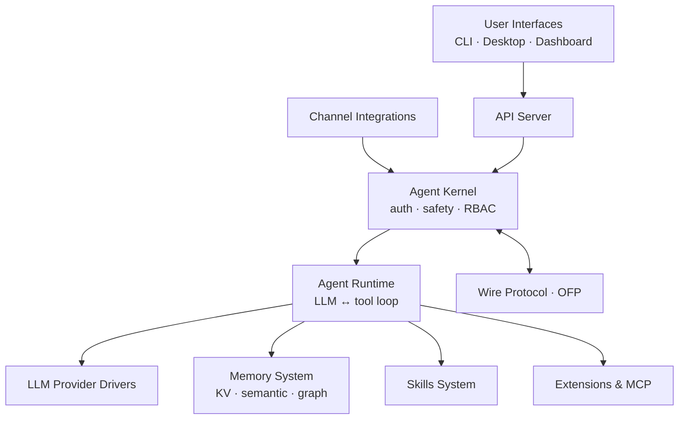

# crates — Wiki

# LibreFang Agent OS

LibreFang is a self-hosted autonomous agent platform. It lets you define AI agents, connect them to messaging channels (Telegram, Discord, Slack, and more), equip them with skills and tools, and let them operate either interactively or autonomously in the background. Everything runs on your infrastructure — no third-party cloud required.

## Architecture

## How it works

Users interact with LibreFang through one of three entry points: the [CLI & Terminal UI](librefang-cli-src.md) for scripting and local use, the [Desktop Application](librefang-desktop-src.md) for a native windowed experience, or the [Dashboard Frontend](librefang-dashboard-src.md) for browser-based management. All three talk to the [API Server](librefang-api-src.md), which is the single HTTP entry point into the backend.

External messaging platforms — Telegram, Discord, Slack, WhatsApp, and others — are handled by [Channel Integrations](librefang-channels-src.md). Channel adapters normalize incoming messages and route them into the kernel.

The [Agent Kernel](librefang-kernel-src.md) is the gatekeeper. It enforces authentication, role-based access control, execution approval policies, and resource metering before any agent runs. Once a request is authorized, it hands off to the [Agent Runtime](librefang-runtime-src.md), the execution engine that drives the iterative LLM conversation loop — calling the model, executing tool calls, managing context, and returning responses.

During execution, the runtime draws on several supporting subsystems:

- **[LLM Provider Drivers](librefang-llm-driver-src.md)** — a trait-based abstraction over OpenAI, Anthropic, local models, and other LLM providers, with shared retry, streaming, and fallback logic.
- **[Memory System](librefang-memory-src.md)** — three complementary stores (key-value, semantic text search, and a knowledge graph) that give agents persistent, queryable memory across sessions.
- **[Skills System](librefang-skills-src.md)** — marketplace-driven skill discovery, installation, and execution. Skills teach agents new capabilities, and agents can even evolve their own skills autonomously.
- **[Extensions & MCP](librefang-extensions-src.md)** — MCP server lifecycle, credential vaults, OAuth flows, and sandboxed plugin execution for connecting agents to external tools and services.

For background autonomous work, [Hands & Orchestration](librefang-hands-src.md) provides pre-built, domain-complete agent configurations (called "Hands") that users activate from a marketplace and monitor rather than chat with interactively.

Multi-node deployments are connected by the [Wire Protocol & Networking](librefang-wire-src.md) module (OFP), which handles TCP-based agent discovery, authentication, and cross-kernel messaging.

Everything sits on a shared foundation: [Shared Types & Configuration](librefang-types-src.md) defines the canonical data structures used across every crate, while [Infrastructure & Utilities](librefang-testing-src.md) provides shared HTTP client logic, telemetry, framework migration tooling, and test mocks.

## Key end-to-end flow

A typical chat interaction follows this path:

1. A user sends a message on a connected platform (e.g., Telegram).
2. The **Channel Integration** adapter receives it, normalizes it, and routes it to the **Agent Kernel**.
3. The **Kernel** authenticates the user, checks RBAC permissions, and enforces safety policies.
4. The authorized request is passed to the **Agent Runtime**, which loads relevant context and memories.
5. The runtime calls out to an **LLM Provider** to generate a response, potentially executing tool calls in a loop.
6. If tool execution is needed, the runtime may invoke **Skills** or **Extensions & MCP** servers.
7. New memories are persisted via the **Memory System**.
8. The response flows back through the kernel and channel adapter to the user.

The same flow works when initiated from the dashboard, CLI, or desktop app — only the entry point changes; the backend path through API → Kernel → Runtime is identical.