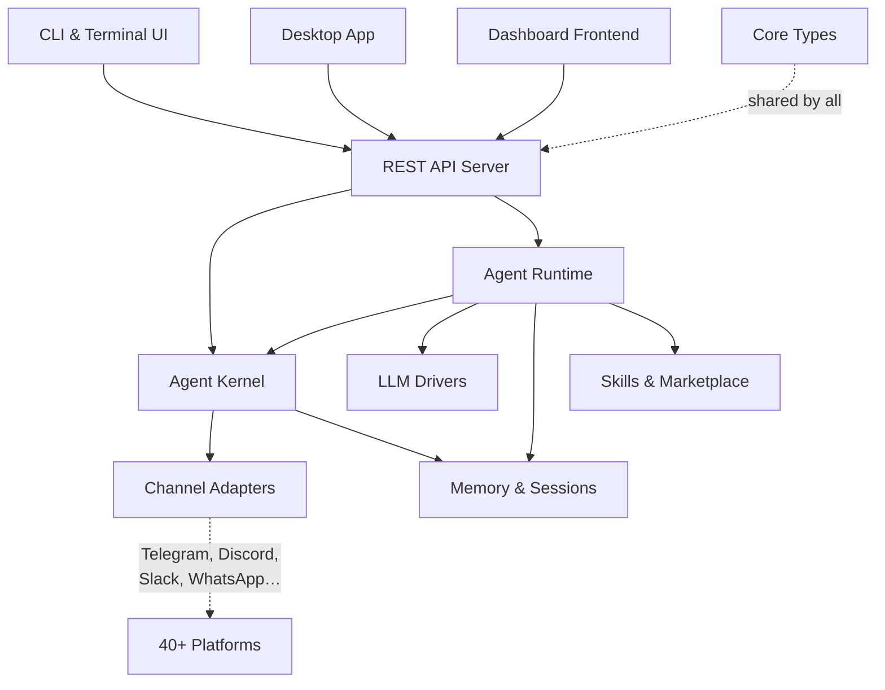

# crates — Wiki

# LibreFang Agent OS — Codebase Overview

Welcome to the **LibreFang Agent OS** (`crates` repository). LibreFang is an open-source agent operating system that lets you build, configure, and run AI-powered agents that connect to 40+ messaging platforms, use tools, manage memory, and collaborate — all from a single unified runtime.

Whether you're spinning up a conversational bot on Telegram, deploying an autonomous "Hand" that works in the background, or wiring agents together across machines, this is the codebase that makes it happen.

## Architecture at a Glance

The system is organized into clearly separated layers:

### Foundation

[Core Types & Configuration](core-types-configuration.md) defines the shared data structures — every struct, enum, and serialization helper that crosses crate boundaries lives here. There is no business logic, just types that the entire workspace depends on.

[Shared Infrastructure](shared-infrastructure.md) handles cross-cutting concerns: outbound HTTP (with proper CA root seeding and proxy configuration), OpenTelemetry/Prometheus observability via [librefang-telemetry](shared-infrastructure.md), and data migration via [librefang-migrate](shared-infrastructure.md).

### Runtime Core

The [Agent Kernel](agent-kernel.md) is the orchestrator — it manages agent lifecycles, enforces budgets, routes messages, handles approvals and auth, and coordinates workflows. Think of it as the OS scheduler and process supervisor for agents.

The [Agent Runtime](agent-runtime.md) is the execution engine. It runs the core agent loop: assembling prompts, calling LLMs, executing tools, recalling memories, and streaming responses back. It talks to LLM providers through the [LLM Drivers](llm-drivers.md) abstraction layer, which separates the driver trait from provider-specific implementations (OpenAI, Anthropic, local models, and others).

[Memory & Sessions](memory-sessions.md) provides the persistent substrate — structured key-value storage in SQLite, semantic search, and a knowledge graph — plus a proactive memory layer that automatically extracts and deduplicates facts during conversations.

### Capability Extensions

[Channel Adapters](channel-adapters.md) bridges LibreFang to the outside world. Each adapter (Telegram, Discord, Slack, WhatsApp, Teams, Matrix, IRC, email, and many more) translates platform-specific messages into a unified `ChannelMessage` format. Adapters are feature-gated — you compile only what you need.

[Skills & Marketplace](skills-marketplace.md) implements the plugin system. Skills are self-contained bundles (a TOML manifest plus code or prompt context) that extend agent capabilities at runtime. Agents can even create skills themselves.

[Extensions & MCP](extensions-mcp.md) manages MCP (Model Context Protocol) server integrations — discovering catalog templates, storing credentials securely, and monitoring server health.

[Hands](hands.md) are pre-built, domain-complete autonomous agent configurations. Unlike regular agents you chat with interactively, Hands work in the background — you check in on them rather than drive them.

[Peer Networking](peer-networking.md) enables cross-machine agent discovery and communication using the LibreFang Wire Protocol, with HMAC-SHA256 authentication.

### User-Facing Clients

Users interact with LibreFang through three interfaces:

- **[CLI & Terminal UI](cli-terminal-ui.md)** — ~60 subcommands organized into domain groups, plus a full-screen TUI dashboard and an interactive init wizard. In normal operation it acts as a thin HTTP client to a running daemon.
- **[Dashboard Frontend](dashboard-frontend.md)** — a React SPA for managing agents, channels, skills, workflows, and runtime configuration through a web browser.
- **[Desktop Application](desktop-application.md)** — a Tauri 2.0 native app that can either boot an embedded kernel locally or connect to a remote instance, with system tray integration, global hotkeys, and auto-updates.

All three clients communicate through the [REST API Server](rest-api-server.md), which is the HTTP gateway to the kernel and runtime.

## Key End-to-End Flow

A typical message flow looks like this:

1. A user sends a message on a platform (e.g., Telegram).
2. The **[Channel Adapters](channel-adapters.md)** module translates it into a `ChannelMessage` and dispatches it to the kernel.
3. The **[Agent Kernel](agent-kernel.md)** routes the message to the appropriate agent.
4. The **[Agent Runtime](agent-runtime.md)** assembles a prompt (pulling context from **[Memory & Sessions](memory-sessions.md)**), calls an LLM via **[LLM Drivers](llm-drivers.md)**, and executes any tools the agent invokes (potentially loading **[Skills & Marketplace](skills-marketplace.md)** plugins or calling out to **[Extensions & MCP](extensions-mcp.md)** servers).
5. The response flows back through the kernel, into the channel adapter, and out to the user on their platform.

For web or desktop users, the same flow is initiated through the **[REST API Server](rest-api-server.md)**, which proxies into the kernel and runtime.

## Where to Start

Pick your area of interest:

- **Backend orchestration** → [Agent Kernel](agent-kernel.md)
- **Agent loop, LLM integrations, tool execution** → [Agent Runtime](agent-runtime.md)
- **Platform integrations** → [Channel Adapters](channel-adapters.md)
- **Web UI** → [Dashboard Frontend](dashboard-frontend.md)
- **CLI** → [CLI & Terminal UI](cli-terminal-ui.md)
- **Data layer** → [Memory & Sessions](memory-sessions.md)

Every module page contains its own architecture diagram, sub-module breakdown, and implementation details. Welcome to the project.