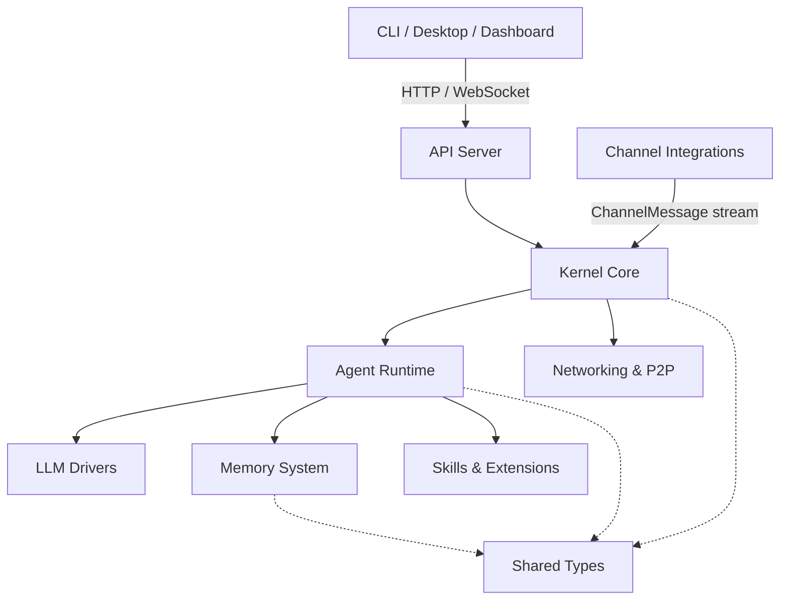

# crates — Wiki

# LibreFang Agent OS

LibreFang is an autonomous agent operating system built in Rust. It provides a complete platform for running, managing, and extending AI agents — from a single conversational bot to a fleet of autonomous workers — with built-in memory, tool use, multi-provider LLM support, and 40+ messaging platform integrations.

The codebase is organized as a workspace of ~30 Rust crates plus a React dashboard SPA. Everything is designed to run as a single daemon: the kernel boots, agents register, channels connect, and the system is ready.

## Architecture

## Core Modules

**Kernel Core** is the runtime foundation. It owns agent registration, supervision, scheduling, event routing, config loading, workflow execution, and triggers. Everything else depends on it.

The **Agent Runtime** is where agents actually execute. It orchestrates the full agent loop — receiving messages, recalling memories, calling LLMs, executing tools, and persisting conversations. It integrates memory, context management, web capabilities, and the plugin system into a unified loop.

**LLM Drivers** provide a provider-agnostic interface over LLM providers with automatic failover, rate-limit tracking, credential management, and response filtering. The runtime calls the trait; the driver handles the rest.

The **Memory System** gives agents a unified memory API over three SQLite-backed stores — structured key-value, semantic vector search, and a knowledge graph — plus a proactive memory layer that automatically extracts and deduplicates memories during conversations.

**Channel Integrations** is the bridge between external messaging platforms and the kernel. Over 40 adapters (Telegram, Slack, Discord, and more) translate platform events into a unified `ChannelMessage` stream that the kernel routes to the appropriate agent.

## Extension Points

The **Skills System** is LibreFang's pluggable extension mechanism. Skills are self-contained bundles — manifest plus optional code or prompt context — that extend what an agent can do. They can be loaded at startup, registered as LLM-callable tools, and even created and versioned at runtime by agents themselves.

**Hands & Multi-Agent** defines autonomous worker packages. Unlike regular conversational agents, Hands are activated and then run independently — bundling their own model config, system prompts, tool access, skills, and dashboard metrics into a single `HAND.toml` definition.

The **Extensions System** manages MCP (Model Context Protocol) server integrations — discovering, installing, credentialing, and monitoring external tool servers that agents can call through the runtime.

**Runtime Protocols (MCP & OAuth)** connects agents to external services: MCP servers for tool invocation and OAuth 2.0 providers for authentication.

## User Interfaces

Users interact with LibreFang through three frontends:

- The **CLI & TUI** (`librefang-cli`) is the primary developer interface — a comprehensive command-line tool and interactive terminal dashboard. It can operate as a daemon client or boot an in-process kernel for single-shot commands.
- The **API Server** (`librefang-api`) exposes the kernel over HTTP/WebSocket with authentication, rate limiting, and a versioned JSON API built on Axum.
- The **Dashboard Frontend** is a React SPA covering agent configuration, chat, workflow editing, skill management, monitoring, and administration.
- The **Desktop Application** wraps everything in a Tauri 2.0 native app with system tray integration, auto-start, and automatic updates.

## Infrastructure

[Shared Types](librefang-types-src.md) (`librefang-types`) contains the core data structures — agent identity, message types, configuration, approval gates — shared across the entire system with no business logic.

[HTTP Infrastructure](librefang-http-src.md) centralizes outbound HTTP client construction with proxy support and resilient TLS configuration, ensuring uniform timeout, header, and certificate handling across all crates.

[Telemetry & Observability](librefang-telemetry-src.md) wraps the `metrics` facade and provides HTTP-specific utilities consumed by the API layer's request-logging middleware.

[Networking & P2P](librefang-wire-src.md) implements the LibreFang Wire Protocol (OFP), enabling multiple kernels to discover, authenticate, and route messages to each other over TCP with HMAC-SHA256 authentication and replay protection.

## Cross-Cutting

[Testing Framework](librefang-testing-src.md) provides self-contained mock infrastructure — in-memory SQLite, temporary filesystem, mock kernel — so API routes, LLM integrations, and kernel behavior can be tested without network ports or external services.

[Migration](librefang-migrate-src.md) imports agents, memory, sessions, skills, and channel configurations from other agent frameworks (OpenClaw, OpenFang) into LibreFang's native format.

## Key End-to-End Flow

A message arrives from an external platform — say, a Telegram DM:

1. **Channel Integrations** receives the webhook, normalizes it into a `ChannelMessage`, and dispatches it to the kernel.
2. **Kernel Core** routes the message to the appropriate agent, checking scheduling, budgets, and permissions.
3. **Agent Runtime** picks up the message, recalls relevant context from the **Memory System**, constructs a prompt, and calls the **LLM Drivers**.
4. If the LLM requests a tool call, the runtime executes it — which may invoke a **Skill**, an **Extensions** MCP server, or a built-in capability.
5. The response flows back through the kernel to the channel adapter, which delivers it to Telegram.
6. The conversation turn is persisted to memory, and telemetry is recorded.

The same flow works identically whether the message originates from a messaging platform, the dashboard chat interface, the CLI, or a P2P-routed message from another kernel.