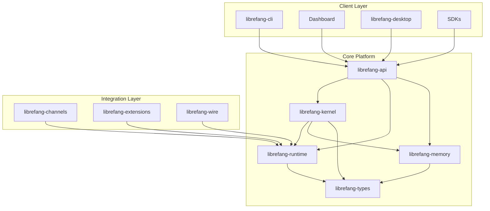

# librefang — Wiki

# LibreFang

LibreFang is an open-source Agent Operating System built in Rust. It provides a complete platform for running, orchestrating, and extending AI agents — with built-in support for 40+ messaging channels, autonomous capability packages (called Hands), a pluggable skills system, and multi-peer agent networking.

## Architecture Overview



## How It Fits Together

**librefang-kernel** is the central orchestrator. It manages the complete lifecycle of agents — spawning, scheduling, permission enforcement, and message routing. It exposes a trait-based interface consumed by everything else.

**librefang-runtime** is the execution engine. It receives messages, drives LLM inference, executes tools, and manages agent sessions. The runtime handles sandboxing, plugin loading, and MCP protocol communication.

**librefang-api** is the HTTP/WebSocket interface. The same binary that runs the daemon also serves the web-based Dashboard and the API consumed by CLI, SDKs, and external integrations.

**librefang-memory** provides the memory substrate — a unified API over structured storage, semantic search, and knowledge graphs, all backed by SQLite with optional external vector database support.

**librefang-channels** bridges 40+ messaging platforms (Slack, Discord, WhatsApp, Matrix, and many others) into the kernel. Each adapter normalizes platform-specific messages into a unified format and routes them to the appropriate agent.

**librefang-extensions** handles MCP server integration — discovery, authentication, OAuth flows, health monitoring, and automatic reconnection. This is how you add external tools and capabilities to your agents.

**librefang-wire** implements OFP (OpenFang Protocol), the peer-to-peer networking layer that lets agents on different machines discover each other and exchange messages over TCP with HMAC authentication.

**librefang-cli** is the primary command-line interface for operating the daemon, spawning agents, managing channels, and configuring the system.

**librefang-hands** provides autonomous capability packages — pre-built agent configurations you activate from a marketplace. Unlike regular agents you chat with, Hands run in the background and you check in on them periodically.

**librefang-skills** offers a pluggable architecture for extending agent capabilities through tools, prompt context injection, and sandboxed code execution.

**librefang-types** is the canonical source of truth for all shared data structures. Every crate in the workspace depends on these types — they define the shapes of data, serialization contracts, and validation rules without any business logic.

## Key End-to-End Flows

**Agent Message Flow**: When a message arrives via a channel adapter → it enters the runtime → the agent loop processes it through the LLM driver → tool calls are executed → responses flow back through the same channel adapter to the original user.

**API Request Flow**: CLI, Dashboard, or SDK → librefang-api HTTP server → kernel handle → kernel core orchestration → runtime execution → memory operations → response back up the chain.

**MCP Tool Call Flow**: Runtime agent loop → MCP client → MCP server (via extensions system) → tool result → agent continues processing.

## Getting Started

After cloning the repository:

```bash
# Build the workspace
cargo build --release

# Initialize configuration
./target/release/librefang init

# Start the daemon
./target/release/librefang start

# Spawn your first agent
./target/release/librefang agent create --name my-agent
```

Or use the [Desktop Application](librefang-desktop.md) for a native GUI experience on Windows, macOS, or Linux.

## Project Structure

```
crates/
├── librefang-types/      # Shared data types and validation
├── librefang-memory/     # Memory substrate (vector, graph, structured)
├── librefang-runtime/    # Agent execution engine
├── librefang-kernel/     # Core orchestrator
├── librefang-api/        # HTTP/WebSocket API server
├── librefang-cli/        # Command-line interface
├── librefang-channels/   # Channel bridge (40+ platforms)
├── librefang-skills/     # Skills system
├── librefang-extensions/ # MCP server integration
├── librefang-hands/      # Autonomous capability packages
├── librefang-wire/       # OFP peer-to-peer protocol
├── librefang-migrate/    # Migration tools
└── librefang-telemetry/  # Observability infrastructure
```

## Where to Go Next

- **[Kernel Core](librefang-kernel.md)** — Understand how agents are orchestrated
- **[Runtime Engine](librefang-runtime.md)** — Deep dive into agent execution
- **[API Server](librefang-api.md)** — Explore the HTTP interface and endpoints
- **[CLI](librefang-cli.md)** — Command-line operations reference
- **[Dashboard](dashboard.md)** — Web UI for managing LibreFang
- **[Extensions System](librefang-extensions.md)** — Adding MCP server integrations
- **[Channels](librefang-channels.md)** — Connecting messaging platforms
- **[Deployment](deploy-fly.md)** — Deploy to Fly.io, GCP, or Docker