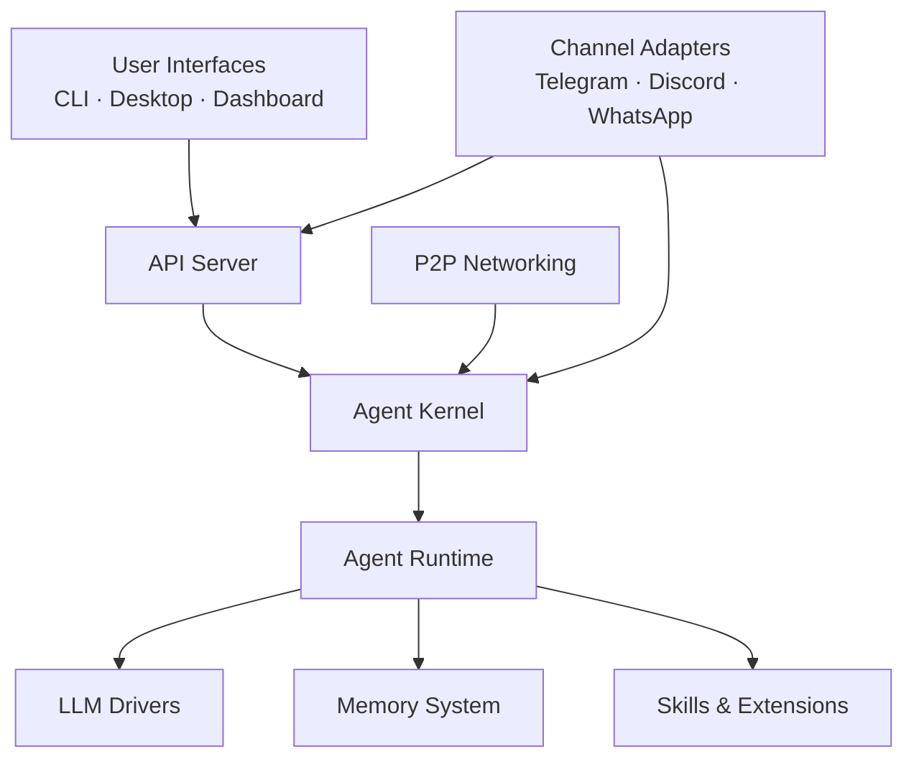

# crates — Wiki

# LibreFang Agent OS

Welcome to **LibreFang** — an open-source platform for building, running, and managing autonomous AI agents. LibreFang connects your agents to 40+ messaging platforms (Telegram, Discord, Slack, WhatsApp, and more), gives them persistent memory, pluggable skills, Model Context Protocol integrations, and a full web dashboard for management and monitoring.

## Architecture at a Glance

## How It All Fits Together

### User-Facing Interfaces

Users interact with LibreFang through several entry points, all converging on the same backend:

- The **[Dashboard Frontend](librefang-api-dashboard-src.md)** — a React SPA for chatting with agents, managing workflows, and configuring the system through a browser
- The **[CLI & TUI](librefang-cli-src.md)** — a feature-rich command-line tool with 40+ subcommands and an interactive terminal UI launcher
- The **[Desktop Application](librefang-desktop-src.md)** — a native Tauri 2.0 app with system tray integration, auto-updates, and both local and remote server modes
- **[Channel Adapters](librefang-channels-src.md)** — direct platform connections that route messages from Telegram, Discord, Slack, WhatsApp, Bluesky, webhooks, and many more into the system

### The Core Engine

The **[Agent Kernel](librefang-kernel-src.md)** is the central orchestrator. It handles authentication, approval gating, workflow DAG execution, triggers, and message routing to the right specialist agent. Every request passes through the kernel before reaching an agent.

The kernel delegates the actual agent turn to the **[Agent Runtime](librefang-runtime-src.md)**, which manages the full lifecycle: receiving a user message, filtering PII, recalling relevant memories, calling the LLM, executing tool calls, persisting results, and extracting new memories. The runtime also implements the A2A (Agent-to-Agent) protocol for cross-framework interoperability.

LLM communication flows through the **[LLM Drivers](librefang-llm-driver-src.md)** layer — a provider-agnostic trait interface with concrete backends for OpenAI, Anthropic, local models, and 15+ other providers, all with streaming support.

### Agent Capabilities

Agents are extended through two complementary systems:

- The **[Skills Framework](librefang-skills-src.md)** manages the full lifecycle of skills — discovery from ClawHub, installation, configuration, and even agent-driven autonomous evolution. Skills are self-contained packages of prompts, tools, and configuration.
- **[Extensions & MCP](librefang-extensions-src.md)** provides Model Context Protocol integration: catalog browsing, credential vaulting, OAuth PKCE flows, and a standardized client runtime for tool discovery and execution.

For autonomous background work, the **[Hands System](librefang-hands-src.md)** offers pre-built, domain-complete agent packages. Users activate a Hand and check in on progress rather than conversing directly — each Hand spawns and manages its own agents.

### Persistence & Multi-Node Networking

The **[Memory System](librefang-memory-src.md)** gives agents persistent recall across three storage layers: structured key-value, semantic vector search, and a knowledge graph — all backed by SQLite with optional external vector databases.

For distributed deployments, the **[P2P Networking](librefang-wire-src.md)** module (OFP — the LibreFang Wire Protocol) enables TCP-based peer discovery, HMAC-SHA256 authenticated messaging, and cross-kernel agent routing so multiple machines can share an agent pool.

### Foundation Layer

Everything rests on shared infrastructure and type definitions. The **[Shared Types](librefang-types-src.md)** crate defines the canonical data structures used across every module — serialization-stable, dependency-light, and never pulling in async runtimes. Beneath that, **[Infrastructure & Utilities](librefang-testing-src.md)** provides HTTP client factories, OAuth 2.0 flows, WASM sandboxing, telemetry, workspace migration, and test tooling.

## Key End-to-End Flow

When a user sends a message through a channel like Telegram:

1. The **Channel Adapter** receives and sanitizes the incoming message
2. The adapter forwards it through the channel bridge to the **Agent Kernel**
3. The kernel authenticates the user, checks permissions, and routes to the correct agent
4. The **Agent Runtime** takes over: filters PII, recalls relevant **memories**, loads applicable **skills**
5. The runtime calls the **LLM** through the driver layer, processing the streaming response
6. Any tool calls are executed, results persisted, and new memories extracted
7. The response flows back: runtime → kernel → channel bridge → adapter → user

The same flow works identically through the dashboard, CLI, or desktop app — they all communicate through the **API Server**, which orchestrates the kernel and runtime on behalf of the frontend.