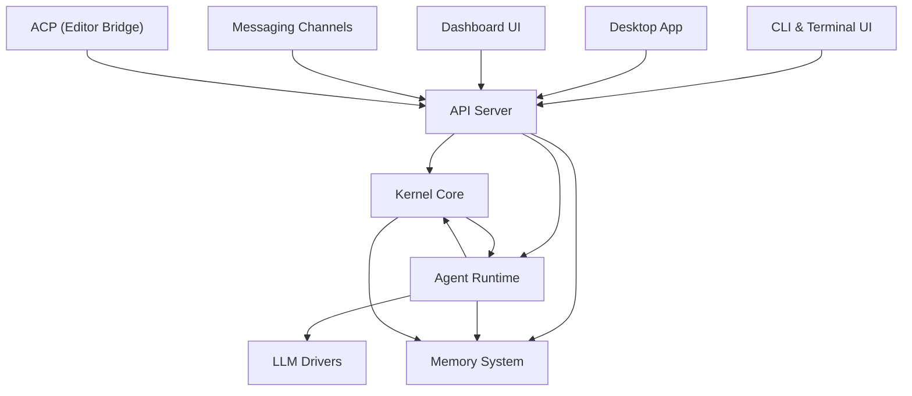

# crates — Wiki

# LibreFang Agent OS

LibreFang is a self-hosted **agent operating system** — a runtime platform for building, running, and managing autonomous AI agents. It provides everything from identity management and LLM integration to persistent memory, real-time messaging channels, and a full web dashboard. You interact with agents through a terminal UI, a desktop app, editor integrations, or external chat platforms like Telegram and Discord.

## Architecture at a Glance

## How the System Fits Together

At the center is the [Kernel Core](librefang-kernel-src.md), which owns agent identity, approval workflows, message routing, cost controls, and shared HTTP infrastructure. Every other layer depends on it.

The [API Server](librefang-api-src.md) wraps the kernel and exposes it through HTTP routes, WebSocket connections, Server-Sent Events, and channel adapters. All user-facing surfaces talk to the system through this API:

- The [CLI & Terminal UI](librefang-cli-src.md) — the primary launcher, protocol servers, and a full Ratatui dashboard
- The [Desktop Application](librefang-desktop-src.md) — a Tauri 2.0 native window with optional embedded kernel
- The [Dashboard UI](librefang-api-dashboard-src.md) — a React SPA for web-based management and monitoring
- The [Agent Control Protocol](librefang-acp-src.md) adapter — JSON-RPC 2.0 bridge for editors (Zed, VS Code, JetBrains)

External chat platforms (Telegram, Discord, Slack, Bluesky, Feishu, and more) connect through the [Messaging Channels](librefang-channels-src.md) module, which normalizes inbound messages into a common `ChannelMessage` type and routes responses back through each platform's native API.

When an agent needs to think, the [Agent Runtime](librefang-runtime-src.md) drives the turn loop: it calls an [LLM Driver](librefang-llm-drivers-src.md), dispatches tools, manages sessions, and handles agent-to-agent delegation. The runtime also manages an [MCP Client](librefang-runtime-mcp-src.md) for external tool servers and the [Skills System](librefang-skills-src.md) for modular, installable agent capabilities.

Agents persist knowledge through the [Memory System](librefang-memory-src.md), which combines structured key-value storage, semantic vector search, a knowledge graph, and a file-backed markdown wiki for long-form notes.

For peer-to-peer networking between LibreFang instances, the [P2P Wire Protocol](librefang-wire-src.md) (OFP) handles agent discovery, authenticated handshakes, and encrypted message routing over TCP.

Supporting modules round out the platform:

- [Types & Configuration](librefang-types-src.md) — the shared vocabulary used across every crate, with no runtime dependencies
- [Extensions & Vault](librefang-extensions-src.md) — MCP server template discovery and secure credential storage
- [Hands Orchestration](librefang-hands-src.md) — pre-built autonomous background agent packages activated from a marketplace
- [Telemetry & Observability](librefang-telemetry-src.md) — centralized metrics via Prometheus
- [Migration Tools](librefang-migrate-src.md) — imports agents and data from frameworks like OpenClaw and OpenFang
- [Testing Framework](librefang-testing-src.md) — mock infrastructure for integration tests against a real kernel with minimal config

## Key End-to-End Flows

**Provider health checks** start at an API route, flow through the runtime's provider health checker, which probes endpoints by building an HTTP client using the kernel's shared TLS configuration — crossing the API → Runtime → Kernel boundary.

**Cross-platform messaging** works like this: an inbound message from Telegram or Discord enters through a channel adapter, gets normalized into `ChannelMessage`, flows through the API to the kernel's message router, which dispatches it to the agent runtime. The runtime processes the turn, calls the LLM, and sends the response back through the same channel adapter.

**Skill self-evolution** enters through an API route, delegates to the skills module's evolution engine to modify files in place, and propagates asset updates through the dashboard's build pipeline.

**Scheduled workflows** flow from API route handlers through the runtime's session metrics and token estimation (via the compactor), exercising the LLM driver and memory system to complete the agent's task on a cron schedule.