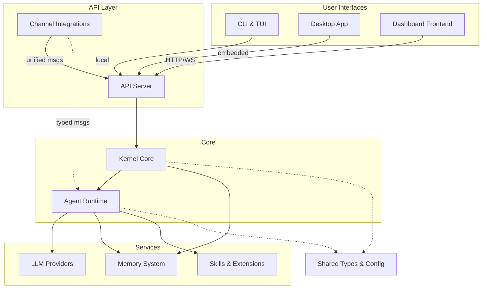

# crates — Wiki

# LibreFang Agent OS

LibreFang is a full-stack platform for building, running, and managing autonomous AI agents. It handles the complete lifecycle — receiving messages from users or external platforms, orchestrating LLM calls, executing tools, managing persistent memory, and streaming responses back — across multiple interfaces including a web dashboard, desktop app, terminal UI, and 40+ messaging platforms.

## Architecture

## How the System Works

Everything starts at the [Kernel Core](kernel-core.md), which boots the in-process runtime, wires up the event bus, and manages agent lifecycles from instantiation through shutdown. The kernel is the orchestrator — it doesn't execute agent logic itself but coordinates everything that does.

When a message arrives — whether from the [API Server](api-server.md) via HTTP/WebSocket, from an external platform through [Channel Integrations](channel-integrations.md), or from the [CLI & TUI](cli-tui.md) — the kernel routes it to the appropriate agent in the [Agent Runtime](agent-runtime.md). The runtime handles the full execution loop: recalling relevant context from the [Memory System](memory-system.md), calling an [LLM Provider](llm-providers.md), executing any tools the model requests (including sandboxed [Skills & Extensions](skills-extensions.md)), and persisting the session.

User-facing interfaces sit on top. The [Dashboard Frontend](dashboard-frontend.md) is a React SPA that communicates with the backend through the [Dashboard API Client](dashboard-api-client.md), which wraps every endpoint in typed React Query hooks. The [Desktop Application](desktop-application.md) wraps everything in a Tauri 2.0 native window with system tray integration and auto-updates. The CLI provides both one-shot commands and an interactive terminal dashboard.

Cross-cutting concerns are handled by dedicated modules. [Authentication & Security](authentication-security.md) provides a layered model spanning OAuth2/OIDC federation, rate limiting, capability-based permissions, and taint tracking. [MCP Integration](mcp-integration.md) lets LibreFang act as both an MCP client (connecting to external tool servers) and an MCP server (exposing its own tools to clients like Claude Desktop). The [Networking & P2P](networking-p2P.md) module enables distributed kernels to discover each other and coordinate work over authenticated TCP connections.

Underpinning all of this is [Shared Types & Configuration](shared-types-configuration.md) — the single source of truth for data structures, config shapes, error types, test harnesses, and migration tooling used across every crate.

## Key End-to-End Flow: Sending a Chat Message

A typical user interaction traces through most of the stack:

1. The user types a message in the **Dashboard Frontend** `ChatPage`
2. The **Dashboard API Client** fires a typed mutation (`useCreateAgentSession`) that calls the authenticated `POST` endpoint
3. The **API Server** receives the request, authenticates it, and forwards it to the **Kernel Core**
4. The kernel dispatches to the **Agent Runtime**, which runs the agent loop:
   - Recalls relevant memories from the **Memory System**
   - Sends the prompt (with context) to an **LLM Provider**
   - If the model requests a tool, the runtime executes it via **Skills & Extensions** (or **MCP Integration** for external tools)
   - Tool results feed back into the LLM for the next turn
5. The response streams back through the API server to the dashboard via SSE/WebSocket

The same flow works when a message arrives from Telegram, Discord, Slack, or any of the 40+ platforms supported by **Channel Integrations** — the channel adapter normalizes the incoming message into a unified `ChannelMessage`, and the kernel routes it identically.