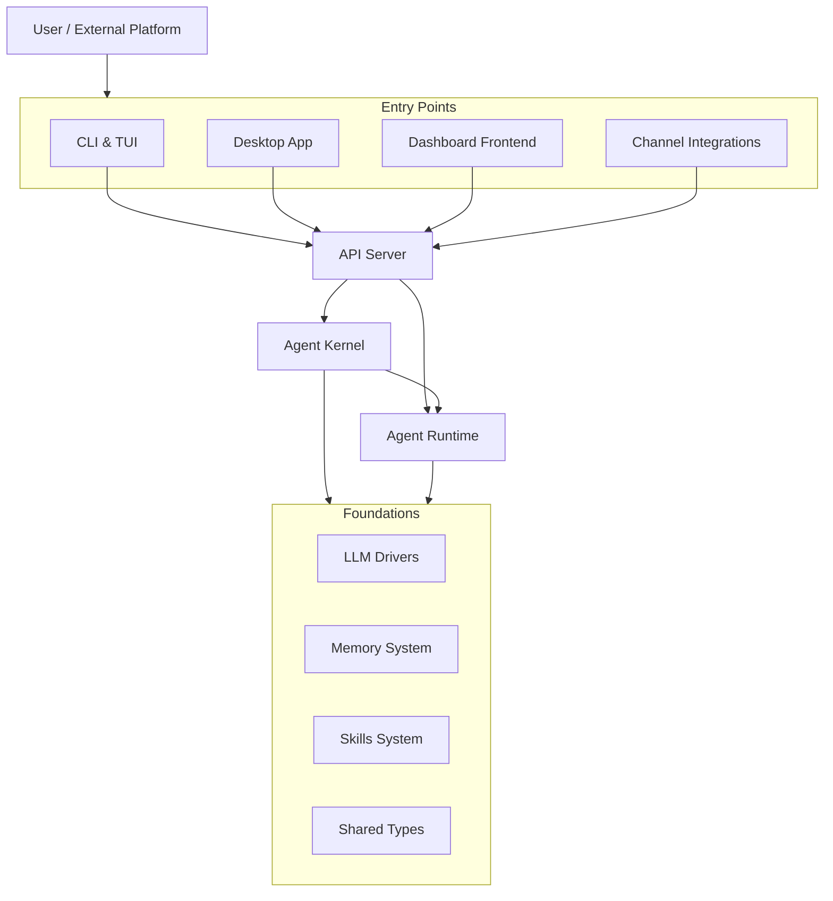

# crates — Wiki

# LibreFang Agent OS

LibreFang is a full-stack agent platform — an operating system for building, running, and managing autonomous AI agents. It provides everything from LLM orchestration and tool execution to multi-channel messaging, a web dashboard, desktop application, and peer-to-peer agent networking.

## Architecture



## Key Concepts

**Agents** are the central abstraction. Each agent has an identity, a manifest, sessions, memory, skills, and configuration. Users interact with agents through chat interfaces (the dashboard, CLI, or external channels) or delegate to them as autonomous **Hands** — pre-packaged agent configurations from a marketplace that run independently.

The [Agent Kernel](agent-kernel.md) mediates all interactions between the runtime and the outside world — handling approvals, routing, cost tracking, and access control. The [Agent Runtime](agent-runtime.md) drives the core loop: orchestrating LLM completions, tool execution, memory recall, and session persistence.

## End-to-End Flows

**Chatting via the dashboard:** A user opens the [Dashboard Frontend](dashboard-frontend.md), which calls the [API Server](api-server.md). The API routes through the [Agent Kernel](agent-kernel.md) for authorization and approval gates. The [Agent Runtime](agent-runtime.md) runs the agent loop — LLM completion via [LLM Drivers](llm-drivers.md), tool calls, memory recall from the [Memory System](memory-system.md) — and streams the response back.

**Chatting via an external channel:** A message arrives from Telegram, Discord, WhatsApp, or another platform through [Channel Integrations](channel-integrations.md). The channel bridge sanitizes, rate-limits, and routes it. From there the flow is identical, except the response is translated into platform-appropriate formatting.

**Installing and using a skill:** The [Skills System](skills-system.md) handles discovery from marketplaces, installation, and agent-driven skill creation. Skills inject tool definitions and prompt context into sessions, and depend on the [Extensions System](extensions-system.md) for MCP server management, credential vaulting, and OAuth flows.

**Cross-machine agent communication:** The [Wire Protocol & Networking](wire-protocol-networking.md) module provides TCP-based peer discovery, HMAC authentication, and message dispatch so agents on different machines can collaborate.

## Module Map

Every module has detailed documentation. Here's how to navigate:

- **[API Server](api-server.md)** — REST API surface, routing, and the channel bridge connecting external messaging platforms
- **[Agent Kernel](agent-kernel.md)** — Central coordination: approval gates, auth, consolidation locks, workflow execution, cost tracking
- **[Agent Runtime](agent-runtime.md)** — Execution engine: agent loop, tool invocation, MCP client, OAuth, WASM plugins, web search
- **[LLM Drivers](llm-drivers.md)** — Unified multi-provider LLM abstraction with credential management, rate limiting, and intelligent failover
- **[Memory System](memory-system.md)** — Structured key-value storage, semantic vector search, and knowledge graph behind a single facade
- **[Skills System](skills-system.md)** — Lifecycle management for installable capability modules
- **[Extensions System](extensions-system.md)** — MCP server catalog, encrypted credential vault, OAuth2 PKCE, health monitoring
- **[Hands System](hands-system.md)** — Autonomous agent packages: definitions, registry, marketplace integration
- **[Channel Integrations](channel-integrations.md)** — Adapter interface and lifecycle for Telegram, Discord, Bluesky, WhatsApp, and more
- **[Dashboard Frontend](dashboard-frontend.md)** — React SPA management console with type-safe API communication
- **[CLI & Terminal UI](cli-terminal-ui.md)** — Command-line interface and interactive TUI launcher
- **[Desktop Application](desktop-application.md)** — Tauri 2.0 native shell with system tray, auto-update, and remote/local modes
- **[Wire Protocol & Networking](wire-protocol-networking.md)** — Cross-machine peer discovery and communication over TCP
- **[Shared Types & Configuration](shared-types-configuration.md)** — Cross-crate type contracts for identities, manifests, sessions, and config
- **[HTTP Infrastructure](http-infrastructure.md)** — Centralized HTTP client with TLS fallback and uniform proxy management
- **[Telemetry](telemetry.md)** — Prometheus metrics with automatic path normalization
- **[Testing Utilities](testing-utilities.md)** — Mock infrastructure for fast, isolated tests
- **[Migration Tools](migration-tools.md)** — Import agents and configuration from other frameworks

## Getting Started

### Prerequisites

- **Rust** (latest stable) — the backend is entirely Rust
- **Node.js** (v18+) — for the dashboard frontend build
- A running **LLM provider** endpoint (OpenAI, Anthropic, local, etc.)

### Build & Run

The fastest path is the CLI:

```bash
# Build everything
cargo build

# Run the daemon (starts API server + kernel)
cargo run -- daemon

# Or launch the interactive TUI
cargo run
```

For the desktop application:

```bash
cd librefang-desktop
cargo tauri dev
```

For the dashboard frontend (standalone development):

```bash
cd dashboard
npm install
npm run dev
```

### Configuration

LibreFang looks for configuration at `~/.librefang/config.toml`. On first run, the CLI guides you through setup — LLM provider credentials, channel adapters, and agent creation.

## Contributing

The [Testing Utilities](testing-utilities.md) crate provides mock infrastructure (in-memory databases, fake LLM providers, HTTP helpers) so tests run without a full daemon. Most modules have integration tests under their `tests/` directories that demonstrate expected usage patterns.