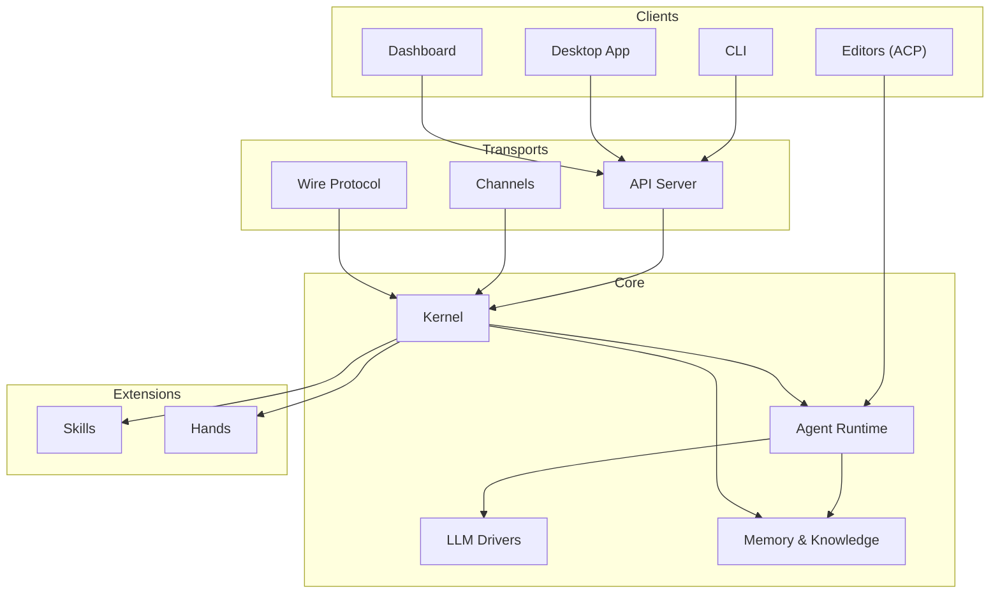

# crates — Wiki

# LibreFang

LibreFang is an open-source **Agent Operating System** — a self-hosted platform for running, managing, and extending autonomous AI agents. It provides the complete stack: a kernel that orchestrates agent identity and lifecycle, a runtime that executes the agent loop, pluggable LLM provider support, durable memory and knowledge storage, and multiple frontends (CLI, desktop app, web dashboard, chat platforms) for interacting with agents.

## Architecture

The system is organized in layers. [Core Types & Configuration](core-types-and-configuration.md) defines the shared vocabulary every other crate depends on. The [Kernel (Core Engine)](kernel-core-engine.md) sits at the center, managing agent identity, authentication, approval gating, and configuration. The [Agent Runtime](agent-runtime.md) drives the core agent loop — assembling prompts, calling LLMs, executing tools, and finalizing responses. All LLM communication flows through the [LLM Driver Layer](llm-driver-layer.md), which normalizes 19+ providers behind a single trait. Agents persist knowledge via the [Memory & Knowledge Base](memory-and-knowledge-base.md) module, which combines structured key-value storage, semantic vector search, and a knowledge graph backed by SQLite.

External access is multiplexed through the [API Server & Routes](api-server-and-routes.md), a daemon-attached service layer that bridges Unix domain sockets, named pipes, and messaging channels to the kernel. Operators interact through three client surfaces: the [Command Line Interface](command-line-interface.md) (interactive launcher, ACP/MCP protocol servers, diagnostics), the [Desktop Application](desktop-application.md) (Tauri 2.0 native wrapper with system tray, auto-update, and WebView dashboard), and the [Dashboard Frontend](dashboard-frontend.md) (React SPA for managing agents, sessions, budgets, and kernel subsystems).

Chat platform integrations — Telegram, Discord, Slack, WhatsApp — are handled by the [Channel System](channel-system.md), which provides a unified adapter interface with sanitization, rate-limiting, and crash-recoverable message journaling. Agent capabilities are extended through the [Skills System](skills-system.md) (marketplace discovery, installation, security scanning, runtime loading) and the [Hands System](hands-system.md) (pre-built autonomous agent packages that run independently). The [Extensions & Credential Vault](extensions-and-credential-vault.md) manages MCP server lifecycle and secure credential storage.

Cross-cutting infrastructure includes [HTTP Infrastructure](http-infrastructure.md) (centralized TLS roots and proxy configuration for all outbound requests), [Telemetry & Metrics](telemetry-and-metrics.md) (OpenTelemetry + Prometheus instrumentation), [Wire Protocol & Networking](wire-protocol-and-networking.md) (inter-node TCP federation with mutual authentication and forward secrecy), [Reinforcement Learning Export](reinforcement-learning-export.md) (RL rollout trajectory shipping), [Import & Migration](import-and-migration.md) (workspace migration from other frameworks), and the [Testing Framework](testing-framework.md) (mock infrastructure for integration tests). The [Agent Communication Protocol](agent-communication-protocol.md) adapter bridges the runtime to editors like Zed, VS Code, and JetBrains via the ACP standard.

```mermaid
graph TB
    subgraph Clients
        CLI["CLI"]
        DESK["Desktop App"]
        DASH["Dashboard"]
        EDITORS["Editors (ACP)"]
    end

    subgraph Transports
        API["API Server"]
        CH["Channels"]
        WIRE["Wire Protocol"]
    end

    subgraph Core
        KERNEL["Kernel"]
        RUNTIME["Agent Runtime"]
        LLM["LLM Drivers"]
        MEM["Memory &amp; Knowledge"]
    end

    subgraph Extensions
        SKILLS["Skills"]
        HANDS["Hands"]
    end

    CLI --> API
    DESK --> API
    DASH --> API
    EDITORS --> RUNTIME

    API --> KERNEL
    CH --> KERNEL
    WIRE --> KERNEL

    KERNEL --> RUNTIME
    RUNTIME --> LLM
    RUNTIME --> MEM
    KERNEL --> SKILLS
    KERNEL --> HANDS
    KERNEL --> MEM
```

## Key End-to-End Flows

**Provider health check** — An API route handler calls into the agent runtime's provider health module, which probes LLM endpoints. The probe constructs an HTTP client through the centralized HTTP infrastructure module, ensuring TLS roots and proxy settings are applied consistently.

**Agent loop execution** — The runtime assembles a prompt from message history, sends it through the LLM driver layer, processes the completion (including tool calls), and compresses context when token limits approach. Context compression flows through the compactor and gateway compression modules before the next iteration.

**Chat platform message flow** — An incoming message from Telegram or Discord arrives via the channel system's adapter. It passes through sanitization and rate-limiting, then the channel bridge dispatches it to the kernel, which routes it to the appropriate agent runtime instance. The response flows back through the channel adapter to the platform.

**Skill installation and evolution** — The API exposes skill management endpoints that invoke the skills system for marketplace discovery, download, and security scanning. Skills can also be created or mutated by agents at runtime, with supporting files managed through the evolution module.

## Getting Started

New developers should start with [Core Types & Configuration](core-types-and-configuration.md) to understand the shared data model, then explore the [Kernel (Core Engine)](kernel-core-engine.md) for the central orchestration logic. The [Agent Runtime](agent-runtime.md) is where the core agent loop lives and is the most important codepath to understand. For setting up a development environment, see the [Testing Framework](testing-framework.md) page, which documents how to run integration tests against a fully-wired mock kernel.