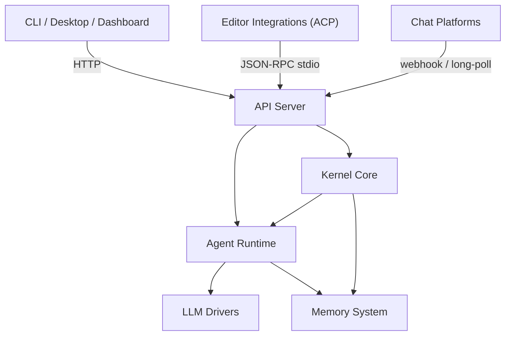

# crates — Wiki

# LibreFang Agent OS

LibreFang is a self-hosted agent platform that gives you durable, auditable, multi-channel AI agents you can interact with through a terminal, a desktop app, a web dashboard, chat platforms, or your editor. A single long-lived daemon holds a `LibreFangKernel` that orchestrates identity, execution, memory, cost control, and tool access for every agent.

## Architecture

```mermaid
graph TD
    Clients["CLI / Desktop / Dashboard"]
    Editors["Editor Integrations (ACP)"]
    Chats["Chat Platforms"]

    API["API Server"]
    Kernel["Kernel Core"]
    Runtime["Agent Runtime"]
    LLM["LLM Drivers"]
    Memory["Memory System"]

    Clients -->|HTTP| API
    Editors -->|JSON-RPC stdio| API
    Chats -->|webhook / long-poll| API

    API --> Kernel
    API --> Runtime
    Kernel --> Runtime
    Runtime --> LLM
    Runtime --> Memory
    Kernel --> Memory
```

## How it fits together

Everything starts at the **Kernel Core**, which owns agent identity (deterministic UUID v5), approval gating, authentication, config loading, and the workflow engine. It exposes its surface through a set of role traits defined in the kernel handle module.

The **API Server** sits inside the daemon process and multiplexes external consumers onto a shared kernel. It serves the HTTP API (consumed by the dashboard and CLI), hosts the ACP adapter for editor integrations, and bridges to the **Channels** module for Telegram, Slack, Discord, and WhatsApp.

When an agent needs to run, the kernel hands off to the **Agent Runtime** — the agent loop, context loading, message history, tool execution, MCP client, media handling, sandboxed code execution, and a Merkle-hash-chain audit trail. The runtime calls into **LLM Drivers** for provider communication (with retry, fallback, and credential management) and into the **Memory System** for structured key-value storage, semantic vector search, and a human-readable wiki vault backed by SQLite.

Users interact through the **CLI & Desktop** clients (terminal or Tauri 2.0 native app), the React-based **Dashboard UI**, or directly via chat channels. The **Agent Control Protocol** adapter lets editors like Zed, VS Code, and JetBrains embed a LibreFang agent natively.

On the capability side, **Skills** manage installable agent behaviours from the ClawHub marketplace — including agent-driven self-evolution — while **Hands** are fully autonomous, domain-complete agent configurations that users activate and monitor rather than chat with. **Extensions & Vault** handles MCP server discovery, OAuth flows, credential storage, and server health monitoring.

For multi-machine deployments, the **Wire Protocol** provides agent-to-agent federation over TCP with HMAC + Ed25519 authentication. Every crate depends on **Shared Types** for identity, manifest, and wire-format definitions, and on **Support Libraries** for HTTP client construction, subprocess bridging, observability, and testing utilities.

## Key end-to-end flows

**Listing providers** — the dashboard calls `list_providers` on the API server, which delegates to the runtime's provider health checker, which probes endpoints using an HTTP client built by the support layer (with proxy and TLS configuration).

**Running an agent** — the CLI sends a request to the API server, which acquires a kernel handle and invokes the runtime's streaming agent loop. The runtime loads context and memory, calls the LLM driver for completions, applies gateway compression and token estimation when needed, and streams the response back through the API to the client.

**Installing a skill** — the dashboard triggers the skill evolution route on the API server, which calls into the skills crate to walk files, apply patches, and persist changes. The CLI's init wizard uses the extensions module to write environment files for new credentials.

**Receiving a chat message** — a platform adapter in the channels module receives an inbound message, routes it to the correct agent through the kernel, and the kernel dispatches to the agent runtime. Approval requests and scheduled messages flow back out through the same channel adapter.

## Getting started

The workspace builds with standard Cargo commands. The daemon binary is the main entry point — it boots the kernel, starts the API server, and begins accepting connections from CLI, desktop, dashboard, and channel adapters. Configuration lives in `~/.librefang/config.toml`.