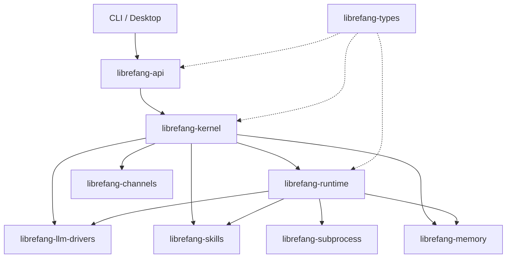

# librefang — Wiki

# LibreFang — Libre System Operacyjny Agentów

Witamy w repozytorium kodu LibreFang. LibreFang to otwartoźródłowy **System Operacyjny Agentów** napisany w języku Rust — samodzielnie hostowana platforma do budowania, uruchamiania i federowania autonomicznych agentów napędzanych przez LLM. Zapewnia wielodostawcowe wsparcie dla LLM, autonomiczne planowanie zadań, integrację z platformami komunikacyjnymi, ewolucję umiejętności oraz federację peer-to-peer — wszystko za pomocą zunifikowanego interfejsu HTTP API.

Obszar roboczy zawiera 24 craty, ponad 2100 testów i zero ostrzeżeń clippy.

---

## Architektura w pigułce

LibreFang jest zorganizowany jako warstwowy monorepo. Na samym dole znajduje się współdzielony system typów; powyżej jądro (kernel) koordynuje pracę silnika wykonywania, trwałej pamięci, sterowników LLM, kanałów komunikacyjnych i zdefiniowanych przez użytkownika umiejętności. Klienci (CLI, aplikacja desktopowa, zewnętrzne SDK) komunikują się z systemem przez warstwę HTTP API.


```mermaid
graph TB
    CLI["CLI / Desktop"]
    API["librefang-api"]
    KERNEL["librefang-kernel"]
    RT["librefang-runtime"]
    TYPES["librefang-types"]
    MEM["librefang-memory"]
    LLM["librefang-llm-drivers"]
    CHAN["librefang-channels"]
    SKILLS["librefang-skills"]
    SUB["librefang-subprocess"]

    CLI --> API
    API --> KERNEL
    KERNEL --> RT
    KERNEL --> MEM
    KERNEL --> CHAN
    KERNEL --> SKILLS
    KERNEL --> LLM
    RT --> SUB
    RT --> MEM
    RT --> SKILLS
    RT --> LLM
    TYPES -.-> API
    TYPES -.-> KERNEL
    TYPES -.-> RT
```

Ciągłe strzałki oznaczają bezpośrednią własność i ścieżki wywołań. Kreskowane strzałki z `librefang-types` wskazują, że niemal każdy crat zależy od niego ze względu na współdzielone modele domeny — jest to lingua franca obszaru roboczego.

---

## Podsystemy podstawowe

### Fundament typów

Wszystko w LibreFang mówi tym samym słownictwem. [`librefang-types`](librefang-types.md) definiuje modele domeny, typy błędów oraz prymitywy internacjonalizacji (w tym potok tłumaczeń `resolve_language` / `t`) używane przez wszystkie pozostałe craty. Z ponad 600 punktami wywołań z samego jądra, jest to pierwszy crat, który nowy współtwórca powinien przeczytać.

### Warstwa API

[`librefang-api`](librefang-api.md) to główne wejście HTTP. Udostępnia ścieżki REST dla cyklu życia agentów, zarządzania umiejętnościami, konfiguracji kanałów, przyznawania uprawnień narzędzi MCP i wielu innych. API deleguje logikę biznesową do jądra i silnika wykonywania, a zależy od [`librefang-wire`](librefang-wire.md) w celu serializacji na poziomie protokołu.

### Jądro — płaszczyzna sterowania

[`librefang-kernel`](librefang-kernel.md) to mózg orkiestracji. Koordynuje uruchamianie agentów, przekierowuje wiadomości między kanałami a silnikiem wykonywania, zarządza rejestracją MCP OAuth i monitoruje zużycie zasobów za pomocą [`librefang-kernel-metering`](librefang-kernel-metering.md). Jądro posiada również abstrakcję [`librefang-kernel-handle`](librefang-kernel-handle.md), która umożliwia zewnętrznym procesom bezpieczną interakcję z działającym agentem.

### Silnik wykonywania — silnik wykonawczy

[`librefang-runtime`](librefang-runtime.md) to miejsce, gdzie agenci faktycznie *działają*. Zarządza pętlami wykonania, wywołuje sterowniki LLM, wykonuje umiejętności, przetwarza multimedia i komunikuje się z izolowanymi procesami potomnymi. Specjalizowane sub-craty obsługują konkretne aspekty środowiska wykonawczego:

- [`librefang-runtime-audit`](librefang-runtime-audit.md) — audyt wykonania i kontrola bezpieczeństwa
- [`librefang-runtime-media`](librefang-runtime-media.md) — przetwarzanie multimediów (obraz, dźwięk)
- [`librefang-runtime-mcp`](librefang-runtime-mcp.md) — integracja narzędzi Model Context Protocol
- [`librefang-runtime-sandbox-docker`](librefang-runtime-sandbox-docker.md) — piaskownica wykonywania kodu oparta na Dockerze

### Pamięć

[`librefang-memory`](librefang-memory.md) zapewnia trwałe przechowywanie i pobieranie kontekstu — długotrwałą pamięć, z której agenci korzystają w ramach wielu sesji. Jest intensywnie wywoływana zarówno przez jądro, jak i silnik wykonywania.

### Sterowniki LLM

[`librefang-llm-drivers`](librefang-llm-drivers.md) to warstwa agregacji wielodostawcowej, zbudowana na bazie abstrakcji opartej na cechach (traits) [`librefang-llm-driver`](librefang-llm-driver.md). Zamiana lub dodanie dostawcy LLM sprowadza się do implementacji cechy sterownika — bez konieczności zmian w jądrze lub silniku wykonywania.

### Kanały

[`librefang-channels`](librefang-channels.md) łączy zewnętrzne platformy komunikacyjne (WhatsApp, Telegram, Discord itp.) z silnikiem wykonywania agentów, umożliwiając agentom rozmowy z użytkownikami na platformach, z których już korzystają.

### Umiejętności

[`librefang-skills`](librefang-skills.md) to system umiejętności — kompozytowe, zdefiniowane przez użytkownika możliwości, które agenci mogą wywoływać. Umiejętności mogą być wyłącznie promptowymi manifestami TOML lub obciążonymi obliczeniowo modułami WASM/Python. Potok ewolucji umiejętności obejmuje wbudowane skanowanie wstrzykiwania promptów poprzez weryfikację wzorców zagrożeń, zanim jakakolwiek aktualizacja zostanie zatwierdzona.

### Wykonywanie procesów potomnych

[`librefang-subprocess`](librefang-subprocess.md) to wół roboczy do uruchamiania i zarządzania procesami potomnymi — używany przez jądro, silnik wykonywania, kanały i CLI do wszystkiego, od izolowanego wykonywania kodu po wywoływanie zewnętrznych narzędzi.

---

## Kluczowe przepływy end-to-end

**Uruchomienie agenta.** Żądanie trafia przez obsługę ścieżek `librefang-api`, która wywołuje `librefang-kernel` w celu rozwiązania manifestu agenta. Jądro wywołuje `librefang-types` w celu ustalenia języka i18n (`resolve_language`), a następnie przekazuje skonfigurowanego agenta do `librefang-runtime` w celu rozpoczęcia pętli wykonania. W trakcie procesu konsultowana jest `librefang-memory` w celu pobrania wcześniejszego kontekstu.

**MCP OAuth / TLS.** Gdy agent musi połączyć się z serwerem MCP, obsługiwacz `auth_start` w API deleguje zadanie do dostawcy MCP OAuth jądra (`register_client`), który buduje klienta HTTP przez `librefang-http` — przechodząc przez `oauth_client_builder` → `proxied_client_builder` → `build_http_client` → `tls_config`. Konfiguracja TLS to krok końcowy, który tworzy gotowego do użycia uwierzytelnionego klienta.

**Ewolucja umiejętności i bezpieczeństwo.** Gdy umiejętność jest aktualizowana lub przywracana do wcześniejszej wersji przez API, żądanie trafia do modułu ewolucji `librefang-skills`. Zanim jakakolwiek zmiana zostanie utrwalona, `validate_prompt_content` wywołuje `scan_prompt_content`, który buduje i stosuje definicje `ThreatPattern` w celu wykrycia prób wstrzykiwania promptów. Jest to twarde zabezpieczenie — żadna aktualizacja umiejętności go nie omija.

---

## Poza cratami

Repozytorium zawiera również znaczącą infrastrukturę spoza ekosystemu Rusta:

- **SDK** — automatycznie generowane biblioteki klienckie w językach [Go](sdk-go.md), [JavaScript](sdk-javascript.md) i [Python](sdk-python.md), a także ręcznie pisany [Rust SDK](sdk-rust.md) dla adapterów kanałów typu sidecar.
- **Wdrożenie** — Docker Compose, jednostki systemd, [moduł NixOS](nix.md), konfiguracje [Fly.io](deploy-fly.md) i [GCP](deploy-gcp.md) oraz [pakowanie dla Arch Linux](packaging.md).
- **Przykłady** — szablony typu kopiuj-i-modyfikuj dla [niestandardowych agentów, umiejętności i adapterów kanałów](examples.md).
- **Witryna dokumentacji** — aplikacja Next.js obsługująca [docs.librefang.io](docs.md).
- **[xtask](xtask.md)** — jedyny uruchamiacz zadań obszaru roboczego (`cargo xtask <command>`), używany do benchmarków, bramek CI, wycinania wydań i kompilacji changelogów.

---

## Pierwsze kroki

```bash
# Klonowanie repozytorium
git clone https://github.com/nicksarafa/librefang.git
cd librefang

# Budowanie całego obszaru roboczego
cargo build

# Uruchomienie testów (ponad 2100 testów)
cargo test

# Uruchomienie serwera API i panelu
cargo xtask serve
```

Domyślna konfiguracja uruchamia HTTP API na `localhost:8080` z panelem webowym. Aby skonfigurować dostawcę LLM, ustaw odpowiednie zmienne środowiskowe (zobacz [dokumentację konfiguracji API](librefang-api.md)) lub edytuj plik konfiguracyjny wygenerowany przy pierwszym uruchomieniu.

Aby utworzyć pierwszego agenta, skopiuj szablon z [`examples/custom-agent/`](examples.md) i zarejestruj go przez API lub CLI. [Moduł przykładów](examples.md) przeprowadzi przez wszystkie trzy powierzchnie rozszerzeń — agentów, umiejętności i adaptery kanałów.

---

> **Nowy tutaj?** Najlepsza kolejność czytania to: [`librefang-types`](librefang-types.md) → [`librefang-kernel`](librefang-kernel.md) → [`librefang-runtime`](librefang-runtime.md) → [`librefang-api`](librefang-api.md). Ta ścieżka prowadzi od współdzielonego słownictwa, przez orkiestrację i wykonywanie, aż do warstwy HTTP, która spina wszystko w całość.
