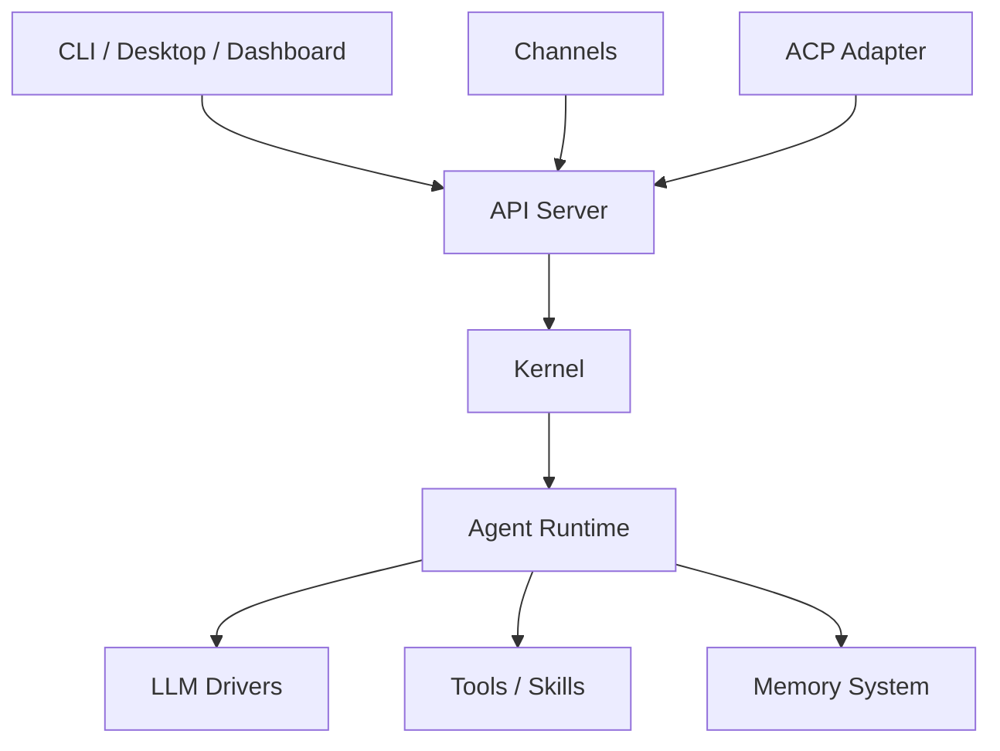

# crates — Wiki

# LibreFang

LibreFang is an **agent operating system** — a platform for building, running, and managing AI agents that reason, use tools, persist memories across sessions, and interact with humans through multiple interfaces. Operators control agents via a web dashboard, native desktop app, command-line interface, or connected messaging platforms like Telegram, Discord, Slack, and WhatsApp. Editors like VS Code and Zed integrate natively through the ACP adapter.

## Architecture


```mermaid
graph TD
    UI["CLI / Desktop / Dashboard"]
    CH["Channels"]
    ACP["ACP Adapter"]

    UI --> API
    CH --> API
    ACP --> API

    API["API Server"] --> K["Kernel"]
    K --> RT["Agent Runtime"]
    RT --> LLM["LLM Drivers"]
    RT --> TOOLS["Tools / Skills"]
    RT --> MEM["Memory System"]
```

The system is organized in four layers:

**User-facing interfaces** — where operators and external systems reach agents. The [Command-Line Interface](command-line-interface.md) is the primary entry point, parsing arguments and either talking to a running daemon over HTTP or booting an in-process kernel. The [Desktop Application](desktop-application.md) wraps everything in a Tauri 2.0 native window with system tray, auto-updates, and notifications. The [Dashboard](dashboard.md) is a React SPA that communicates with the kernel's REST API and real-time SSE/WebSocket streams. The [Agent Control Protocol](agent-control-protocol.md) adapter bridges editors like Zed, VS Code, and JetBrains into the agent runtime over JSON-RPC 2.0 on stdio. The [Channels](channels.md) module normalizes inbound messages from heterogeneous chat APIs into a uniform type and routes them to the correct agent.

**API surface** — the [API Server & Routes](api-server-routes.md) crate hosts REST endpoints, SSE streams, WebSocket sessions, ACP listeners, and the channel bridge that lets external editors and messaging platforms share a single kernel instance.

**Kernel** — the [Kernel](kernel.md) is the central coordination layer. It owns agent identity, approval gating, workflow orchestration, skill management, the agent spawn loop, configuration reload, heartbeat, pairing, and all the state machines every subsystem depends on.

**Runtime and execution** — the [Agent Runtime](agent-runtime.md) manages a single agent turn end-to-end: loading context, recalling memories, building the prompt, calling the LLM in a tool-use loop, executing tools, and persisting session state. It's supported by:

- [LLM Drivers](llm-drivers.md) — provider abstraction with streaming, retry/backoff, and fallback chains across concrete implementations
- [Tool Execution](tool-execution.md) — dispatcher routing tool invocations from the agent loop to individual handlers
- [Memory System](memory-system.md) — SQLite-backed semantic memory, knowledge graph, session state, and usage tracking, plus an optional Markdown knowledge vault for human-auditable documentation
- [Skills System](skills-system.md) — marketplace discovery, security-scanned installation, agent-driven creation, and version-tracked evolution with rollback
- [MCP, Media & Sandbox Runtimes](mcp-media-sandbox-runtimes.md) — external MCP tool servers, media providers, Docker sandboxes, and Merkle-audited event trails
- [Extensions](extensions.md) — lifecycle management for discovering, installing, securing, and monitoring MCP server integrations

Everything builds on [Shared Types](shared-types.md), which centralizes identifiers, manifests, lifecycle states, and wire-format contracts that every crate depends on, and [Infrastructure Libraries](infrastructure-libraries.md), which provides the HTTP client builder, wire protocol, process management, telemetry, and testing utilities.

## End-to-End Flow

A typical agent interaction follows this path:

1. A message arrives through one of the interfaces — a user types in the dashboard, a message comes in on Telegram, or an editor sends an ACP request.
2. The [API Server & Routes](api-server-routes.md) receives it and forwards it to the [Kernel](kernel.md), which resolves which agent should handle the message.
3. The Kernel dispatches to the [Agent Runtime](agent-runtime.md), which loads agent context, recalls relevant memories from the [Memory System](memory-system.md), and assembles the full prompt.
4. The runtime calls out to an LLM provider through [LLM Drivers](llm-drivers.md), streaming the response back.
5. If the LLM requests a tool call, [Tool Execution](tool-execution.md) dispatches it — potentially invoking a skill from the [Skills System](skills-system.md), an external MCP server via [MCP, Media & Sandbox Runtimes](mcp-media-sandbox-runtimes.md), or an [Extensions](extensions.md)-managed integration.
6. Results flow back through the runtime loop (which may trigger additional LLM turns), and the final response streams to the originating interface through the API server.

## Getting Started

LibreFang is a Cargo workspace. Clone and build:

```bash
git clone <repo-url>
cd crates
cargo build
```

The fastest way to explore is through the CLI:

```bash
cargo run --bin librefang-cli -- --help
```

To run the full stack with the web dashboard, launch the desktop app or start the API server and open the dashboard in your browser.

## Where to Go Next

- **New to the codebase?** Start with the [Kernel](kernel.md) to understand state management, then walk through the [Agent Runtime](agent-runtime.md) to see how a turn executes.
- **Building an integration?** See [Channels](channels.md) for messaging platforms or [Agent Control Protocol](agent-control-protocol.md) for editor integrations.
- **Adding a tool?** Read [Tool Execution](tool-execution.md) and [Skills System](skills-system.md).
- **Adding an LLM provider?** See [LLM Drivers](llm-drivers.md).