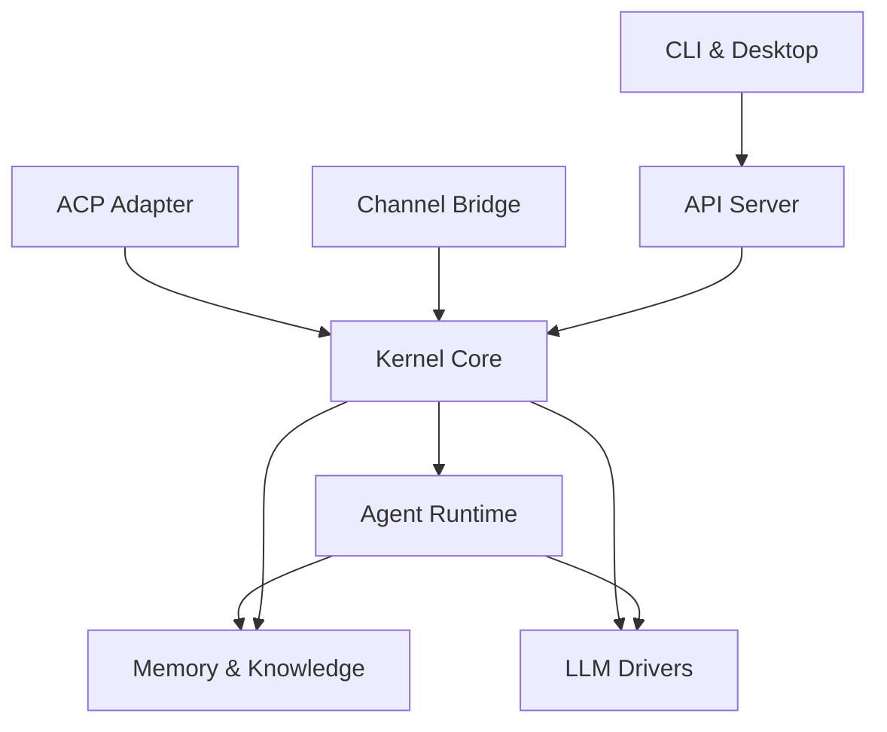

# crates — Wiki

# LibreFang Agent OS

LibreFang is an autonomous agent operating system — a platform for running, managing, and interacting with AI agents that can use tools, maintain persistent memory, communicate across platforms, and operate both interactively and in the background.

At its core is a long-lived agent kernel that persists agent identity across sessions, gates dangerous operations through approval flows, manages LLM provider failover, and routes messages between agents and the outside world through a variety of transports.

## Architecture

```mermaid
graph TD
    Clients["CLI & Desktop"]
    Editors["ACP Adapter"]
    Channels["Channel Bridge"]

    API["API Server"]

    Kernel["Kernel Core"]
    Runtime["Agent Runtime"]
    LLM["LLM Drivers"]
    Memory["Memory & Knowledge"]

    Clients --> API
    Editors --> Kernel
    Channels --> Kernel
    API --> Kernel
    Kernel --> Runtime
    Kernel --> LLM
    Runtime --> Memory
    Runtime --> LLM
    Kernel --> Memory
```

## How the pieces fit together

### Clients and transports

Users interact with LibreFang through several surfaces. The [CLI & Terminal UI](librefang-cli.md) is the primary entry point — it manages the daemon, provides an interactive chat interface, and ships a full Ratatui-based terminal dashboard. The [Desktop Application](librefang-desktop.md) wraps the same functionality in a Tauri 2.0 native app with system tray integration, auto-update, and support for connecting to remote instances. Editors like VS Code and Zed connect through the [ACP adapter](librefang-acp.md), which bridges the Agent Client Protocol (JSON-RPC 2.0) directly to the kernel so approval modals and file access live natively in the editor. For chat platforms, the [Channel Bridge & Messaging](librefang-channels.md) module normalizes inbound messages from Telegram, Discord, Slack, and others, routing them to the correct agent and dispatching responses back through the originating adapter.

### API layer

All of these clients converge on the [API Server](librefang-api.md), the transport boundary between the outside world and the kernel. It exposes HTTP/SSE endpoints, hosts the [Dashboard Frontend](librefang-dashboard.md) (a React SPA for monitoring and configuration), and delegates all agent logic to the kernel. The API server doesn't implement agent behavior itself — it translates between client protocols and the kernel's internal APIs.

### Kernel and runtime

The [Kernel Core](librefang-kernel-src.md) is the central orchestrator. It handles agent identity persistence across respawns, approval gating for dangerous tool operations, message routing, cost metering, and peer-to-peer networking via the [Wire Protocol & P2P](librefang-wire.md) layer (TCP, JSON-RPC framed, with HMAC + Ed25519 authentication). The kernel dispatches work to the [Agent Runtime](librefang-runtime-src.md), which manages the core agent loop, external tool connectivity through MCP, multi-modal media processing, audit logging, and sandboxed code execution.

### Supporting subsystems

Agents think and remember through the [LLM Drivers](librefang-llm-driver-src.md) layer, which abstracts multiple providers behind a uniform interface with automatic fallback chains, credential rotation, and retry logic. Persistent knowledge lives in [Memory & Knowledge](librefang-memory-src.md), providing two complementary paradigms: structured semantic search backed by SQLite + vectors, and a human-readable wiki vault for navigation and auditability.

Agents can be extended through the [Skills System](librefang-skills.md) — discovery, installation, and agent-driven mutation of skill packages from the ClawHub marketplace — and [Hands](librefang-hands.md), which are pre-built, domain-complete autonomous agent packages that run in the background. The [Extensions & Credentials](librefang-extensions.md) module manages OAuth2 flows, credential vaults, MCP server catalogs, and health monitoring.

Everything rests on [Shared Types](librefang-types.md) for common data structures and [Infrastructure Libraries](librefang-infra.md) for cross-cutting concerns like HTTP transport, telemetry, subprocess bridging, data migration, and test harnessing.

## Key end-to-end flows

**Starting a session**: A user runs `librefang start` from the CLI, which boots the kernel as a long-lived daemon. The kernel loads credentials via the extensions layer, initializes LLM driver pools, opens the API server, and begins accepting connections.

**Chatting with an agent**: A message arrives through a channel (e.g., Telegram), gets normalized by the Channel Bridge, and is routed to the kernel. The kernel resolves the target agent, the agent loop in the Runtime processes the message — calling LLM Drivers for completions, consulting Memory for context, compressing conversation history when token limits approach, and invoking tools as needed — then routes the response back through the originating channel.

**Running a background Hand**: A user activates a Hand. The kernel creates a managed instance, the Runtime executes it independently, and progress surfaces through the Dashboard or CLI. Hands can evolve their own skills and write findings to the knowledge wiki.

**Connecting from an editor**: An ACP-speaking editor discovers the kernel, authenticates via the handshake protocol, and streams prompts directly. Approval modals for dangerous operations appear in the editor's own UI — no separate dashboard required.