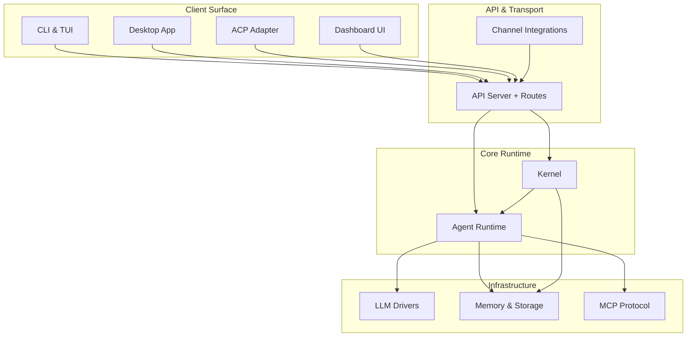

# crates — Wiki

# LibreFang Agent OS

LibreFang is an open-source agent operating system for running, orchestrating, and extending autonomous AI agents around the clock across messaging channels, editors, and native desktop apps. It provides a complete vertical stack — from LLM driver abstraction and persistent memory through to channel integrations (Telegram, Discord, Slack, WhatsApp), an ACP adapter for editor embedding, a browser dashboard, and a Tauri 2.0 desktop application.

## Architecture


```mermaid
graph TD
    subgraph "Client Surface"
        CLI["CLI & TUI"]
        DESK["Desktop App"]
        ACP["ACP Adapter"]
        DASH["Dashboard UI"]
    end

    subgraph "API & Transport"
        API["API Server + Routes"]
        CHAN["Channel Integrations"]
    end

    subgraph "Core Runtime"
        RT["Agent Runtime"]
        KERN["Kernel"]
    end

    subgraph "Infrastructure"
        LLM["LLM Drivers"]
        MEM["Memory & Storage"]
        MCP["MCP Protocol"]
    end

    CLI --> API
    DESK --> API
    ACP --> API
    DASH --> API
    CHAN --> API
    API --> RT
    API --> KERN
    RT --> LLM
    RT --> MEM
    RT --> MCP
    KERN --> MEM
    KERN --> RT
```

The system is organized into four concentric layers:

1. **Client Surface** — how users and tools reach LibreFang. The [CLI & TUI](librefang-cli-src.md) is the primary entry point for developers; the [Desktop Application](librefang-desktop-src.md) wraps the full stack in a native window with system tray integration and auto-updates; the [ACP Adapter](librefang-acp-src.md) lets editors like Zed, VS Code, and JetBrains embed agents via JSON-RPC over stdio; and the [Dashboard UI](librefang-dashboard-src.md) provides a browser-based management console backed by a typed [Dashboard Data Layer](librefang-dashboard-data-layer-src.md).

2. **API & Transport** — the [API Server](librefang-api-src.md) exposes the kernel over HTTP with authentication, streaming, approval workflows, and error sanitization. Its route handlers live in [API Routes](librefang-api-routes-src.md). [Channel Integrations](librefang-channels-src.md) normalize inbound messages from heterogeneous chat platforms into a unified `ChannelMessage` type, debounce rapid-fire input, and route responses back through the originating adapter.

3. **Core Runtime** — the [Agent Runtime](librefang-runtime-src.md) orchestrates every agent turn: prompt assembly, context loading, LLM completion, tool dispatch, and post-turn persistence. The [Kernel](librefang-kernel-src.md) provides the shared services every agent depends on — identity registration, approval management, cost enforcement, configuration, and routing.

4. **Infrastructure** — [LLM Drivers](librefang-llm-drivers-src.md) provide a trait-based abstraction over upstream providers with per-provider implementations, exhaustion tracking, and error classification. [Memory & Storage](librefang-memory-src.md) combines an SQLite-backed structured store (via `r2d2` pools in WAL mode) with vector search, knowledge graphs, session history, and proactive memory consolidation. [MCP Protocol](librefang-runtime-mcp-src.md) implements the Model Context Protocol client for discovering and dispatching external tools while enforcing security boundaries around credential exfiltration and network access.

## Key Supporting Modules

- [Hands Orchestration](librefang-hands-src.md) — pre-built, domain-complete autonomous agent packages from a marketplace that run in the background; users check in on them rather than driving them turn-by-turn.
- [Skills System](librefang-skills-src.md) — marketplace-driven skill discovery, installation, and iterative agent-driven refinement with version control.
- [Extensions & Vault](librefang-extensions-src.md) — lifecycle management for MCP server integrations, credential storage with vault key preseeding, and OAuth flows.
- [Wire Protocol & Networking](librefang-wire-src.md) — agent-to-agent TCP networking with Ed25519 authentication, ephemeral key exchange, and encrypted sessions.
- [Docker Sandbox](librefang-runtime-docker-src.md) — OS-level isolation for agent code execution with capability dropping, network isolation, read-only filesystems, and resource limits.
- [Media Processing](librefang-runtime-media-src.md) — provider-agnostic abstraction for image generation, TTS, transcription, and video analysis.
- [Runtime Audit](librefang-runtime-audit-src.md) — tamper-evident Merkle hash chain audit trail for security-critical actions, persisted to SQLite.
- [Telemetry & Observability](librefang-telemetry-src.md) — centralized metrics instrumentation emitting consistent, low-cardinality telemetry to a Prometheus exporter.
- [Shared Types](librefang-types-src.md) — pure data types at the bottom of the dependency graph, consumed by nearly every other crate.
- [HTTP Client](librefang-http-src.md) — centralized HTTP client construction with proxy support, TLS fallback to bundled CA roots, and consistent timeout configuration.
- [Data Import & Migration](librefang-import-src.md) — migrates agent configurations and memory from OpenClaw, OpenFang, and other frameworks into LibreFang's native format.
- [RL Data Export](librefang-rl-export-src.md) — exports long-horizon RL rollout trajectories to W&B, Tinker, or Atropos without inspecting the payload.
- [Testing Utilities](librefang-testing-src.md) — mock infrastructure for testing API routes, kernel operations, and LLM interactions without starting a full daemon or requiring network access.

## End-to-End Flows

### Chat message → agent response

A user sends a message on Telegram. [Channel Integrations](librefang-channels-src.md) normalizes it into a `ChannelMessage`, debounces rapid-fire messages from the same sender, and routes it through the [API Server](librefang-api-src.md) to the correct agent. The [Agent Runtime](librefang-runtime-src.md) loads context from [Memory & Storage](librefang-memory-src.md), dispatches tool calls via [MCP Protocol](librefang-runtime-mcp-src.md), calls an [LLM Driver](librefang-llm-drivers-src.md) for completion (streaming or non-streaming), persists the turn, and delivers the response back through the channel adapter.

### Editor session via ACP

An editor launches the [ACP Adapter](librefang-acp-src.md) as a subprocess. The adapter translates the Agent Client Protocol's JSON-RPC 2.0 frames into LibreFang API calls, letting the editor provide its own approval modals, file I/O, terminal hosting, and prompt streaming — the agent operates with native editor integration rather than through the dashboard.

### Provider health check → LLM call

When the API lists available LLM providers, the flow traverses [API Routes](librefang-api-routes-src.md) → provider health probing in the runtime → the [HTTP Client](librefang-http-src.md) with proxy resolution and TLS configuration → and ultimately an [LLM Driver](librefang-llm-drivers-src.md) completion request to the upstream provider.

### Skill evolution

An agent modifies a skill at runtime. The call flows from [Agent Runtime](librefang-runtime-src.md) through [API Routes](librefang-api-routes-src.md) into the [Skills System](librefang-skills-src.md), which acquires a file lock, writes updated TOML, and records version history. The skill is immediately available for subsequent turns.

## Getting Started

Clone the repository and build the workspace:

```bash
git clone https://github.com/librefang/crates.git
cd crates
cargo build
```

The fastest way to explore is through the [CLI & TUI](librefang-cli-src.md):

```bash
cargo run --bin librefang -- tui
```

This launches the interactive terminal dashboard. From there you can configure providers, create agents, and start chatting. The CLI also supports single-shot commands that boot a temporary in-process kernel, as well as daemon mode for 24×7 operation.

For editor integration, see the [ACP Adapter](librefang-acp-src.md) docs. For the native desktop experience, see [Desktop Application](librefang-desktop-src.md). To migrate from another agent framework, start with [Data Import & Migration](librefang-import-src.md).