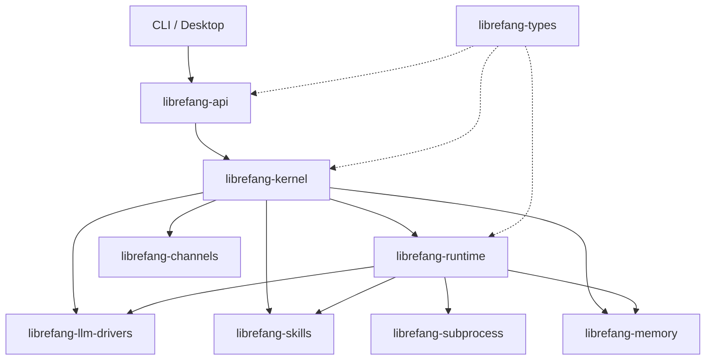

# librefang — Wiki

# LibreFang — Libre Agent Operating System

Welcome to the LibreFang codebase. LibreFang is an open-source **Agent Operating System** written in Rust — a self-hosted platform for building, running, and federating autonomous LLM-powered agents. It provides multi-provider LLM support, autonomous task scheduling, messaging-platform integration, skill evolution, and peer-to-peer federation, all behind a unified HTTP API.

The workspace contains 24 crates, 2,100+ tests, and zero clippy warnings.

---

## Architecture at a Glance

LibreFang is structured as a layered monorepo. At the bottom sits a shared type system; above that, a kernel orchestrates work across a runtime engine, persistent memory, LLM drivers, messaging channels, and user-defined skills. Clients (CLI, desktop app, external SDKs) talk to the system through an HTTP API surface.


```mermaid
graph TB
    CLI["CLI / Desktop"]
    API["librefang-api"]
    KERNEL["librefang-kernel"]
    RT["librefang-runtime"]
    TYPES["librefang-types"]
    MEM["librefang-memory"]
    LLM["librefang-llm-drivers"]
    CHAN["librefang-channels"]
    SKILLS["librefang-skills"]
    SUB["librefang-subprocess"]

    CLI --> API
    API --> KERNEL
    KERNEL --> RT
    KERNEL --> MEM
    KERNEL --> CHAN
    KERNEL --> SKILLS
    KERNEL --> LLM
    RT --> SUB
    RT --> MEM
    RT --> SKILLS
    RT --> LLM
    TYPES -.-> API
    TYPES -.-> KERNEL
    TYPES -.-> RT
```

Solid arrows show direct ownership and call paths. Dashed arrows from `librefang-types` indicate that nearly every crate depends on it for shared domain models — it is the lingua franca of the workspace.

---

## Core Subsystems

### Type Foundation

Everything in LibreFang speaks the same vocabulary. [`librefang-types`](librefang-types.md) defines the domain models, error types, and internationalization primitives (including the `resolve_language` / `t` translation pipeline) used across all other crates. With 600+ call sites from the kernel alone, this is the first crate a new contributor should read.

### API Surface

[`librefang-api`](librefang-api.md) is the HTTP front door. It exposes REST routes for agent lifecycle, skill management, channel configuration, MCP tool grants, and more. The API delegates business logic to the kernel and runtime, and depends on [`librefang-wire`](librefang-wire.md) for protocol-level serialization.

### Kernel — The Control Plane

[`librefang-kernel`](librefang-kernel.md) is the orchestration brain. It coordinates agent spawning, routes messages between channels and the runtime, manages MCP OAuth registration, and meters resource usage through [`librefang-kernel-metering`](librefang-kernel-metering.md). The kernel also owns the [`librefang-kernel-handle`](librefang-kernel-handle.md) abstraction that lets external processes interact with a running agent safely.

### Runtime — The Execution Engine

[`librefang-runtime`](librefang-runtime.md) is where agents actually *run*. It manages execution loops, invokes LLM drivers, executes skills, processes media, and communicates with sandboxed subprocesses. Specialized sub-crates handle specific runtime concerns:

- [`librefang-runtime-audit`](librefang-runtime-audit.md) — execution auditing and safety inspection
- [`librefang-runtime-media`](librefang-runtime-media.md) — media processing (image, audio)
- [`librefang-runtime-mcp`](librefang-runtime-mcp.md) — Model Context Protocol tool integration
- [`librefang-runtime-sandbox-docker`](librefang-runtime-sandbox-docker.md) — Docker-based code execution sandbox

### Memory

[`librefang-memory`](librefang-memory.md) provides persistent context storage and retrieval — the long-term memory that agents draw on across sessions. It is called heavily by both the kernel and the runtime.

### LLM Drivers

[`librefang-llm-drivers`](librefang-llm-drivers.md) is the multi-provider aggregation layer, built on the trait-based [`librefang-llm-driver`](librefang-llm-driver.md) abstraction. Swapping or adding an LLM provider is a matter of implementing the driver trait — no kernel or runtime changes required.

### Channels

[`librefang-channels`](librefang-channels.md) bridges external messaging platforms (WhatsApp, Telegram, Discord, etc.) to the agent runtime, so agents can converse with users on the platforms they already use.

### Skills

[`librefang-skills`](librefang-skills.md) is the skill system — composable, user-defined capabilities that agents can invoke. Skills can be prompt-only TOML manifests or compute-heavy WASM/Python modules. The skill evolution pipeline includes built-in prompt-injection scanning via threat-pattern verification before any update is committed.

### Subprocess Execution

[`librefang-subprocess`](librefang-subprocess.md) is the workhorse for spawning and managing child processes — used by the kernel, runtime, channels, and CLI for everything from sandboxed code execution to external tool invocation.

---

## Key End-to-End Flows

**Agent Spawn.** A request enters through `librefang-api` route handlers, which call into `librefang-kernel` to resolve the agent manifest. The kernel calls through to `librefang-types` for i18n language resolution (`resolve_language`), then hands the configured agent to `librefang-runtime` to begin its execution loop. Along the way, `librefang-memory` is consulted for prior context.

**MCP OAuth / TLS.** When an agent needs to connect to an MCP server, the API's `auth_start` handler delegates to the kernel's MCP OAuth provider (`register_client`), which builds an HTTP client through `librefang-http` — flowing through `oauth_client_builder` → `proxied_client_builder` → `build_http_client` → `tls_config`. The TLS configuration is the terminal step that produces a ready-to-use authenticated client.

**Skill Evolution & Security.** When a skill is updated or rolled back via the API, the request flows into `librefang-skills`' evolution module. Before any change is persisted, `validate_prompt_content` invokes `scan_prompt_content`, which builds and applies `ThreatPattern` definitions to catch prompt-injection attempts. This is a hard gate — no skill update bypasses it.

---

## Beyond the Crates

The repository also contains significant non-Rust infrastructure:

- **SDKs** — auto-generated client libraries in [Go](sdk-go.md), [JavaScript](sdk-javascript.md), and [Python](sdk-python.md), plus a hand-written [Rust SDK](sdk-rust.md) for sidecar channel adapters.
- **Deployment** — Docker compose, systemd units, [NixOS module](nix.md), [Fly.io](deploy-fly.md) and [GCP](deploy-gcp.md) configs, and [Arch Linux packaging](packaging.md).
- **Examples** — copy-and-modify templates for [custom agents, skills, and channel adapters](examples.md).
- **Documentation site** — the Next.js app powering [docs.librefang.io](docs.md).
- **[xtask](xtask.md)** — the workspace's single task runner (`cargo xtask <command>`), used for benchmarks, CI gates, release cutting, and changelog assembly.

---

## Getting Started

```bash
# Clone the repository
git clone https://github.com/nicksarafa/librefang.git
cd librefang

# Build the entire workspace
cargo build

# Run the test suite (2,100+ tests)
cargo test

# Launch the API server and dashboard
cargo xtask serve
```

The default configuration starts an HTTP API on `localhost:8080` with a web dashboard. To configure an LLM provider, set the appropriate environment variables (see the [API configuration docs](librefang-api.md)) or edit the config file generated on first run.

To create your first agent, copy a template from [`examples/custom-agent/`](examples.md) and register it through the API or CLI. The [examples module](examples.md) walks through all three extension surfaces — agents, skills, and channel adapters.

---

> **New here?** The best reading order is: [`librefang-types`](librefang-types.md) → [`librefang-kernel`](librefang-kernel.md) → [`librefang-runtime`](librefang-runtime.md) → [`librefang-api`](librefang-api.md). That path takes you from the shared vocabulary, through orchestration and execution, to the HTTP surface that ties everything together.