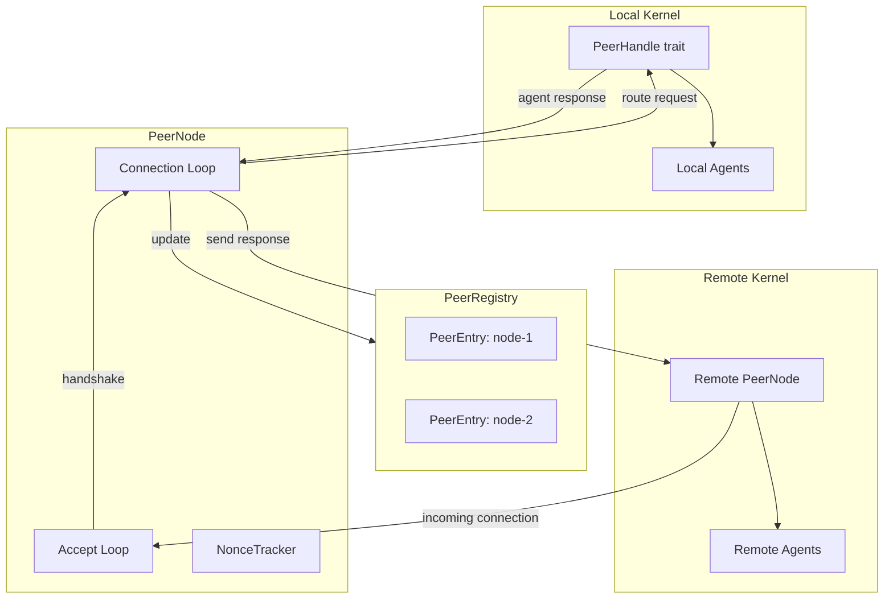
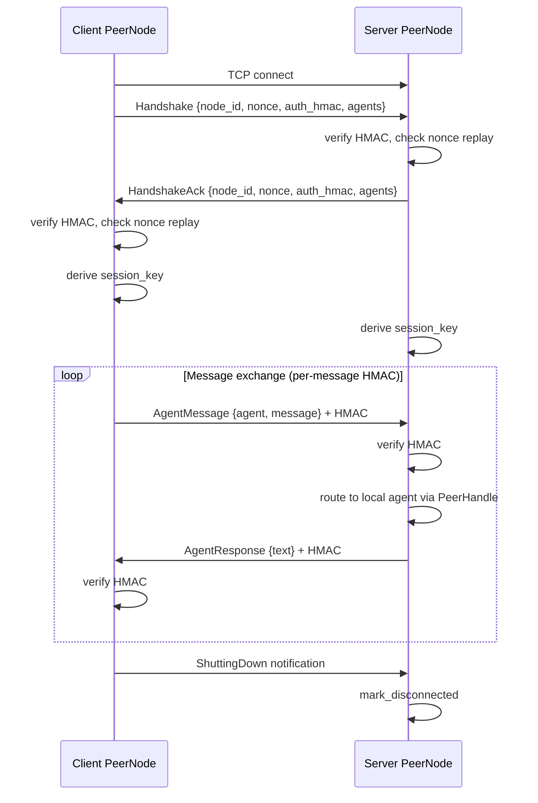

# P2P Networking

# P2P Networking (`librefang-wire`)

## Overview

The wire protocol module implements **OFP** (LibreFang Wire Protocol) — the networking layer that allows multiple LibreFang kernels to discover, authenticate, and communicate with each other over TCP. Each kernel exposes its local agents to remote peers and can route messages to agents on other machines.

All communication uses JSON-framed messages with a 4-byte big-endian length prefix, protected by HMAC-SHA256 authentication at both the handshake and per-message levels.

## Architecture



## Wire Protocol

### Framing

Every message on the wire uses the same frame format:

```
[4 bytes: big-endian length of JSON body][JSON body]
```

After the handshake completes, the frame format changes to include a per-message HMAC:

```
[4 bytes: big-endian length][JSON body][64 bytes: hex-encoded HMAC-SHA256]
```

The maximum message size is 16 MB (`MAX_MESSAGE_SIZE`).

### Encoding/Decoding

| Function | Purpose |
|----------|---------|
| `encode_message` | Serializes a `WireMessage` to length-prefixed JSON bytes |
| `decode_length` | Reads the 4-byte length header |
| `decode_message` | Parses JSON bytes into a `WireMessage` |
| `write_message` | Async write of a framed message to a TCP stream |
| `read_message` | Async read of a framed message from a TCP stream |
| `write_message_authenticated` | Writes a message with appended HMAC |
| `read_message_authenticated` | Reads and verifies an HMAC-authenticated message |

### Message Types

All messages are wrapped in a `WireMessage` envelope containing a unique `id` and a `WireMessageKind`:

**Requests** (`WireRequest` — expect a response):

| Variant | Method Tag | Purpose |
|---------|-----------|---------|
| `Handshake` | `"handshake"` | Exchange identity, agents, and HMAC authentication |
| `Discover` | `"discover"` | Search for agents matching a query on the remote peer |
| `AgentMessage` | `"agent_message"` | Send a message to a specific remote agent |
| `Ping` | `"ping"` | Liveness check |

**Responses** (`WireResponse`):

| Variant | Method Tag | Purpose |
|---------|-----------|---------|
| `HandshakeAck` | `"handshake_ack"` | Acknowledges handshake, includes own identity and HMAC |
| `DiscoverResult` | `"discover_result"` | Returns matching agents |
| `AgentResponse` | `"agent_response"` | Returns the agent's reply text |
| `Pong` | `"pong"` | Responds to ping with uptime |
| `Error` | `"error"` | Error with code and message |

**Notifications** (`WireNotification` — one-way, no response):

| Variant | Event Tag | Purpose |
|---------|----------|---------|
| `AgentSpawned` | `"agent_spawned"` | A new agent is available on the peer |
| `AgentTerminated` | `"agent_terminated"` | An agent was shut down |
| `ShuttingDown` | `"shutting_down"` | Peer is going offline |

The current protocol version is `PROTOCOL_VERSION = 1`.

## Authentication & Security

OFP enforces authentication at two levels: **handshake** and **per-message**.

### Handshake Authentication

Every connection must begin with a `Handshake` request. The handshake includes:

- A random UUID **nonce** (single-use)
- An **HMAC-SHA256** signature: `HMAC(shared_secret, nonce + node_id)`

The responder verifies the HMAC using constant-time comparison, checks the nonce against the `NonceTracker` to prevent replay attacks, and replies with a `HandshakeAck` containing its own nonce and HMAC.

**Any message sent before completing the handshake is rejected with error code 401** — this includes `Ping`, `Discover`, and `AgentMessage`.

### Nonce Replay Protection

`NonceTracker` prevents replay attacks using:

- A `DashMap` storing seen nonces with their insertion timestamps
- A 5-minute garbage-collection window (expired nonces are pruned on each insertion)
- Atomic `check_and_record` using `DashMap::entry` to avoid TOCTOU races — even under concurrent access, only one caller can claim a given nonce
- A hard cap of 100,000 entries to prevent unbounded memory growth under flooding attacks (rejects new nonces at capacity rather than growing indefinitely)

### Session Key Derivation

After the handshake, both peers derive a per-session key:

```
session_key = HMAC-SHA256(shared_secret, our_nonce + their_nonce)
```

The order of nonces matters — caller uses `(our_nonce, their_nonce)`, responder uses `(their_nonce, our_nonce)`. This ensures each connection gets a unique key even when the shared secret is the same.

### Per-Message HMAC

All post-handshake messages are signed with the session key. The HMAC is appended as 64 hex characters after the JSON body. On receive, the HMAC is verified before parsing — tampered or forged messages are rejected.

## Key Components

### `PeerNode`

The core networking actor. Created via `PeerNode::start`, which:

1. Binds a `TcpListener` to the configured address
2. Validates that `shared_secret` is non-empty (refuses to start without it)
3. Spawns an accept loop task
4. Returns `(Arc<PeerNode>, JoinHandle<()>)`

**Key methods:**

| Method | Description |
|--------|-------------|
| `start(config, registry, handle)` | Creates and starts the node listening for connections |
| `local_addr()` | Returns the actual bound address (useful when binding to port 0) |
| `node_id()` | Returns this node's unique ID |
| `registry()` | Access the `PeerRegistry` |
| `connect_to_peer(addr, handle)` | Initiates an outbound connection with full HMAC handshake |
| `send_to_peer(node_id, agent, message, sender, handle)` | Opens a new authenticated connection to a known peer, sends an agent message, and returns the response |

`send_to_peer` performs a full handshake on a fresh TCP connection for each call. This ensures authentication is never skipped.

### `PeerConfig`

| Field | Type | Default | Description |
|-------|------|---------|-------------|
| `listen_addr` | `SocketAddr` | `"127.0.0.1:0"` | Address to bind the listener |
| `node_id` | `String` | Random UUID | Unique node identifier |
| `node_name` | `String` | `"librefang-node"` | Human-readable name |
| `shared_secret` | `String` | `""` (must be set) | Pre-shared key for HMAC auth |

### `PeerHandle` Trait

The kernel implements this trait to wire the networking layer into the agent system:

```rust
#[async_trait]
pub trait PeerHandle: Send + Sync + 'static {
    fn local_agents(&self) -> Vec<RemoteAgentInfo>;
    async fn handle_agent_message(&self, agent: &str, message: &str, sender: Option<&str>) -> Result<String, String>;
    fn discover_agents(&self, query: &str) -> Vec<RemoteAgentInfo>;
    fn uptime_secs(&self) -> u64;
}
```

- `local_agents` — returns agents advertised during handshake and discovery
- `handle_agent_message` — routes an incoming remote message to a local agent and returns its response
- `discover_agents` — searches local agents by name, tags, or description
- `uptime_secs` — provides uptime for pong responses

### `PeerRegistry`

Thread-safe registry (internally `Arc<RwLock<HashMap<String, PeerEntry>>>`) tracking all known peers. Shared between the accept loop, connection loops, and the rest of the application.

**Peer lifecycle methods:**

| Method | Description |
|--------|-------------|
| `add_peer(entry)` | Register/update a peer after successful handshake |
| `remove_peer(node_id)` | Remove a peer entirely |
| `mark_disconnected(node_id)` | Mark as disconnected (kept for reconnect potential) |
| `mark_connected(node_id)` | Restore a disconnected peer |

**Agent tracking:**

| Method | Description |
|--------|-------------|
| `update_agents(node_id, agents)` | Replace the full agent list for a peer |
| `add_agent(node_id, agent)` | Add or update a single agent (by ID) |
| `remove_agent(node_id, agent_id)` | Remove a specific agent |

**Query methods:**

| Method | Description |
|--------|-------------|
| `get_peer(node_id)` | Snapshot of a specific peer |
| `connected_peers()` | All peers in `Connected` state |
| `all_peers()` | All peers regardless of state |
| `find_agents(query)` | Case-insensitive search across connected peers' agents (matches name, tags, description) |
| `all_remote_agents()` | Every agent on every connected peer |
| `connected_count()` / `total_count()` | Counts |

`find_agents` skips disconnected peers — only agents on actively connected peers appear in results.

### `PeerEntry`

Stores per-peer state:

| Field | Description |
|-------|-------------|
| `node_id` | Unique node identifier |
| `node_name` | Human-readable name |
| `address` | Socket address |
| `agents` | Advertised `Vec<RemoteAgentInfo>` |
| `state` | `PeerState::Connected` or `PeerState::Disconnected` |
| `connected_at` | Timestamp of first connection |
| `protocol_version` | Negotiated during handshake |

## Connection Lifecycle



### Outbound Connection (`connect_to_peer`)

1. Open TCP connection to the remote address
2. Generate a UUID nonce, compute `HMAC(shared_secret, nonce + node_id)`
3. Send `Handshake` request with identity, agents, nonce, and HMAC
4. Read `HandshakeAck`, verify protocol version, check nonce replay, verify HMAC
5. Derive session key, register peer in `PeerRegistry`
6. Spawn a background task running `connection_loop` for ongoing message dispatch
7. When the loop exits (connection closed or error), mark the peer as disconnected

### Inbound Connection (`handle_inbound`)

1. Read the first message — **must** be a `Handshake` request
2. Verify protocol version, check nonce replay, verify HMAC
3. Generate own nonce and HMAC, send `HandshakeAck`
4. Derive session key, register peer in `PeerRegistry`
5. Enter `connection_loop` for the authenticated session
6. Any non-handshake first message receives a 401 error and the connection is dropped

### Sending a One-Shot Message (`send_to_peer`)

For request-response patterns, `send_to_peer` handles the full lifecycle on a fresh connection:

1. Look up the peer's address from `PeerRegistry`
2. Connect, handshake, derive session key
3. Send the `AgentMessage` with per-message HMAC
4. Read and verify the response HMAC
5. Return the agent's response text or an error

### Broadcasting Notifications

`broadcast_notification` sends a one-way notification to all connected peers. Each recipient gets a fresh connection with a per-message key derived from the shared secret and a unique nonce. Returns a list of `(node_id, WireError)` tuples for any peers that failed to receive the notification.

## Error Handling

`WireError` covers all failure modes:

| Variant | When |
|---------|------|
| `Io` | TCP read/write failures |
| `Json` | Message serialization/deserialization errors |
| `HandshakeFailed` | HMAC verification failure, nonce replay, missing shared secret, unexpected message order |
| `ConnectionClosed` | Remote end disconnected (EOF) |
| `MessageTooLarge` | Message exceeds 16 MB limit |
| `VersionMismatch` | Protocol version disagreement between peers |

## Integration with the Kernel

The wire module connects to the rest of the application through two interfaces:

**Input (from the kernel):**
- The kernel creates a `PeerConfig` and calls `PeerNode::start`, passing a `PeerHandle` implementation
- `PeerHandle.handle_agent_message` is called when a remote peer sends a message to a local agent

**Output (from the wire module):**
- `PeerNode::registry()` exposes the `PeerRegistry`, which other parts of the system query for peer status and agent discovery
- Routes like `network_status` and `list_peers` read from `registry()` and `connected_count()`
- WebSocket handlers call `all_peers()` to report network state to the frontend

## Configuration

In `config.toml`, set the `[network]` section:

```toml
[network]
shared_secret = "your-secret-key-here"   # Required — node will refuse to start without it
listen_addr = "0.0.0.0:7070"             # Optional, defaults to 127.0.0.1:0
```