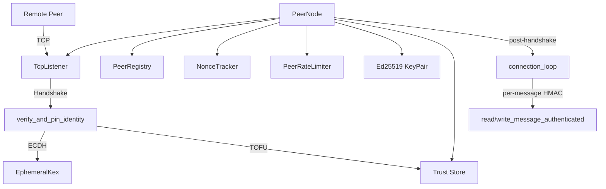

# P2P Networking

# P2P Networking (librefang-wire)

The LibreFang Wire Protocol (OFP) provides authenticated, integrity-protected peer-to-peer communication between LibreFang kernels over TCP. Each kernel runs a `PeerNode` that accepts inbound connections and initiates outbound connections to federation partners, exchanging agent information and routing messages to remote agents.

**Important:** OFP provides authentication, integrity, and replay protection but does **not** provide confidentiality. Wire-level encryption must come from the deployment layer (WireGuard, Tailscale, SSH tunnel, or service-mesh mTLS).

## Architecture



## Authentication Model

OFP uses two mandatory authentication layers that operate in sequence during every handshake:

### Layer 1 — Network Admission (HMAC-SHA256)

A pre-shared `shared_secret` gates network access. The handshake carries:

```
auth_data = "{nonce}|{sender_node_id}|{recipient_node_id}"
auth_hmac = HMAC-SHA256(shared_secret, auth_data)
```

Binding the HMAC to both sender and recipient node IDs prevents a captured handshake from being replayed against a different federation peer that shares the same `shared_secret` (#3875). HMAC verification happens **before** the nonce is recorded (#3880), so an attacker who doesn't know the secret cannot fill nonce capacity.

### Layer 2 — Per-Peer Identity (Ed25519)

Every node persists an Ed25519 keypair in `<data_dir>/peer_keypair.json` via `PeerKeyManager`. During the handshake, each side optionally sends:

- `public_key` — base64-encoded Ed25519 verifying key
- `identity_signature` — Ed25519 signature over the same `auth_data` bytes the HMAC covers (plus the ephemeral pubkey if present)

The recipient verifies the signature and enforces **Trust-On-First-Use (TOFU) pinning**: the first time a `node_id` is seen, its public key is pinned. Subsequent handshakes from the same `node_id` must present the identical public key or are rejected. Pins persist across restarts in `<data_dir>/trusted_peers.json`.

Net effect: a leaked `shared_secret` no longer lets an attacker impersonate a previously-pinned peer — they would also need that node's private key.

## Forward Secrecy (Ephemeral X25519 Key Exchange)

Each handshake optionally generates a fresh X25519 keypair via `EphemeralKex::generate()`. Both peers exchange their ephemeral public keys (covered by the Ed25519 identity signature, so an active MITM cannot substitute them), then derive a shared secret via ECDH. The static `shared_secret` never enters the derivation.

```
session_key = HKDF-SHA256(
    salt  = handshake_transcript(client_nonce, server_nonce),
    IKM   = X25519(ephemeral_local_secret, ephemeral_remote_public),
    info  = "librefang-ofp/v1/session-key"
)
```

The `EphemeralKex` struct is consumed and dropped after derivation — `StaticSecret` zeroizes on drop, so past session keys cannot be reconstructed from a future key leak.

When either side omits the ephemeral pubkey, the kernel falls back to the legacy derivation: `HMAC-SHA256(shared_secret, our_nonce || their_nonce)`. This maintains backward compatibility during a rolling upgrade.

### handshake_transcript

```rust
pub fn handshake_transcript(client_nonce: &str, server_nonce: &str) -> Vec<u8>
```

Produces `client_nonce|server_nonce` (client first, server second, regardless of caller). Both sides must produce the same byte string for the session key to agree. Different transcripts yield different keys even when the same ephemeral pair is reused.

## Key Components

### PeerNode

The central networking entity. Created via `PeerNode::start` (HMAC-only) or `PeerNode::start_with_identity` (Ed25519 + optional trust store directory).

```rust
let (node, task_handle) = PeerNode::start_with_identity(
    config,
    registry,
    handle,
    Some(keypair),
    Some(data_dir.into()),
).await?;
```

Key responsibilities:
- **Accept loop** — spawns a task per inbound TCP connection
- **Handshake** — HMAC verification, Ed25519 identity verification + TOFU pinning, ephemeral KEX, nonce replay check
- **Session key derivation** — ECDH-derived when both peers support it, legacy HMAC-derived otherwise
- **Connection loop** — per-message HMAC-authenticated read/write dispatch
- **Rate limiting** — per-peer message and token budgets

### PeerConfig

| Field | Purpose | Default |
|-------|---------|---------|
| `listen_addr` | TCP bind address | `127.0.0.1:0` |
| `node_id` | Unique node identifier | Random UUID |
| `node_name` | Human-readable name | `"librefang-node"` |
| `shared_secret` | **Required.** HMAC pre-shared key | — |
| `max_messages_per_peer_per_minute` | Rate limit (0 = unlimited) | 60 |
| `max_llm_tokens_per_peer_per_hour` | Optional token budget | `None` |

### PeerHandle Trait

The kernel implements this trait to handle incoming remote requests:

```rust
#[async_trait]
pub trait PeerHandle: Send + Sync + 'static {
    fn local_agents(&self) -> Vec<RemoteAgentInfo>;
    async fn handle_agent_message(&self, agent: &str, message: &str, sender: Option<&str>) -> Result<String, String>;
    fn discover_agents(&self, query: &str) -> Vec<RemoteAgentInfo>;
    fn uptime_secs(&self) -> u64;
}
```

### WireMessage Protocol

All communication uses length-prefixed JSON frames: `[4-byte BE length][JSON body]`. After handshake, frames include a trailing HMAC: `[4-byte BE length][JSON body][64-char hex HMAC]`.

**Envelope:**

```rust
pub struct WireMessage {
    pub id: String,
    pub kind: WireMessageKind,  // Request | Response | Notification | Unknown
}
```

**Handshake fields relevant to security:**

| Field | Layer | Notes |
|-------|-------|-------|
| `nonce` | HMAC | UUID, replay-protected |
| `auth_hmac` | HMAC | `HMAC-SHA256(shared_secret, nonce\|sender\|recipient)` |
| `public_key` | Ed25519 | Optional, base64 |
| `identity_signature` | Ed25519 | Optional, covers `auth_data[\|ephemeral_pubkey]` |
| `ephemeral_pubkey` | X25519 KEX | Optional, base64 X25519 public key |

**Forward compatibility:** Unknown `type`, `method`, or `event` values decode as `Unknown` variants (#3544). The TCP link stays alive; older peers ignore messages from newer protocol versions.

### Ed25519KeyPair and PeerKeyManager

`Ed25519KeyPair` wraps an Ed25519 signing key. `PeerKeyManager` handles persistence:

```rust
let mut mgr = PeerKeyManager::new(data_dir);
let keypair = mgr.load_or_generate()?;  // Load or create + persist
let node_id = mgr.node_id().unwrap();   // Stable UUID
```

Key file format (`peer_keypair.json`):

```json
{
  "public_key": "<base64>",
  "private_key": "<base64>",
  "node_id": "<uuid>"
}
```

On load, `PeerKeyManager` re-derives the public key from the private seed and cross-checks it against the file. Mismatches are rejected. PR-1 era files missing `node_id` are automatically migrated.

### EphemeralKex

```rust
let kex = EphemeralKex::generate()?;
let public_for_wire = kex.public_b64();  // base64 X25519 public key
let session_key = kex.derive_session_key(remote_pubkey_b64, &transcript)?;
```

`derive_session_key` consumes `self`, ensuring the ephemeral private key is dropped. It rejects the all-zero shared point (low-order public key attack) and uses HKDF-SHA256 with the handshake transcript as salt.

### NonceTracker

Prevents replay attacks with a time-bounded set of seen nonces:

- **Window:** 5 minutes
- **Capacity:** 100,000 entries (hard cap, fails closed)
- **GC:** Amortized — expired nonces are swept only when the map reaches 80% capacity, preventing unauthenticated attackers from forcing O(n) sweeps on every connection attempt
- **TOCTOU-safe:** Uses `DashMap::entry` for atomic check-and-insert

### PeerRateLimiter

Two independent per-peer limits:

1. **Message rate:** `max_messages_per_peer_per_minute` — excess `AgentMessage` requests return HTTP 429 before reaching the LLM
2. **Token budget:** `max_llm_tokens_per_peer_per_hour` — cumulative cap checked after each LLM turn

### PeerRegistry

Thread-safe (`Arc<RwLock>`) store of known peers and their agents. Supports:
- `add_peer` / `get_peer` / `mark_disconnected`
- `find_agents` — searches across all connected peers by name, tag, or description
- `add_agent` / `remove_agent` — updated by `AgentSpawned`/`AgentTerminated` notifications

### TrustedPeers

Persistent backing store for TOFU pins. Loaded at startup via `start_with_identity` with a `trust_store_dir` argument. New pins are written to disk after in-memory insertion; persistence failure is logged but does not roll back the in-memory pin.

## Security Properties Summary

| Threat | Mitigation | Issue |
|--------|-----------|-------|
| Shared secret leak → node impersonation | Ed25519 identity + TOFU pinning | #3873 |
| Shared secret leak → in-flight HMAC forgery | Ephemeral X25519 session key derivation | #4269 |
| Future key compromise → past traffic decryption | Ephemeral keys zeroized after handshake | #4269 |
| Cross-node replay of handshake packets | HMAC bound to `(sender, recipient)` node IDs | #3875 |
| Nonce replay within window | `NonceTracker` with atomic check-and-record | #3880 |
| Unauthenticated nonce-fill DoS | HMAC verified before nonce recording | #3880 |
| Peer LLM budget drain | `PeerRateLimiter` (message rate + token budget) | #3876 |
| Oversized payload from federated peer | `MAX_PEER_MESSAGE_BYTES` (64 KiB) | #3876 |
| Downgrade to HMAC-only after pin | Reject `node_id` with prior pin that omits identity | #3873 |
| TOFU pin map exhaustion | Hard cap at 100,000 entries | #3873 |
| Low-order X25519 pubkey attack | Reject all-zero shared secret | #4269 |
| MITM substitution of ephemeral pubkey | Ephemeral bound to Ed25519 signature scope | #4269 |

## Connection Lifecycle

1. **TCP connect** — client opens socket to server
2. **Client handshake** — sends `WireRequest::Handshake` with HMAC nonce, Ed25519 pubkey + signature, X25519 ephemeral pubkey
3. **Server verifies HMAC** — rejects if invalid (no nonce recorded yet)
4. **Server verifies Ed25519 identity** — signature check + TOFU pin compare
5. **Server records nonce** — only after both verifications pass
6. **Server handshake ack** — sends `WireResponse::HandshakeAck` with its own HMAC, identity, and ephemeral
7. **Both sides derive session key** — ECDH if both peers sent ephemeral pubkeys, legacy HMAC otherwise
8. **Connection loop** — per-message HMAC-authenticated frame exchange
9. **Disconnect** — registry marks peer disconnected; `ShuttingDown` notification sent on graceful shutdown

## Outbound Operations

### connect_to_peer / connect_to_peer_with_id

```rust
node.connect_to_peer_with_id(addr, handle, "recipient-node-id").await?;
```

Performs a full handshake and spawns a long-lived `connection_loop` task. Use `connect_to_peer_with_id` with the known remote node ID to bind the HMAC to that specific recipient (#3875).

### send_to_peer

```rust
let response = node.send_to_peer("remote-node-id", "agent-name", "message", Some("sender"), handle).await?;
```

Opens a new connection, performs handshake, sends a single `AgentMessage`, reads the response, and closes. Suitable for one-shot RPC-style calls.

### broadcast_notification

```rust
let errors = broadcast_notification(&registry, WireNotification::AgentSpawned { agent }, &shared_secret).await;
```

Delivers a notification to all currently connected peers. Returns a list of `(node_id, error)` for any that failed.

## Configuration Checklist

1. Set `shared_secret` in `[network]` section of `config.toml` — OFP refuses to start without it
2. Ensure `<data_dir>/peer_keypair.json` is readable only by the daemon user (permissions are set to 0600 on Unix automatically)
3. Pass `trust_store_dir` to `start_with_identity` for persistent TOFU pins across restarts
4. Tune `max_messages_per_peer_per_minute` and `max_llm_tokens_per_peer_per_hour` based on your federation's LLM budget
5. Verify the identity fingerprint via `GET /api/network/status` and compare out-of-band with your federation partner before trusting a new peer