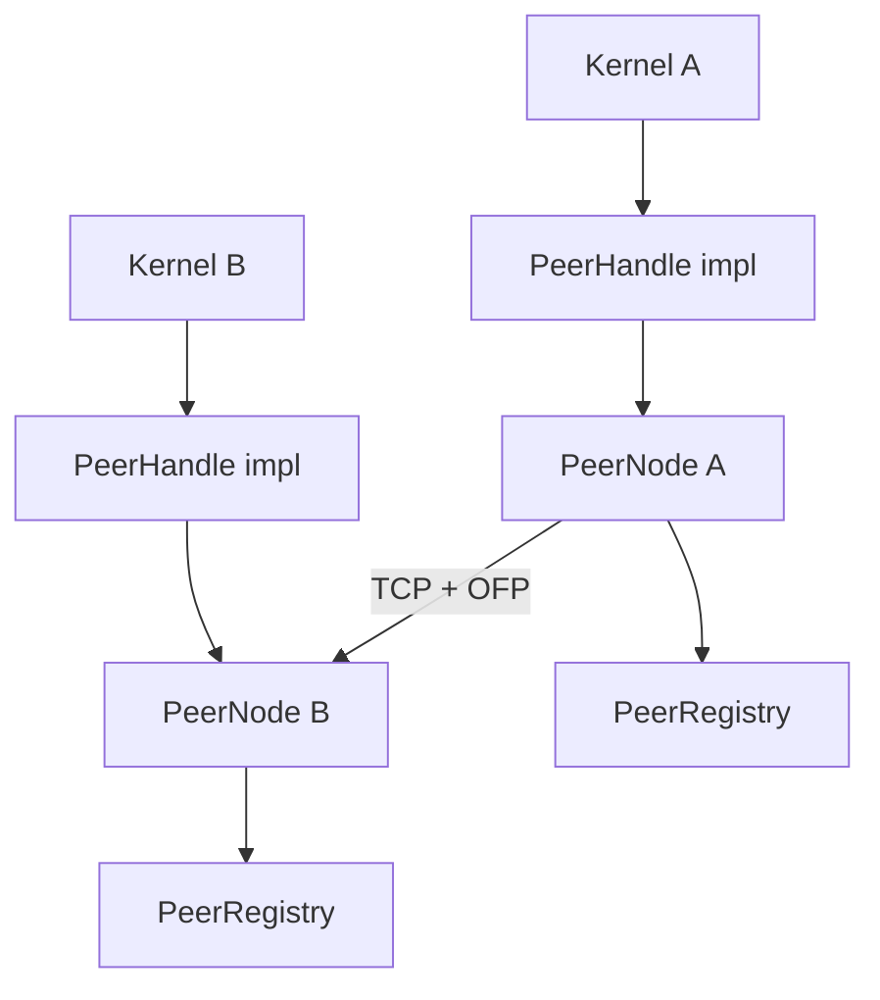
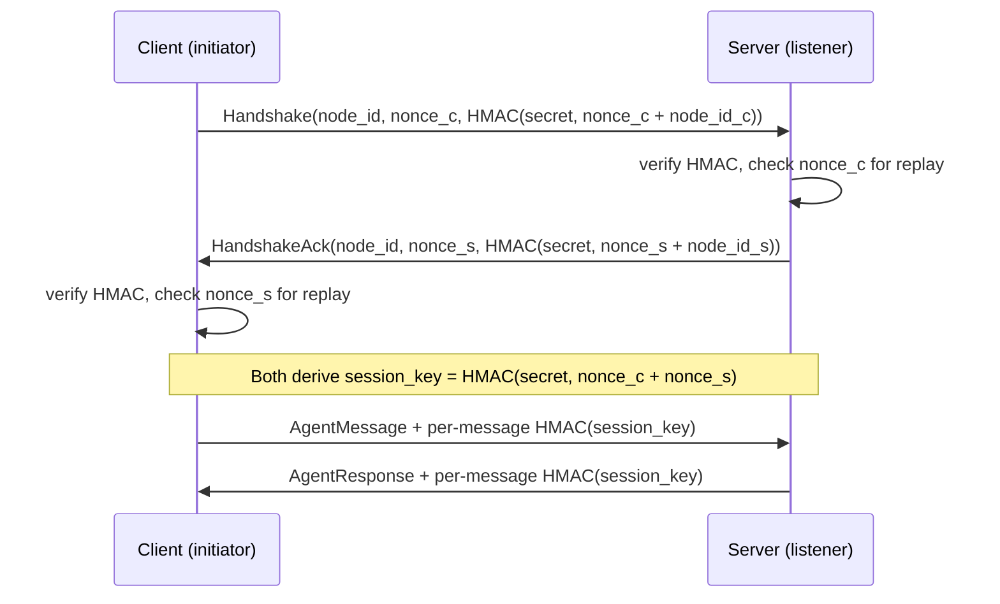

# P2P Networking

# P2P Networking (`librefang-wire`)

The LibreFang Wire Protocol (OFP) module provides cross-machine agent discovery, authentication, and communication over TCP. It enables separate LibreFang kernels to find each other's agents, exchange messages, and coordinate work across the network.

## Architecture Overview



Each kernel runs a `PeerNode` that listens for inbound connections and can connect outward to other peers. The kernel implements the `PeerHandle` trait so the networking layer can route incoming agent messages to local agents. Each `PeerNode` maintains a `PeerRegistry` tracking all known remote peers and their advertised agents.

## Wire Protocol

All communication uses JSON-framed messages over TCP. Every frame is a 4-byte big-endian length prefix followed by a JSON body. After the initial handshake, frames also include a trailing 64-character hex HMAC-SHA256 signature.

**Unauthenticated frame:** `[4-byte length][JSON body]`

**Authenticated frame:** `[4-byte length][JSON body][64-byte hex HMAC]`

The maximum message size is 16 MB (`MAX_MESSAGE_SIZE`).

### Message Envelope

Every message is a `WireMessage` containing a unique `id` and a `kind` discriminated by a `"type"` tag:

```rust
pub struct WireMessage {
    pub id: String,
    pub kind: WireMessageKind, // Request | Response | Notification
}
```

### Request Types

| Method | Tag | Purpose |
|--------|-----|---------|
| `Handshake` | `"handshake"` | Exchange identity, agents, and HMAC authentication |
| `Discover` | `"discover"` | Query agents on a remote peer by name/tag/description |
| `AgentMessage` | `"agent_message"` | Send a message to a specific remote agent |
| `Ping` | `"ping"` | Liveness check |

### Response Types

| Method | Tag | Purpose |
|--------|-----|---------|
| `HandshakeAck` | `"handshake_ack"` | Acknowledge handshake with identity + HMAC |
| `DiscoverResult` | `"discover_result"` | Return matching agents |
| `AgentResponse` | `"agent_response"` | Return agent's reply text |
| `Pong` | `"pong"` | Acknowledge ping with uptime |
| `Error` | `"error"` | Error with numeric code and message |

### Notification Types

Notifications are one-way and elicit no response:

| Event | Tag | Purpose |
|-------|-----|---------|
| `AgentSpawned` | `"agent_spawned"` | A new agent is available on the peer |
| `AgentTerminated` | `"agent_terminated"` | An agent was shut down |
| `ShuttingDown` | `"shutting_down"` | Peer is going offline |

## Authentication and Security

The wire protocol mandates HMAC-SHA256 authentication. A `PeerNode` will not start if `shared_secret` is empty, and all incoming connections that skip the handshake are rejected with a `401` error.

### Handshake Flow



Each side generates a random nonce, computes `HMAC-SHA256(shared_secret, nonce + node_id)`, and sends it in the handshake. The receiver verifies the HMAC and checks the nonce against a replay tracker. After mutual authentication, both sides derive a session key via `derive_session_key(shared_secret, our_nonce, their_nonce)`. All subsequent messages on that connection carry a per-message HMAC computed over the JSON body using the session key.

### Replay Protection

`NonceTracker` stores seen nonces in a `DashMap` with their insertion timestamps. Nonces older than 5 minutes are garbage-collected on each insertion. The tracker has a hard cap of 100,000 entries — under a flooding attack, new nonces are rejected rather than allowing unbounded memory growth. The `check_and_record` method uses `DashMap::entry` to atomically check and insert in a single call, preventing a TOCTOU race where two concurrent handshakes with the same replayed nonce could both pass.

### Session Key Derivation

```rust
pub fn derive_session_key(shared_secret: &str, our_nonce: &str, their_nonce: &str) -> String
```

Computes `HMAC-SHA256(shared_secret, our_nonce + their_nonce)`. The nonce order differs between client and server, so each side must pass its own nonce first. This guarantees unique keys per connection even when the same shared secret is used across many connections.

### Per-Message HMAC

After handshake, `write_message_authenticated` and `read_message_authenticated` append and verify a 64-character hex HMAC on every frame. The HMAC covers the JSON body only (not the length prefix). Verification uses constant-time comparison via `subtle::ConstantTimeEq` to prevent timing attacks.

## Key Components

### `PeerNode`

The main networking actor. Created via `PeerNode::start`, which binds a TCP listener and spawns an accept loop. Each `PeerNode` owns:

- A `PeerConfig` with identity and shared secret
- A `PeerRegistry` for tracking remote peers
- A `NonceTracker` for replay defense
- The bound `local_addr` (useful when binding to port `0`)

**Inbound connections:** The accept loop spawns a task per connection. Each task calls `handle_inbound`, which enforces the handshake requirement — any message other than `Handshake` as the first frame receives a `401` error and the connection is dropped.

**Outbound connections:** `connect_to_peer` dials a remote address, performs the full handshake, and spawns a `connection_loop` task for ongoing message dispatch. `send_to_peer` opens a fresh connection, handshakes, sends a single `AgentMessage`, reads the response, and closes — it does not reuse connections.

### `PeerHandle` Trait

The kernel implements this trait to allow the networking layer to interact with local agents:

```rust
#[async_trait]
pub trait PeerHandle: Send + Sync + 'static {
    fn local_agents(&self) -> Vec<RemoteAgentInfo>;
    async fn handle_agent_message(&self, agent: &str, message: &str, sender: Option<&str>) -> Result<String, String>;
    fn discover_agents(&self, query: &str) -> Vec<RemoteAgentInfo>;
    fn uptime_secs(&self) -> u64;
}
```

The trait is queried during handshake (to advertise local agents), when processing `Discover` requests, and when routing `AgentMessage` requests to local agents.

### `PeerRegistry`

A thread-safe store (`Arc<RwLock<HashMap<String, PeerEntry>>>`) tracking all known peers. Each `PeerEntry` records the peer's node ID, name, address, advertised agents, connection state, connection timestamp, and protocol version.

Key operations:

- **`add_peer` / `remove_peer`** — register or remove a peer entirely
- **`mark_disconnected` / `mark_connected`** — toggle state without removing the entry (supports reconnection scenarios)
- **`add_agent` / `remove_agent`** — update a peer's agent list in response to `AgentSpawned` / `AgentTerminated` notifications
- **`find_agents(query)`** — search across all connected peers' agents by name, tags, or description (case-insensitive). Returns `Vec<RemoteAgent>` which pairs each agent info with its owning peer's node ID.
- **`connected_peers` / `all_peers`** — list peers filtered by state

### Connection Lifecycle

The `connection_loop` function runs after a successful handshake. It reads messages in a loop and dispatches based on kind:

- **Requests** (`Ping`, `Discover`, `AgentMessage`) → routed to `PeerHandle`, response written back
- **Notifications** (`AgentSpawned`, `AgentTerminated`, `ShuttingDown`) → applied to the local `PeerRegistry`
- **Responses** → logged as unexpected (the connection loop never sends requests that would produce responses)

When the loop exits (connection closed or error), the peer is marked `Disconnected` in the registry.

### Broadcast

`broadcast_notification` sends a one-way notification to all connected peers. It opens a separate TCP connection per peer, derives a fresh per-message key, and writes a single authenticated frame. Errors are collected and returned rather than propagated — the caller can decide how to handle partial failures.

## Encoding Helpers

Defined in `message.rs`:

- **`encode_message(msg)`** — serializes a `WireMessage` to a `Vec<u8>` with the 4-byte length prefix
- **`decode_length(header)`** — reads the big-endian length from a 4-byte header
- **`decode_message(body)`** — parses JSON bytes into a `WireMessage`

## Configuration

```rust
pub struct PeerConfig {
    pub listen_addr: SocketAddr,   // e.g. "0.0.0.0:7000" or "127.0.0.1:0" for ephemeral
    pub node_id: String,           // unique UUID
    pub node_name: String,         // human-readable
    pub shared_secret: String,     // required — must match across all peers
}
```

The shared secret must be identical on all peers that should communicate. Set it via `[network] shared_secret` in `config.toml`. An empty secret causes `PeerNode::start` to return an error immediately.

## Error Handling

`WireError` covers all failure modes:

| Variant | Meaning |
|---------|---------|
| `Io` | TCP read/write failure |
| `Json` | Malformed message body |
| `HandshakeFailed` | HMAC mismatch, replay, or unexpected message during handshake |
| `ConnectionClosed` | Remote end disconnected cleanly |
| `MessageTooLarge` | Frame exceeds 16 MB limit |
| `VersionMismatch` | Incompatible protocol versions |

The current protocol version is `PROTOCOL_VERSION = 1`. A version mismatch during handshake returns a `VersionMismatch` error locally and sends an `Error` response to the remote peer before closing.

## Integration Points

The rest of the codebase interacts with this module through:

- **`PeerHandle` implementation** — the kernel provides its agent routing logic
- **`PeerRegistry` queries** — the web UI and API routes call `all_peers`, `connected_count`, `find_agents` to display network status
- **`local_addr()`** — used by test infrastructure and the desktop/server startup to discover the bound port when using ephemeral addressing
- **`broadcast_notification`** — called when local agents are spawned or terminated to notify all connected peers