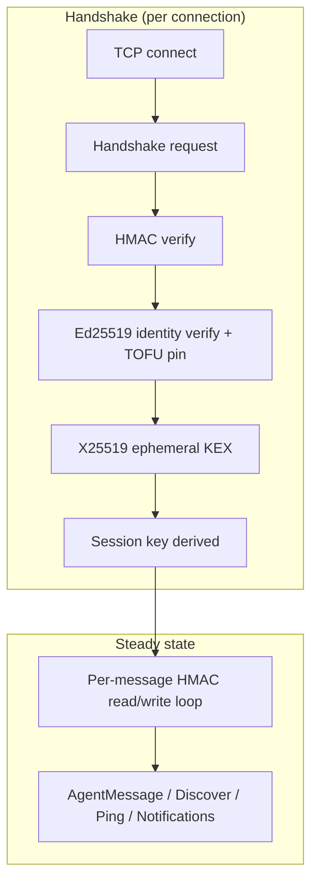
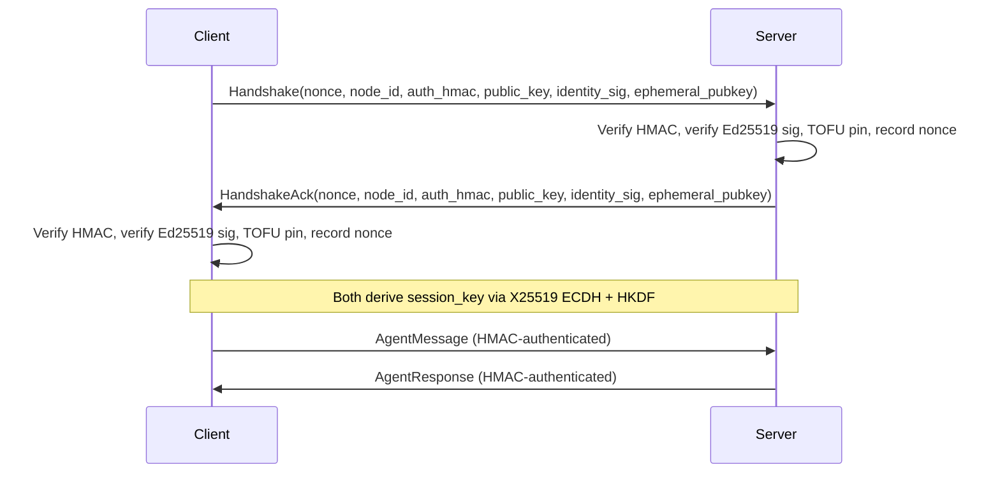

# P2P Wire Protocol

# P2P Wire Protocol (OFP)

Agent-to-agent networking over TCP for LibreFang federation. Provides cross-machine peer discovery, multi-layer authentication, and message routing between kernel instances.

## Architecture Overview



The crate is organized into five modules:

| Module | Purpose |
|---|---|
| `message` | Wire format types and framing (`WireMessage`, `WireRequest`, `WireResponse`, `WireNotification`) |
| `peer` | TCP listener, connection handling, handshake logic, rate limiting (`PeerNode`, `PeerConfig`) |
| `keys` | Ed25519 identity keypairs, signing, verification, on-disk persistence (`Ed25519KeyPair`, `PeerKeyManager`) |
| `kex` | Ephemeral X25519 key exchange for forward-secret session keys (`EphemeralKex`) |
| `registry` | In-memory peer/agent directory (`PeerRegistry`) |
| `trusted_peers` | Persistent TOFU pin storage across restarts |

## Wire Framing

Every message on the wire uses a length-prefixed JSON frame:

**Unauthenticated** (handshake phase only):
```
[4-byte BE length][JSON body]
```

**Authenticated** (post-handshake):
```
[4-byte BE length][JSON body][64-char hex HMAC-SHA256]
```

The HMAC covers the JSON body using the session key. Constants: `MAX_MESSAGE_SIZE` = 16 MiB, `MAX_PEER_MESSAGE_BYTES` = 64 KiB (applied to `AgentMessage` payloads specifically to protect the receiver's LLM budget).

Encoding/decoding is handled by `encode_message`, `decode_length`, `decode_message` in `message.rs`, plus `write_message_authenticated` / `read_message_authenticated` in `peer.rs`.

## Authentication Layers

Three independent layers compose during the handshake. All three must pass for a connection to succeed.

### Layer 1: Network Admission (HMAC-SHA256)

Coarse "do you know the cluster password" gate. Both sides compute:

```
auth_data = "{nonce}|{sender_node_id}|{recipient_node_id}"
auth_hmac = HMAC-SHA256(shared_secret, auth_data)
```

The `recipient_node_id` binding (#3875) prevents a captured handshake from being replayed against a *different* federation peer that shares the same `shared_secret`. Verification uses constant-time comparison via `subtle::ConstantTimeEq`.

The nonce is recorded in `NonceTracker` **after** HMAC verification succeeds (#3880), preventing unauthenticated clients from filling the tracker. The tracker uses a 5-minute window with amortized GC (only sweeps at 80% of the 100k entry cap).

### Layer 2: Per-Peer Identity (Ed25519 + TOFU)

Each node persists an Ed25519 keypair at `<data_dir>/peer_keypair.json` via `PeerKeyManager`. During the handshake:

1. The sender includes `public_key` (base64) and `identity_signature` (base64 Ed25519 signature) in the `Handshake`/`HandshakeAck` message.
2. The signature covers `identity_signing_scope(auth_data, ephemeral_pubkey)` — the same auth-data bytes the HMAC covers, plus the X25519 ephemeral pubkey if present (#4269). This binds the static identity to the ephemeral KEX.
3. The recipient verifies the signature and applies **TOFU** (Trust On First Use): on first contact the pubkey is pinned to the sender's `node_id`. Subsequent handshakes from the same `node_id` must present the identical pubkey or are rejected.

Key behaviors:
- **Downgrade rejection**: if a `node_id` was previously seen *with* an Ed25519 identity, a later handshake that omits it is rejected as a potential downgrade attack.
- **Persistence**: pins are hydrated from `TrustedPeers` at startup and written to disk on every new pin. A corrupt trust file prevents startup (fail-closed).
- **Cap**: in-memory pin map bounded at `MAX_PIN_ENTRIES` (100k) to prevent memory exhaustion from a malicious peer.

The fingerprint (`SHA-256(base64_pubkey)`, hex-encoded) is exposed via `GET /api/network/status` for out-of-band verification between operators.

### Layer 3: Forward-Secret Session Keys (X25519 + HKDF)

Ephemeral key exchange (#4269) decouples the per-message HMAC key from `shared_secret`:

1. Each side generates a fresh `EphemeralKex` (X25519 keypair) per handshake.
2. Public halves are exchanged in `ephemeral_pubkey` (covered by the Ed25519 signature from Layer 2, preventing MITM substitution).
3. Both sides perform X25519 ECDH → HKDF-SHA256 with:
   - **Salt**: `handshake_transcript(client_nonce, server_nonce)` — nonces concatenated in a fixed order (client first) so both sides agree regardless of who initiated.
   - **Info**: `b"librefang-ofp/v1/session-key"` — bump this for breaking changes.
4. The ephemeral private key is dropped after derivation (`StaticSecret` zeroizes on drop), providing forward secrecy.

**Fallback**: if either peer omits `ephemeral_pubkey`, the system falls back to `derive_session_key(shared_secret, our_nonce, their_nonce)` — the legacy path — so peers at different protocol versions interoperate.

All-zero shared-secret check is explicit in `EphemeralKex::derive_session_key` to reject low-order public key contributions.

## Handshake Flow



### Server-side (inbound)

`PeerNode::handle_inbound` processes a `TcpStream`:

1. Read one `WireMessage` (unauthenticated frame).
2. Reject any message that isn't `WireRequest::Handshake` with error 401.
3. Verify HMAC, verify Ed25519 identity + TOFU pin, record nonce.
4. Generate server-side `EphemeralKex` (only if client sent one).
5. Send `HandshakeAck`.
6. Derive session key (ECDH if both sides have ephemerals, legacy otherwise).
7. Enter `connection_loop` with per-message HMAC.

### Client-side (outbound)

`PeerNode::connect_to_peer_with_id` drives the outbound handshake:

1. Generate nonce, compute auth_data with recipient binding, generate `EphemeralKex`.
2. Sign identity scope (auth_data + ephemeral).
3. Send `Handshake`, read `HandshakeAck`.
4. Verify HMAC, verify identity, record nonce, derive session key.
5. Spawn a Tokio task running `connection_loop`.

## Post-Handshake Message Loop

`connection_loop` reads authenticated frames and dispatches:

| Message | Handling |
|---|---|
| `WireRequest::Ping` | Respond with `Pong { uptime_secs }` |
| `WireRequest::Discover { query }` | Call `PeerHandle::discover_agents`, return results |
| `WireRequest::AgentMessage` | Rate-limit check → size check (64 KiB) → `PeerHandle::handle_agent_message` |
| `WireNotification::*` | Update registry (add/remove agents, mark disconnected) |
| `WireMessageKind::Unknown` | Silently ignored — forward compatibility (#3544) |

The `PeerHandle` trait is the kernel's integration point. The wire crate calls `local_agents`, `handle_agent_message`, `discover_agents`, and `uptime_secs` on it.

## Rate Limiting

`PeerRateLimiter` enforces two independent limits per peer node ID:

- **Message rate**: `max_messages_per_peer_per_minute` (default 60). Excess requests get error 429 before reaching the LLM.
- **Token budget**: `max_llm_tokens_per_peer_per_hour` (default: unlimited). Checked after an LLM turn completes via `record_tokens`. Note: currently hardcoded to 0 pending `PeerHandle` returning actual token usage.

Both use `DashMap` for concurrent access across Tokio tasks serving the same peer.

## Key Management

### `Ed25519KeyPair`

Holds a base64 public key and raw 32-byte seed. `sign(data)` returns base64(64-byte signature). `verifying_key()` reconstructs the `VerifyingKey` for external use. The `Debug` impl redacts the private key bytes.

### `PeerKeyManager`

Owns the lifecycle:

- `load_or_generate()` — idempotent. Reads `<data_dir>/peer_keypair.json`, validates the private-to-public key derivation, migrates PR-1 files (no `node_id` field) by minting a UUID and rewriting. Creates the file with mode `0600` on Unix.
- `node_id()` — stable UUID persisted alongside the keypair. Essential for TOFU pinning stability across restarts.

### `EphemeralKex`

Generate with `EphemeralKex::generate()`. Call `public_b64()` for the wire field. Call `derive_session_key(remote_pubkey_b64, transcript)` once (consumes `self`, zeroizing the private key). The `handshake_transcript(client_nonce, server_nonce)` function builds the HKDF salt.

## Starting a Peer Node

```rust
let config = PeerConfig {
    listen_addr: "0.0.0.0:7001".parse()?,
    node_id: my_node_id,
    node_name: "production-1".into(),
    shared_secret: secret_from_config, // required, non-empty
    max_messages_per_peer_per_minute: 60,
    max_llm_tokens_per_peer_per_hour: Some(100_000),
};

let (node, task) = PeerNode::start_with_identity(
    config,
    registry,
    Arc::new(my_handle),
    Some(keypair),                    // Ed25519 identity
    Some(data_dir.into()),           // trust store directory
).await?;
```

`start` is the legacy entry point (no Ed25519 identity, HMAC-only). `start_with_identity` is preferred for production. Both bind a TCP listener and spawn an accept loop.

## Configuration: `PeerConfig`

| Field | Default | Notes |
|---|---|---|
| `listen_addr` | `127.0.0.1:0` | Use `0.0.0.0` for federation |
| `node_id` | random UUID | Should come from `PeerKeyManager` |
| `node_name` | `"librefang-node"` | Human-readable |
| `shared_secret` | `""` (empty) | **Must** be set — startup fails without it |
| `max_messages_per_peer_per_minute` | 60 | 0 = unlimited |
| `max_llm_tokens_per_peer_per_hour` | `None` | Token budget per peer |

## Forward Compatibility

Unknown `type`, `method`, or `event` values in messages decode as `WireMessageKind::Unknown`, `WireRequest::Unknown`, `WireResponse::Unknown`, or `WireNotification::Unknown` respectively. The connection stays alive; unknown envelopes are silently dropped. This allows rolling upgrades where a newer peer sends message types an older peer doesn't understand (#3544).

## Confidentiality

OFP frames are **plaintext** on the wire. Authentication, integrity, and replay protection are provided by the three-layer handshake. Confidentiality must come from the deployment layer (WireGuard, Tailscale, SSH tunnel, service-mesh mTLS). Do not add TLS inside this crate without re-evaluating the decision documented at the OFP wire architecture page (closed #3874, #4001).