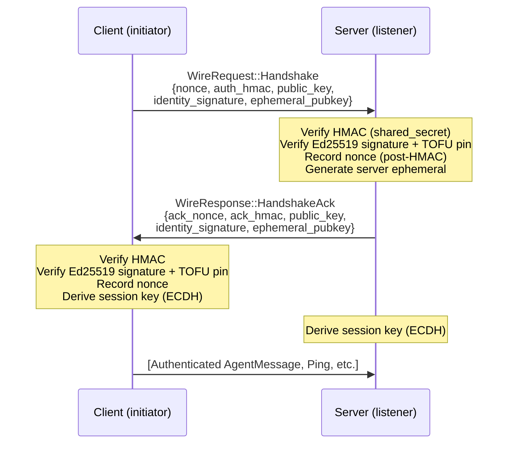

# P2P Wire Protocol

# P2P Wire Protocol (OFP)

The `librefang-wire` crate implements the LibreFang Wire Protocol (OFP) — the TCP-based peer-to-peer networking layer that connects LibreFang kernels across machines. It handles agent discovery, authenticated handshakes, message routing, and the cryptographic session lifecycle.

## Security Architecture

OFP provides three independent security layers, all required for a complete connection:

```
┌─────────────────────────────────────────────────────────────────┐
│                    Network Admission (HMAC)                      │
│  shared_secret + nonce + sender_node_id + recipient_node_id     │
│  "Do you know the cluster password, for this specific peer?"    │
├─────────────────────────────────────────────────────────────────┤
│                Peer Identity (Ed25519 TOFU)                      │
│  Per-node persisted keypair + signature over handshake data     │
│  "Are you the same node I talked to last time?"                 │
├─────────────────────────────────────────────────────────────────┤
│            Session Integrity (X25519 ECDH + HKDF)               │
│  Per-handshake ephemeral keypair → forward-secret session key   │
│  "Can you prove you were here during this handshake?"            │
└─────────────────────────────────────────────────────────────────┘
```

**What this crate does NOT provide:** Wire confidentiality. OFP frames are plaintext. Confidentiality must come from the deployment layer (WireGuard, Tailscale, SSH tunnel, service-mesh mTLS). See the design rationale at `docs.librefang.ai/architecture/ofp-wire`.

---

## Module Layout

| File | Responsibility |
|---|---|
| `message.rs` | Wire message types, JSON framing, length-prefixed encoding |
| `keys.rs` | Ed25519 keypair generation, persistence, signing, verification |
| `kex.rs` | Per-handshake X25519 ephemeral key exchange and HKDF session key derivation |
| `peer.rs` | `PeerNode` TCP server/client, handshake orchestration, rate limiting, nonce tracking |
| `registry.rs` | In-memory `PeerRegistry` tracking known peers and their agents |
| `trusted_peers.rs` | Persistent TOFU pin store (survives restarts) |

---

## Wire Format

All messages use a 4-byte big-endian length prefix followed by a JSON body:

```
[4 bytes: length N][N bytes: JSON WireMessage]
```

Post-handshake, every frame appends a 64-character hex HMAC-SHA256 over the JSON body:

```
[4 bytes: length N+64][N bytes: JSON][64 bytes: hex HMAC]
```

Functions `encode_message` / `decode_message` / `decode_length` in `message.rs` handle the basic framing. Functions `write_message_authenticated` / `read_message_authenticated` in `peer.rs` handle the HMAC-authenticated variant.

### Message Types

The `WireMessage` envelope carries an `id` and a `WireMessageKind` discriminated by `"type"`:

- **`WireRequest`** — tagged by `"method"`: `Handshake`, `Discover`, `AgentMessage`, `Ping`
- **`WireResponse`** — tagged by `"method"`: `HandshakeAck`, `DiscoverResult`, `AgentResponse`, `Pong`, `Error`
- **`WireNotification`** — tagged by `"event"`: `AgentSpawned`, `AgentTerminated`, `ShuttingDown`

All three enums include an `Unknown` variant with `#[serde(other)]` so that messages from newer protocol versions decode without error, keeping the TCP link alive (issue #3544).

### Protocol Version

`PROTOCOL_VERSION` is currently `1`. A version mismatch during handshake results in a `VersionMismatch` error and connection teardown.

---

## Handshake Flow

The handshake is a single request-response exchange before any application messages can be sent. Any non-Handshake message on a fresh connection is rejected with `401`.



### `auth_data` Binding (#3875)

The HMAC covers `"{nonce}|{sender_node_id}|{recipient_node_id}"`. Including the recipient's node ID means a captured handshake packet cannot be replayed against a *different* federation node that shares the same `shared_secret`.

### Nonce Ordering (#3880)

Nonces are recorded in the `NonceTracker` **after** successful HMAC verification, not before. This prevents an unauthenticated attacker from filling the nonce table and triggering GC sweeps.

---

## Ed25519 Identity (`keys.rs`)

Each node persists an Ed25519 keypair in `<data_dir>/peer_keypair.json` managed by `PeerKeyManager`.

### Key Classes

- **`Ed25519KeyPair`** — In-memory keypair. `sign(data)` returns a base64 signature. `fingerprint()` returns `SHA-256(public_key_b64)` as hex for out-of-band verification.
- **`PeerKeyManager`** — Loads or generates the keypair at startup. Handles migration from PR-1 files (which lacked `node_id`) by minting a UUID and rewriting the file. Sets `0600` permissions on Unix.

### Verification

`verify_signature(public_key_b64, data, signature_b64)` validates an Ed25519 signature. Used during handshake to verify the remote peer's identity claim.

### TOFU Pinning

On first contact, the remote peer's Ed25519 public key is pinned to their `node_id`. Subsequent handshakes from the same `node_id` **must** present the same public key — a mismatch is rejected as a potential impersonation. A previously-pinned peer that omits the identity fields is treated as a downgrade attack and also rejected.

Pins are stored:
- In memory: `PeerNode.pinned_pubkeys` (`HashMap<String, String>`), capped at 100,000 entries.
- On disk: `TrustedPeers` store in `<data_dir>/trusted_peers.json`, hydrated at startup.

### Identity Signature Scope (#4269)

When an ephemeral X25519 pubkey is included in the handshake, the Ed25519 signature covers `auth_data | "|" | ephemeral_pubkey` — binding the ephemeral to the static identity so an active MITM cannot substitute its own key. Without an ephemeral (legacy peers), the scope reduces to just `auth_data`.

---

## Ephemeral Key Exchange (`kex.rs`)

Per-handshake X25519 ECDH provides forward secrecy and decouples the session key from `shared_secret`.

### `EphemeralKex`

1. `EphemeralKex::generate()` — creates a fresh X25519 keypair per handshake.
2. `public_b64()` — the public half, sent in the handshake's `ephemeral_pubkey` field.
3. `derive_session_key(remote_pubkey_b64, transcript)` — consumes `self` (destroying the private key via `StaticSecret`'s zeroizing drop), performs ECDH, runs HKDF-SHA256 with the transcript as salt and `b"librefang-ofp/v1/session-key"` as info, returns a 64-char hex key.

### Transcript

`handshake_transcript(client_nonce, server_nonce)` produces `"{client_nonce}|{server_nonce}"`. The order is fixed regardless of which side calls it, ensuring both peers derive the same salt.

### All-Zero Check

The module explicitly rejects the all-zero shared secret output (which occurs with low-order public keys), since `x25519_dalek` does not do this by default.

### Backward Compatibility

`ephemeral_pubkey` is `Option<String>` on the wire. When either peer omits it, both sides fall back to `derive_session_key(shared_secret, our_nonce, their_nonce)` — the legacy HMAC-based derivation.

---

## Session Key Derivation

Two paths exist:

| Path | When | Derivation |
|---|---|---|
| **ECDH** (preferred) | Both peers send `ephemeral_pubkey` | `HKDF-SHA256(salt=transcript, ikm=X25519_shared_point, info="librefang-ofp/v1/session-key")` |
| **Legacy** | Either peer omits `ephemeral_pubkey` | `HMAC-SHA256(shared_secret, our_nonce \|\| their_nonce)` |

The resulting hex string is used as the per-message HMAC key for the remainder of the connection.

---

## Per-Message Authentication

After the handshake, all frames use `write_message_authenticated` / `read_message_authenticated`:

- **Write**: Append `HMAC-SHA256(session_key, json_bytes)` as 64 hex characters after the JSON body. The length prefix covers both.
- **Read**: Split the trailing 64 bytes, verify the HMAC with constant-time comparison (`subtle::ConstantTimeEq`). Reject tampered or forged messages.

---

## Rate Limiting (`PeerRateLimiter`)

Two independent limits per peer, configurable via `PeerConfig`:

1. **Message rate** — `max_messages_per_peer_per_minute` (default 60). Counts `AgentMessage` requests per peer per 60-second window. Excess returns a `429` error before the message reaches the LLM pipeline.
2. **Token budget** — `max_llm_tokens_per_peer_per_hour` (default: unlimited). Cumulative cap checked retroactively via `record_tokens()` after each LLM turn.

Additionally, `MAX_PEER_MESSAGE_BYTES` (64 KiB) is enforced on every incoming `AgentMessage` payload before it reaches the kernel's LLM pipeline.

---

## Nonce Replay Protection (`NonceTracker`)

Stores seen handshake nonces with timestamps in a `DashMap`. Properties:

- **5-minute window** — expired nonces are garbage-collected.
- **Atomic check-and-record** — uses `DashMap::entry()` to avoid TOCTOU races.
- **Capacity bound** — 100,000 entries. Amortized GC sweeps only run at ≥80% capacity to prevent an unauthenticated attacker from forcing O(n) scans on every connection.
- **Fail-closed** — when at capacity, new nonces are rejected rather than accepted without tracking.

---

## `PeerNode` — Server and Client

`PeerNode` is the main entry point. It binds a TCP listener, accepts inbound connections, and initiates outbound connections to known peers.

### Construction

```rust
// Legacy (HMAC-only, no Ed25519 identity)
PeerNode::start(config, registry, handle).await

// Production (with Ed25519 identity + persistent trust store)
PeerNode::start_with_identity(config, registry, handle, Some(keypair), Some(trust_dir)).await
```

`config.shared_secret` must be non-empty or `start` returns an error.

### `PeerHandle` Trait

The kernel implements this trait to handle incoming requests:

| Method | Purpose |
|---|---|
| `local_agents()` | Return agent list for handshake/discovery |
| `handle_agent_message(agent, message, sender)` | Route to a local agent, return response text |
| `discover_agents(query)` | Search local agents by name/tags/description |
| `uptime_secs()` | Return node uptime for Pong responses |

### Outbound Connections

- **`connect_to_peer_with_id(addr, handle, recipient_node_id)`** — Opens a TCP connection, performs the full handshake (HMAC + Ed25519 + ECDH), then spawns a background task running `connection_loop`.
- **`send_to_peer(node_id, agent, message, sender, handle)`** — One-shot: connects, handshakes, sends a single `AgentMessage`, reads the response, tears down.

### Inbound Processing

The `accept_loop` spawns one task per incoming connection. `handle_inbound` performs the handshake in reverse (verify client HMAC → verify identity → optionally generate server ephemeral → send `HandshakeAck` → derive session key), then enters `connection_loop`.

---

## `PeerRegistry` — Peer and Agent Tracking

Thread-safe (`Arc<RwLock>`) store of `PeerEntry` structs. Key operations:

- `add_peer` / `remove_peer` / `get_peer` / `connected_peers`
- `add_agent` / `remove_agent` / `find_agents(query)` — searches across all connected peers
- `mark_disconnected` — transitions a peer to `Disconnected` state without removing it

The registry is cloned into each connection task so the accept loop and outbound connectors share the same view.

---

## Notifications

`broadcast_notification` sends a one-way `WireNotification` to all connected peers. Each delivery opens a fresh TCP connection with a per-message HMAC derived from `shared_secret + fresh_nonce`.

Handled notification types:
- `AgentSpawned` — updates the registry
- `AgentTerminated` — removes the agent from the registry
- `ShuttingDown` — marks the peer disconnected
- `Unknown` — silently ignored (forward compat)

---

## Integration with the Kernel

The wire crate is consumed by the API layer and kernel via:

| Consumer | Usage |
|---|---|
| `src/routes/network.rs` | `network_status` exposes `identity_fingerprint`, `pinned_peer_count`, `connected_count`, `local_addr` |
| `src/routes/network.rs` | `network_trusted_peers` calls `list_pinned_peers()` for admin UI |
| `librefang-api/src/ws.rs` | WebSocket handler reads `all_peers()` for dashboard rendering |
| App boot sequence | Calls `PeerKeyManager::load_or_generate()`, then `PeerNode::start_with_identity()` |

---

## Key Constants

| Constant | Value | Purpose |
|---|---|---|
| `PROTOCOL_VERSION` | `1` | Wire version checked during handshake |
| `MAX_MESSAGE_SIZE` | 16 MB | Maximum frame size |
| `MAX_PEER_MESSAGE_BYTES` | 64 KiB | Per-agent-message payload cap |
| `MAX_PIN_ENTRIES` | 100,000 | TOFU pin map capacity |
| `HKDF_INFO` | `b"librefang-ofp/v1/session-key"` | HKDF info string (protocol versioning hook) |
| Nonce window | 5 minutes | Replay protection timeframe |
| Nonce capacity | 100,000 | Maximum tracked nonces |