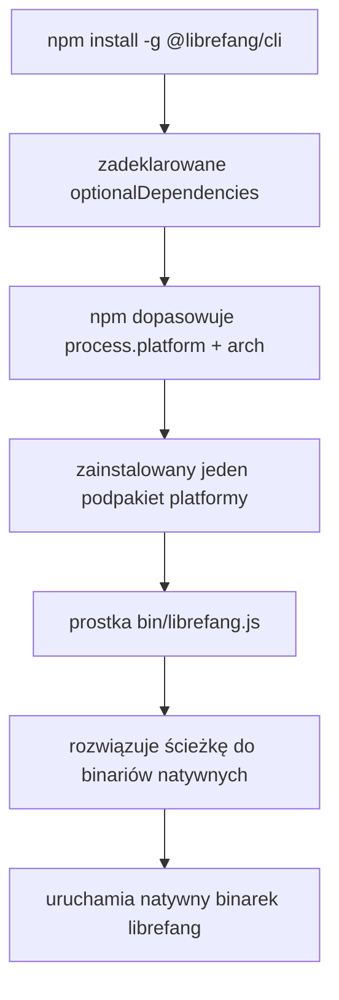

# packages — cli-npm

# `@librefang/cli` — Pakiet dystrybucyjny binarek NPM

## Przeznaczenie

Pakiet `packages/cli-npm` jest **prostką dystrybucyjną NPM** dla interfejsu wiersza poleceń LibreFang Agent OS. Nie jest to sam CLI — nie zawiera żadnej logiki aplikacji. Zamiast tego działa jako cienki dyspozytor, który instaluje odpowiedni natywny pakiet binarny danej platformy jako `optionalDependency` i deleguje do niego wykonanie.

To pakiet, który użytkownicy instalują, uruchamiając:

```bash
npm install -g @librefang/cli
```

## Jak to działa

Pakiet wykorzystuje mechanizm `optionalDependencies` npm-a, aby dostarczyć jedną komendę instalacyjną, która pobiera dokładnie jeden pakiet binarny specyficzny dla danej platformy. Przepływ wygląda następująco:



### Prostka (`bin/librefang.js`)

Jedynym plikiem źródłowym jest `bin/librefang.js`, zarejestrowany jako plik wykonywalny `librefang` za pomocą pola `bin` w `package.json`. W czasie wykonywania:

1. Sprawdza `process.platform` i `process.arch` (z dodatkową logiką dla dystrybucji Linuksa opartych na musl).
2. Rozwiązuje ścieżkę do natywnego binarek w odpowiednim pakiecie `@librefang/cli-*`.
3. Uruchamia proces natywny, przekazując `argv`, `stdin`, `stdout` i `stderr`.
4. Zakańcza z kodem wyjścia natywnego binarek.

Tablica `files` ogranicza publikowany pakiet wyłącznie do tego pliku prostki, co minimalizuje rozmiar instalacji.

## Macierz platform

Każdy wiersz odpowiada osobnej zależności opcjonalnej. npm instaluje co najwyżej jeden z nich, w zależności od środowiska hosta:

| `process.platform` | Architektura | Biblioteka C | Zależność opcjonalna |
|---|---|---|---|
| `darwin` | `arm64` | — | `@librefang/cli-darwin-arm64` |
| `darwin` | `x64` | — | `@librefang/cli-darwin-x64` |
| `linux` | `x64` | glibc | `@librefang/cli-linux-x64` |
| `linux` | `arm64` | glibc | `@librefang/cli-linux-arm64` |
| `linux` | `x64` | musl | `@librefang/cli-linux-x64-musl` |
| `linux` | `arm64` | musl | `@librefang/cli-linux-arm64-musl` |
| `win32` | `x64` | — | `@librefang/cli-win32-x64` |
| `win32` | `arm64` | — | `@librefang/cli-win32-arm64` |

Rozróżnienie glibc/musl dla Linuksa wymaga detekcji w czasie wykonywania w prostce, ponieważ Node.js nie udostępnia biblioteki C przez `process`. Zazwyczaj realizuje się to poprzez sprawdzenie obecności wyniku polecenia `ldd` lub sondowanie `/proc/self/maps`.

## Konfiguracja pakietu

Kluczowe pola z `package.json`:

| Pole | Wartość | Rola |
|---|---|---|
| `name` | `@librefang/cli` | Publikowana nazwa pakietu |
| `bin` | `./bin/librefang.js` | Rejestracja globalnej komendy |
| `files` | `["bin/librefang.js"]` | Publikowana jest wyłącznie prostka |
| `engines.node` | `>=18` | Minimalna wersja środowiska uruchomieniowego Node.js |
| `optionalDependencies` | 8 wpisów | Pakiety binarne specyficzne dla platformy |

Wszystkie osiem zależności opcjonalnych jest przypiętych do tej samej wersji (`0.0.0` w bieżącym manifeście), publikowanych synchronicznie. Niezgodność wersji między prostką a dowolnym podpakietem spowodowałaby błędy resolucji.

## Relacja z kodem źródłowym

Ten pakiet jest **artefaktem dystrybucyjnym**, a nie celem deweloperskim. Rzeczywista implementacja CLI — analizowanie komend, zarządzanie demonem, sprawdzanie kondycji (`librefang doctor`), inicjalizacja (`librefang init`) oraz uruchamianie demona (`librefang start`) — znajduje się w natywnym binarek, kompilowanym z rdzennego workspace'u Rust i publikowanym do podpakietów specyficznych dla danej platformy.

```
root monorepo
├── packages/
│   └── cli-npm/          ← Ten pakiet (tylko prostka)
│       ├── bin/
│       │   └── librefang.js
│       ├── package.json
│       └── README.md
└── (workspace Rust)      ← Implementacja CLI, kompilowana do natywnych binarek
```

Deweloperzy pracujący nad zachowaniem CLI powinni modyfikować implementację rdzenną, a nie ten pakiet. Zmiany tutaj są ograniczone do:

- **Aktualizacje logiki prostki** — obsługa nowych platform, ulepszone wykrywanie musl, komunikaty błędów.
- **Aktualizacje wersji zależności** — po publikacji nowej wersji natywnego binarek.
- **Zmiany wymagań silnika** — polityka minimalnej wersji Node.js.

## Weryfikacja instalacji

Aby potwierdzić, że prostka poprawnie rozwiązała binarek platformy po instalacji:

```bash
librefang doctor
```

Jeśli żaden pakiet platformy nie został zainstalowany (np. za proxy, które cicho ignoruje zależności opcjonalne), prostka zakończy się błędem resolucji, wskazując, który pakiet `@librefang/cli-*` był oczekiwany.

## Wymagania

- **Node.js** ≥ 18 (do resolucji modułów prostki i semantyki `child_process`)
- **npm** (lub kompatybilny menedżer pakietów honorujący `optionalDependencies`)
- Jedna z ośmiu obsługiwanych kombinacji platforma/architektura
