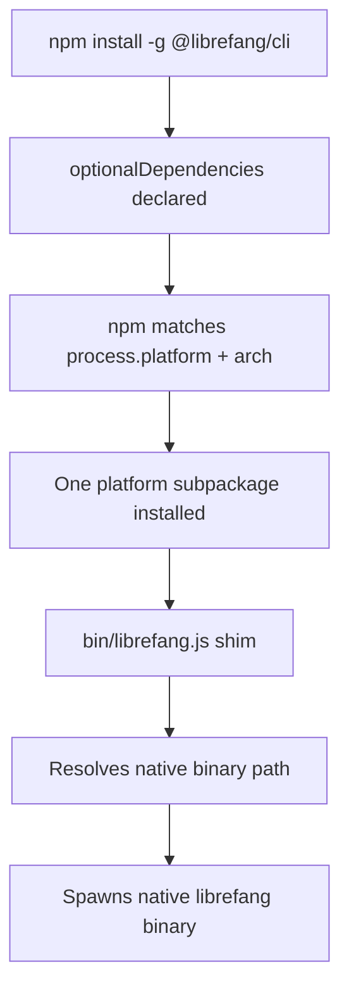

# packages — cli-npm

# `@librefang/cli` — NPM Binary Distribution Package

## Purpose

The `packages/cli-npm` package is the **npm distribution shim** for the LibreFang Agent OS command-line interface. It is not the CLI itself — it contains no application logic. Instead, it acts as a thin dispatcher that installs the correct platform-native binary as an `optionalDependency` and delegates execution to it.

This is the package users install when they run:

```bash
npm install -g @librefang/cli
```

## How It Works

The package leverages npm's `optionalDependencies` mechanism to deliver a single install command that pulls in exactly one platform-specific binary package. The flow is:



### The Shim (`bin/librefang.js`)

The sole source file is `bin/librefang.js`, registered as the `librefang` executable via the `bin` field in `package.json`. At runtime it:

1. Inspects `process.platform` and `process.arch` (with additional logic for musl-based Linux distributions).
2. Resolves the path to the native binary inside the corresponding `@librefang/cli-*` package.
3. Spawns the native process, forwarding `argv`, `stdin`, `stdout`, and `stderr`.
4. Exits with the native binary's exit code.

The `files` array restricts the published package to only this shim file, keeping the install footprint minimal.

## Platform Matrix

Each row maps to a distinct optional dependency. npm installs at most one based on the host environment:

| `process.platform` | Architecture | C Library | Optional Dependency |
|---|---|---|---|
| `darwin` | `arm64` | — | `@librefang/cli-darwin-arm64` |
| `darwin` | `x64` | — | `@librefang/cli-darwin-x64` |
| `linux` | `x64` | glibc | `@librefang/cli-linux-x64` |
| `linux` | `arm64` | glibc | `@librefang/cli-linux-arm64` |
| `linux` | `x64` | musl | `@librefang/cli-linux-x64-musl` |
| `linux` | `arm64` | musl | `@librefang/cli-linux-arm64-musl` |
| `win32` | `x64` | — | `@librefang/cli-win32-x64` |
| `win32` | `arm64` | — | `@librefang/cli-win32-arm64` |

The glibc/musl distinction for Linux requires runtime detection in the shim since Node.js does not expose the C library via `process`. This is typically done by checking for the presence of `ldd` output or probing `/proc/self/maps`.

## Package Configuration

Key fields from `package.json`:

| Field | Value | Role |
|---|---|---|
| `name` | `@librefang/cli` | Published package name |
| `bin` | `./bin/librefang.js` | Global command registration |
| `files` | `["bin/librefang.js"]` | Only the shim is published |
| `engines.node` | `>=18` | Minimum Node.js runtime |
| `optionalDependencies` | 8 entries | Platform-specific binary packages |

All eight optional dependencies are pinned to the same version (`0.0.0` in the current manifest), released in lockstep. A version mismatch between the shim and any subpackage would cause resolution failures.

## Relationship to the Codebase

This package is a **distribution artifact**, not a development target. The actual CLI implementation — command parsing, daemon management, health checks (`librefang doctor`), initialization (`librefang init`), and daemon startup (`librefang start`) — lives in the native binary, built from the core Rust workspace and published to the platform-specific subpackages.

```
monorepo root
├── packages/
│   └── cli-npm/          ← This package (shim only)
│       ├── bin/
│       │   └── librefang.js
│       ├── package.json
│       └── README.md
└── (Rust workspace)      ← CLI implementation, compiled to native binaries
```

Developers working on CLI behavior should modify the core implementation, not this package. Changes here are limited to:

- **Shim logic updates** — new platform support, improved musl detection, error messaging.
- **Dependency version bumps** — when a new native binary release is published.
- **Engine requirement changes** — Node.js minimum version policy.

## Install Verification

To confirm the shim correctly resolved a platform binary after install:

```bash
librefang doctor
```

If no platform package was installed (e.g., behind a proxy that silently drops optional dependencies), the shim will fail with a resolution error identifying which `@librefang/cli-*` package was expected.

## Requirements

- **Node.js** ≥ 18 (for the shim's module resolution and `child_process` semantics)
- **npm** (or compatible package manager that honors `optionalDependencies`)
- One of the eight supported platform/architecture combinations