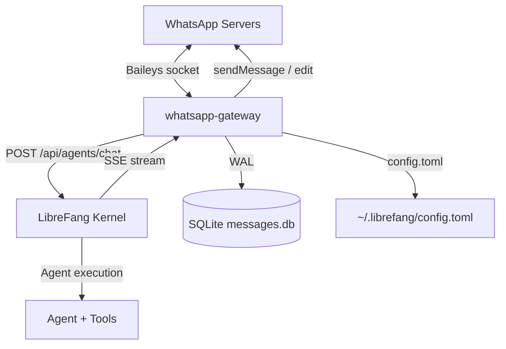
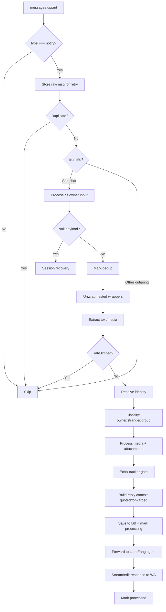

# packages — whatsapp-gateway

# whatsapp-gateway

A Node.js gateway that bridges WhatsApp (via the Baileys library) to the LibreFang kernel. It receives inbound WhatsApp messages, forwards them to an AI agent for processing, and delivers the agent's responses back to the originating chat. The gateway runs as a long-lived process managed by PM2 and is designed for unattended, headless operation.

## Architecture Overview



The gateway is the sole WhatsApp transport for a LibreFang deployment. It owns the WhatsApp session credentials, the message persistence layer, and all connection-recovery logic. The kernel is a separate HTTP service that the gateway calls as a client.

## Configuration

### Sources of truth (precedence: env var > config.toml > defaults)

| Setting | Env var | config.toml path | Default |
|---|---|---|---|
| Kernel URL | `LIBREFANG_URL` | — | `http://127.0.0.1:4545` |
| Kernel API key | `LIBREFANG_API_KEY` | root `api_key` | *(empty)* |
| Default agent | `LIBREFANG_DEFAULT_AGENT` | `[channels.whatsapp].default_agent` | `assistant` |
| Owner numbers | `WHATSAPP_OWNER_JID` | `[channels.whatsapp].owner_numbers` | `[]` |
| Conversation TTL | `CONVERSATION_TTL_HOURS` | `[channels.whatsapp].conversation_ttl_hours` | `24` |
| Stream to channel | — | `[channels.whatsapp].stream_to_channel` | `true` |
| Group trigger patterns | — | `[channels.whatsapp].group_trigger_patterns` | `[]` |
| Relay intent languages | — | `[relay_intent].languages` | `["en"]` |

The config file path defaults to `~/.librefang/config.toml` but can be overridden with `LIBREFANG_CONFIG`.

### PM2 process configuration

`ecosystem.config.cjs` defines a single `whatsapp-gateway` app:

- **Restart policy**: autorestart enabled, max 5 restarts, 30s minimum uptime, 3s base restart delay with exponential backoff, 256MB memory ceiling.
- **Log paths**: `logs/pm2-error.log` and `logs/pm2-out.log` under the package directory (override with `WA_GATEWAY_LOG_DIR` / `WA_GATEWAY_CWD`).
- **Deployment-specific values** (agents, owner numbers, API keys) are injected via environment variables at runtime — they are never committed in the ecosystem file.

### Feature flags (env vars)

| Flag | Effect when set to `off` |
|---|---|
| `LIBREFANG_ECHO_TRACKER` | Disables echo-loop detection (self-message suppression) |
| `LIBREFANG_DISPATCH_LOG` | Silences the per-dispatch structured log line |
| `LIBREFANG_LID_PERSIST` | Disables SQLite-backed LID→PN cache; in-memory only |
| `LIBREFANG_SILENT_V2` | Reverts to legacy regex-based silent-response scrubbing |
| `LIBREFANG_OWNER_CHANNEL` | Falls back to legacy `NOTIFY_OWNER` text-tag path |

## Connection Lifecycle

### Startup and authentication

`startConnection()` dynamically imports Baileys (ESM-only in v6), loads the multi-file auth state from `./auth_store`, fetches the latest WA protocol version, and creates the socket. The browser identity is set to `['LibreFang', 'Desktop', '1.0.0']`.

On first connect there are no stored credentials, so Baileys emits a QR code. The gateway renders it to a PNG data URL (`qrDataUrl`) and exposes it via the HTTP status endpoint for the operator to scan. After a successful scan, `creds.update` events persist credentials so subsequent restarts reconnect without re-pairing.

### Reconnect and backoff

Disconnect handling distinguishes three cases:

- **`loggedOut` (401)**: The user removed the linked device from their phone. The auth store is deleted, the cached agent ID is invalidated, and the gateway enters a waiting state until the operator triggers `/login/start`.
- **`forbidden`**: Non-recoverable; no auto-reconnect.
- **All other reasons**: Exponential backoff with jitter via `computeBackoffDelay(attempts)`.

The backoff formula: `base = min(2000 * 1.8^(attempts-1), 30000)`, multiplied by a `0.75–1.25` jitter factor. There is no hard stop on retry count — a transient outage longer than the previous 5-attempt cap no longer strands the gateway permanently. The `scheduleReconnect()` helper self-reschedules if `startConnection()` throws before the new socket's close listener is installed, ensuring the recovery loop never goes idle.

### Heartbeat watchdog (ST-01)

A periodic interval (default 30s) checks whether inbound `messages.upsert` events have arrived within `HEARTBEAT_MS` (default 5 minutes). If the socket goes silent — indicating a dead-but-not-closed connection — the gateway force-closes the socket via `sock.end()`, which triggers the normal reconnect path. The watchdog is torn down in `cleanupSocket()` alongside all other per-connection timers to avoid leaked intervals across reconnect cycles.

### Process-level error handling

Two handlers protect against silent corruption:

- **`uncaughtException`**: Logs the stack and calls `process.exit(1)` immediately. PM2 restarts the process.
- **`unhandledRejection`**: Maintains a rolling 5-minute window of rejection timestamps. A single rejection is logged but tolerated (often a recoverable network blip in a `setInterval` cleanup). If 5 or more rejections accumulate within the window, the process exits for a clean PM2 restart rather than continuing with half-finished transactions.

## Identity Resolution

WhatsApp assigns every account two independent identifiers:

- **Phone-number JID** (`<digits>@s.whatsapp.net`) — the classic, publicly known address.
- **LID** (`<digits>@lid`) — an opaque, privacy-preserving identifier that is unrelated to the phone number.

The `remoteJid` of an inbound message may be either form. The gateway must resolve LIDs back to phone-number JIDs to recognize owners, extract phone numbers for logging/routing, and build consistent session keys.

### Resolution pipeline

The helper `resolvePeerId()` (from `lib/identity.js`) consults these sources in order:

1. `msg.key.senderPn` — Baileys sometimes provides the PN JID directly.
2. `lidToPnJid` cache — populated from prior observations and the SQLite-backed LID cache.
3. `msg.key.participant` — for group messages, the actual sender.
4. The raw `sender` itself, when it is already an `@s.whatsapp.net` JID.

### LID cache persistence (ID-02)

When `LIBREFANG_LID_PERSIST` is not `off`, every LID→PN mapping is written through to a SQLite `lid_cache` table via `lib/lid-cache.js`. On boot:

1. The table is pruned to the 10,000 most recently updated entries.
2. All surviving rows are loaded into the in-memory `lidToPnJid` Map.

Write-through failures (`lid_cache_write_failed`) are logged but never block the caller — identity resolution continues to work even if the database becomes read-only.

### Proactive LID resolution (CS-02)

For a first-seen LID with no `senderPn` and no cache entry, `resolveLidProactively()` races `sock.onWhatsApp([lid])` against a 5-second timeout. On success, the result populates the cache so subsequent messages in the same burst resolve synchronously. On timeout or empty response, the caller proceeds in degraded mode (LID used as-is); a later `senderPn` event may still populate the cache.

### Owner LID pre-resolution

At every successful connect, the gateway calls `sock.onWhatsApp()` for each configured owner number and populates `ownerLidJids`. This ensures the very first LID-addressed message from an owner is recognized, before any `senderPn` event arrives.

## Inbound Message Pipeline

The `messages.upsert` handler is the core of the gateway. Here is the processing order for each inbound message:



### Message unwrapping

WhatsApp wraps user-visible content in multiple protocol layers — ephemeral messages, view-once containers, edited messages, device-sent messages, and document-with-caption wrappers. `unwrapMessageWrappers()` recursively collapses these (up to depth 5) so downstream handlers see the actual payload. `protocolMessage` is intentionally excluded since it carries receipts/revokes, not user content.

### Text and media extraction

The handler checks for text in `conversation`, `extendedTextMessage.text`, image/video captions, and document captions. Downloadable media (image, video, audio, sticker, document) is detected by `getDownloadableMedia()` and processed through the media pipeline. Location and contact messages are converted to enriched text descriptors (e.g. `[Location: ... — https://maps.google.com/?q=...]`).

### Echo suppression (EB-01)

`EchoTracker` (from `lib/echo-tracker.js`) maintains a process-local LRU of the last 100 outbound text bodies. On every inbound `messages.upsert`, the gateway normalizes the message body and checks it against the tracker. If it matches a recently sent outbound message, the inbound is dropped as a self-loop echo (WhatsApp reflects cross-device messages back via sync). This prevents the agent from responding to its own output.

### Rate limiting

Strangers and group senders are limited to 3 messages per 60-second window (`RATE_LIMIT_MAX` / `RATE_LIMIT_WINDOW_MS`). Rate-limited messages are silently dropped.

### Reply context enrichment

If the inbound message quotes another message (`contextInfo.quotedMessage`), the gateway prepends `[In risposta a: "<quoted text>"]` to the forwarded text. The quoted-text extraction handles text, captions, and typed placeholders for audio (`[voice note]`), images, videos, stickers, documents, locations, and contacts. Forwarded messages are annotated with `[Forwarded message]`.

### Group message handling

Group messages are detected via `isGroupJid()`. The gateway determines whether the bot was mentioned via:

1. **Structured mentions**: `contextInfo.mentionedJid` containing the bot's own JID.
2. **Pattern fallback**: `[channels.whatsapp].group_trigger_patterns` compiled to JS RegExps. Rust-style `(?i)` inline flags are translated to the JS `i` flag; mid-pattern flag groups are rejected with a warning.

The participant roster is fetched via `getGroupParticipants()` with a 5-minute TTL cache. Membership changes (`group-participants.update` event) invalidate the cache immediately.

## Message Persistence

### SQLite store

All inbound and outbound messages are persisted in `messages.db` (path overridable via `WHATSAPP_DB_PATH`). The database uses WAL journaling with a 5-second busy timeout and file permissions set to `0600`.

Schema highlights:

- **`messages`** — primary table with columns for `id`, `jid`, `sender_jid`, `push_name`, `phone`, `text`, `direction` (`inbound`/`outbound`), `timestamp`, `processed` (0 = pending, 1 = done, -1 = failed), `retry_count`, `raw_type`, and `processing_since` (the in-flight lease timestamp).
- **`jid_last_seen`** — tracks the last message timestamp per JID for gap detection.

### Processing lease and catch-up sweep

Before the slow media-download-and-forward path begins, the gateway stamps `processing_since` via `dbMarkProcessing()`. A periodic catch-up sweep (`runCatchUpSweep()`) queries for unprocessed rows whose lease has expired (`processing_since < Date.now() - PROCESSING_LEASE_MS`), so a crashed handler's claim eventually expires and the sweep recovers the message. On successful processing, the lease is cleared and `processed` is set to 1.

The `shouldSkipCatchupForMissingJid()` predicate filters orphan rows with null/empty JIDs — these cannot be scoped to any WhatsApp chat and are skipped.

### Deduplication

Baileys can re-emit `messages.upsert` for the same `msgId` during reconnect storms or after decryption retries. The dedup tracker (`lib/dedup-tracker.js`) uses a two-phase protocol:

1. **`wasProcessed(msgId)`** — read-only check; does NOT mark.
2. **`markProcessed(msgId)`** — called only after decryption succeeds.

This ensures that WA's retransmit of a failed-decrypt message reaches the session-recovery path instead of being stranded by an overly eager mark-on-sight. The window is 10 minutes (600s), bounded by inbound rate.

## Agent Forwarding

### Streaming protocol

The gateway calls the kernel's chat endpoint via `forwardToLibreFangStreaming()`, which returns a Server-Sent Events stream of text deltas. When `STREAM_TO_CHANNEL` is `true` (default), each delta triggers an `onProgress` callback that:

1. Buffers the text in a hold-back accumulator until it exceeds 32 characters and does not match a silent-response prefix.
2. Sends the first flush as a new WhatsApp message.
3. Subsequent deltas edit that message in place (`sendMessage(..., { edit: streamMsgKey })`).

When `STREAM_TO_CHANNEL` is `false`, all deltas are accumulated and only the final text is sent in a single message, avoiding the "edited" tag flicker on every chunk.

After the stream completes, the final accumulated text is sent via `sendOrEdit()` — either editing the streamed message (if one exists for this JID) or sending a new message.

### Silent response suppression (OB-02 / OB-07)

The gateway mirrors the Rust canonical silent-response detector to prevent sentinel phrases like `[no reply needed]` or `NO_REPLY` from reaching WhatsApp. Two layers of protection:

1. **`isSilentResponse(text)`** — classifies a complete response. Strips trailing punctuation, whitespace, and non-ASCII (emoji), then matches against known sentinel forms with word-boundary checks. Case-insensitive.

2. **`createHoldbackAccumulator()`** — the streaming gate. Buffers deltas until the cumulative text has clearly diverged from any sentinel shape. If the stream ends silent, `onFlush` is never called, guaranteeing zero partial sentinel leaks.

3. **`isProgressTextLeak(text)`** — detects CLI progress placeholders the model sometimes emits as a whole reply (e.g. `(thinking)`, `[Reading the conversation context]`) and suppresses them.

The legacy `stripNoReply()` entry point is preserved for non-streaming call sites. `LIBREFANG_SILENT_V2=off` reverts to the old regex-scrub behavior.

### Progress-placeholder leak guard

Messages consisting solely of bracketed or parenthetical progress verbs (thinking, reading, loading, processing, analyzing, etc.) are detected by `isProgressTextLeak()` and suppressed. Each branch (stranger, owner, group) logs the event as `progress_placeholder_leak` for observability.

## Owner / Stranger Routing

When owner numbers are configured, every inbound message is classified as **owner**, **stranger**, or **group**:

### Owner (DM)

Owner messages are forwarded to the agent directly. If there are active stranger conversations and the owner's text expresses a relay intent (checked by `ownerIntentsRelay()`), the gateway prepends the active-conversations context and a relay system instruction so the owner can delegate replies.

The agent can respond with relay commands embedded as JSON tags:

```
[RELAY_TO_STRANGER]{"jid":"...@s.whatsapp.net","message":"..."}[/RELAY_TO_STRANGER]
```

`extractRelayCommands()` parses these, and `executeRelay()` validates that the target JID has an active conversation (anti-confusion safeguard F1), sends the message to the stranger, and logs an audit trail. Failed relays are reported back to the owner.

### Stranger (DM)

Stranger messages are prefixed with a factual context block (`[WHATSAPP_STRANGER_CONTEXT]`) that tells the agent the sender is an external contact and documents the available `NOTIFY_OWNER` routing tag. The agent's response is sent directly to the stranger.

If the agent emits `NOTIFY_OWNER` tags, the gateway:

1. Extracts the JSON payload via `extractNotifyOwner()`.
2. Applies a 5-minute escalation debounce per stranger (`shouldDebounceEscalation()`).
3. Marks the conversation as escalated.
4. Sends the notification to the primary owner JID.

The typed `notify_owner` LLM tool (when `LIBREFANG_OWNER_CHANNEL` is `on`) routes owner notices through the `onOwnerNotice` callback, which fans out to every configured `OWNER_JID`. This is preferred over the legacy text-tag path, which logs a deprecation warning on every hit.

### Group

Group messages include the sender's identity in the forwarded text (`[Group message from <name>]`). The agent response is sent directly to the group chat. Relay commands are ignored in group contexts.

## Media Processing

`processMediaMessage()` handles the download-upload pipeline:

1. **Download** from WhatsApp servers via Baileys' `downloadMediaMessage()`, with a 30-second timeout and 50MB size cap (`MAX_MEDIA_SIZE`).
2. **Upload** to the kernel's attachment endpoint via multipart POST, with a 60-second timeout.
3. **Transcription** for audio/voice messages — if the kernel returns a transcription, it replaces the message text as `[Voice transcription]: ...`.

The entire pipeline is bounded by `MEDIA_PIPELINE_TIMEOUT_MS` (90 seconds). On timeout or failure, the message is forwarded to the agent without the attachment but with a text descriptor (e.g. `[Photo from <name>]`), ensuring the agent still responds rather than dropping the message silently.

`getMediaDescriptor()` produces fallback text descriptors for all media types. `getMediaFilename()` generates a display filename when no caption is present.

## Session Recovery and Decryption Retry

### Decryption retry tracking

When Baileys emits a `messages.update` with stub type 39 (CIPHERTEXT) or status ERROR, the gateway tracks retry counts in `decryptRetryMap`. After `DECRYPT_RETRY_MAX` (3) retries, the message is marked permanently failed, the owner is notified with a fallback message, and a system notification is forwarded to the agent.

### Signal session renegotiation

A different failure class — libsignal throwing from `session_cipher.js` before any stub is emitted — produces inbound messages with `msg.message = null`. The gateway detects this null-content case in the `messages.upsert` handler and forces a fresh Signal session via `handleSessionRecovery()`:

1. Calls `sock.assertSessions([deviceJid], true)` to trigger re-keying with the specific device (not the base JID, since sessions are per-device).
2. Respects a 20-second cooldown between attempts and a maximum of 3 attempts per base JID.
3. On exhaustion, notifies all configured owners with troubleshooting guidance.

`sessionRecoveryMap` tracks attempts, last-attempt timestamps, and notification state per base JID, with entries expiring after 30 minutes of inactivity.

### Raw message store

A bounded in-memory `Map` (`messageStore`, max 500 entries, 10-minute TTL) stores raw decrypted messages. Baileys calls `getMessage(key)` during its retry mechanism to re-decrypt messages; the store provides the original ciphertext payload. A periodic cleanup (every 60s, `.unref()`) evicts expired entries from the message store, decrypt retry map, and session recovery map.

## Conversation Tracker

`activeConversations` is an in-memory `Map<jid, ConversationState>` tracking stranger conversations with:

- Push name, phone, and up to 20 recent messages (capped at 500 chars each).
- Message count, escalation flag, and last-activity timestamp.
- TTL-based eviction every 15 minutes (`CONVERSATION_TTL_MS`, default 24 hours).

`buildConversationsContext()` renders this state as a structured text block (`[ACTIVE_STRANGER_CONVERSATIONS]`) that is injected into owner-facing relay messages, giving the owner situational awareness of pending stranger interactions.

`buildStrangerContext()` produces the `[WHATSAPP_STRANGER_CONTEXT]` prefix for stranger messages, documenting the `NOTIFY_OWNER` routing tag.

## Markdown Conversion

`markdownToWhatsApp()` translates common Markdown patterns to WhatsApp's native formatting syntax:

- `**bold**` → `*bold*` (WhatsApp bold)
- `*italic*` → `_italic_` (WhatsApp italic), with bullet-list items excluded
- `` `code` `` → ` ```code``` ` (WhatsApp monospace)
- `~~strikethrough~~` → `~strikethrough~`

The conversion uses placeholder slots to protect inline code from bold/italic processing and handles escaped stars (`\*`) to keep them literal. The `__text__` dunder form is intentionally skipped due to ambiguity with Python identifiers.

## HTTP API

The gateway exposes a minimal HTTP server (default port 3009, overridable via `WHATSAPP_GATEWAY_PORT`) for operator interaction:

| Endpoint | Method | Purpose |
|---|---|---|
| `/health` | GET | Health check; reports connection status and heartbeat freshness |
| `/status` | GET | Current connection state, QR code data URL, session ID |
| `/login/start` | POST | Force a fresh connection (generates new QR if needed) |
| `/reset` | POST | Clear auth state and restart pairing |
| `/messages/unprocessed` | GET | Debug endpoint listing pending messages |
| `/messages/:jid` | GET | Retrieve message history for a specific chat |

The health endpoint uses a separate staleness threshold (`WA_HEALTH_STALE_MS`, default 5 minutes) so external monitoring degrades earlier than the heartbeat watchdog's force-reconnect trigger.

## Gap Detection

A 10-minute interval (`gapDetectionTimer`) checks `jid_last_seen` for active conversations that have gone silent for more than 30 minutes. If an active stranger conversation shows no messages within the threshold, the gateway logs a `gap-detect` warning — this catches potential message loss that would otherwise go unnoticed.

## Key Dependencies

- **`@whiskeysockets/baileys`** — WhatsApp Web protocol implementation (ESM dynamic import).
- **`better-sqlite3`** — Synchronous SQLite driver for the message store and LID cache.
- **`toml`** — Parser for `config.toml`.
- **`qrcode`** — QR code rendering for pairing.
- **`pino`** — Structured logging (configured at `warn` level for Baileys internals).

## Internal Libraries

| Module | Responsibility |
|---|---|
| `lib/echo-tracker.js` | LRU of outbound texts for self-loop echo detection |
| `lib/lid-cache.js` | SQLite persistence layer for LID→PN JID mappings |
| `lib/dedup-tracker.js` | Two-phase message dedup with time-windowed eviction |
| `lib/identity.js` | JID classification (`isLidJid`, `isGroupJid`), phone extraction, owner derivation, peer resolution |
| `lib/session-key.js` | Per-conversation session key derivation and channel type mapping |

## Agent ID Resolution and Caching

On the first inbound message after boot (or after a reconnect that cleared the cache), the gateway resolves the configured agent name to a UUID via `GET /api/agents`. The resolved ID is persisted atomically (tmp-file + rename) to `agent_id.json` next to the database, so a gateway restart during kernel downtime does not force a fresh resolution round-trip. If the agent name is not found, the first available agent is used as a fallback.