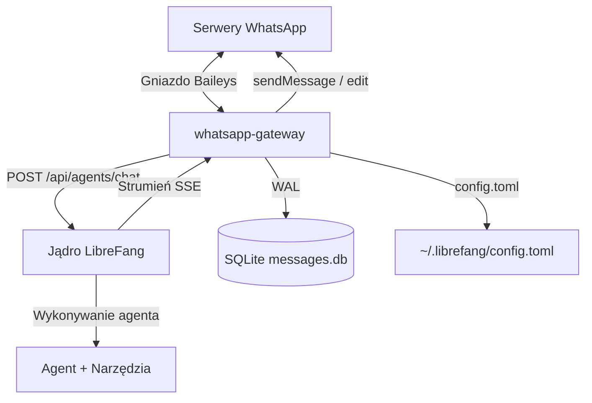
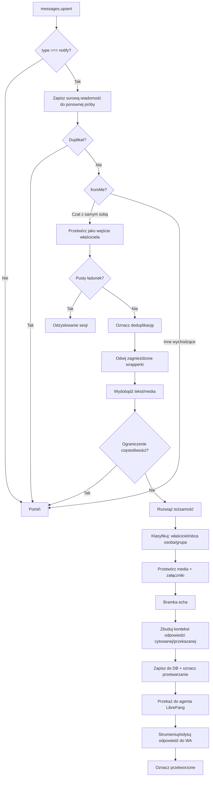

# packages — whatsapp-gateway

# whatsapp-gateway

Bramka Node.js łącząca WhatsAppa (za pomocą biblioteki Baileys) z jądrem LibreFang. Odbiera przychodzące wiadomości WhatsApp, przesyła je do agenta AI do przetworzenia i dostarcza odpowiedzi agenta z powrotem do czatu źródłowego. Bramka działa jako długotrwały proces zarządzany przez PM2 i jest zaprojektowana do bezobsługowej pracy w trybie headless.

## Architektura



Bramka jest jedynym transportem WhatsApp w wdrożeniu LibreFang. Przechowuje poświadczenia sesji WhatsApp, warstwę trwałości wiadomości i całą logikę odzyskiwania połączenia. Jądro jest osobną usługą HTTP, którą bramka wywołuje jako klient.

## Konfiguracja

### Źródła prawdy (priorytet: zmienna środowiskowa > config.toml > wartości domyślne)

| Ustawienie | Zmienna środowiskowa | Ścieżka w config.toml | Domyślnie |
|---|---|---|---|
| URL jądra | `LIBREFANG_URL` | — | `http://127.0.0.1:4545` |
| Klucz API jądra | `LIBREFANG_API_KEY` | korzeń `api_key` | *(puste)* |
| Domyślny agent | `LIBREFANG_DEFAULT_AGENT` | `[channels.whatsapp].default_agent` | `assistant` |
| Numery właściciela | `WHATSAPP_OWNER_JID` | `[channels.whatsapp].owner_numbers` | `[]` |
| TTL konwersacji | `CONVERSATION_TTL_HOURS` | `[channels.whatsapp].conversation_ttl_hours` | `24` |
| Strumieniuj na kanał | — | `[channels.whatsapp].stream_to_channel` | `true` |
| Wzorce wyzwalaczy grupowych | — | `[channels.whatsapp].group_trigger_patterns` | `[]` |
| Języki intencji przekazywania | — | `[relay_intent].languages` | `["en"]` |

Ścieżka pliku konfiguracyjnego to domyślnie `~/.librefang/config.toml`, ale można ją nadpisać zmienną `LIBREFANG_CONFIG`.

### Konfiguracja procesu PM2

`ecosystem.config.cjs` definiuje pojedynczą aplikację `whatsapp-gateway`:

- **Polityka restartu**: autorestart włączony, maksymalnie 5 restartów, 30s minimalny czas pracy, 3s podstawowe opóźnienie restartu z wykładniczym wycofywaniem, limit pamięci 256MB.
- **Ścieżki logów**: `logs/pm2-error.log` i `logs/pm2-out.log` w katalogu pakietu (do nadpisania przez `WA_GATEWAY_LOG_DIR` / `WA_GATEWAY_CWD`).
- **Wartości specyficzne dla wdrożenia** (agenci, numery właściciela, klucze API) są wstrzykiwane przez zmienne środowiskowe w czasie działania — nigdy nie są zatwierdzane w pliku ekosystemu.

### Flagi funkcji (zmienne środowiskowe)

| Flaga | Efekt gdy ustawiona na `off` |
|---|---|
| `LIBREFANG_ECHO_TRACKER` | Wyłącza detekcję pętli echa (pomijanie własnych wiadomości) |
| `LIBREFANG_DISPATCH_LOG` | Wycisza ustrukturyzowaną linię log na dyspozycję |
| `LIBREFANG_LID_PERSIST` | Wyłącza pamięć podręczną LID→PN wspieraną przez SQLite; tylko w pamięci |
| `LIBREFANG_SILENT_V2` | Powraca do starszego czyszczenia cichych odpowiedzi opartego na regex |
| `LIBREFANG_OWNER_CHANNEL` | Powraca do starszej ścieżki tagu tekstowego `NOTIFY_OWNER` |

## Cykl życia połączenia

### Uruchomienie i uwierzytelnianie

`startConnection()` dynamicznie importuje Baileys (tylko ESM w v6), ładuje wieloplikowy stan uwierzytelnienia z `./auth_store`, pobiera najnowszą wersję protokołu WA i tworzy gniazdo. Tożsamość przeglądarki jest ustawiona na `['LibreFang', 'Desktop', '1.0.0']`.

Przy pierwszym połączeniu nie ma zapisanych poświadczeń, więc Baileys emituje kod QR. Bramka renderuje go jako URL danych PNG (`qrDataUrl`) i udostępnia przez punkt końcowy statusu HTTP do zeskanowania przez operatora. Po udanym skanowaniu zdarzenia `creds.update` zapisują poświadczenia, dzięki czemu kolejne restarty łączą się ponownie bez ponownego parowania.

### Ponowne połączenie i wycofywanie

Obsługa rozłączenia rozróżnia trzy przypadki:

- **`loggedOut` (401)**: Użytkownik usunął powiązane urządzenie z telefonu. Magazyn uwierzytelnienia jest usuwany, buforowany identyfikator agenta jest unieważniany, a bramka przechodzi w stan oczekiwania do momentu wyzwolenia `/login/start` przez operatora.
- **`forbidden`**: Nie do odzyskania; bez automatycznego ponownego połączenia.
- **Wszystkie inne przyczyny**: Wykładnicze wycofywanie z losowym rozproszeniem przez `computeBackoffDelay(attempts)`.

Wzór wycofywania: `base = min(2000 * 1.8^(próby-1), 30000)`, pomnożony przez współczynnik losowości `0,75–1,25`. Nie ma twardego limitu liczby prób — dłuższa awaria trwająca ponad poprzedni limit 5 prób nie zostawia już bramki w stanie zawieszenia na stałe. Pomocnik `scheduleReconnect()` samodzielnie planuje ponowne wywołanie, jeśli `startConnection()` rzuci wyjątek przed zainstalowaniem nowego listenera zamknięcia gniazda, zapewniając, że pętla odzyskiwania nigdy nie przechodzi w stan bezczynności.

### Watchdog tętna (ST-01)

Okresowy interwał (domyślnie 30s) sprawdza, czy przychodzące zdarzenia `messages.upsert` dotarły w ciągu `HEARTBEAT_MS` (domyślnie 5 minut). Jeśli gniazdo milczy — wskazując na martwe, ale nie zamknięte połączenie — bramka wymusza zamknięcie gniazda przez `sock.end()`, co wyzwala normalną ścieżkę ponownego połączenia. Watchdog jest usuwany w `cleanupSocket()` wraz ze wszystkimi innymi timerami połączeniowymi, aby uniknąć wyciekających interwałów między cyklami ponownego połączenia.

### Obsługa błędów na poziomie procesu

Dwa programy obsługi chronią przed cichą korupcją:

- **`uncaughtException`**: Loguje stos i natychmiast wywołuje `process.exit(1)`. PM2 restartuje proces.
- **`unhandledRejection`**: Utrzymuje przesuwające się 5-minutowe okno znaczników czasu odrzuceń. Pojedyncze odrzucenie jest logowane, ale tolerowane (często odwracalny błąd sieciowy w czyszczeniu `setInterval`). Jeśli w oknie zgromadzi się 5 lub więcej odrzuceń, proces kończy działanie dla czystego restartu PM2, zamiast kontynuować z niedokończonymi transakcjami.

## Rozwiązywanie tożsamości

WhatsApp przypisuje każdemu kontu dwa niezależne identyfikatory:

- **JID numeru telefonu** (`<cyfry>@s.whatsapp.net`) — klasyczny, publicznie znany adres.
- **LID** (`<cyfry>@lid`) — nieprzezroczysty, chroniący prywatność identyfikator, niespowiązany z numerem telefonu.

`remoteJid` przychodzącej wiadomości może być w obu formach. Bramka musi rozwiązać LID z powrotem na JID numeru telefonu, aby rozpoznać właścicieli, wydobyć numery telefonów do logowania/routingu i budować spójne klucze sesji.

### Potok rozwiązywania

Pomocnik `resolvePeerId()` (z `lib/identity.js`) konsultuje następujące źródła w kolejności:

1. `msg.key.senderPn` — Baileys czasami dostarcza JID PN bezpośrednio.
2. Pamięć podręczna `lidToPnJid` — zasilana z wcześniejszych obserwacji i pamięci podręcznej LID wspieranej przez SQLite.
3. `msg.key.participant` — dla wiadomości grupowych, rzeczywisty nadawca.
4. Sam `sender`, gdy jest już JID-em `@s.whatsapp.net`.

### Trwałość pamięci podręcznej LID (ID-02)

Gdy `LIBREFANG_LID_PERSIST` nie jest `off`, każde mapowanie LID→PN jest zapisywane do tabeli SQLite `lid_cache` przez `lib/lid-cache.js`. Przy starcie:

1. Tabela jest przycinana do 10 000 najnowszych zaktualizowanych wpisów.
2. Wszystkie przetrwałe wiersze są ładowane do wewnętrznej mapy `lidToPnJid`.

Błędy zapisu (`lid_cache_write_failed`) są logowane, ale nigdy nie blokują wywołującego — rozwiązywanie tożsamości nadal działa nawet jeśli baza danych stanie się tylko do odczytu.

### Proaktywne rozwiązywanie LID (CS-02)

Dla LID widzianego po raz pierwszy bez `senderPn` i bez wpisu w pamięci podręcznej, `resolveLidProactively()` wyściguje `sock.onWhatsApp([lid])` z 5-sekundowym limitem czasu. Po sukcesie wynik zasilana pamięć podręczną, więc kolejne wiadomości w tym samym ataku są rozwiązywane synchronicznie. Po przekroczeniu limitu czasu lub pustej odpowiedzi, wywołujący kontynuuje w trybie zdegradowanym (LID używane jak jest); późniejsze zdarzenie `senderPn` może nadal zasilana pamięć podręczną.

### Wstępne rozwiązywanie LID właściciela

Przy każdym udanym połączeniu bramka wywołuje `sock.onWhatsApp()` dla każdego skonfigurowanego numeru właściciela i zasilana `ownerLidJids`. Zapewnia to, że pierwsza wiadomość od właściciela z LID jest rozpoznana, zanim dotrze jakiejkolwiek zdarzenie `senderPn`.

## Potok wiadomości przychodzących

Program obsługi `messages.upsert` jest rdzeniem bramki. Oto kolejność przetwarzania każdej przychodzącej wiadomości:



### Odwijanie wiadomości

WhatsApp zawija widoczną dla użytkownika treść w wiele warstw protokołu — wiadomości efemeryczne, kontenery view-once, zredagowane wiadomości, wiadomości wysłane przez urządzenie i wrapperki dokumentów z podpisem. `unwrapMessageWrappers()` rekursywnie zwija je (do głębokości 5), aby programy obsługi niszowe widziały rzeczywisty ładunek. `protocolMessage` jest celowo wyłączone, ponieważ niesie potwierdzenia/odwołania, a nie treść użytkownika.

### Wydobywanie tekstu i mediów

Program obsługi sprawdza tekst w `conversation`, `extendedTextMessage.text`, podpisyach obrazów/wideo i podpisyach dokumentów. Pobieralne media (obraz, wideo, audio, naklejka, dokument) są wykrywane przez `getDownloadableMedia()` i przetwarzane przez potok mediów. Wiadomości o lokalizacji i kontakcie są konwertowane na wzbogacone deskryptory tekstu (np. `[Lokalizacja: ... — https://maps.google.com/?q=...]`).

### Tłumienie echa (EB-01)

`EchoTracker` (z `lib/echo-tracker.js`) utrzymuje lokalny dla procesu LRU ostatnich 100 tekstów wychodzących. Przy każdym przychodzącym `messages.upsert` bramka normalizuje treść wiadomości i sprawdza ją względem trackera. Jeśli pasuje do niedawno wysłanej wiadomości wychodzącej, wiadomość przychodząca jest odrzucana jako echo pętli własnej (WhatsApp odbija wiadomości między urządzeniami przez synchronizację). Zapobiega to odpowiedziom agenta na jego własne wyniki.

### Ograniczenie częstotliwości

Obce osoby i nadawcy grupowi są ograniczeni do 3 wiadomości w oknie 60 sekund (`RATE_LIMIT_MAX` / `RATE_LIMIT_WINDOW_MS`). Wiadomości z ograniczeniem częstotliwości są cicho odrzucane.

### Wzbogacenie kontekstu odpowiedzi

Jeśli przychodząca wiadomość cytuje inną wiadomość (`contextInfo.quotedMessage`), bramka dodaje `[In risposta a: "<cytowany tekst>"]` na początku przesyłanego tekstu. Wydobywanie cytowanego tekstu obsługuje tekst, podpisy i wpisywane zastępcze znaki dla audio (`[wiadomość głosowa]`), obrazów, wideo, naklejek, dokumentów, lokalizacji i kontaktów. Przekazane wiadomości są opatrzone adnotacją `[Przekazana wiadomość]`.

### Obsługa wiadomości grupowych

Wiadomości grupowe są wykrywane przez `isGroupJid()`. Bramka określa, czy bot był wspomniany przez:

1. **Ustrukturyzowane wzmianki**: `contextInfo.mentionedJid` zawierające własny JID bota.
2. **Rezerwowy wzorzec**: `[channels.whatsapp].group_trigger_patterns` skompilowane do JS RegExp. Flagi inline w stylu Rust `(?i)` są tłumaczone na flagę JS `i`; grupy flag w środku wzorca są odrzucane z ostrzeżeniem.

Lista uczestników jest pobierana przez `getGroupParticipants()` z 5-minutową pamięcią podręczną TTL. Zmiany członkostwa (zdarzenie `group-participants.update`) natychmiast unieważniają pamięć podręczną.

## Trwałość wiadomości

### Magazyn SQLite

Wszystkie wiadomości przychodzące i wychodzące są utrwalane w `messages.db` (ścieżka do nadpisania przez `WHATSAPP_DB_PATH`). Baza danych używa logowania WAL z 5-sekundowym limitem zajętości i uprawnieniami pliku ustawionymi na `0600`.

Podświetlenia schematu:

- **`messages`** — tabela główna z kolumnami dla `id`, `jid`, `sender_jid`, `push_name`, `phone`, `text`, `direction` (`inbound`/`outbound`), `timestamp`, `processed` (0 = oczekujące, 1 = gotowe, -1 = nieudane), `retry_count`, `raw_type` i `processing_since` (znacznik czasu aktywnej dzierżawy).
- **`jid_last_seen`** — śledzi ostatni znacznik czasu wiadomości na JID do wykrywania luk.

### Dzierżawa przetwarzania i sweep odzyskiwania

Zanim rozpocznie się powolna ścieżka pobierania i przesyłania mediów, bramka oznacza `processing_since` przez `dbMarkProcessing()`. Okresowy sweep odzyskiwania (`runCatchUpSweep()`) odpytuje nieprzetworzone wiersze, których dzierżawa wygasła (`processing_since < Date.now() - PROCESSING_LEASE_MS`), aby dzierżawa awarii programu obsługi ostatecznie wygasła, a sweep odzyskał wiadomość. Po udanym przetworzeniu dzierżawa jest czyszczona, a `processed` jest ustawione na 1.

Predykat `shouldSkipCatchupForMissingJid()` filtruje sierotę wiersze z pustymi/null JID — nie mogą być przypisane do żadnego czatu WhatsApp i są pomijane.

### Deduplikacja

Baileys może ponownie emitować `messages.upsert` dla tego samego `msgId` podczas burz ponownego połączenia lub po ponownych próbach deszyfrowania. Tracker deduplikacji (`lib/dedup-tracker.js`) używa dwufazowego protokołu:

1. **`wasProcessed(msgId)`** — sprawdzenie tylko do odczytu; NIE oznacza.
2. **`markProcessed(msgId)`** — wywoływane dopiero po udanym deszyfrowaniu.

Zapewnia to, że ponowna transmisja WA wiadomości z nieudanym deszyfrowaniem trafia do ścieżki odzyskiwania sesji zamiast być uwięziona przez zbyt gorliwe oznaczenie na widok. Okno to 10 minut (600s), ograniczone przez częstotliwość przychodzących.

## Przekazywanie do agenta

### Protokół strumieniowania

Bramka wywołuje punkt końcowy czatu jądra przez `forwardToLibreFangStreaming()`, który zwraca strumień zdarzeń wysyłanych przez serwer z deltami tekstu. Gdy `STREAM_TO_CHANNEL` jest `true` (domyślnie), każda delta wyzwala wywołanie zwrotne `onProgress`, które:

1. Buforyzuje tekst w akumulatorze opóźnienia, dopóki nie przekroczy 32 znaków i nie pasuje do prefiksu cichej odpowiedzi.
2. Wysyła pierwszy przepływ jako nową wiadomość WhatsApp.
3. Kolejne delty edytują tę wiadomość w miejscu (`sendMessage(..., { edit: streamMsgKey })`).

Gdy `STREAM_TO_CHANNEL` jest `false`, wszystkie delty są akumulowane i tylko końcowy tekst jest wysyłany w pojedynczej wiadomości, unikając migotania tagu „zredagowano" przy każdym fragmencie.

Po zakończeniu strumienia końcowy akumulowany tekst jest wysyłany przez `sendOrEdit()` — edytując strumieniowaną wiadomość (jeśli istnieje dla tego JID) lub wysyłając nową wiadomość.

### Tłumienie cichych odpowiedzi (OB-02 / OB-07)

Bramka dubluje kanoniczny detektor cichych odpowiedzi z Rust, aby zapobiec dotarciu fraz-sentyneł takich jak `[brak odpowiedzi wymagany]` lub `NO_REPLY` do WhatsAppa. Dwie warstwy ochrony:

1. **`isSilentResponse(text)`** — klasyfikuje kompletną odpowiedź. Usuwa końcową interpunkcję, białe znaki i nie-ASCII (emoji), następnie dopasowuje do znanych form sentyneł z kontrolą granic słów. Bez uwzględniania wielkości liter.

2. **`createHoldbackAccumulator()`** — bramka strumieniowania. Buforyzuje delty, dopóki skumulowany tekst wyraźnie nie rozchodzi się od jakiejkolwiek formy sentynełu. Jeśli strumień kończy się cicho, `onFlush` nigdy nie jest wywoływane, gwarantując zero częściowych wycieków sentynełów.

3. **`isProgressTextLeak(text)`** — wykrywa zastępcze znaki postępu CLI, które model czasami emituje jako pełną odpowiedź (np. `(myślenie)`, `[Odczytywanie kontekstu konwersacji]`) i je tłumi.

Starszy punkt wejścia `stripNoReply()` jest zachowany dla niestrumieniowych punktów wywołania. `LIBREFANG_SILENT_V2=off` powraca do starego zachowania czyszczenia regex.

### Strażnik wycieku zastępczych znaków postępu

Wiadomości składające się wyłącznie z czasowników postępu w nawiasach kwadratowych lub okrągłych (myślenie, czytanie, ładowanie, przetwarzanie, analizowanie itp.) są wykrywane przez `isProgressTextLeak()` i tłumione. Każda gałąź (obca osoba, właściciel, grupa) loguje zdarzenie jako `progress_placeholder_leak` dla obserwowalności.

## Routing właściciel / obca osoba

Gdy numery właściciela są skonfigurowane, każda przychodząca wiadomość jest klasyfikowana jako **właściciel**, **obca osoba** lub **grupa**:

### Właściciel (DM)

Wiadomości właściciela są przesyłane bezpośrednio do agenta. Jeśli są aktywne konwersacje z obcymi osobami, a tekst właściciela wyraża intencję przekazania (sprawdzaną przez `ownerIntentsRelay()`), bramka dodaje kontekst aktywnych konwersacji i instrukcję systemową przekazania, aby właściciel mógł delegować odpowiedzi.

Agent może odpowiadać z komendami przekazania osadzonymi jako tagi JSON:

```
[RELAY_TO_STRANGER]{"jid":"...@s.whatsapp.net","message":"..."}[/RELAY_TO_STRANGER]
```

`extractRelayCommands()` analizuje je, a `executeRelay()` weryfikuje, że docelowy JID ma aktywną konwersację (zabezpieczenie antyzamieszania F1), wysyła wiadomość do obcej osoby i loguje ślad audytu. Nieudane przekazania są zgłaszane z powrotem do właściciela.

### Obca osoba (DM)

Wiadomości obcych osób są poprzedzane blokiem kontekstowym faktycznym (`[WHATSAPP_STRANGER_CONTEXT]`), który informuje agenta, że nadawca jest kontaktem zewnętrznym i dokumentuje dostępny tag routingu `NOTIFY_OWNER`. Odpowiedź agenta jest wysyłana bezpośrednio do obcej osoby.

Jeśli agent emituje tagi `NOTIFY_OWNER`, bramka:

1. Wydobywa ładunek JSON przez `extractNotifyOwner()`.
2. Stosuje 5-minutowe odrzucenie eskalacji na obcą osobę (`shouldDebounceEscalation()`).
3. Oznacza konwersację jako eskalowaną.
4. Wysyła powiadomienie do głównego JID właściciela.

Typowane narzędzie LLM `notify_owner` (gdy `LIBREFANG_OWNER_CHANNEL` jest `on`) kieruje powiadomienia właściciela przez wywołanie zwrotne `onOwnerNotice`, które rozsyła do każdego skonfigurowanego `OWNER_JID`. Jest to preferowane nad starszą ścieżką tagów tekstowych, która loguje ostrzeżenie o przestarzaniu przy każdym trafieniu.

### Grupa

Wiadomości grupowe zawierają tożsamość nadawcy w przesyłanym tekście (`[Wiadomość grupowa od <nazwa>]`). Odpowiedź agenta jest wysyłana bezpośrednio do czatu grupowego. Komendy przekazania są ignorowane w kontekście grupowym.

## Przetwarzanie mediów

`processMediaMessage()` obsługuje potok pobierania i przesyłania:

1. **Pobieranie** z serwerów WhatsApp przez `downloadMediaMessage()` Baileys, z 30-sekundowym limitem czasu i limitem rozmiaru 50MB (`MAX_MEDIA_SIZE`).
2. **Przesyłanie** do punktu końcowego załączników jądra przez multipart POST, z 60-sekundowym limitem czasu.
3. **Transkrypcja** dla wiadomości audio/głosowych — jeśli jądro zwraca transkrypcję, zastępuje ona tekst wiadomości jako `[Transkrypcja głosowa]: ...`.

Cały potok jest ograniczony przez `MEDIA_PIPELINE_TIMEOUT_MS` (90 sekund). Po przekroczeniu limitu czasu lub błędzie wiadomość jest przesyłana do agenta bez załącznika, ale z deskryptorem tekstu (np. `[Zdjęcie od <nazwa>]`), zapewniając, że agent nadal odpowiada zamiast cicho porzucać wiadomość.

`getMediaDescriptor()` tworzy zapasowe deskryptory tekstu dla wszystkich typów mediów. `getMediaFilename()` generuje nazwę pliku wyświetlaną, gdy nie ma podpisu.

## Odzyskiwanie sesji i ponowna próba deszyfrowania

### Śledzenie ponownych prób deszyfrowania

Gdy Baileys emituje `messages.update` z typem-stub 39 (CIPHERTEXT) lub stanem ERROR, bramka śledzi liczbę prób w `decryptRetryMap`. Po `DECRYPT_RETRY_MAX` (3) ponownych próbach wiadomość jest oznaczana jako trwale nieudana, właściciel jest powiadamiany zapasową wiadomością, a powiadomienie systemowe jest przesyłane do agenta.

### Renegocjacja sesji Signal

Inna klasa awarii — libsignal rzucający wyjątek z `session_cipher.js` przed emitowaniem jakiegokolwiek stub — powoduje przychodzące wiadomości z `msg.message = null`. Bramka wykrywa ten przypadek pustej treści w programie obsługi `messages.upsert` i wymusza nową sesję Signal przez `handleSessionRecovery()`:

1. Wywołuje `sock.assertSessions([deviceJid], true)` aby wyzwolić ponowne kluczowanie z określonym urządzeniem (nie bazowym JID, ponieważ sesje są per urządzenie).
2. Uwzględnia 20-sekundowe opóźnienie między próbami i maksymalnie 3 próby na bazowy JID.
3. Po wyczerpaniu powiadamia wszystkich skonfigurowanych właścicieli z poradą rozwiązywania problemów.

`sessionRecoveryMap` śledzi próby, znaczniki czasu ostatniej próby i stan powiadomień na bazowy JID, z wpisami wygasającymi po 30 minutach nieaktywności.

### Magazyn surowych wiadomości

Ograniczona wewnętrzna mapa (`messageStore`, max 500 wpisów, 10-minutowy TTL) przechowuje surowe odszyfrowane wiadomości. Baileys wywołuje `getMessage(key)` podczas swojego mechanizmu ponownych prób do ponownego deszyfrowania wiadomości; magazyn dostarcza oryginalny ładunek szyfrogramu. Okresowe czyszczenie (co 60s, `.unref()`) usuwa wygasłe wpisy z magazynu wiadomości, mapy ponownych prób deszyfrowania i mapy odzyskiwania sesji.

## Tracker konwersacji

`activeConversations` to wewnętrzna mapa `Map<jid, ConversationState>` śledząca konwersacje z obcymi osobami z:

- Nazwą push, numerem telefonu i do 20 ostatnich wiadomości (ograniczonych do 500 znaków każda).
- Liczbą wiadomości, flagą eskalacji i znacznikiem czasu ostatniej aktywności.
- Ewiczją opartą na TTL co 15 minut (`CONVERSATION_TTL_MS`, domyślnie 24 godziny).

`buildConversationsContext()` renderuje ten stan jako ustrukturyzowany blok tekstu (`[ACTIVE_STRANGER_CONVERSATIONS]`), który jest wstrzykiwany do wiadomości przekazywania dla właściciela, dając właścicielowi świadomość sytuacyjną oczekujących interakcji z obcymi osobami.

`buildStrangerContext()` tworzy prefiks `[WHATSAPP_STRANGER_CONTEXT]` dla wiadomości od obcych osób, dokumentujący tag routingu `NOTIFY_OWNER`.

## Konwersja Markdown

`markdownToWhatsApp()` tłumaczy wspólne wzorce Markdown na natywną składnię formatowania WhatsApp:

- `**bold**` → `*bold*` (pogrubienie WhatsApp)
- `*italic*` → `_italic_` (kursywa WhatsApp), z wyłączeniem elementów listy punktowanej
- `` `code` `` → ` ```code``` ` (monospace WhatsApp)
- `~~strikethrough~~` → `~strikethrough~`

Konwersja używa slotów zastępczych do ochrony kodu inline przed przetwarzaniem pogrubienia/kursywy i obsługuje ucieczki gwiazdek (`\*`), aby zachować je dosłownie. Forma `__text__` jest celowo pomijana z powodu niejednoznaczności z identyfikatorami Python.

## API HTTP

Bramka udostępnia minimalny serwer HTTP (domyślny port 3009, do nadpisania przez `WHATSAPP_GATEWAY_PORT`) do interakcji z operatorem:

| Punkt końcowy | Metoda | Cel |
|---|---|---|
| `/health` | GET | Sprawdzenie stanu; raportuje status połączenia i aktualność tętna |
| `/status` | GET | Aktualny stan połączenia, URL danych QR, identyfikator sesji |
| `/login/start` | POST | Wymusza nowe połączenie (generuje nowy QR jeśli potrzebne) |
| `/reset` | POST | Czyści stan uwierzytelnienia i restartuje parowanie |
| `/messages/unprocessed` | GET | Punkt końcowy debugowania listujący oczekujące wiadomości |
| `/messages/:jid` | GET | Pobiera historię wiadomości dla konkretnego czatu |

Punkt końcowy zdrowia używa osobnego progu nieaktualności (`WA_HEALTH_STALE_MS`, domyślnie 5 minut), aby zewnętrzny monitoring degradował wcześniej niż wyzwalacz wymuszonego ponownego połączenia watchdoga tętna.

## Wykrywanie luk

10-minutowy interwał (`gapDetectionTimer`) sprawdza `jid_last_seen` pod kątem aktywnych konwersacji, które milczały przez więcej niż 30 minut. Jeśli aktywna konwersacja z obcą osobą nie wykazuje wiadomości w ramach progu, bramka loguje ostrzeżenie `gap-detect` — wyłapuje to potencjalną utratę wiadomości, która inaczej pozostałaby niezauważona.

## Kluczowe zależności

- **`@whiskeysockets/baileys`** — Implementacja protokołu WhatsApp Web (dynamiczny import ESM).
- **`better-sqlite3`** — Synchroniczny sterownik SQLite dla magazynu wiadomości i pamięci podręcznej LID.
- **`toml`** — Analizator dla `config.toml`.
- **`qrcode`** — Renderowanie kodów QR do parowania.
- **`pino`** — Ustrukturyzowane logowanie (skonfigurowane na poziomie `warn` dla wewnętrzności Baileys).

## Biblioteki wewnętrzne

| Moduł | Odpowiedzialność |
|---|---|
| `lib/echo-tracker.js` | LRU tekstów wychodzących do detekcji echa pętli własnej |
| `lib/lid-cache.js` | Warstwa trwałości SQLite dla mapowań LID→PN JID |
| `lib/dedup-tracker.js` | Dwufazowa deduplikacja wiadomości z ewikcją opartą na oknie czasowym |
| `lib/identity.js` | Klasyfikacja JID (`isLidJid`, `isGroupJid`), wydobywanie numeru, wyprowadzanie właściciela, rozwiązywanie peerów |
| `lib/session-key.js` | Wyprowadzanie klucza sesji per konwersacja i mapowanie typów kanałów |

## Rozwiązywanie i buforowanie identyfikatora agenta

Przy pierwszej przychodzącej wiadomości po starcie (lub po ponownym połączeniu, które wyczyściło pamięć podręczną), bramka rozwiązuje skonfigurowaną nazwę agenta na UUID przez `GET /api/agents`. Rozwiązany identyfikator jest zapisywany atomowo (plik tmp + zmiana nazwy) do `agent_id.json` obok bazy danych, aby restart bramki podczas przestoju jądra nie wymuszał nowej rundy rozwiązywania. Jeśli nazwa agenta nie zostanie znaleziona, pierwszy dostępny agent jest używany jako rezerwa.
