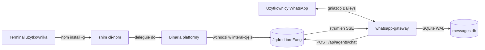

# packages

# packages

Katalog `packages` zawiera dystrybuowalne artefakty dla ekosystemu LibreFang Agent OS. Każdy podpakiet ma niezależne wersjonowanie i służy odrębnemu celowi wdrożeniowemu — jeden do instalacji CLI dla użytkownika końcowego, drugi do uruchamiania trwałej bramy komunikatów.

## Podmoduły

| Pakiet | Rola | Model wykonawczy |
|---|---|---|
| [cli-npm](cli-npm.md) | Shim npm, który instaluje właściwy binarny plik natywny dla danej platformy i deleguje do niego wykonanie | Krótkotrwały proces; uruchamiany przy każdym wywołaniu |
| [whatsapp-gateway](whatsapp-gateway.md) | Łączy czaty WhatsApp z jądrem LibreFang za pomocą biblioteki Baileys | Długotrwały proces, zarządzany przez PM2 |

## Powiązania między nimi

Oba pakiety znajdują się na **krawędzi** systemu LibreFang — stanowią powierzchnie widoczne dla użytkownika lub integracji, które kierują zadania *do* jądra:

CLI zapewnia interaktywny dostęp z wiersza poleceń dla operatorów i deweloperów, natomiast brama zapewnia stały odbiór komunikatów z WhatsApp. Żaden z pakietów nie zawiera logiki agenta — oba zależą od jądra LibreFang, aby wykonywać agentów i narzędzia.

## Kluczowe przepływy pracy

### Przepływ instalacji CLI

Pakiet [cli-npm](cli-npm.md) wykorzystuje `optionalDependencies` npm, dzięki czemu pojedyncze `npm install -g @librefang/cli` pobiera tylko właściwy binarny plik dla danej platformy. Sam shim nie zawiera kodu aplikacji; w czasie wykonania przekazuje sterowanie do binarnego pliku natywnego.

### Przekazywanie komunikatów WhatsApp

Brama [whatsapp-gateway](whatsapp-gateway.md) obsługuje wieloetapowy potok dla każdej przychodzącej wiadomości:

1. **Tożsamość i deduplikacja** — Wiadomości przechodzą przez `normalizeDeviceScopedJid` / `isLidJid` (z `lib/identity.js`) oraz tracker deduplikacji, aby odfiltrować echa i powtórzenia.
2. **Rozwiązanie sesji** — `buildSessionKey` (z `lib/session-key.js`) określa zakres konwersacji, a `resolveAgentId` wybiera docelowego agenta.
3. **Przekazanie do jądra** — `forwardToLibreFang` / `forwardToLibreFangStreaming` wysyła POST do endpointu jądra `/api/agents/chat` i konsumuje strumień odpowiedzi SSE.
4. **Dostarczenie odpowiedzi** — Brama edytuje wysłaną wiadomość w miejscu, gdy tokeny wracają w strumieniu, używając `markdownToWhatsApp` do formatowania. Odpowiedzi obrazowe przechodzą przez `sendImage`.
5. **Trwałość stanu** — Baza danych SQLite (`messages.db`) rejestruje identyfikatory przetworzonych wiadomości, a pamięć podręczna LID (`lib/lid-cache.js`) mapuje JID-om związanym z numerami telefonu na stabilne tożsamości.

Ponowne łączenie, skanowanie nadrabiania (`runCatchUpSweep`) oraz wygaszanie eskalacji (`shouldDebounceEscalation`) zapewniają bramie odporność podczas przerw w łączności sieciowej.
