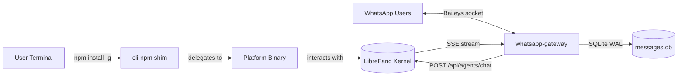

# packages

# packages

The `packages` directory contains the distributable artifacts for the LibreFang Agent OS ecosystem. Each sub-package is independently versioned and serves a distinct deployment target — one for end-user CLI installation, one for running a persistent messaging gateway.

## Sub-Modules

| Package | Role | Runtime Model |
|---|---|---|
| [cli-npm](cli-npm.md) | npm shim that installs the correct platform-native binary and delegates execution to it | Short-lived process; dispatched per invocation |
| [whatsapp-gateway](whatsapp-gateway.md) | Bridges WhatsApp chats to the LibreFang kernel via the Baileys library | Long-lived process, managed by PM2 |

## How They Relate

Both packages sit at the **edge** of the LibreFang system — they are the user-facing or integration-facing surfaces that route work *into* the kernel:

The CLI provides interactive command-line access for operators and developers, while the gateway provides always-on message ingestion from WhatsApp. Neither package contains core agent logic — both depend on the LibreFang kernel to execute agents and tools.

## Key Workflows

### CLI Installation Flow

The [cli-npm](cli-npm.md) package uses npm's `optionalDependencies` so that a single `npm install -g @librefang/cli` pulls only the relevant platform binary. The shim itself contains no application code; it dispatches to the native binary at run time.

### WhatsApp Message Relay

The [whatsapp-gateway](whatsapp-gateway.md) handles a multi-stage pipeline for each inbound message:

1. **Identity & dedup** — Messages pass through `normalizeDeviceScopedJid` / `isLidJid` (from `lib/identity.js`) and a dedup tracker to filter echoes and repeats.
2. **Session resolution** — `buildSessionKey` (from `lib/session-key.js`) scopes the conversation, and `resolveAgentId` selects the target agent.
3. **Kernel handoff** — `forwardToLibreFang` / `forwardToLibreFangStreaming` POSTs to the kernel's `/api/agents/chat` endpoint and consumes the SSE response stream.
4. **Response delivery** — The gateway edits the sent message in-place as tokens stream back, using `markdownToWhatsApp` for formatting. Image responses go through `sendImage`.
5. **State persistence** — A SQLite database (`messages.db`) records processed message IDs and a LID cache (`lib/lid-cache.js`) maps phone-scoped JIDs to stable identities.

Reconnection, catch-up sweeps (`runCatchUpSweep`), and escalation debouncing (`shouldDebounceEscalation`) keep the gateway resilient during network interruptions.