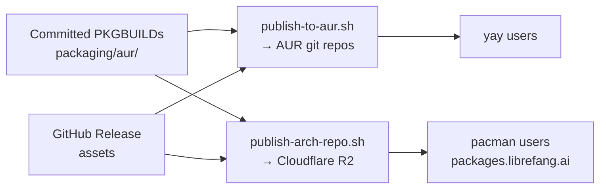

# packaging

# Packaging Module

Arch Linux distribution of LibreFang across two complementary channels — the Arch User Repository (AUR) and a self-hosted pacman repository — both driven from a single set of committed PKGBUILD sources and automated through release-triggered CI.

## Module Layout

```
packaging/
├── aur/                          # Source of truth for all three packages
│   ├── README.md
│   ├── publish-to-aur.sh         # CI: build + push one package to AUR
│   ├── librefang-bin/            # CLI, daemon, HTTP API, web dashboard
│   ├── librefang-desktop-bin/    # Native Tauri desktop launcher
│   └── librefang-docker/         # Docker-backed systemd service
└── arch-repo/                    # Project-maintained pacman repository
    ├── README.md
    └── publish-arch-repo.sh      # CI: build + sign + publish to R2
```

## Packages

All three packages repackage prebuilt release artifacts — no Rust compilation occurs during packaging.

| Package | Provides | Architecture | Dependencies |
|---|---|---|---|
| `librefang-bin` | CLI, daemon, HTTP API on port 4545, browser dashboard | `x86_64`, `aarch64` | `gcc-libs`, `glibc`, `dbus` |
| `librefang-desktop-bin` | Native desktop launcher via `.desktop` entry | `x86_64` only | `gtk3`, `webkit2gtk-4.1` |
| `librefang-docker` | Container-managed service pinned to a release image | `any` | `docker` |

Optional dependencies across all packages: `python` (first-party channel sidecar adapters) and `docker` (sandbox workflows).

The packages are independent — users install only what matches their deployment.

## Shared Source of Truth

Both the AUR publisher and the pacman repo publisher treat the committed PKGBUILDs under `packaging/aur/<package>/` as the single source of truth. The committed `pkgver`, `sha256sums`, and `.SRCINFO` values are a **working baseline for local `makepkg`** — not the values shipped on each release. The per-release values are derived at publish time:

- **`pkgver`**: tag minus the `v` prefix with the first `-` replaced by `_` (Arch disallows `-` in pkgver). Example: `v2026.6.26-beta.24` → `2026.6.26_beta.24`.
- **`pkgrel`**: reset to `1` on each release.
- **`sha256sums`**: regenerated via `updpkgsums` after sources are resolved.
- **`_desktop_ver`** (`librefang-desktop-bin` only): parsed from the actual `LibreFang_<ver>_amd64.deb` release asset name, since the Tauri bundle version is independent of the release tag.
- **Docker image tag** (`librefang-docker` only): re-pinned inside `librefang-docker` and `librefang-docker.env` via regex on `ghcr.io/librefang/librefang:<version>`.



## Publishing Scripts

Both scripts follow the same self-bootstrapping pattern designed for `archlinux:base-devel` containers.

### Root Phase

When invoked as root, each script:

1. Installs the required tooling (`base-devel`, `pacman-contrib`, `jq`, plus `rclone` for arch-repo or `git`/`openssh` for AUR), refreshing `archlinux-keyring` in the same transaction.
2. Creates an unprivileged `builder` user (`makepkg` refuses to run as root).
3. Stages credentials (GPG key or SSH key) with tight file permissions.
4. Re-execs itself as `builder` with `HOME` set, passing through all configuration via environment variables.

### Builder Phase

The builder copies the committed package source to a working directory (using `cp -R` without `-a` because the bind-mounted source has a foreign owner), patches per-release values, regenerates checksums, then diverges by channel.

#### `publish-to-aur.sh`

Runs for one package at a time (passed as `$1`). After patching, it regenerates `.SRCINFO` via `makepkg --printsrcinfo`, clones the AUR git repository, copies only the original committed source files (never downloaded artifacts), commits, and pushes:

```
ssh://aur@aur.archlinux.org/<package>.git
```

AUR rejects pushes whose `.SRCINFO` doesn't match the PKGBUILD, so the script always generates it with `makepkg --printsrcinfo`.

If `git diff --cached --quiet` reports no changes, the push is skipped (the package is already at that version).

#### `publish-arch-repo.sh`

Builds all packages for all configured architectures. For each architecture:

1. **Sets `CARCH`** in `$HOME/.makepkg.conf` — `makepkg` reads CARCH from config, not the environment, so this is how cross-arch builds are driven on an x86_64 runner.
2. **Builds** each package with `makepkg --force --nodeps --nocheck --sign` (runtime dependencies aren't installed in the container; these repackage prebuilt binaries).
3. **Folds** into the existing per-arch pacman database with `repo-add --sign`, pulling the current database from R2 first so updates are incremental.
4. **Materializes symlinks** — `repo-add` writes `librefang.db` / `librefang.files` as symlinks to their `.tar.gz` targets. R2 has no symlinks, so each is replaced with a real file via `cp --remove-destination "$(readlink -f ...)". A missing `.db.sig` breaks signed-database verification on the client.
5. **Uploads** packages, signatures, database files, and the public key to R2 via rclone's S3 backend.
6. **Prunes** old package files beyond `RETAIN` (default 5) per package name — best-effort, kept only for manual `pacman -U <url>` downgrades. Pruning deletes orphaned files only; it never calls `repo-remove` (which would drop the current database entry).

The signing public key is published once to the bucket root at `librefang.gpg` for stable user-facing URL.

### Cross-Architecture Handling

aarch64 packages are built on the x86_64 runner because packaging involves no compilation. For `librefang-bin` on a non-x86_64 target:

- The source tarball URL is repointed from `x86_64-unknown-linux-gnu` to `${arch}-unknown-linux-gnu`.
- `arch=('x86_64')` is rewritten to `arch=('$arch')`.
- `options` gains `!strip` — the host `strip` cannot process foreign binaries (the release tarball is already stripped upstream).
- `CARCH` is overridden via `~/.makepkg.conf`.

`librefang-desktop-bin` is x86_64 only because no ARM Linux desktop bundle exists upstream. `librefang-docker` is `arch=('any')` and lands in every arch's repo path.

### Asset Visibility

Both scripts poll the GitHub Releases API (up to 18 attempts at 10-second intervals) to wait for release assets to become visible. The `wait_for_asset` function checks for assets by suffix:

- `librefang-bin`: waits for `librefang-x86_64-unknown-linux-gnu.tar.gz` (or the target arch variant)
- `librefang-desktop-bin`: waits for `_amd64.deb` and parses the bundle version from the filename
- `librefang-docker`: no asset dependency — only re-pins the image tag

`GH_API_TOKEN` is optional but raises the unauthenticated API rate limit.

## systemd Integration

Two packages ship systemd units that run the LibreFang daemon under a dedicated service user:

**`librefang-bin`** (`librefang.service`):
- Runs `/usr/bin/librefang start --foreground` as user/group `librefang`
- Working directory: `/var/lib/librefang`
- Hardened service: `ProtectSystem=strict`, `ProtectHome=true`, `PrivateTmp=true`, `ProtectKernelTunables`, `ProtectKernelModules`, `ProtectControlGroups`, `RestrictSUIDSGID`, `RestrictRealtime`
- Write access restricted to `/var/lib/librefang` via `ReadWritePaths`
- Resource limits: `LimitNOFILE=65536`, `LimitNPROC=4096`
- Environment loaded from `/etc/librefang/env` (backed up on upgrade)
- sysusers entry creates the `librefang` system user; tmpfiles creates `/var/lib/librefang` (0750) and `/etc/librefang` (0755)

**`librefang-docker`** (`librefang-docker.service`):
- `Requires=docker.service`
- `ExecStart=/usr/bin/librefang-docker run` / `ExecStop=/usr/bin/librefang-docker stop`
- Environment from `/etc/librefang/docker.env`
- `TimeoutStartSec=0` (allows slow image pulls)

The `librefang-docker` helper script manages the container lifecycle with commands: `run`, `start`, `stop`, `pull`, `logs`, `status`, `shell`. It publishes port 4545 on `127.0.0.1` only, mounts a named volume `librefang-data` at `/data`, and forwards known provider/channel environment variables (`OPENAI_API_KEY`, `ANTHROPIC_API_KEY`, `GROQ_API_KEY`, `TELEGRAM_BOT_TOKEN`, `DISCORD_BOT_TOKEN`, `SLACK_BOT_TOKEN`, `SLACK_APP_TOKEN`, `LIBREFANG_ALLOW_NO_AUTH`) if set.

## CI Integration

The `release.yml` workflow triggers these scripts on every `v*` tag:

| Job | Script | Output |
|---|---|---|
| `sync_aur_bin` | `publish-to-aur.sh librefang-bin` | AUR git repo |
| `sync_aur_desktop` | `publish-to-aur.sh librefang-desktop-bin` | AUR git repo |
| `sync_aur_docker` | `publish-to-aur.sh librefang-docker` | AUR git repo |
| `publish_arch_repo` | `publish-arch-repo.sh` | R2 pacman repo (both arches) |

Both scripts degrade to a no-op with a notice when the required secrets are absent, so they are safe to merge before the maintainer configures credentials.

### Required Secrets

**AUR** (`.github/SECRETS.md`):
- `AUR_SSH_PRIVATE_KEY` — dedicated CI keypair registered on the AUR account
- `AUR_KNOWN_HOSTS` (optional) — pins `aur.archlinux.org`
- `AUR_GIT_NAME` / `AUR_GIT_EMAIL` (optional) — commit author identity

**Arch pacman repo**:
- `ARCH_REPO_GPG_PRIVATE_KEY` — passphrase-less signing subkey (primary key kept offline)
- `ARCH_REPO_GPG_KEY_ID` — subkey id for `makepkg --sign` and `repo-add --sign`
- `R2_ACCESS_KEY_ID`, `R2_SECRET_ACCESS_KEY` — Cloudflare R2 S3 credentials
- `CLOUDFLARE_ACCOUNT_ID` — reused from Workers deploys

## Local Development

To test a package build locally, run from the package directory:

```sh
makepkg -g                        # print checksums
makepkg --printsrcinfo > .SRCINFO # verify metadata
makepkg -f                        # full build
pacman -Qp ./*.pkg.tar.zst        # inspect package info
pacman -Qlp ./*.pkg.tar.zst       # list package contents
```

Do not commit downloaded sources, `src/`, `pkg/`, or `*.pkg.tar.*` outputs. Commit only the AUR source files (`PKGBUILD`, install hooks, service files, env templates).

## Relationship Between Channels

The AUR and pacman repo channels exist because AUR account registration was closed indefinitely (see #6334), blocking the AUR automation (#6341). The pacman repo ships the same release-pinned binary packages directly, requiring no AUR account. When AUR registration reopens, #6341 will publish the AUR `-bin` packages for `yay` users while the pacman repo continues serving `pacman` users. The two channels are complementary and always share the same PKGBUILD sources.