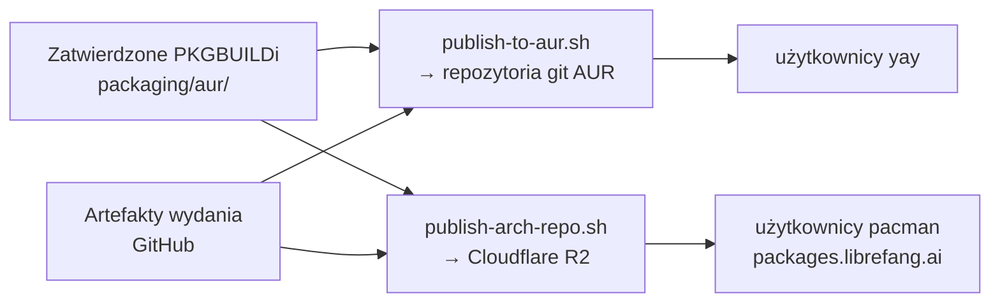

# pakietowanie

# Moduł pakietowania

Dystrybucja LibreFang dla Arch Linuxa przez dwa komplementarne kanały — Arch User Repository (AUR) i samodzielnie hostowane repozytorium pacman — oba oparte na jednym wspólnym zestawie zatwierdzonych źródeł PKGBUILD i zautomatyzowane przez CI wyzwalane przy wydaniu.

## Układ modułu

```
packaging/
├── aur/                          # Jedno źródło prawdy dla wszystkich trzech pakietów
│   ├── README.md
│   ├── publish-to-aur.sh         # CI: kompilacja + publikacja jednego pakietu do AUR
│   ├── librefang-bin/            # CLI, demon, API HTTP, panel webowy
│   ├── librefang-desktop-bin/    # Natywna aplikacja desktopowa Tauri
│   └── librefang-docker/         # Usługa systemd oparta na Dockerze
└── arch-repo/                    # Repozytorium pacman utrzymywane przez projekt
    ├── README.md
    └── publish-arch-repo.sh      # CI: kompilacja + podpisanie + publikacja do R2
```

## Pakiety

Wszystkie trzy pakiety przepakowują gotowe artefakty wydań — podczas pakietowania nie ma żadnej kompilacji Rusta.

| Pakiet | Dostarcza | Architektura | Zależności |
|---|---|---|---|
| `librefang-bin` | CLI, demon, API HTTP na porcie 4545, panel przeglądarkowy | `x86_64`, `aarch64` | `gcc-libs`, `glibc`, `dbus` |
| `librefang-desktop-bin` | Natywna aplikacja desktopowa przez wpis `.desktop` | tylko `x86_64` | `gtk3`, `webkit2gtk-4.1` |
| `librefang-docker` | Usługa zarządzana przez kontenery przypięta do obrazu wydania | `any` | `docker` |

Zależności opcjonalne we wszystkich pakietach: `python` (adaptery sidecar pierwszej strony dla kanałów) oraz `docker` (workflows piaskownicy).

Pakiety są niezależne — użytkownicy instalują tylko to, co odpowiada ich wdrożeniu.

## Wspólne źródło prawdy

Zarówno wydawca AUR, jak i wydawca repozytorium pacman traktują zatwierdzone PKGBUILDi w `packaging/aur/<paket>/` jako jedno źródło prawdy. Zatwierdzone wartości `pkgver`, `sha256sums` i `.SRCINFO` stanowią **działającą bazę dla lokalnego `makepkg`** — a nie wartości dostarczane przy każdym wydaniu. Wartości dla poszczególnych wydań są wyliczane w momencie publikacji:

- **`pkgver`**: tag bez prefiksu `v`, z pierwszym `-` zamienionym na `_` (Arch nie dopuszcza `-` w pkgver). Przykład: `v2026.6.26-beta.24` → `2026.6.26_beta.24`.
- **`pkgrel`**: resetowany do `1` przy każdym wydaniu.
- **`sha256sums`**: regenerowane przez `updpkgsums` po rozwiązaniu źródeł.
- **`_desktop_ver`** (tylko `librefang-desktop-bin`): parsowane z rzeczywistej nazwy artefaktu wydania `LibreFang_<ver>_amd64.deb`, ponieważ wersja pakietu Tauri jest niezależna od tagu wydania.
- **Tag obrazu Docker** (tylko `librefang-docker`): przypinany ponownie wewnątrz `librefang-docker` i `librefang-docker.env` przez regex na `ghcr.io/librefang/librefang:<version>`.



## Skrypty publikacji

Oba skrypty stosują ten sam wzorzec samodzielnego bootstrapu zaprojektowany dla kontenerów `archlinux:base-devel`.

### Faza roota

Po wywołaniu jako root, każdy skrypt:

1. Instaluje wymagane narzędzia (`base-devel`, `pacman-contrib`, `jq`, oraz `rclone` dla arch-repo lub `git`/`openssh` dla AUR), odświeżając `archlinux-keyring` w tej samej transakcji.
2. Tworzy nieuprzywilejowanego użytkownika `builder` (`makepkg` odmawia działania jako root).
3. Przygotowuje poświadczenia (klucz GPG lub SSH) z restrykcyjnymi uprawnieniami plików.
4. Ponownie uruchamia się jako `builder` z ustawionym `HOME`, przekazując całą konfigurację przez zmienne środowiskowe.

### Faza buildera

Builder kopiuje zatwierdzone źródła pakietu do katalogu roboczego (używając `cp -R` bez `-a`, ponieważ zamontowane źródło ma obce uprawnienia właściciela), łata wartości dla wydania, regeneruje sumy kontrolne, a następnie rozgałęzia się w zależności od kanału.

#### `publish-to-aur.sh`

Uruchamiany dla jednego pakietu naraz (przekazanego jako `$1`). Po nałożeniu łatek regeneruje `.SRCINFO` przez `makepkg --printsrcinfo`, klonuje repozytorium git AUR, kopiuje tylko oryginalne zatwierdzone pliki źródłowe (nigdy pobrane artefakty), commituje i wysyła:

```
ssh://aur@aur.archlinux.org/<paket>.git
```

AUR odrzuca wypchnięcia, których `.SRCINFO` nie zgadza się z PKGBUILD, więc skrypt zawsze generuje je przez `makepkg --printsrcinfo`.

Jeśli `git diff --cached --quiet` raportuje brak zmian, wypchnięcie jest pomijane (pakiet jest już w tej wersji).

#### `publish-arch-repo.sh`

Kompiluje wszystkie pakiety dla wszystkich skonfigurowanych architektur. Dla każdej architektury:

1. **Ustawia `CARCH`** w `$HOME/.makepkg.conf` — `makepkg` odczytuje CARCH z konfiguracji, nie ze środowiska, więc w ten sposób steruje się kompilacjami cross-arch na runnerze x86_64.
2. **Kompiluje** każdy pakiet przez `makepkg --force --nodeps --nocheck --sign` (zależności runtime nie są instalowane w kontenerze; pakiety przepakowują gotowe binaria).
3. **Integruje** z istniejącą bazą danych pacman dla danej architektury przez `repo-add --sign`, pobierając najpierw aktualną bazę z R2, aby aktualizacje były przyrostowe.
4. **Materializuje symlinki** — `repo-add` zapisuje `librefang.db` / `librefang.files` jako symlinki do ich celów `.tar.gz`. R2 nie obsługuje symlinków, więc każdy jest zamieniany na prawdziwy plik przez `cp --remove-destination "$(readlink -f ...)". Brakujący `.db.sig` przerywa weryfikację podpisanej bazy po stronie klienta.
5. **Wysyła** pakiety, podpisy, pliki bazy danych i klucz publiczny do R2 przez backend S3 rclone.
6. **Czyści** stare pliki pakietów powyżej `RETAIN` (domyślnie 5) na nazwę pakietu — best-effort, zachowane tylko dla ręcznych obniżenia wersji `pacman -U <url>`. Czyszczenie usuwa tylko osierocone pliki; nigdy nie wywołuje `repo-remove` (co usunęłoby aktualny wpis w bazie).

Klucz publiczny do podpisywania jest publikowany raz w katalogu głównym bucketa jako `librefang.gpg` dla stabilnego URL dostępnego dla użytkowników.

### Obsługa cross-architektur

Pakiety aarch64 są kompilowane na runnerze x86_64, ponieważ pakietowanie nie obejmuje kompilacji. Dla `librefang-bin` na celu innym niż x86_64:

- URL tarballa źródłowego jest przekierowany z `x86_64-unknown-linux-gnu` na `${arch}-unknown-linux-gnu`.
- `arch=('x86_64')` jest przepisywane na `arch=('$arch')`.
- `options` zyskuje `!strip` — hostowy `strip` nie może przetworzyć obcych binariów (tarball wydania jest już obcięty upstream).
- `CARCH` jest nadpisywany przez `~/.makepkg.conf`.

`librefang-desktop-bin` jest tylko dla x86_64, ponieważ upstream nie dostarcza pakietu desktopowego dla ARM Linuxa. `librefang-docker` to `arch=('any')` i trafia do ścieżki repozytorium każdej architektury.

### Widoczność artefaktów

Oba skrypty odpytują API GitHub Releases (do 18 prób w 10-sekundowych odstępach), aby poczekać na udostępnienie się artefaktów wydania. Funkcja `wait_for_asset` sprawdza artefakty po sufiksie:

- `librefang-bin`: czeka na `librefang-x86_64-unknown-linux-gnu.tar.gz` (lub wariant dla docelowej architektury)
- `librefang-desktop-bin`: czeka na `_amd64.deb` i parsuje wersję pakietu z nazwy pliku
- `librefang-docker`: brak zależności od artefaktów — tylko przypina ponownie tag obrazu

`GH_API_TOKEN` jest opcjonalny, ale podnosi limit nieautoryzowanych żądań API.

## Integracja z systemd

Dwa pakiety dostarczają jednostki systemd, które uruchamiają demona LibreFang pod dedykowanym użytkownikiem serwisu:

**`librefang-bin`** (`librefang.service`):
- Uruchamia `/usr/bin/librefang start --foreground` jako użytkownik/grupa `librefang`
- Katalog roboczy: `/var/lib/librefang`
- Usługa zaostrzona: `ProtectSystem=strict`, `ProtectHome=true`, `PrivateTmp=true`, `ProtectKernelTunables`, `ProtectKernelModules`, `ProtectControlGroups`, `RestrictSUIDSGID`, `RestrictRealtime`
- Dostęp do zapisu ograniczony do `/var/lib/librefang` przez `ReadWritePaths`
- Limity zasobów: `LimitNOFILE=65536`, `LimitNPROC=4096`
- Środowisko ładowane z `/etc/librefang/env` (kopia zapasowa przy aktualizacji)
- Wpis sysusers tworzy systemowego użytkownika `librefang`; tmpfiles tworzy `/var/lib/librefang` (0750) oraz `/etc/librefang` (0755)

**`librefang-docker`** (`librefang-docker.service`):
- `Requires=docker.service`
- `ExecStart=/usr/bin/librefang-docker run` / `ExecStop=/usr/bin/librefang-docker stop`
- Środowisko z `/etc/librefang/docker.env`
- `TimeoutStartSec=0` (pozwala na wolne pobieranie obrazów)

Skrypt pomocniczy `librefang-docker` zarządza cyklem życia kontenera poleceniami: `run`, `start`, `stop`, `pull`, `logs`, `status`, `shell`. Publikuje port 4545 tylko na `127.0.0.1`, montuje nazwany wolumen `librefang-data` w `/data` i przekazuje znane zmienne środowiskowe dostawców/kanałów (`OPENAI_API_KEY`, `ANTHROPIC_API_KEY`, `GROQ_API_KEY`, `TELEGRAM_BOT_TOKEN`, `DISCORD_BOT_TOKEN`, `SLACK_BOT_TOKEN`, `SLACK_APP_TOKEN`, `LIBREFANG_ALLOW_NO_AUTH`), jeśli są ustawione.

## Integracja CI

Workflow `release.yml` uruchamia te skrypty przy każdym tagu `v*`:

| Zadanie | Skrypt | Wynik |
|---|---|---|
| `sync_aur_bin` | `publish-to-aur.sh librefang-bin` | Repozytorium git AUR |
| `sync_aur_desktop` | `publish-to-aur.sh librefang-desktop-bin` | Repozytorium git AUR |
| `sync_aur_docker` | `publish-to-aur.sh librefang-docker` | Repozytorium git AUR |
| `publish_arch_repo` | `publish-arch-repo.sh` | Repozytorium pacman R2 (obie architektury) |

Oba skrypty degradują do no-op z powiadomieniem, gdy wymagane sekrety są nieobecne, więc są bezpieczne do scalenia przed skonfigurowaniem poświadczeń przez maintainera.

### Wymagane sekrety

**AUR** (`.github/SECRETS.md`):
- `AUR_SSH_PRIVATE_KEY` — dedykowana para kluczy CI zarejestrowana na koncie AUR
- `AUR_KNOWN_HOSTS` (opcjonalny) — przypinuje `aur.archlinux.org`
- `AUR_GIT_NAME` / `AUR_GIT_EMAIL` (opcjonalne) — tożsamość autora commita

**Arch pacman repo**:
- `ARCH_REPO_GPG_PRIVATE_KEY` — podklucz do podpisywania bez hasła (klucz główny przechowywany offline)
- `ARCH_REPO_GPG_KEY_ID` — identyfikator podklucza dla `makepkg --sign` i `repo-add --sign`
- `R2_ACCESS_KEY_ID`, `R2_SECRET_ACCESS_KEY` — poświadczenia S3 Cloudflare R2
- `CLOUDFLARE_ACCOUNT_ID` — współdzielone z wdrożeń Workers

## Rozwój lokalny

Aby przetestować kompilację pakietu lokalnie, uruchom z katalogu pakietu:

```sh
makepkg -g                        # wyświetl sumy kontrolne
makepkg --printsrcinfo > .SRCINFO # zweryfikuj metadane
makepkg -f                        # pełna kompilacja
pacman -Qp ./*.pkg.tar.zst        # sprawdź informacje o pakiecie
pacman -Qlp ./*.pkg.tar.zst       # wyświetl zawartość pakietu
```

Nie commituj pobranych źródeł, `src/`, `pkg/` ani wyników `*.pkg.tar.*`. Commituj tylko pliki źródłowe AUR (`PKGBUILD`, skrypty install, pliki serwisowe, szablony env).

## Relacja między kanałami

Kanały AUR i pacman repo istnieją, ponieważ rejestracja kont AUR została zamknięta na czas nieokreślony (zob. #6334), co blokuje automatyzację AUR (#6341). Repozytorium pacman dostarcza te same binarne pakiety przypięte do wydania bezpośrednio, bez wymagania konta AUR. Gdy rejestracja AUR zostanie ponownie otwarta, #6341 opublikuje pakiety AUR `-bin` dla użytkowników `yay`, podczas gdy repozytorium pacman będzie nadal obsługiwać użytkowników `pacman`. Dwa kanały są komplementarne i zawsze współdzielą te same źródła PKGBUILD.
