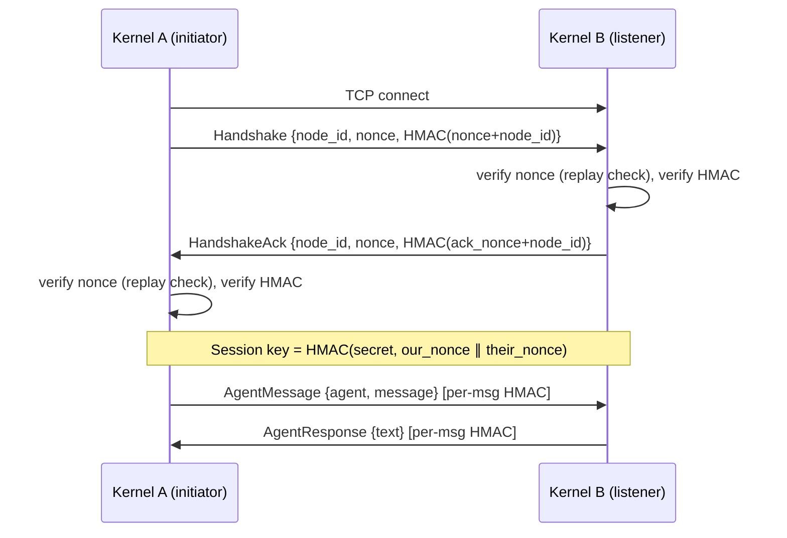

# Peer Networking

# Peer Networking (`librefang-wire`)

Cross-machine agent discovery, authentication, and communication over TCP using the LibreFang Wire Protocol (OFP).

## Overview

`librefang-wire` enables separate LibreFang kernels to communicate with each other over the network. One kernel's agents can discover and send messages to agents running on a remote kernel, with HMAC-SHA256 authentication protecting every connection.

The crate is organized into three concerns:

| Module | Responsibility |
|---|---|
| `message` | Wire protocol types — `WireMessage`, `WireRequest`, `WireResponse`, `WireNotification`, and length-prefixed framing |
| `peer` | `PeerNode` (TCP listener + client), handshake authentication, `PeerHandle` trait for kernel integration |
| `registry` | `PeerRegistry` — thread-safe tracking of known peers and their advertised agents |

## Connection Lifecycle



Both sides register each other in their `PeerRegistry` after a successful handshake, so connections are bidirectional — the initiator can send requests, and the listener's existing connection loop handles inbound messages from that peer as well.

## Wire Protocol

### Framing

Every message on the wire uses a 4-byte big-endian length prefix followed by a JSON body:

```
[4 bytes: length N][N bytes: JSON]
```

After the handshake completes, the framing changes to include a per-message HMAC trailer:

```
[4 bytes: length N][N-64 bytes: JSON][64 bytes: hex HMAC-SHA256]
```

Maximum message size: **16 MB** (`MAX_MESSAGE_SIZE`).

The encoding/decoding functions in `message` are:
- `encode_message` — serializes a `WireMessage` to the length-prefixed byte format
- `decode_length` / `decode_message` — parse header and body back into a `WireMessage`

### Message Types

`WireMessage` is the envelope. It carries a unique `id` and a `WireMessageKind`:

**Requests** (`WireRequest`, tagged by `method`):
- `Handshake` — identity exchange with nonce and HMAC, required before any other message
- `Discover` — search for agents matching a query string
- `AgentMessage` — send a message to a specific agent on the remote peer
- `Ping` — liveness check

**Responses** (`WireResponse`, tagged by `method`):
- `HandshakeAck` — accepts the handshake, mirrors identity + HMAC
- `DiscoverResult` — returns matched `RemoteAgentInfo` list
- `AgentResponse` — returns the agent's reply text
- `Pong` — includes uptime in seconds
- `Error` — error code + message (codes: 401 auth required, 403 auth failed, 404 not found, 500 agent error)

**Notifications** (`WireNotification`, tagged by `event`, no response expected):
- `AgentSpawned` — a new agent is available
- `AgentTerminated` — an agent has stopped
- `ShuttingDown` — the peer is going offline

The current protocol version is `PROTOCOL_VERSION = 1`. A version mismatch during handshake causes an immediate error.

## Authentication & Security

### Shared Secret Requirement

OFP **refuses to start** without a configured `shared_secret`. The `PeerNode::start` call returns `WireError::HandshakeFailed` if the secret is empty.

### Handshake HMAC

Both sides compute `HMAC-SHA256(shared_secret, nonce + node_id)` where `nonce` is a fresh UUID per handshake attempt. The receiver verifies this against its own copy of the shared secret.

### Replay Protection

`NonceTracker` tracks all seen nonces with timestamps. It:

1. **Garbage-collects** expired nonces on every insertion (5-minute window, since handshake nonces are single-use UUIDs).
2. **Atomically checks and records** nonces using `DashMap::entry` to prevent TOCTOU races — even 32 concurrent calls with the same replayed nonce result in exactly one acceptance.
3. **Caps at 100,000 entries** to prevent memory exhaustion under flood. Once at capacity, new nonces are rejected (fail-closed).

### Session Key Derivation

After both HMACs verify, each side derives a per-session key:

```
session_key = HMAC-SHA256(shared_secret, our_nonce || their_nonce)
```

Nonce order matters — the initiator and responder agree on the ordering via their roles. Every subsequent message on that connection includes a trailer HMAC computed over the JSON body using this session key.

### Unauthenticated Rejection

Any message that arrives before a completed handshake (including `Ping`, `Discover`, `AgentMessage`) receives an `Error { code: 401 }` response and the connection is dropped.

## Key Components

### `PeerNode`

The main networking entry point. Created via `PeerNode::start`, which binds a TCP listener and spawns an accept loop.

```rust
let (node, task_handle) = PeerNode::start(config, registry, handle).await?;
```

**Important methods:**

| Method | Description |
|---|---|
| `start(config, registry, handle)` | Binds listener, returns `(Arc<PeerNode>, JoinHandle)` |
| `local_addr()` | Returns the actual bound address (useful when binding to port 0) |
| `node_id()` | This node's unique identifier |
| `registry()` | Access the `PeerRegistry` |
| `connect_to_peer(addr, handle)` | Connect to a remote peer, perform handshake, spawn connection loop |
| `send_to_peer(node_id, agent, message, sender, handle)` | Open a fresh authenticated connection to a known peer, send one message, return the response |

### `PeerHandle` Trait

The kernel implements this trait so `PeerNode` can route incoming requests to local agents:

```rust
#[async_trait]
pub trait PeerHandle: Send + Sync + 'static {
    fn local_agents(&self) -> Vec<RemoteAgentInfo>;
    async fn handle_agent_message(&self, agent: &str, message: &str, sender: Option<&str>) -> Result<String, String>;
    fn discover_agents(&self, query: &str) -> Vec<RemoteAgentInfo>;
    fn uptime_secs(&self) -> u64;
}
```

- `local_agents` is called during handshake to advertise available agents.
- `handle_agent_message` is called when a remote peer sends an `AgentMessage`; the kernel routes it to the target agent.
- `discover_agents` performs a local search matching name, tags, or description.

### `PeerRegistry`

Thread-safe (`RwLock<HashMap>`) store of all known peers and their agents. Key operations:

- **Peer lifecycle**: `add_peer`, `remove_peer`, `mark_disconnected`, `mark_connected`
- **Agent tracking**: `update_agents`, `add_agent`, `remove_agent` — kept in sync via handshake exchange and `AgentSpawned`/`AgentTerminated` notifications
- **Discovery**: `find_agents(query)` searches across all connected peers' agents (matches name, tags, description, case-insensitive)
- **Queries**: `connected_peers`, `all_peers`, `connected_count`, `total_count`, `all_remote_agents`

Disconnected peers are retained in the registry (state set to `PeerState::Disconnected`) and excluded from discovery queries, but remain available for potential reconnection.

### `PeerConfig`

```rust
pub struct PeerConfig {
    pub listen_addr: SocketAddr,     // e.g., "0.0.0.0:9090" or "127.0.0.1:0"
    pub node_id: String,             // UUID, auto-generated if not set
    pub node_name: String,           // Human-readable name
    pub shared_secret: String,       // Required — must match across all peers
}
```

### `broadcast_notification`

A standalone async function that sends a one-way notification to all currently connected peers. It opens a fresh connection per peer (with HMAC authentication), sends the notification, and collects any errors. Used for `AgentSpawned`, `AgentTerminated`, and `ShuttingDown` events.

## Error Handling

`WireError` covers the failure modes:

| Variant | When |
|---|---|
| `Io` | TCP read/write failures |
| `Json` | Malformed messages |
| `HandshakeFailed` | HMAC mismatch, nonce replay, missing secret, remote error |
| `ConnectionClosed` | Remote end disconnected |
| `MessageTooLarge` | Message exceeds 16 MB |
| `VersionMismatch` | Protocol version differs between peers |

## Integration Points

Other crates consume `librefang-wire` through these surfaces:

- **API layer** (`librefang-api`): reads `registry.all_peers()`, `registry.connected_count()`, and `node.local_addr()` for network status endpoints and WebSocket commands.
- **Desktop/server entrypoints** (`librefang-desktop`, `librefang-cli`): call `PeerNode::start` during initialization and expose `local_addr()` for health checks.
- **Tests across crates**: use `local_addr()` to verify the wire server is responsive before running integration tests.
- **OAuth flows**: temporarily bind a `PeerNode` to capture redirect callbacks via `local_addr()`.

## Configuration

In `config.toml`, the `[network]` section maps to `PeerConfig`:

```toml
[network]
listen_addr = "0.0.0.0:9090"
node_name = "production-kernel-1"
shared_secret = "a-strong-random-secret-shared-across-all-peers"
```

The `shared_secret` must be identical on every kernel that should peer together. Use a cryptographically random string — all security properties depend on its secrecy.