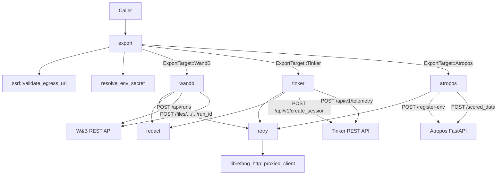

# Reinforcement Learning Export

# `librefang-rl-export`

Long-horizon RL rollout trajectory exporter — the LibreFang egress surface that delivers finished agent rollouts to upstream RL-tracking services.

## Architecture



## Public API

The crate exposes a single async entry point:

```rust
pub async fn export(
    target: ExportTarget,
    payload: RlTrajectoryExport,
) -> Result<ExportReceipt, ExportError>
```

`ExportTarget` is `#[non_exhaustive]` — match exhaustively or handle future variants with a wildcard arm.

### Input: `RlTrajectoryExport`

| Field | Type | Purpose |
|---|---|---|
| `run_id` | `String` | Caller-side identifier; forwarded as a hint where the upstream accepts one |
| `trajectory_bytes` | `Vec<u8>` | Opaque payload — the crate does **not** parse, validate, or transcode it |
| `toolset_metadata` | `Option<serde_json::Value>` | Structured metadata about the agent/environment; scrubbed of credentials before upload |
| `started_at` | `DateTime<Utc>` | Wall-clock rollout start |
| `finished_at` | `DateTime<Utc>` | Wall-clock rollout end |

The wire format of `trajectory_bytes` is owned by the producer (tracked in RFC #3330). This crate is format-agnostic by design — it can land and be integration-tested today regardless of when the wire format is locked.

### Output: `ExportReceipt`

| Field | Type | Meaning |
|---|---|---|
| `target_run_url` | `String` | Browser-loadable URL on the upstream (e.g. `https://wandb.ai/<entity>/<project>/runs/<id>`) |
| `bytes_uploaded` | `u64` | Mirrors `trajectory_bytes.len()` |
| `uploaded_at` | `DateTime<Utc>` | Local wall-clock time of upload completion |

## Export Targets

### Weights & Biases (`ExportTarget::WandB`)

Two-step REST flow:

1. **`POST {base}/api/runs`** — creates the run, recovers the server-assigned `run_id` and `url`.
2. **`POST {base}/files/{entity}/{project}/{run_id}`** — uploads the opaque trajectory bytes as an `application/octet-stream` artefact.

Authentication uses HTTP Basic with the literal user `api` and the API key as the password (`Authorization: Basic base64("api:<key>")`), per the [W&B REST convention](https://docs.wandb.ai/ref/api/rest/).

Required config: `project`, `entity`, `api_key_env`. There is **no default entity** — the previous `"default"` fallback was a guess that silently misrouted runs. Callers must resolve the entity out of band.

SSRF mode: **Public** — loopback, private, and link-local destinations are rejected.

### Tinker (`ExportTarget::Tinker`)

Tinker has no dedicated opaque-trajectory endpoint. The exporter maps onto the closest stable two-call pair:

1. **`POST {base}/api/v1/create_session`** — registers a session, recovers `session_id`. Tags include the project name; `user_metadata` carries the (scrubbed) toolset metadata.
2. **`POST {base}/api/v1/telemetry`** — submits a single `GenericEvent` whose `event_data` contains the trajectory bytes as standard base64 (`trajectory_bytes_b64`), plus rollout timestamps and the caller's run ID.

Authentication: `X-API-Key: <key>` header. The Tinker SDK requires the `tml-` prefix; this crate forwards the key verbatim and lets the upstream enforce the format.

Required config: `api_key_env`, `project`. Optional: `base_url` (defaults to `https://tinker.thinkingmachines.dev/services/tinker-prod`).

SSRF mode: **Public**.

### Atropos (`ExportTarget::Atropos`)

Atropos is a **local FastAPI microservice** — not a cloud-hosted service. No authentication. Two-step flow:

1. **`POST {base}/register-env`** — registers this rollout producer, recovers `env_id` and `wandb_name`. The `RegisterEnv` body carries `desired_name` (the project), `max_token_length`, `weight`, and `group_size`.
2. **`POST {base}/scored_data`** — submits the trajectory bytes verbatim as `Content-Type: application/json`. The bytes **must** already be valid `ScoredData` JSON (`tokens`, `masks`, `scores`, …); if not, Atropos returns 422.

The `register-env` endpoint has a sentinel state: if the trainer hasn't booted yet, the server returns HTTP 200 with `{"status": "wait for trainer to start"}` and **no** `env_id`. The exporter detects this and surfaces `ExportError::TrainerNotReady` so callers can poll with backoff.

Required config: `project`, `base_url`. Optional tuning: `max_token_length` (default 32,768), `group_size` (default 1), `weight` (default 1.0).

SSRF mode: **LoopbackOrPrivate** — only `127.0.0.0/8`, `::1`, and RFC-1918 addresses are accepted. There is **no implicit default** for `base_url`; operators must set it explicitly.

## Cross-Cutting Concerns

### Secret Handling

API keys are **never** inlined into `ExportTarget`. Every secret-bearing variant carries an `api_key_env: String` field holding the **name** of the environment variable. The `resolve_env_secret` helper reads the variable at upload time and fails closed with `ExportError::InvalidConfig` if unset or empty. This keeps secrets out of `config.toml`, history snapshots, and process dumps.

```rust
// Correct — env var name, not the key itself
ExportTarget::WandB { api_key_env: "WANDB_API_KEY".into(), ... }

// Wrong — this is a regression
ExportTarget::WandB { api_key_env: "sk-live-actual-key-here".into(), ... }
```

### Credential Redaction (`redact`)

Before any metadata leaves the process, `redact_metadata` walks the `serde_json::Value` tree and replaces credential-shaped substrings in string values with placeholders:

| Pattern | Replacement |
|---|---|
| JWT tokens (`eyJ...`) | `<REDACTED:JWT>` |
| API keys (`sk_...`, `token=...`, etc.) | `<REDACTED:CREDENTIAL>` |
| Long base64 blobs (≥40 chars) | `<REDACTED:BLOB>` |

JSON **keys** are never rewritten — only values. The regex set mirrors `librefang_kernel::trajectory::RedactionPolicy` and is checked for parity via a snapshot test against `tests/fixtures/kernel_redaction_patterns.txt`. Drift on either side fails CI.

### SSRF Protection (`ssrf`)

Every outbound URL is validated before any network I/O. Two egress modes:

- **`Public`** (W&B, Tinker): Rejects loopback, RFC-1918, link-local, IMDS (`169.254.169.254`), `metadata.google.internal`, and non-HTTP schemes.
- **`LoopbackOrPrivate`** (Atropos): Accepts only loopback and RFC-1918. Rejects everything else including public IPs, link-local, and IMDS.

Additional guards: userinfo in URLs (`user:pass@host`) is rejected outright, and IPv4-mapped IPv6 addresses (`::ffff:127.0.0.1`) are unwrapped and checked against the v4 block list.

### Retry Logic (`retry`)

Transient failures are retried up to **3 attempts** with exponential backoff (200ms, 400ms). This is deliberately faster than the workspace's LLM-call retry loop (`librefang_runtime::agent_loop`, which uses 4 attempts at 1s base) — trajectories are post-rollout, so sub-second retry gives faster feedback on transient blips without the 1s wake-up tax.

Transient classes: `NetworkError`, `UpstreamRejected` with status 429 or 5xx. Everything else (auth, 4xx, decode failures, `InvalidConfig`, `TrainerNotReady`) returns on the first attempt.

### HTTP Client

All outbound HTTP flows through `librefang_http::proxied_client()` — the workspace's shared reqwest client. This is non-negotiable: the shared client carries the configured proxy, TLS fallback roots, and `User-Agent: librefang/<version>`.

## Error Taxonomy

`ExportError` is `#[non_exhaustive]`. Match with that in mind:

| Variant | When | Retryable |
|---|---|---|
| `NetworkError(String)` | Transport failure (DNS, TCP, TLS, timeout) | Yes |
| `AuthError` | HTTP 401/403 | No |
| `UpstreamRejected { status, body }` | Non-auth 4xx/5xx; body truncated to 4 KiB | Only 429/5xx |
| `MalformedResponse(String)` | 2xx body didn't match expected shape | No |
| `InvalidConfig(String)` | Bad caller config caught before I/O | No |
| `TrainerNotReady { status_label }` | Atropos trainer hasn't booted (sentinel 200) | Yes (poll) |

## Testing Strategy

Each exporter has a `*_with_base` internal entry point that accepts an explicit base URL, allowing in-crate `wiremock::MockServer` tests to target a loopback mock without tripping SSRF validation. The public `export()` dispatch is tested separately with SSRF-rejection scenarios (e.g. pointing Tinker at `169.254.169.254`, Atropos at a public IP).

Every test uses `wiremock` matchers to pin the exact HTTP shape — method, path, headers, and partial body — so wire-format drift between the exporter and the upstream is caught by CI.